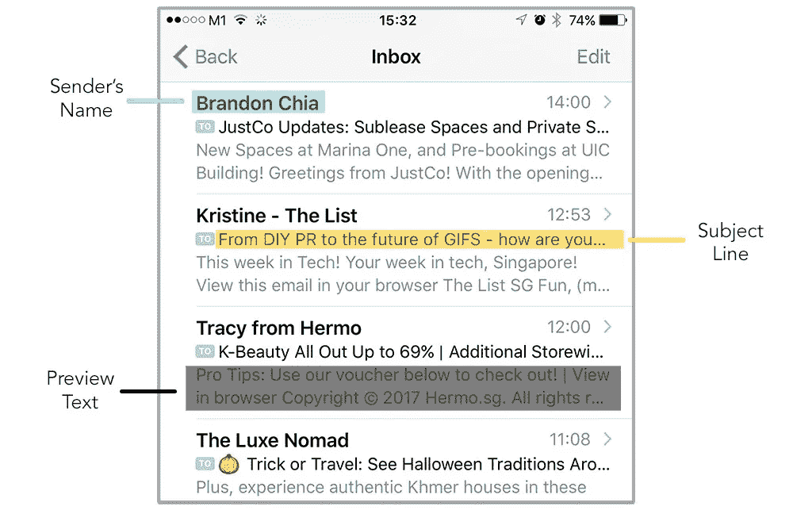
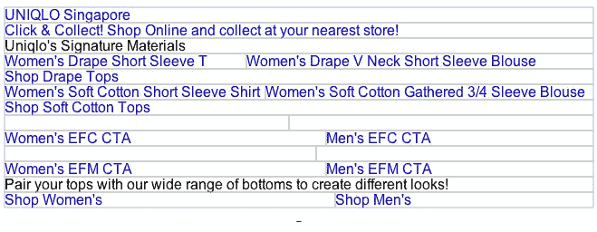

# 电子邮件营销活动中最常见的 6 个错误

> 原文：<https://medium.com/hackernoon/the-6-most-common-mistakes-in-email-marketing-campaigns-457d8a5e0ef4>

Photo by [Tim Gouw](https://unsplash.com/photos/1K9T5YiZ2WU?utm_source=unsplash&utm_medium=referral&utm_content=creditCopyText) on [Unsplash](https://unsplash.com/search/photos/frustrated?utm_source=unsplash&utm_medium=referral&utm_content=creditCopyText)

开始创建电子邮件营销活动很容易，但是在发送时也很容易犯这些错误。

在本文中，我们将与您分享在创建和发送电子邮件营销活动时最常见的 6 个错误。我们开始吧！

# 1.不检查您活动的电子邮件主题行

经常检查你的主题是很重要的，它将决定你的电子邮件是否会被你的订阅者打开。

大多数电子邮件服务提供商(esp)会在您发起活动之前检查电子邮件主题行是否为空。但是，您也应该检查您的主题行是否正确。

# 2.没有电子邮件的预览文本

这是邮件营销中最常见的错误之一，因为邮件预览文本实际上是可选的。即使在大多数 esp 中，它们也不被视为必填字段。

下面是一个苹果邮箱的预览文本的例子，

Example of iOS Apple Mail Inbox

电子邮件预览文本显示在主题行之后，因为你可以看到它可以容纳比 Apple Mail 的主题行更多的文本。这意味着我们可以使用它以及一个朗朗上口的线，以提高我们的开放率！

> 您知道预览文本实际上是在 HTML 电子邮件模板中设置的吗？我们的 Mailworks 电子邮件所见即所得编辑器可以帮助您轻松地从我们的设置面板中包含预览文本。
> 
> 如果你还没有试过我们的编辑器，你可以在这里注册一个免费的账户。

Better open rates? YAY!

# 3.图像没有可选文字

另一个常见的错误是，电子邮件模板中的图像没有替代文本。在你的图片中使用替代文字仍然被认为是很重要的，一些电子邮件客户端在默认情况下会屏蔽图片。

请注意，也有默认屏蔽图片的订阅者。由于我们不能太确定图像何时被屏蔽，我们希望确保我们的图像有一种替代的方式来传达它的信息。

如果您在 ESPs 中使用现成的模板，请确保您在图像中添加了替代文本。一个好的规则是在有信息的图片中添加替换文字。

一个很好的例子就是英雄形象，甚至是你的社交偶像。

如果你是一名开发人员，确保在你的``标签中添加“alt”属性。类似于以下内容:

``

> 你知道 Mailworks 电子邮件所见即所得编辑器能够轻松做到这一点吗？你可以在这里阅读关于[的更多信息。](http://knowledgebase.mailworks.io/building-an-emailer-in-mailworks/adding-content/how-do-i-add-images-to-my-emailer)

下面是一个使用 [Litmus](https://litmus.com/) 测试一封来自优衣库的电子邮件的例子，

A section of Uniqlo’s Newsletter Email

正如你所看到的，他们的电子邮件有很多图片，他们在认为重要的图片上添加了替代文字。

你可以在这里查看原邮件[。](http://view.uq.uniqlo.com.sg/?qs=a2dd7f2f03bbcfa59d4413135fcbf9a3dc08e9cb25111751608fdcb933394bdb5770e83028b6452a709f14ea452d7c32ab6575c4eb12ca43dfb4ec87b2798c234e5c6492cf4d02ef643e3a9e5bd45346)

# 4.未能检查您的超链接是否正确

与图像替代文本类似，缺少/不正确的超链接是很常见的。始终确保你的所有链接都经过测试，你可以使用电子邮件测试工具，如[石蕊](https://litmus.com/)或[电子邮件。](https://www.emailonacid.com/)

还要注意，如果你使用了追踪链接，最好也检查一下你的追踪链接是否正常。

# 5.无法检查您的合并标签是否正确

大多数电子邮件营销活动包括个性化和合并标签有助于使之成为可能！

注意，有许多种类的合并标签，这是因为不同的 esp 有它们自己的数据集和编写这些合并标签的约定。

所以在发送出去之前，一定要仔细检查所有的打字错误，因为当你向你的忠实订户发送“胡言乱语”时，会非常尴尬。

# 6.不做电子邮件模板测试

我们不能强调这一点，总是测试你的电子邮件模板。有 30 多个电子邮件客户端，如果你的目标受众跨越这 30 多个客户端，那么你要确保你的电子邮件在这些客户端上都能工作。

通过测试你的邮件，你可以更好地了解你的读者，当他们收到你的邮件时，他们看到了什么。

类似于图片和超链接测试，你可以用石蕊测试你的电子邮件。它们概述了哪些超链接是可访问的，哪些是不可访问的。

# 摘要

我们希望通过与您分享这篇文章，它可以帮助您在发送您的完美电子邮件活动之前纠正这些错误。

在发送我们的活动之前，请确保将这篇文章加入书签，作为您的清单的一部分。

如果你喜欢这篇文章，一定要关注我们的 Medium。我们正在努力为任何对电子邮件营销和开发感兴趣的人制作有用的文章。

# 关于 Mailworks 的更多信息:

我们正在努力改进我们现有的电子邮件所见即所得编辑器，我们鼓励用户与我们签约，通过提供更多反馈来帮助我们。

如果你还没有注册，你可以在这里注册。我们为你准备了一个免费的计划，非常适合任何有兴趣创建高质量电子邮件的人。