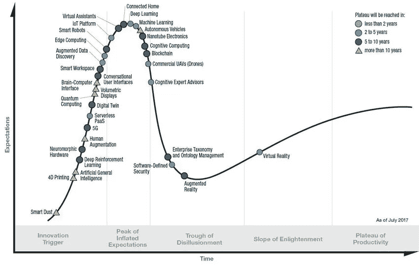

# 6000 亿美元崩盘与区块链的真实价值

> 原文：<https://medium.com/hackernoon/the-600-billion-crash-and-the-real-value-of-blockchain-be74c2f2b91d>

## 论密码的内在价值和未来

正如加密爱好者和害羞的市场观察人士一样，他们将适时意识到，加密货币在 2018 年的大部分时间里一直在下滑。上周，livemint.com 的林世勤和彭博报道了 coimarketcap.com 追踪的所有货币的总市值如何跌至 2300 亿美元的历史低点，自今年 1 月以来，市场价值损失了 6000 亿美元。

 [## 加密货币的 6000 亿美元暴跌创下新低

### 香港:2018 年加密货币的抛售在周三创下新高，此前美国证券交易所…

www.livemint.com](https://www.livemint.com/Money/FfowGEmOwk4O0aOdMUwaJP/Bitcoin-tumbles-below-6500-on-delayed-SEC-decision.html?facet=amp&utm_source=googleamp&utm_medium=referral&utm_campaign=googleamp) 

## 这说明了加密的内在价值是什么？

从今年年初开始的暴跌真正说明了[区块链](https://hackernoon.com/tagged/blockchain) [科技](https://hackernoon.com/tagged/technology)和加密货币的价值？不多。如果你仔细观察，你会发现市值和价格的轨迹与区块链科技在科技炒作周期中的轨迹大致吻合:

现在，我的观点是将此图中的峰值(使用比特币作为总加密市场的代表)与下图中的峰值等同起来:

Gartner Hype cycle 2017

你必须记住，上面看到的快照是大约一年前的:根据 Gartner 的研究和分析，区块链即将一头扎进“视觉低谷”。

**如果你不熟悉的话:Gartner 炒作周期基本上说的是市场中的人们对给定新技术的预期，与时间有关。它还不太直接地说明了所述技术随着时间的推移将带来的真正(商业)价值，其中最大和最稳定的价值出现在低谷之后和“启蒙的斜坡”*

所有这些基本上表明，我们已经度过了大肆宣传的高峰期，现在我们可能开始看到区块链技术能够为世界带来的真正价值。然后作为一个代理，他们会带来什么样的财务价值。

## 区块链最终会带来什么价值？

正如我之前在我的广泛分析“成为区块链蝙蝠侠:致富和拯救世界”中所指出的那样，区块链技术为人类组织他们的世界提供了两种经常被忽视的基本和新的能力:一种支持我们对货币的信念的新方法，以及一种使信息分发的集中和私有平台变得多余的方法。

**1。“法定”货币的新定义**
聪智(化名)给我们的最重要的东西是一种建立对货币的信任的新方法。一个毫无意义的虚拟代码块链，我们可以*决定*赋予它价值。

区块链或基于密码术的硬币给了我们一种新的方式来支持对货币的信仰，或我们对金钱或价值观念的信仰。这种新的方式就是我们对技术的信念——或者换句话说，对人类创造力的信念。

*旁注:看到我最喜欢的作家和思想家之一，* [纳西姆·尼古拉斯·塔勒布](https://medium.com/u/f138bf5466fe?source=post_page-----be74c2f2b91d--------------------------------) *，称比特币——以及任何被广泛接受的加密货币——为第一种“* [*有机货币*](/opacity/bitcoin-1537e616a074) *”是一件非常惊喜的事情。这是另一种方式来说，我们作为个人和社会有选择相信它的自由。*

**2。打破目前平台垄断的方法** 除了打破银行/政府对货币的垄断，区块链技术提供的第二个内在的新可能性是打破平台垄断的可能性。打破现在控制信息和注意力流动的看门人的垄断，并把同样的角色带到 commons 拥有的去中心化平台。

如果说比特币是前者的海报小孩，以太坊对于后者大概也是如此。

## 在科技的帮助下互相信任

那么这对未来意味着什么呢？现在，问题不是区块链科技作为一种支付和价值储存手段，还是 blochain 科技作为一个平台，是否会给社会带来主要价值和好处。

有一种新的方法来支持我们对货币的信念，有一种方法来使信息传播的集中和私有平台变得多余，这两种方法的共同点如下:

区块链是一种组织信任的新方式:远离中央机构，走向全球点对点系统。市场对加密货币价值的兴奋只是一个指数，表明人们看到了利用加密货币快速赚大钱的方法。郁金香，。coms，crypto 的；都一样。

再加上金钱在我们社会中的重要性，以及政府和金融监管机构需要对其施加的力量，最近的暴跌只是全球政府和监管机构的决定如何影响市场对加密的热情的又一个例子。

但是区块链的长期价值——和长期利润——将来源于我上面所说的:以一种新的方式组织信任，并打破有利于公有的垄断。

## 期待什么:在波动性和长期价值方面的长期“翻转”

那么，在接下来的一两年里，我们可以期待看到什么呢？请注意，我不是金融分析师。但在我看来，[比特币](https://www.livemint.com/Money/MEnEGgQ4GQnQS5Trz3IXaN/Bitcoin-extends-rally-to-breach-8000-for-first-time-since.html?facet=amp&utm_source=googleamp&utm_medium=referral&utm_campaign=googleamp) [据报道](https://www.livemint.com/Money/FfowGEmOwk4O0aOdMUwaJP/Bitcoin-tumbles-below-6500-on-delayed-SEC-decision.html?facet=amp&utm_source=googleamp&utm_medium=referral&utm_campaign=googleamp)下跌了 7%之多，以太下跌了 4%，这一事实在我的直觉中可能象征着更大的事情:

纯粹以货币为导向的区块链倡议(不考虑像 Ripl 等例外。)很可能会在相当长的一段时间内继续非常不稳定，而面向平台和应用的区块链解决方案的市场估值将变得越来越稳健，因为在这些领域中小麦已经从谷壳中分离出来。

因此:不一定是以太坊取代比特币成为市值第一大货币的“翻转”，而是平台和应用区块链超过主要货币的翻转的延伸。

部分原因是，世界各地的政府和机构似乎更难也不太可能通过立法和法规来反对点对点应用程序，并与公有信息平台作斗争。

总而言之，我们可以期待看到区块链理工大学为世界提供更多的实际价值，无论是内在价值还是金钱价值。并且看到更多来自平台和应用程序的(稳定、长期)收益，而不是来自纯粹的加密货币。

建议进一步阅读:

 [## 区块链蝙蝠侠:通过理解金钱、密码的本质来致富和拯救世界…

### 作为心智结构的金钱和价值

medium.com](/life-beyond/blockchain-batman-getting-rich-and-saving-the-world-by-understanding-the-essence-of-money-crypto-2a301baf61af) 

我非常重视并感谢您的关注。这也是我努力带来价值的原因。我主要写在 [*和*](https://medium.com/life-beyond) *之外的生活。如果你能让我知道你是如何评价这篇文章的，我会很高兴，通过鼓掌或者在下面的评论中。*

*最后，如果你知道这篇文章对谁有价值，请分享。*