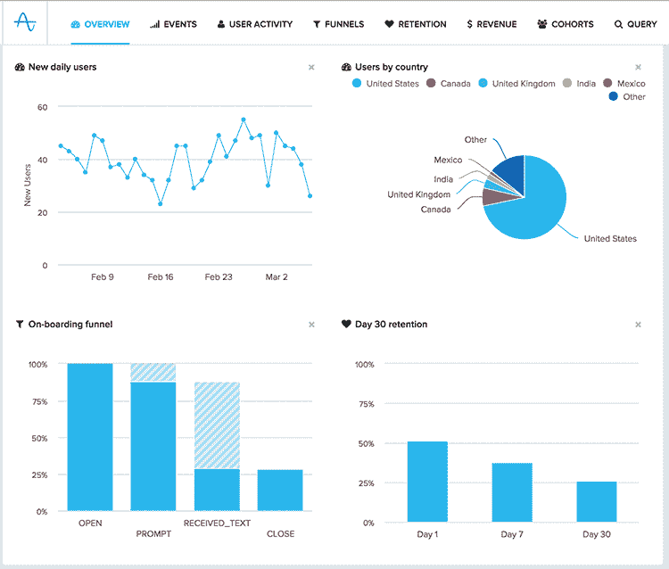
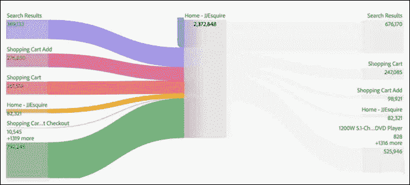
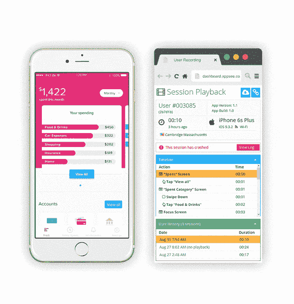
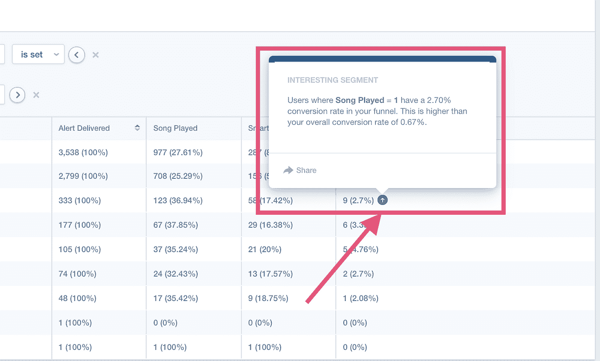
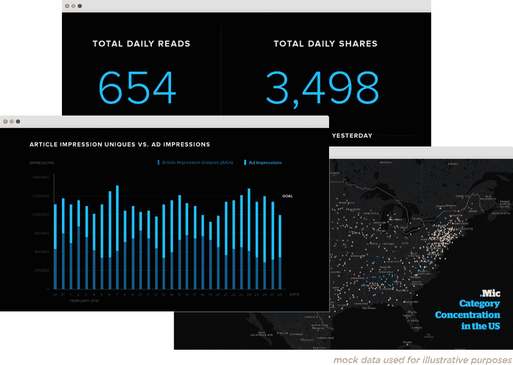
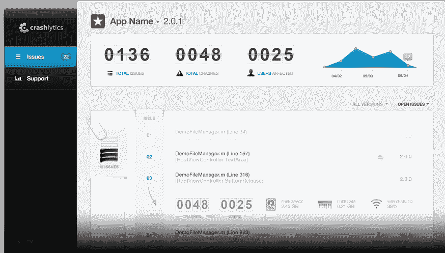
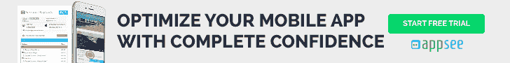

# 7 款最佳安卓应用分析工具[2018–2019]

> 原文：<https://medium.com/hackernoon/the-7-best-android-app-analytics-tools-2018-2019-cfcade20a5e0>

恭喜你！您已经完成了测试，修复了崩溃并粉碎了所有您能找到的错误，并且在 Google Play 上发布了您的应用程序。你坐下来，等待每日下载量开始飙升，等待热情洋溢的评论开始到来。毕竟，现在艰苦的工作已经过去了。对吗？

嗯…我们都知道那不是真的。发布后可能是一段混乱的数据、混乱的保留率、困难的决定和许多不眠之夜的时间。谢天谢地，这就是应用分析的用武之地。但是有这么多选择，你如何选择最好的 Android 应用分析工具呢？

为您和您的应用选择正确的分析平台可能具有挑战性。此外，这种多样性实际上会让你更难做出决定。我们挑选了 7 个平台，我们认为它们是今年的领导者(谁肯定会在 2019 年领先)。有些更侧重于事件和性能，而有些则使您能够评估用户体验和行为。这些工具中的任何一个都不会出错。

# Android 应用分析工具#1: [振幅](https://amplitude.com/)

*“数字时代的产品分析”*

价格:免费/付费

支持的平台:Android、iOS、web

Amplitude 旨在帮助你理解用户行为，创造更好的产品体验。为了提高您的参与度、转化率和保留率，Amplitude 的 Android 应用程序分析跟踪数据，将其组织成方便的行为报告，并帮助您根据您的数据得出结论和获得洞察力。

特点:

*   实时产品分析
*   智能提醒
*   快速洞察
*   SQL 访问

# 安卓应用分析工具#2: [Adobe](https://www.adobe.com/il_en/data-analytics-cloud/analytics/mobile-app-analytics.html)

*“了解他们为何选择你的应用。知道他们为什么留下来。并且知道如何留住他们。”*

价格:按服务器调用量；选择、主要和最终

支持的平台:iOS、Android、Apache Cordova、移动网络

在它的许多其他工具和平台中，软件巨头 Adobe 有一个跨设备的工具，用于 web、移动 web 和 iOS 以及 Android 应用程序分析。它内置于 Adobe 体验云中，因此您也可以享受 Adobe 的大量工具套件。Adobe 的应用程序分析工具包括一系列广泛的功能，从自定义拖放仪表板和自动化工作流到高级算法属性和用户旅程分析。额外收获:Adobe 的移动营销插件提供用户行为分析和崩溃分析。

特点:

*   崩溃分析
*   用户行为分析
*   用户流量
*   智能警报
*   断代分析

# Android 应用分析工具#3: [Appsee](https://www.appsee.com/?utm_source=medium&utm_medium=link&utm_campaign=top_7_best_android_analytics_2018_2019&utm_content=appsee_homepage_link&cpnid=701b0000000Wd7c)

*“前所未有地了解应用内体验”*

[价格](https://www.appsee.com/plans) : 14 天免费试用/付费

支持的平台:iOS 和 Android

有了 Appsee 的 Android 应用分析，你不仅可以获得 MAU/DAU、崩溃和转换率的数字数据，还可以获得定性数据。这意味着你可以通过用户会话记录获得用户操作的逐步细分，以及通过触摸热图获得应用程序每个屏幕上手势的汇总视图。所有这些都是自动发生的，不需要您花费时间来标记事件。您团队中的每个人都可以从 Appsee 的定性应用分析中受益:UX/UI 设计师和产品经理可以使用触摸热图来定位影响保留率的可用性问题，例如次优导航或无响应的手势。开发人员可以观察崩溃会话的记录，以查明崩溃的确切原因，而不是梳理代码行。定性和定量应用程序分析工具的这种结合确保了更快、更明智的决策过程，没有任何猜测。

特点:

*   触摸热图
*   用户会话记录
*   崩溃报告
*   行动队列
*   留存分析
*   用户流和导航路径
*   不需要事件标记

# Android 应用分析工具#4: [Firebase](https://firebase.google.com/)

*“Firebase 帮助移动应用团队取得成功。”*

价格:免费，随用随付

支持的平台:Android、iOS

Firebase(由 Google 开发)是 Android 应用分析的 Google Analytics。Firebase 的性能监控工具从用户的角度提供对应用性能的洞察。此外，Firebase 可以帮助您缩小数据范围，更快地发现性能问题。Firebase 工具套件伴随着你的整个应用制作过程，包括托管、认证、A/B 测试和其他有用的工具。

特点:

*   性能监控
*   测试平台
*   通过 Crashlytics 集成进行崩溃报告
*   通过谷歌分析的属性数据

# Android 应用分析工具#5: [Mixpanel](https://mixpanel.com/)

*“了解每一个用户的旅程”*

价格:免费，999 美元/年，企业版

支持的平台:Android、iOS、web 和移动 web

Mixpanel 旨在通过为团队提供可操作的用户行为分析，消除用户分析中的犹豫和猜测。通过 Mixpanel，你可以在你的应用程序上标记你想要跟踪的事件，然后在机器学习的帮助下获得自动洞察。Mixpanel 的机器学习使用数万亿个数据点来预测用户行为，帮助你在竞争激烈的应用程序游戏中领先一步，使这款 Android 应用程序分析工具成为人们的最爱。

特点:

*   自动洞察
*   A/B 测试
*   参与度分析
*   留存分析
*   漏斗分析

# 安卓应用分析工具#6: [Keen](http://keen.io)

“为您的用户提供快速、灵活的分析”

价格:基于你收集和分析了多少数据

支持的平台:Android、iOS

Keen 采用 DIY 方法进行 Android 应用程序分析，让移动应用程序开发人员创建自己灵活的定制分析堆栈，以最好地满足他们的需求。通过 Keen，您可以从应用程序中的事件收集数据，添加自定义属性，然后创建自己的仪表板来跟踪您想要的指标。额外收获:Keen 甚至为每个人最喜欢的应用类别提供了一个特殊的分析平台:游戏！！！

特点:

*   定制事件跟踪
*   嵌入式分析
*   出版商分析

# 令人敬畏的安卓应用分析工具#7: [Crashlytics](https://try.crashlytics.com/)

*《不再有悲伤的应用》*

价格:免费

支持的平台:Android、iOS

没有强大的崩溃分析功能，任何 Android 应用程序分析都是不完整的。Crashlytics 旨在通过向应用程序开发人员提供非常详细但仍然用户友好的崩溃报告，自动突出显示需要您注意的行，从而消除世界上的错误。Crashlytics 从不遗漏任何东西，并跟踪您需要的每一个数据元素:设备、方向、电池状态、WiFi 连接等。因此，Crashlytics 实际上可以精确定位应用程序崩溃的确切代码行。最重要的是，它非常轻量级，所以它不会影响你的应用程序的性能。

特点:

*   轻量级 SDK
*   实时
*   跨平台崩溃分析
*   工作流集成

# 走之前说几句话

选择正确的 Android 应用程序分析工具是你为应用程序做出的最重要的决定之一。想象一下，您的分析堆栈是一个值得信赖的朋友，与您同行，提供建议，如果您真的陷入困境，还会给你当头一棒。我们都需要这样的朋友，所以一定要明智地选择。我们已经尽可能地缩小了列表，但是如果你认为我们错过了一个很棒的 Android 分析工具，请在下面的评论中添加它！

