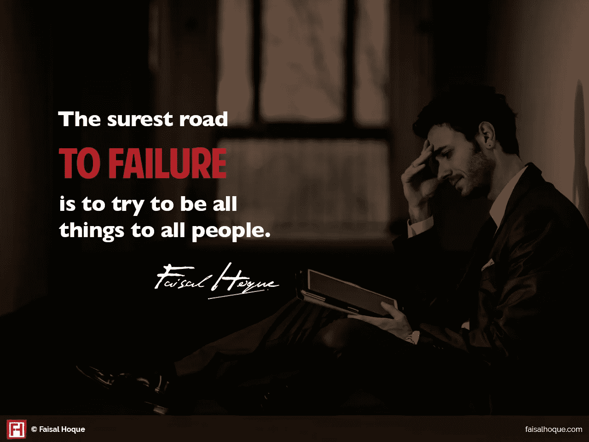
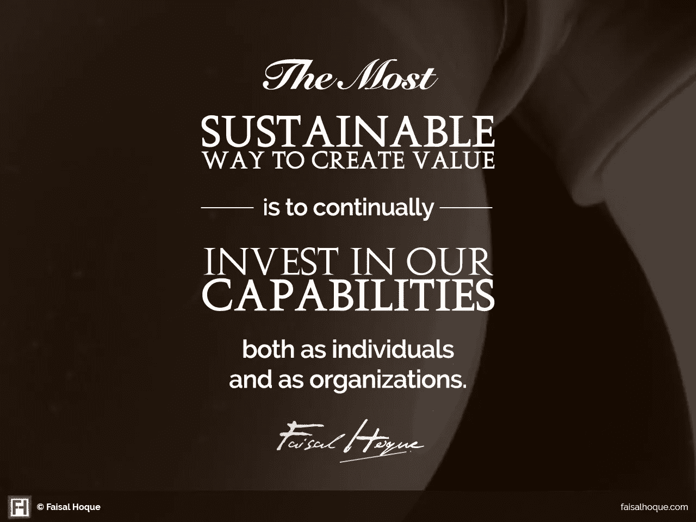

# 可持续业务增长的 7 个基本要素

> 原文：<https://medium.com/hackernoon/the-7-fundamentals-of-sustainable-business-growth-4afff39859bb>

[Photo by [rawpixel.com](https://unsplash.com/photos/aOYA7D3fse8?utm_source=unsplash&utm_medium=referral&utm_content=creditCopyText) on [Unsplash](https://unsplash.com/search/photos/business?utm_source=unsplash&utm_medium=referral&utm_content=creditCopyText)]

## 用有限的资源创造长期价值对企业家来说是一个巨大的挑战，但这并不新奇。

我的祖母住在孟加拉国的一个偏远的村庄里，身高不足五英尺，骨瘦如柴，说话非常温和。她几乎不会读或写，从未接受过正规教育，但她成功地管理了一家农业和分成制企业，监管着一个由农民、商人和季节工人组成的网络，同时抚养着 9 个孩子，维持着一个家庭的秩序。

要做到这一点，她需要在不耗尽她(和她的社区)可支配的有限资源的情况下，从她指导的工作中创造长期价值。尽管现代企业家所处的环境大不相同，但可持续增长的基本原理是一样的。这是其中的七个。

# 真实目的

每家公司都需要明确“我们为什么要做这些事情”那是公司的北极星，指导着从招聘到客户管理再到产品开发销售的每一个环节。

强烈的目标推动增长和盈利。例如，在过去的 10 年里，投资于 T2 斯坦格尔 50 指数(全球表现最好的 50 家公司的名单)会比投资于标准普尔 500 指数盈利 400%。

为了获得可持续的成功，公司必须反复重新审视他们的目标感，并确保组织很好地为其服务。真实和鼓舞人心的目标允许:

*   持续一致的专注感
*   公司内部以及与客户和合作伙伴之间强烈的情感互动
*   持续、务实的创新

销售和营销专家经常谈论“独特的销售主张”，或“USP”，其中 [*企业家*将](http://www.entrepreneur.com/encyclopedia/unique-selling-proposition-usp)定义为“销售者提出的因素或考虑，作为一种产品或服务不同于竞争对手并优于竞争对手的原因。”

一个公司的真实目的产生了它的 USP。当一个企业有了清晰的愿景，就更容易创造有价值的产品和服务。例如，露华浓创始人查尔斯·雷夫森总是说他卖的是希望，而不是化妆品。

# 强大的品牌

如果你想创建一个可扩展的企业，你必须明白建立品牌资产和与客户的情感联系有多重要。正是这些附件将客户与你的产品联系起来，并让他们不断回到你的身边。建立品牌就是要随着时间的推移发展和维持这些关系。

这里有一些基本规则来[联系、塑造、影响和引导](http://www.fastcompany.com/3026734/leadership-now/5-ways-to-inspire-and-encourage-everyone-you-work-with)你的产品和品牌:

**选择你的目标受众**。产品失败的最可靠途径是试图满足所有人的所有需求。

**联系大众**。让你的受众对你的品牌产生情感依恋，这种情感依恋是基于对你的产品的信心。

激发你的顾客。一个简单的、鼓舞人心的信息远比一个试图强调太多产品特性、功能或想法的信息更有影响力。

没有任何营销计划能够拯救一个尚未完全成型的品牌形象。没有多少营销预算可言？为出版商和社交媒体网站创建引人注目的内容，开始在目标客户群中产生认知，并建立。

# 伙伴关系和协作

当资金很少而雄心很高时，开始时自己做每件事可能很诱人。虽然动手的方法没有错，但是承担超出你能力范围的事情，尤其是在你缺乏经验的领域，可能是有害的。在全球自由职业经济的时代，找到有才华的专家并不困难，但你必须知道去哪里找他们。

现在有几十个[网站和在线市场](http://www.fastcompany.com/3049532/the-future-of-work/heres-why-the-freelancer-economy-is-on-the-rise)提供从设计、开发、销售到金融、法律服务和银行的专业资源。最好的部分是你可以尝试低投资的小项目。诀窍是确切地知道你想做什么，并把资源投入到实现有形的目标。

# 客户保留

正如 Emmet 和 Mark Murphy 在他们的书*领导混乱的边缘*中所写的，获得新客户的成本可能是保持现有客户的五倍。事实上，客户保持率提高 2%与公司成本降低 10%的效果是一样的。换句话说，降低 5%的客户流失率就可以增加 25%到 130%的利润，这取决于行业。

根据[美国商会](https://www.uschamber.com/sites/default/files/legacy/reports/21st_final.pdf)和[美国小企业管理局](https://www.sba.gov/sites/default/files/files/resourceguide_3148.pdf):

*   美国企业平均每五年就会失去大约 50%的客户群。
*   公司与现有客户做生意的可能性是新客户的四倍。
*   向现有客户销售的可能性为 60–70 %,而向新客户销售的可能性仅为 5–20%。

成功的客户维系始于企业与客户的初次接触，并贯穿于关系的整个生命周期。贝恩资本(Bain Capital)甚至估计，对于某些行业来说，客户保持率提高 10%大致相当于公司价值提高 30%。

# 社区

商业生态系统是由以无数方式互动的组织和个人组成的经济共同体。这些生态系统鼓励公司有竞争力地发展他们的能力。

有时候，一个生态系统可以围绕一个产品萌芽，比如一系列的外壳、耳机和其他移动设备配件。类似地，生态系统思维已经成为网络出版的基石——大量无报酬的贡献者为受欢迎的媒体创造内容，以换取增加自己的读者数量和发展个人品牌。

生态系统对可持续增长至关重要，因为它们提供了围绕和支持其中业务的结构。他们将“利益相关者”从商业领域扩展到社会，就像我祖母和她的农业社区一样。

# 可重复销售

创造一个独特的产品和品牌是不够的。创建可扩展的业务需要可重复的销售流程。签几个客户是一回事；设计和实现可以在更大规模上一次又一次成功部署的销售流程是另一回事。

在以下情况下，您已经创建了一个可扩展的销售模式:

*   你可以在与企业家或销售主管相同的生产力水平上增加新员工。
*   您可以持续增加客户线索的来源。
*   你有一个可以持续预测的销售转换率和收入。
*   随着时间的推移，获得一个新客户的成本远远低于你从该客户身上赚取的金额。
*   客户在正确的时间、正确的地点获得正确的产品。

可重复的销售模式构建了可扩展的平台。但是在你找到一个真正可持续的方法之前，需要大量的实验和深入的研究。

# 灵活、适应性强的领导

为了继续发展，企业家、经理和企业主必须成为企业在每个特定发展阶段所需要的领导者。由于公司的需求在每个阶段都会发生变化，其领导者需要以正确的速度不断发展。这需要内省、自我意识和敏锐的战略意识——无论是短期还是长期。

我相信[适应性强、灵活的领导风格](http://www.fastcompany.com/3025184/leadership-now/9-essential-principles-to-create-lead-and-sustain)来自于留心。我们的个体，

人际交往和工作生活都是相互关联的。通过留心，我们了解这些关系以及如何最好地利用它们来创造、创新和领导。

这让我们能够以一种能够带来长期价值创造的方式来安排我们的生活和我们的组织。事实上，创造价值的最可持续方式是不断投资于我们的能力，无论是作为个人还是作为组织。

*【图片:Flickr 用户* [*叶卡捷琳娜*](https://www.flickr.com/photos/kisitir/5199200595/)

***原创文章**[**@ faisalhoque . com**](http://faisalhoque.com/2015/08/18/the-7-fundamentals-of-sustainable-business-growth/)**和**[**@ fast company**](http://www.fastcompany.com/3049856/the-7-fundamentals-of-sustainable-business-growth)**。***

**fais al Hoque 版权所有 2018。保留所有权利。**

*我是一名企业家和作家。SHADOKA 等公司创始人。Shadoka 通过其加速器和解决方案实现了领导、创新和转型的愿望。著有《 [*《万物互联——如何在创意、创新和可持续发展的时代进行变革和领导》》(麦格劳·希尔，2014 年)和《*](http://www.amazon.com/Everything-Connects-Creativity-Innovation-Sustainability/dp/0071830758/ref=sr_1_1?ie=UTF8&qid=1376488798&sr=8-1&keywords=everything+connects%2Bfaisal+hoque) *[*生存并茁壮成长:弹性企业家、创新者和领导者的 27 种实践*](http://survivetothrive.pub/) 》(励志出版社，2015 年)。在推特上关注我 [@faisal_hoque](https://twitter.com/faisal_hoque) 。**