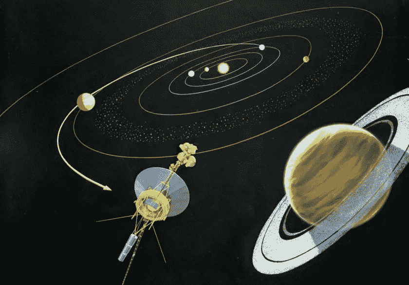
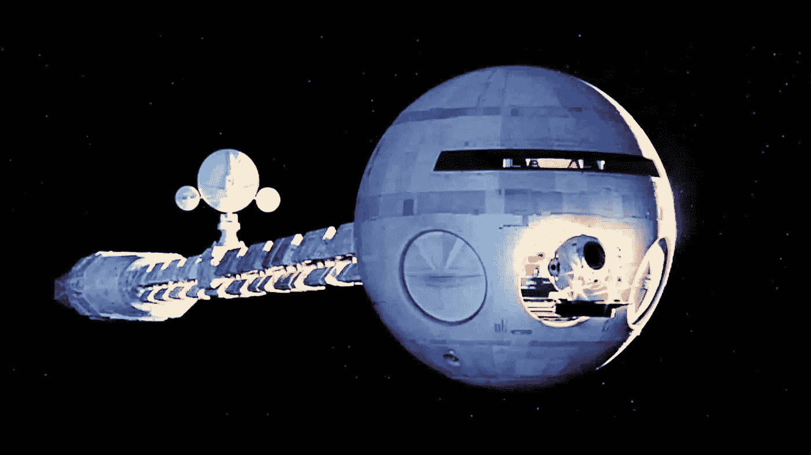
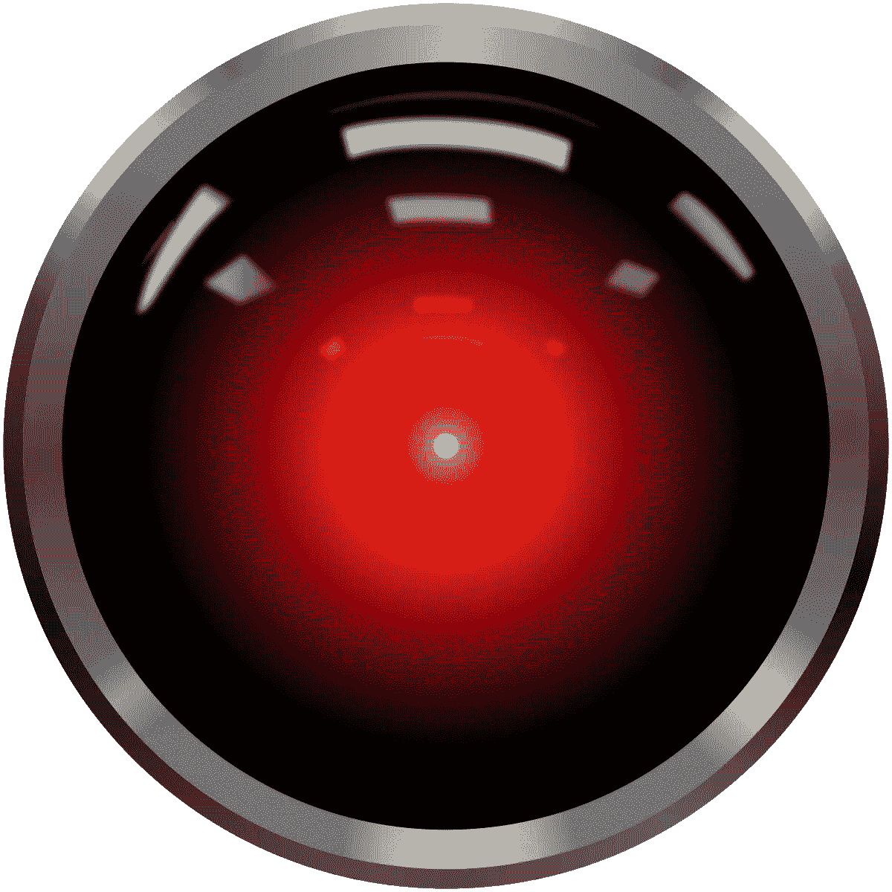

# 亚瑟·C·克拉克的 7 个太空预言成真了！

> 原文：<https://medium.com/hackernoon/the-7-space-predictions-from-arthur-c-clarke-that-came-true-8e0d0b026079>

大约一年前，我访问斯里兰卡，有幸参观了亚瑟·C·克拉克保存完好的办公室(如果你愿意，可以在这里阅读我的[访问)。读过那篇文章的人都知道，我从小就是克拉克科幻小说的忠实粉丝，所以能在那里看到他的书和办公室是一件令人激动的事情。在 2008 年去世之前，他在斯里兰卡生活了 30 年。](https://hackernoon.com/what-i-found-on-arthur-c-clarkes-bookshelf-in-sri-lanka-71c602bc1fdc)

今年，我无法去那么远的地方旅行，但参观中西部父母的房子让我想起了我小时候读克拉克科幻小说的时光——想象我和一些船员一起“在太阳系里嬉戏”。

虽然克拉克的书中有一些元素甚至在今天也超出了我们的能力范围(想想《星子》或《童年的终结》)，但总有一些元素看起来离我们不远。所以，这个圣诞假期，我想写一些亚瑟·C·克拉克在他的科幻小说和科学相关作品中预言的事情，这些事情已经(大部分)成为现实(或者很快就会成为现实！).

## ***科幻变身科学***

当然，科幻小说总是有办法预测未来，可以追溯到儒勒·凡尔纳 1865 年的小说《从地球到月球》。虽然凡尔纳的预测并不完全正确，但他的预测是非常正确的，即美国人将首先登上月球，从佛罗里达州的某个地方发射一门巨型火炮(火箭并不存在)。谁不知道翻盖手机是《星际迷航》的后代，今天的 facetime 和 iWatch 看起来很像迪克·特雷西的手表手机，不是吗？

克拉克的科幻小说与其他许多科幻小说的不同之处在于，他经常更多地思考这些东西是如何工作的以及它们为什么会是现在的样子——不仅仅是为了方便，还借鉴了科学文献和科学必要性。例如，与《星际迷航》中的运输机不同，它只是为了方便而创造的(这样制片人就不必为往返星球的航天飞机的特殊效果付费，这是很昂贵的)，克拉克通常对他小说中的科幻元素有一些深思熟虑的理由。

## ***来自 ACC 本人***

克拉克自己曾经说过，“试图预测未来是一项令人沮丧的危险职业”，他(正如他在科幻世界中所知的那样)在某种程度上归功于他预测了从互联网到电子邮件再到谷歌的一切！

在这篇文章中，我将坚持 ACC 最擅长的，写外太空和外星人！

我并不是说克拉克一定是第一个想到所有这些东西的人——事实上，有时他只是第一个把它们放进流行的科幻小说中，即使在一篇论文或一个概念之前就已经存在了。

所以，事不宜迟，下面是一些已经实现的预测(当然，实现的程度不同):

## ***1。*** ***重力辅助机动***

在与电影(1968 年上映)同时创作的小说《2001:太空漫游》中，ACC 发现了土星的一颗卫星(伊帕托斯)，而不是木星。在电影中，斯坦利·库布里克(他正在与 ACC 合作，并希望使用美国宇航局的最新图像)决定以木星为目的地，因为他们有美国宇航局关于木星的照片。库布里克担心，由于他们没有太多的土星图像，一旦美国宇航局获得更准确的图像，这部电影可能会显得过时。

Just like in the novel 2001, the Voyager probes used Jupiter’s gravity to get to Saturn (src: the Planetary Society)

这都是一点历史，但我记得读过小说版本，这是我第一次听说“重力辅助”机动。在小说中，发现号宇宙飞船利用木星的引力在前往土星的途中加速。虽然木星“只有”5 亿公里远，但土星可能远在十亿公里之外(取决于位置)，尽管我们已经习惯了它们靠得很近。平均而言，这个环形行星的距离几乎是它的两倍。这意味着飞船不需要携带那么多的燃料就能一路到达土星。

这种利用行星来“帮助”悬挂航天器的想法实际上被美国宇航局用于许多探测器，包括水手 10 号和旅行者号探测器。在某些情况下，探测器向内朝向太阳，并利用金星的重力辅助减速，而旅行者则利用木星加速前往土星，就像 ACCs 小说中一样！

在他的另一部小说*与罗摩*会合(我们一会儿会详细讨论)中，一艘建造在小行星上的外星飞船正在利用太阳的引力辅助其星际任务！ACC 并不是第一个想到这一点的人——苏联人实际上在 1959 年利用月球的引力进行了一次探测器飞越，但他在行星周围使用它是像我一样的许多科幻小说读者第一次听说它！

## 2. ***通讯卫星。***

ACC proposed using a satellite in geosynchronour orbit for boucning off radio signals (src: Wikipedia)

阿瑟·C·克拉克在 1945 年为《无线世界》撰写的一篇文章中提出了地球同步通信卫星的想法，这是一种相对于地球保持在同一位置的卫星。ACC 提出，这样的卫星可以用来在地球上反射和发送无线电信号。*无线世界*的编辑把论文题目改成了*外星接力*。

根据许多消息来源，这个想法当时并没有受到重视，因为没有人知道如何将卫星送入众所周知的“克拉克轨道”。20 年后，在 1965 年，第一颗通信卫星被发射到克拉克轨道，今天在这个轨道上有超过 300 颗卫星！

## 3. ***太阳系外的小行星。***

2017 年，夜空中出现了一个有争议的物体，并被观察了数周。它被确定为第一个来自太阳系之外的已知物体。它奇怪的动作和属性让科学家们认为它是一个细长(雪茄形状)的小行星或彗星或外星人太空探测器——我们不能确定是哪一个。

Conception of our first interstellar visitor , ‘Oumuamua (src: CNN)

天文学家发现自己所处的场景似乎与 ACC 1973 年的小说《与拉玛会合》惊人地相似。在小说中，一颗细长的小行星被外星文明改造成了太空探测器，并在我们的太阳系中游荡，计划利用太阳作为重力辅助手段到达它要去的地方。这个探测器在书及其续集中被外星文明抛弃了。天文学家首次提议将去年发现的小行星命名为 Rama，它看起来确实像是一颗由外星文明操纵的小行星。最后，我们选择了“Oumuamua”这个名字(这是一个好名字，意思是“天上的使者”或“来自过去的使者”)，当然，科学家们继续前进，并自信地表示，这个物体没有任何外星人的东西。

一年后的今天，我们知道什么？事实上，该物体确实围绕太阳旋转，其速度增加的方式与小行星或彗星假设不一致，这导致一些人，包括哈佛大学天文学家亚伯拉罕·勒布(Abraham Loeb)，天文学教授兼主席，以及哈佛大学史密森天体物理中心的博士后学者施穆尔·比亚利(Shmuel Bialy)猜测，这毕竟是一个外星探测器。它的加速特性更符合轻帆的特性，而不是小行星或彗星！

所以，虽然我们不知道它到底是什么，但目前符合数据的最佳假设是，它是一个外星人探测器穿过我们的太阳系，绕着太阳旋转？听起来很熟悉？也许终究应该叫拉玛吧！

## 4. ***在轨道上建造船只。***

The Discovery from the movie 2001: A Space Odyssey (src: syfy wire)

ACC 预测，在轨道上建造大型航天飞船和使用航天飞机将宇航员送上飞船会容易得多。这就是《发现号》在《2001:太空漫游》和《T1》续集中的建造过程。这不是 ACC 的发明——许多科幻作家都预测到了这一点。我们今天要这么做吗？不完全是，但是它是触手可及的。有些公司已经派出 3d 打印机在太空组装大型结构(Made in Space 是一家打印了有史以来最大的 3d 打印物体的公司，为在太空打印大型结构做准备)，还有一些充气模块的近期计划，这些模块将在太空组装成大型结构(想想毕格罗航空航天公司)。到目前为止，国际空间站是唯一一个完全展开的此类结构，但这一预测并不遥远。

## 5. ***哈尔和对话式人工智能。***

谁能忘记 2001 年的那句经典台词，这句话出自车载人工智能计算机 HAL 9000:“对不起，戴夫，我做不到？”

I’m sorry Dave, I can’t Do that — the HAL 9000 computer from 2001 (src: wikipedia)

在过去的 10 年里，人工智能出现了爆炸，因为机器算法现在被用来学习做从驾驶汽车到玩视频游戏的一切事情。ACC 不是第一个预测机器智能的人；

麻省理工学院教授和贝尔实验室研究员克劳德·香农是许多人之一，他说有一天机器将能够在国际象棋和写诗方面击败人类大师。象棋的事情已经发生了，不太确定诗歌。在 Sofia 的时代，有如此多不同种类的人工智能和虚拟影响者和个性，看起来像 2001 年 HAL 那样的智能计算机，可以与我们交谈，并不遥远——一些专家说，再过 10 到 20 年。

## ***6。*** ***欧罗巴，液态水，生命。***

在 2001 年的续集《2010:奥德赛 2》及其续集《2061:奥德赛 3》中，克拉克放弃了土星的卫星伊帕托斯，并制作了电影的续集，而不是他的小说。在这部续集中，一组苏联和美国宇航员前往木星寻找这一发现，并了解失踪的戴夫·鲍曼和他的船员发生了什么。

当他们到达那里时，他们最感兴趣的木星卫星之一(也是戴夫·鲍曼现在成为的外星小孩)是欧罗巴，它被冰覆盖着，下面是海洋。第二本书以一个弥天大谎结尾:木星变成了一颗小恒星，欧罗巴就是原因，因为这里有生命可以发展！2010 年末的一句名言:除了欧罗巴，所有这些世界都是你的。不要试图在那里着陆。

2061 年，一个船员实际上去了欧罗巴，由于木星在 2010 年底转变为一个小太阳，称为地球上的路西法，欧罗巴已经发展成为一个可居住的星球。撇开对此负有责任的超级聪明的外星人不谈，克拉克关于欧罗巴是太阳系中最有可能存在生命的地方的预测已经被证明是相当准确的，因为覆盖地球的冰层下存在液态水。

Plumes of water have been seen on Europa (src: Space.com)

对木星卫星的探测表明，木卫二有从表面喷出的水，据估计它有 100 公里厚的水覆盖。一些估计说木卫二可能比地球有更多的水！

那么，在冰下的水中会有什么在等待着我们呢？引用历史频道热播系列的话，会不会是……外星人？？

## 7.降落在一颗彗星上。

在 1987 年出版的小说《2061:奥德赛 3》的开头，在我认为很酷的一个序列中，宇宙飞船银河号正降落在哈雷彗星的表面，哈雷彗星已于 1961 年返回地球(做一下数学，你就会明白为什么小说的背景是 2061 年！).

当然，这部小说中发生的事情远不止彗星，但在当时，这一部分以及小说的其余部分被认为是科幻小说。今天，我们知道这并不遥远。2004 年，欧洲航天局发射了罗塞塔号，这是一个旨在研究彗星的太空探测器。12 年后的 2016 年，探测器不仅勘测到了一颗彗星，7P/丘留莫夫-格拉西缅科，还成功在这颗彗星上硬着陆！

我想知道 2061 年我们会在做什么？？

好了，现在你有 7 个预言已经实现了，或者很有可能在十年或二十年后实现。不错的记录。但是，当然，科幻小说就是科幻小说，在 ACC 的小说和论文中仍然有很多我们渴望的东西。

而这些只是那些已经或可能很快实现的想法！等到我们谈到 he 太空电梯(天堂的喷泉)、气体巨行星中心的钻石(2061:奥德赛三)、星际殖民(遥远地球之歌)就更不用说藏在月球上的神器这个诱人的想法了(如果你是一个远古外星人造访地球，你会把一个通讯设备放在哪里？？).

> 如果你喜欢这篇文章，请鼓掌 20x，跟我来。