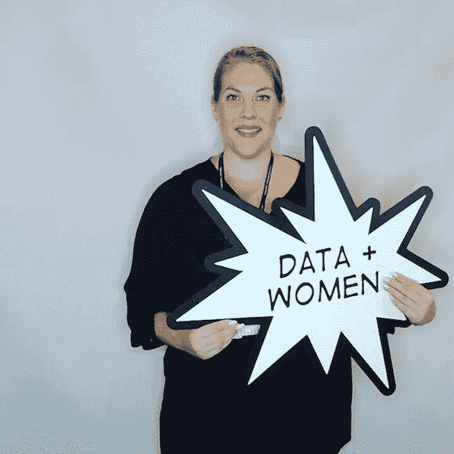

# 科技领域的女性领导者给自己毕业生的建议

> 原文：<https://medium.com/hackernoon/the-advice-leading-women-in-tech-would-give-to-their-graduate-selves-29a82053506f>

对于女性毕业生来说，科技职业可能是一个可怕的前景，特别是考虑到最近科技行业女性报道的一连串令人不快的事件**。但是，虽然这些问题肯定存在，但也有无数积极的故事和成功的故事——像澳大利亚的 [**女性创办的创业公司**](https://www.themartec.com/insidelook/25-women-founders)——有望鼓励 STEM 领域的年轻女性迈出第一步。**

**从许多方面来说，科技引领着平等的潮流，尤其是在让女性进入董事会方面。除了公平之外，这种推动的原因是什么？*性别平等有利于底线*。事实上，麦肯锡报告称，性别多样性排名前四分之一的公司比行业中值高出 15%。**

**在澳洲，女性创始人的数量继续呈上升趋势，去年年底占 25.4%，高于前年的 23.5%。当然，这不是 50%，但这比 2011 年的 16%好得多。**

**该行业正在努力支持科技行业的女性。这一点在 2018 年 3 月的国际妇女节上可以看到，当时许多主要的 [**澳大利亚风险投资公司**](https://www.smartcompany.com.au/startupsmart/news-analysis/australian-vc-firms-office-hours-support-female-founders/) 宣布了一项计划，将女性初创企业创始人与业内已确立的女性领导者联系起来，进行一对一的辅导。毕竟，有谁比以前的女性领导者更能激励未来的女性科技领导者呢？**

**遵循这一思考过程，我们收集了八位强势女性领导者和高管的见解，以找出如果她们今天毕业，会给年轻时的自己什么建议。**

****

# **Katherine Boiciuc， [Telstra](https://www.careers.telstra.com/home) 业务能力总监**

**凯瑟琳·博伊克认为，指导对于寻求职业发展的毕业生来说至关重要。她建议说:“写下我想认识和学习的人的名字，这是一个起草指导愿望清单的好方法。”她还建议保持轻松——“你不是在邀请某人参加学校舞会。如果第一次见面感觉不太好，那就不要强行发展关系。”**

**当谈到建立个人品牌时，Boiciuc 会告诉自己记住她的名字是她的品牌，“你应该像对待有价值的商品一样对待它。”此外，第一印象很重要；这适用于个人和通过您的在线个人资料。“信任很容易失去，很难重建，”她教导道。**

**博伊克也相信做自己。对她来说，这意味着穿着牛仔裤和闪亮的运动鞋来上班。她发现，当人们在办公室内外都感觉像自己时，他们最闪亮。其他人倾向于被那些个性鲜明的人所吸引。**

# **博伊克给女毕业生的三条关键建议是:**

1.  **“网络就像你的职业一样依赖于它……因为它确实如此。通过参加行业活动和使用 LinkedIn 等社交媒体平台，在公司内外建立可信的联系。”**
2.  **“你已经足够了，足够成为你想要的一切，去实现你内心的愿望……所以，找回你自己，大胆梦想吧！”**
3.  **“所有的企业都是以人为本的企业，所以确保你不要忘记通过信任的关系做生意这一已经失传的艺术。我建议亲自去见人，或者通过电话和他们交谈。这是一种更简单的沟通方式，也是一种更人性化的做生意方式。”**

****

# **凯特琳·瑞登，[猎豹数字](https://www.cheetahdigital.com/)APAC 服务部副总裁**

**21 岁的凯特琳·赖尔登发现自己面对一位女性招聘经理，这位经理问了她一个最基本的面试问题——“T4，你的弱点是什么？“我是女孩，我还年轻，”她回答道。招聘经理笑着告诉她“这不是缺点，而是优点。再试一次”。在接下来的几年里，赖尔登慢慢了解到“年龄只是一个数字，它和性别都不等同于智力或能力。”**

**赖尔登认为，找到一位导师对你的早期职业发展至关重要——“他们是如此重要的共鸣板，”她指出。她补充说，他们可以帮助你看到你希望未来成为一名领导者的特质，找到适合你的工作方式，并了解如何学习他人的经验。**

**但与此同时，她敦促女毕业生意识到，商业导师会来来去去，不要过度依赖他们的指导。“最终你会塑造自己的道路。永远不要把它留给导师、经理或其他任何人。当你做决定时，你应该从你的直觉、你的价值体系出发，以符合你自己风格的方式做出决定。”此外，她告诉毕业生们要尽可能地收集灵感，包括书籍、文章、播客、TED 演讲、家庭成员和行业专家。**

**关于建立个人品牌的重要性，赖尔登鼓励真实性——“在[插入公司]的旗帜下，你就是你自己的品牌。人们从人们那里购买。为了变得真实，为了被考虑升职或获得机会，你需要坚持一些东西。了解自己的价值观。展示并实践你的价值观。身体力行。**

**“商业中的很多东西都是基于情商，而不是智商，而这很大程度上来自于倾听和理解你自己与他人的关系以及他们对你的看法。”**

**赖尔登说，要为自己建立一个可信的品牌，做一个*实干家*—*把事情做好的人*，但也要谦虚地承认你周围人的成功。不要骄傲。远离办公室政治和八卦。用善意杀死它。**

**做到这些，赖尔登相信你会建立一个注定成功的个人品牌。**

# **赖尔登给女毕业生的三条关键建议是:**

1.  **“多样性是一种力量。”**
2.  **“适应力是一种最好的学习和艰苦考验的技能，如果你足够努力地考验它，它就会变成勇气。”**
3.  **“不是每个人都会喜欢你或者和你有相同的价值体系，但这完全没关系。忠于你自己。”**

# **娜塔莉·费尔，大客户经理，[传呼机责任](https://www.pagerduty.com/)**

**“毫无疑问，每个人都应该有一个导师，”PagerDuty 的大客户经理娜塔莉·费尔宣布。Fair 对导师和赞助商充满热情，因为他们有能力帮助毕业生在职业道路上导航，因为他们以前都这样做过。“发展事业并不总是容易的。有一个导师(可能的话还有一个赞助人)将会是一盏明灯，指引你到达你想要的地方。*动手吧！她强调道。***

**谈到建立个人品牌，费尔说，任何渴望成为领导者的人都需要被视为所在领域的“专家”。幸运的是，年轻的女毕业生拥有社交媒体。“在社交媒体出现之前，这要困难得多，”她指出，“现在任何准备把自己放在那里的人都可以做到。LinkedIn 通常是最好的起点。”她建议花些时间整理一份个人资料，向你试图吸引的观众展示。坚持张贴相关的、有针对性的文章，以建立可信度。**

**除了在线品牌建设，Fair 还鼓励年轻毕业生关注以下内容:**

*   **聚会:“去他们那里，建立关系网，主动成为他们中的一员，在适当的时候，开始你自己的聚会。”**
*   ****演讲位置:**“全年跟踪事件日历。瞄准一些适合你领域的事件。确定与您的品牌和受众相关的主题，并提交发言请求。”**

# **费尔给女毕业生的三条关键建议是:**

1.  **“对自己和自己能取得的成就充满信心。决定你想要什么，然后努力去做。”**
2.  **“把这些新想法带到桌面上来。如果他们不工作，尝试一次又一次。在这个敏捷的世界里，创新是受欢迎的，失败是被接受的。”**
3.  **“建立你的关系网。你遇到的人越多，你学到的就越多，你得到的曝光度也就越大。你可能会找到可以帮助你发展事业的赞助人，或者结交一些很棒的终生朋友。”**

****

# **琼·拉皮德，[维森特](http://www.versent.com.au/)的销售和市场总监**

**拉皮德承认商业导师的重要性，但他指出，只有在你既给予又接受的情况下，他们才有价值。她给年轻女毕业生的建议是:“导师会帮助你，但前提是你要投入你期望得到的东西。师徒关系有两种方式。”**

**拉皮德还认为，推销自己的关键首先是了解自己。“如果你想建立自己的个人品牌，想想你想以什么出名，你需要影响谁，以及你将如何接触到这些观众。对你分享的内容要有目的性。我相信，保持真实，尽可能地合作，对于建立强大的个人品牌至关重要。”**

# **拉皮德给女毕业生的三条关键建议:**

1.  **“不要害怕问问题。其实不要怕就好！提问显示的是坚韧，而不是知识的匮乏。”**
2.  **“帮助别人。永远不要因为太忙而不去帮助你的同事。帮助别人是帮助自己的一种方式。谁知道你的下一任老板会是谁？”**
3.  **“找时间建立关系网，即使这看起来很可怕。我仍然这样做。你会从与人交谈和了解他人的成功与失败中学到很多东西。”**

****

# **首席员工体验官 Helen Lea[MYOB](https://www.myob.com/au)**

**MYOB 的首席员工体验官 Helen Lea 说:“最终，我们每个人都必须走自己的路，但获得不同的观点是有帮助的。”。“在我们个人情况之外的人，或者自己走过类似道路的人，也可以通过一点点距离的好处来提供平衡的观点。”或许已经很清楚了，她是导师的忠实粉丝。**

**拒绝现代社会对个人品牌的关注，Lea 更愿意考虑 T2 的声誉。“你的声誉是真实的你的理想反映，而不是一个舞台管理或工程的角色。”对她来说，这意味着它应该从你是谁、你如何运作、你处理人际关系的方式以及你如何工作演变而来。但是，如果没有人看到，精心策划的声誉毫无意义——“不用说，拥有更广泛的声誉将为更多的机会敞开大门，所以参与你自己角色或组织之外的倡议、网络和项目是有帮助的。”**

**Lea 也很幸运能在一家重视性别平等的公司工作。“在 MYOB，我们有一项旨在鼓励更多女性进入科技职业的计划，名为 Developher，它专门针对希望改变职业方向或重新进入劳动力市场的女性。”**

# **Lea 给女毕业生的三条关键建议:**

1.  **“永远不要害怕说你不知道，请别人分享他们的知识或寻求帮助——当你真正对学习感兴趣时，人们在内心深处是非常慷慨的。”**
2.  **“在你的信念中要有勇气。一位前任经理曾经说过，我们“受雇于我们的意见、观点和看法”，所以分享它们吧。如果你把这些想法藏在心里，你对任何组织都没有价值。话虽如此，知道什么时候倾听，什么时候‘不轻易持有观点’也是一项强大的技能。”**
3.  **“接受生活抛给你的挑战和机遇。是的，会有风险，但没关系，因为收益会超过损失。”**

****

# **丹妮拉·迪·桑托，[埃森哲科技](https://www.accenture.com/au-en/careers?src=JBCAMP&c=car_employeeexperie_10266893&n=jpc_0518)高级经理**

**对于埃森哲科技公司的高级经理丹妮拉·迪·桑托来说，导师制就是激发灵感，寻找一个你可以复制的人。“你需要找到一个值得尊敬的榜样，以及一个正在扮演你渴望的角色的人，”她建议道。找到那个你喜欢一起工作或者喜欢他们工作方式的人。向你的导师寻求真实的、建设性的反馈，并保持开放、坦诚的关系。”**

**当被问及建立个人品牌的重要性时，迪桑托说，她自己的一位导师曾经给过她一个明智的建议——“找出你想出名的原因，然后去做。”她对测试和质量保证充满热情——这是一个不太被业内人士推崇的学科——但她致力于此，并使之充满乐趣。**

**几年后，Di Santo 现在因这一专业而闻名于当地和全球，这使她有机会在国际上旅行并参与一系列令人兴奋的项目。对于那些刚刚开始建立自己的事业和品牌的人，她的建议很简单。“开发电梯营销。如果你只能在电梯里呆几分钟，你会对你的首席执行官说些什么，谈谈你对工作场所的贡献？”**

# **迪桑托给女毕业生的三条关键建议是:**

1.  **“承担风险。当你开始的时候，你不会有任何损失。当你不确定是什么阻碍了你时，你正在考虑的那个决定？去做就是了。”**
2.  **“尽可能多地旅行，无论是私人旅行还是工作旅行。当你没有联系和承诺的时候，看看这个世界，欣赏你回国后所拥有的一切。”**
3.  **“当你不开心地起床去上班的时候，就是你需要做出改变的时候。在埃森哲工作了 20 年后，我仍然很高兴起床并发挥出自己的最佳水平。我不再快乐的那一天，就是我会找别的事情做的时候。”**

****

# **Android 工程师卡罗琳娜·波利考斯卡[坎瓦](https://www.canva.com/en_au/)**

**Karolina Pawlikowska 自己承认，她很幸运在学习和工作中找到了好的导师。她认为，一个好的导师会向你展示你可以发展的机会和途径，无论这些机会是建立你的在职技能，还是促进你的职业发展。**

**多年来，Pawlikowska 的许多导师中只有少数是女性，但她们无疑给她留下了深刻的印象。“我真的很重视这些关系，因为我们对如何通过证明我们的价值来实现我们的目标而不至于过于疲惫有了更深层次的理解。”**

**Pawlikowska 建议，建立个人品牌的行为可以帮助你了解你的立场，以及你想要追求的职业道路。一旦你知道你要去哪里，“寻找有相似兴趣的人。有项目，招这些人和你一起干。这些都是树立自己专家形象的好方法。除此之外，试着在会议、研讨会等场合分享你正在做的事情。确保建立你的 Linkedin 个人资料，添加你的经验和技能，注册不同的黑客马拉松和聚会。继续建立你的关系网，记得保持好奇心！”**

# **Pawlikowska 给女毕业生的三条关键建议是:**

1.  **“不要害怕问问题。任何问题，任何时间，任何人。不要害怕表现出你不知道某事——问已经意味着你想改变它！”**
2.  **“不要害怕说出来；表达你的知识、观点和感受。学习如何以一种你能被听到和理解的方式去做。”**
3.  **“让自己失败吧——这是学习和生活中很自然的一部分。永远试着去理解那个特别的事件教会了你什么，保持这些知识并继续前进！不断提醒自己哪里出了问题是没有用的。”**

****

# **Paulwyn Devasundaram，软件工程师， [Canva](https://www.canva.com/en_au/)**

**Devasundaram 知道导师在帮助你成长和发展职业生涯中的作用是无价的。“我相信(向导师寻求帮助)总是一件好事，不管你处于职业生涯的哪个阶段。”她说，伟大的导师相对罕见，你可能会在一些意想不到的地方找到他们。“如果你看到有人做得很好，不要害怕，跳出来问他们问题，”她指导道。“他们很可能很乐意与你分享他们的知识。你会明白是什么帮助他们做好工作，这就是指导的意义所在。”**

**Devasundaram 认为，建立个人品牌最重要的考虑因素是确保你准确地反映了自己。她指出，大多数公司对获得技术职位都有具体要求，虽然拥有一个伟大的个人品牌可能会让你迈出第一步，但你不能在技术发展上松懈。“一旦你被聘用，你就是工程师团队中的一员，如果不能准确反映你自己，你的品牌就毫无意义。”**

# **Devasundaram 给女毕业生的三条关键建议是:**

1.  **"学会如何学习比简单地在头脑中建立一个知识数据库更重要。"**
2.  **“了解你自己——你的优势，你的盲点，让你充满活力的事情和没有活力的事情。如果你不了解自己，别人也无法理解你。”**
3.  **“随着你获得更多的经验，你会改变自己，这没关系。”**

# **你准备好追随这些科技领域成功女性的脚步了吗？在我们的[工作论坛](https://www.themartec.com/jobs)上查看最新的技术机会。**