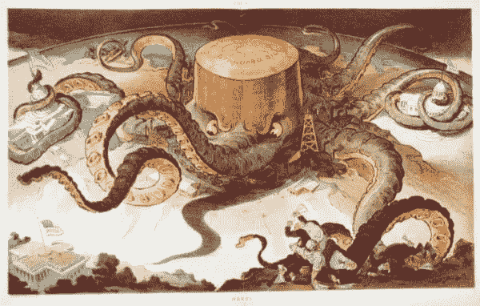

# 秘密垄断的时代

> 原文：<https://medium.com/hackernoon/the-age-of-crypto-monopolies-a7eb9eee13b>

The Standard Oil Octopus engulfing the United States.

作为贝宝的联合创始人和脸书的第一位投资者，彼得·泰尔以其对持久业务的见解吸引了投资界。在他的书[零比一](https://www.amazon.com/Zero-One-Notes-Startups-Future/dp/0804139296)中，泰尔将我们的世界描述为动态的，在这样一个世界中，创造性垄断是一个正和游戏:它们增加了全新的商业途径，从而创造了价值，而不是充当寻租者。同样，美国工业的历史是各种垄断的递归，从 19 世纪晚期洛克菲勒的标准石油到 20 世纪 60 年代英特尔对半导体制造业的控制，再到 20 世纪 90 年代微软对操作系统市场的统治。这些公司之间的共同点是，它们的主导地位往往随着新垄断企业的进入而削弱:这些进入者并不正面竞争，而是避开当时的现任者。

但目前我们能否将 Thiel 的见解应用于加密货币生态系统？**我相信是这样，因为我们很快看到以太坊等特定硬币的卓越地位取代了聚合理论的范式，并控制了加密货币领域。**对于“门外汉”来说，想象以太坊是一个智能合约和去中心化应用程序的平台，琳达·谢[提到的](https://blog.coinbase.com/a-beginners-guide-to-ethereum-tokens-fbd5611fe30b)是苹果的应用程序商店和它旗下的所有应用程序。虽然苹果在这个意义上充当了一个强有力的中介，但创建以太坊去中心化应用程序(dapp)或利用其智能合约功能并不存在任何障碍。以太坊的市场份额大幅扩大有着重要的原因:以太坊企业联盟聚集了包括摩根大通、英特尔和德勤在内的最知名的企业。开发人员发现以太坊是他们去中心化应用基础的关键平台，因为以太坊的编程语言 Solidity 是 Javascript 和 c 的近亲。

以太坊的这些特性导致 ERC 20 代币的数量大幅增加，特别是代币必须满足的标准才能在以太坊网络上存在——在生态系统中。然后，这些可以与以太坊公共地址和钱包(如奇偶校验或 MyEtherWallet)一起传输和包含。一些市值最大的硬币都属于这一类，包括 Omisego (OMG)、auger(REP)和假人(GNT)。随着以太坊的网络效应继续增长，随着更多的开发者通过 Solidity 编程开始他们在区块链的旅程，这可能会导致以太坊在整个领域获得巨大的市场份额。在撰写本文时，以太坊的主导地位约占加密货币总市值的 13 %;然而，如果过去的技术进步可以作为一个信号，那么我们肯定会见证几个硬币控制整个市场。以太坊在这种情况下是创造性的垄断者:这不一定是一个负面的结果。

泰尔强调了成功垄断企业融合的四个特征:专有技术、网络效应、规模经济和 branding⁴.以太坊在很大程度上满足了所有这些要求，因为它一开始就抓住了构建去中心化应用程序的机会，就像微软吞并操作系统的市场份额一样。**从根本上说，一个良性循环由此产生，一个更好的平台吸引更高质量的工程师，因此，更大的应用程序被发布给公众，然后他们被吸引到以太坊无限期。**

但我相信这对这个行业来说可能是一个很好的改变。以太坊的整合将创造出一些可以遵循的标准，并为消费者提供易用性——我的以太钱包已经成为许多人最喜欢的钱包。然而，潜在的二阶效应留给人们去想象。没有任何可能的方法可以预测更多的驾驶会导致像沃尔玛这样的大盒子商店的指数级发展。也许以太坊的垄断会让开发者致力于在全球范围内应用区块链技术；目前，生态系统在许多问题上存在分歧，例如验证数据块的最佳方式(即工作证明或利益证明)。当然，久而久之和区块链成为一项成熟的技术，以太坊可能会失去它的地位，但垄断的所有核心条件都存在，通常甚至一个就足以满足一个企业。

虽然“垄断”这个词可能会让政府官员和普通消费者感到厌恶，但它们确实在各个行业塑造了我们的经济。从投资者的角度来看，将大部分资本集中在最持久的业务上是明智的。一个人可以通过投资有可能逃避竞争并成为真正动态垄断者的硬币，在这个市场上生存下来，并可能取得超乎想象的成功。事实上，泰尔宣称:“竞争是失败者的专利”，但时至今日，以太坊似乎已经掏空了它的 competition⁵.

**指数**

**【1】**Linda Xie 关于以太坊和-20s 的媒介故事:[https://blog . coin base . com/a-初学者指南-以太坊-tokens-fbd5611fe30b](https://blog.coinbase.com/a-beginners-guide-to-ethereum-tokens-fbd5611fe30b)

**【2】**以太坊企业联盟成员:[https://entethalliance.org/members/](https://entethalliance.org/members/)

**【3】**从 Coinmarketcap 中提取的数据。

**【4】**出自第五章，彼得·泰尔的零比一的“最后行动者优势”。神奇的书！

**【5】**从零到一。

如果你对我要说的话仍然有点兴趣，可以考虑在 [*推特*](https://twitter.com/ani_pai) 上关注我