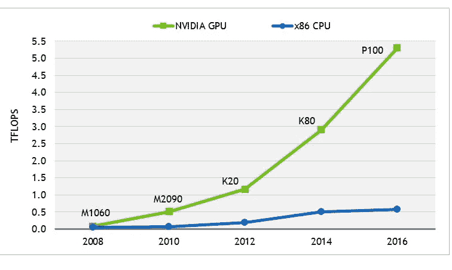

# 为什么 AI 进步快于摩尔定律——算法时代

> 原文：<https://medium.com/hackernoon/the-age-of-the-algorithm-why-ai-progress-is-faster-than-moores-law-2fb7d5ae7943>

摩尔 1965 年的原始论文[将更多的元件塞进集成电路](http://www.monolithic3d.com/uploads/6/0/5/5/6055488/gordon_moore_1965_article.pdf)包含了许多令人难以置信的见解。其中一个被简写为“计算机每两年快两倍”。

摩尔的设想变成了现实。你可以在沃尔玛买一台“便携式家用电脑”,同时买一些除臭剂。

Figure from Moore’s paper

用于非机器学习问题的计算机算法还没有太大的改进。[快速排序](https://en.wikipedia.org/wiki/Quicksort)例如，一种常用的排序算法，明年将迎来 60 岁生日。

animation of Quick sort from wikipedia

# 深度学习算法改进

机器学习模型一直在以更快的速度发展。这里有一个例子，一个在许多物体检测系统中使用的子系统的比较，称为“区域提议网络”:

“[地图](/@jonathan_hui/map-mean-average-precision-for-object-detection-45c121a31173)”是衡量网络好坏的指标。能够在更短的时间内达到相似的分数是我们的目标。[更快的 R-CNN](https://arxiv.org/abs/1506.01497) 与原始方法相比获得了**250 倍**的加速，比快速 R-CNN 快了**10 倍**。

那么，Faster 获得 10 倍的性能提升需要多长时间呢？几年？

号码

《快》和《更快》都是同年出版， [2015](https://arxiv.org/abs/1504.08083) 。**是的，没错，我们在同一年见证了 10 倍的速度提升。**

我们看到错误，或者说人工智能犯了多少错误，也会随着时间的推移而减少。例如，在 ImageNet 大型挑战赛中，通过使用[挤压和激励](https://arxiv.org/pdf/1709.01507.pdf)网，我们的误差已经从 **28%** 下降到 **2%** 。2012 年的一大飞跃是转向基于深度学习的方法，截至本文撰写之时，AlexNet 获得了令人难以置信的 27571 次引用。

See [http://www.image-net.org/challenges/LSVRC/](http://www.image-net.org/challenges/LSVRC/)

## 受益于更多数据的算法

深度学习模型受益于更多的数据。他们在训练时利用更多的数据来产生质量更好的模型。当模型被使用时(在测试时)，它以相似的速度运行，而不管原始网络被训练的数据量。

这与通常试图减少系统中使用的数据量的“传统”编程形成了鲜明的对比。事实上，有一种叫做 [Big O](https://en.wikipedia.org/wiki/Big_O_notation) 的语言专门针对这一点。

数据的可用性正在增加。例如用于照相机。数据可用性的增加有助于机器学习模型的一种方式是迁移学习。更多的数据可能意味着更强大的预训练模型和更容易访问新数据以进行微调。

Left: North America camera module market by application, 2012–2022, (USD Million)

## 专用硬件

GPU 等专用硬件也有所帮助。其他人已经深入讨论过这个问题，所以我只简单展示这个例子:

[https://www.rtinsights.com/gpus-the-key-to-cognitive-computing/](https://www.rtinsights.com/gpus-the-key-to-cognitive-computing/)

这里我们看到 6 年来性能提高了 10 倍。而性能每 2 年翻一番只相当于 4 倍的提高。未来的改进可能会有更多的[特定电路设计。](https://en.wikipedia.org/wiki/Application-specific_integrated_circuit)

# 进步

与传统编程相反，人工智能算法一直在以更快的速度发展。为这些新算法设计的硬件推动了进一步的发展。

> 算法+专用硬件推动了这一发展

但是为什么硬件部分比摩尔定律快呢？区别在于硬件是为“特定”目的而设计的，而不是通常增加更多的功能。例如，图形单元并不总是比中央处理器更好。

如果你的手机只靠图形处理器运行，你的电池可能会在一天的中途没电，做一些普通的事情也会感觉迟钝。

然而，专用硬件在其擅长的任务上确实有很大的回报，例如深度学习。这种专门的硬件可以以绕过 CPU 限制的方式构建。

> “这些内核可以随着计算能力的线性增长而增加，绕过当今摩尔定律的限制……”—Bruce Pile

好吧，但是算法呢？这有什么不同？

在指令驱动编程中，我们有“可证明的”做某些事情的最佳方式。如果证明背后的假设是正确的，那么提出的方法就是我们“认为”的最佳方法我们从未遇到过的问题。

> **对于基于深度学习的方法，我们还没有达到“可证明的最优”！**

在社区中有巨大的努力来发展最先进的技术，发现全新的方法并优化现有的方法。一个具体的例子是[胶囊网络](/ai³-theory-practice-business/understanding-hintons-capsule-networks-part-i-intuition-b4b559d1159b)。

胶囊网络在信息列表 ie [1，4，65，1]的“最低”级别上运行，相比之下，普通网络在单一值 ie“1”上运行。你可以想象，从只有一个数字，到无限的数字列表，打开了一个全新的可能性世界。

## 为什么这很重要？

衡量计算机有用性的一个关键标准是在计算机上运行的软件。想象一下没有你最喜欢的应用程序的智能手机或者没有网飞的电视。

虽然软件的使用一直在进步——使用这些进步的能力主要是关于硬件——而不是改进的算法。

解开传统软件系统的算法可能已经达到收益递减。除了上面的例子，考虑一下 [A*算法](https://en.wikipedia.org/wiki/A*_search_algorithm)。

A* illustration from Wikipedia

首次出版于 1968 年，它仍然是最好的通用方法之一，因此今天在计算机科学课堂上讲授。

# 算法的时代

我们现在生活在一个深度学习算法取得巨大进步的时代，远远超过了以前的算法改进。这与硬件的改进相结合，导致人工智能有效性的惊人增长。

> 区域建议网络是人工智能模型的一个子方法，同年获得了 10 倍的改进。

快速发展的技术创造了难以预测的结果。

[http://www.nydailynews.com/news/world/check-contrasting-pics-st-peter-square-article-1.1288700](http://www.nydailynews.com/news/world/check-contrasting-pics-st-peter-square-article-1.1288700)

在过去的 30 年里，我们目睹了整个行业被颠覆，技术以每两年 2 倍的速度进步。**新算法改进** +硬件改进的复合效果会让我们之前的进展看起来很慢。

我们没有准备好应对上一波颠覆，下一波更是如此。如果我们认为 30 年是破坏性的，我们将被下一个 30 年击垮。

这一进展将继续带来各种好处，如自动驾驶汽车、皮肤癌检测和更智能的语法检查。这也可能导致[自主武器](https://spectrum.ieee.org/automaton/robotics/military-robots/lethal-microdrones-dystopian-futures-and-the-autonomous-weapons-debate)和[影响今天的大部分工作](https://www.nbcnews.com/think/opinion/will-robots-take-your-job-humans-ignore-coming-ai-revolution-ncna845366)。

## 呼吁重新思考工作的意义

人们经常通过他们的工作来定义自己。你不能去参加一个社交活动，而没有不可避免的“那么，你是干什么的？”问题提出来了。也许你就是那个问它的人！

但是，如果一个人工智能能比你做得更好，你如何通过你的工作来定义你自己？当一个人工智能能够胜任一个角色的估计时间短于人类为其训练的时间时，会发生什么？

过去，我们总是创造新的工作岗位，但是现在，在培训和学习新技能方面，我们已经达到了一个临界点。

> “很明显，我们应该停止培训放射科医生，”—计算机科学家杰弗里·辛顿

开复在他的 ted 演讲中有一些很棒的想法。它以人工智能工作为中心。

Source: Kai-Fu Lee [https://www.youtube.com/watch?v=ajGgd9Ld-Wc&t=5s](https://www.youtube.com/watch?v=ajGgd9Ld-Wc&t=5s)

我认为教育将发挥很大作用。不仅仅是开发软件的人——越来越多的人使用它。像 [Udacity](https://www.udacity.com/) 这样的公司使得世界一流的教育比以往任何时候都更容易获得。当然，麻省理工学院和哈佛大学已经做了一段时间的麻省理工学院开放课程和[哈佛大学开放课程](https://online-learning.harvard.edu/courses?sort_by=date_added&platform%5B0%5D=HarvardX)。

> 我们需要越来越多地意识到这些幕后算法在我们的日常生活中发挥了多大作用，以及未来还会增加多少。

在算法时代，你将如何定义自己？人工智能能做你的工作吗？你的同事呢？

感谢阅读！

1[https://www . Forbes . com/sites/kenkam/2018/04/23/how-Moores-law-now-favors-NVIDIA-over-Intel/# 7c 498 C3 F5 e 42](https://www.forbes.com/sites/kenkam/2018/04/23/how-moores-law-now-favors-nvidia-over-intel/#7c498c3f5e42)

2[https://www . economist . com/leaders/2018/06/07/ai-radiology-and-the-future-of-work](https://www.economist.com/leaders/2018/06/07/ai-radiology-and-the-future-of-work)

3 从技术上来说，如果您不断增加网络中的数据，您可能需要更大的网络(“表示能力”)-但是假设您保持网络的大小不变，并且只比较训练时添加数据的成本，则具有更多数据的网络将获得更好的质量结果(来自“更好”的权重)，并且运行时间将是相同的。