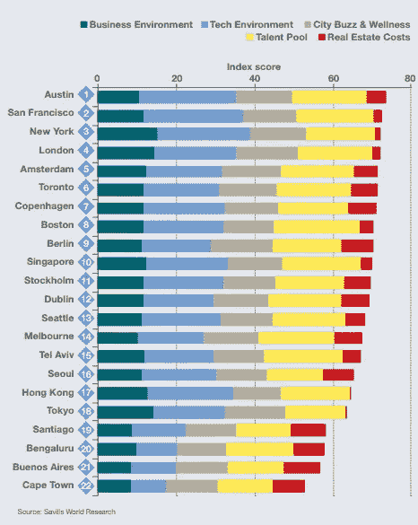
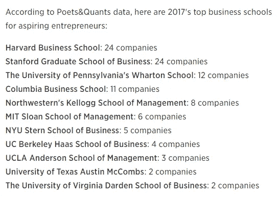

# 商业的魔力

> 原文：<https://medium.com/hackernoon/the-alchemy-of-business-1b2cfd7096be>

## 审视学术界在培养企业家精神中的作用

> 学校不是先决条件——查理·芒格

许多成功的亿万富翁都是辍学生(根据《财富》杂志，2015 年，全世界大约十分之三的亿万富翁——29.9%——没有至少一个学士学位 ) *。许多专家认为企业家精神不能在学校教授。然而，许多学校在培养企业家方面做得很好。这篇文章着眼于创建成功创业所需的要素，并试图通过提问来重新定义这个问题，即辩论是否应该是关于上学，而是你更有可能在哪里找到成功创业所需的要素？*

*教育至少是处于收入分配中间的人的一份保险，这实际上意味着我们大多数人。另一方面，离群者尽管缺乏教育，却使它获得了成功。但是，如果所有的恒星都没有按照这些离群值所梦想的方式排列呢？*

在这个充满不确定性的世界里，没有简单的答案，就像没有放之四海而皆准的解决方案一样。也许，只有偏执狂才能在企业家的旅程中生存下来。

# 没有什么可以代替真实的生活经历

一天深夜，我和表妹在餐桌旁。他嘲笑企业员工无法向企业家转型，好像朝九晚五的工作在某种程度上低于企业家。他坚信，那些花太多时间在书本上或坐在办公室里思考的人可能不适合创业。按照他的说法，企业家只是一头扎进商业，而不会花太多时间在书本上。

我没有对他的笑声掉以轻心，因为我相信没有什么能胜过真实的生活经历。然而，如果你是一名精明的学生，成为企业界的一员可以教会你一些诀窍，直到你决定冒险一试。获得一份能让你管理损益账户的工作通常需要正规教育。

然而，一个熟悉的环境(商学院)的封闭范围可能不会告诉你比几个单位的实际销售更多的关于你的产品的价值。

# 客户是上帝

苹果触摸屏、苹果 iPad 和苹果 AirPods 有很多批评者。事实上，对一些人来说，抨击苹果是一项全职工作。尽管有各种批评，苹果的创新还是成功了。也许，如果一个商学院的学生做了一个焦点小组或调查来确定产品的市场适应性，大多数受访者会对这些创新产生负面反应。争论的另一面是，苹果能够承担这样的风险，而创业公司却不能。然而，苹果曾经是一家初创公司，史蒂夫·乔布斯也曾经迷失过方向。

对于今天的任何企业家来说，小而快地失败是关键。企业家的即时网络可能是了解某人是否会为他/她的产品或服务付费的好方法。

学术界的一个内在危险是思想的同质性和缺乏创新思维。例如，亚马逊(Amazon)和特斯拉(Tesla)等不符合报告季度利润的传统公司模式的公司，会被传统投资原则视为不良投资，而商学院通常将传统投资原则视为久经考验的框架。然而，亚马逊和特斯拉享受着超大的市值，无视市盈率或每股收益等指标。

在一个快速变化的世界中，一些案例研究可能已经过时，成功的驱动因素可能已经改变。因此，放松大脑可能比一头扎进一项冒险更难。

话虽如此，最具扩展性的公司可以用简单的英语解释他们产品或服务的价值。因此，首先要问的一个问题是:你的产品如何在不同于竞争对手的同时为客户增加价值？换句话说，什么是产品的独特卖点(USP)。因此，不管你如何成为一名企业家，基本问题都是一样的。

# 作为生态系统的一部分

西雅图、硅谷、新加坡、以色列和爱沙尼亚都是一个巨大生态系统的标志。以色列之所以成为创业中心，很大程度上要归功于强制兵役，这种制度教导人们如何在各种不利条件下生存，并灌输纪律。

Savlilla World Research

《萨维拉世界研究报告》中提到的大多数城市也拥有充满活力的教育机构。所有这些城市都提供了一个促进合作的充满活力的生态系统。

话虽如此，但并非所有的成功都可以复制。爱沙尼亚浴火重生，成为一个完全数字化的国家。并非所有相同的经验都适用于像印度这样的国家，那里不同的发展和民主水平可能会减缓改革进程。

# 伟业非一日之功

城市成为企业家的温床需要时间。奥斯汀和圣路易斯就是很好的例子。圣路易斯已经成为生物技术和生命科学初创公司的创业中心。这是一个中西部城市，有很多大学、几个孵化器和风险投资基金。

同样，大学的创业项目也随着时间的推移而发展。强大的校友关系鼓励回馈。这些捐赠大部分是用于指导年轻的企业家。

吸引人才是关键，但没有生态系统，很难做到这一点。初创企业需要政府的政策支持才能蓬勃发展，并创造就业机会，这将导致吸引其他企业家的良性循环。

来自这种良性循环的反馈可以以框架的形式被大学捕获，这些框架可以指导未来一代企业家的思维。研究，就其本质而言，可能需要几十年才能产生回报。

# 离别的思绪

据《财富》杂志报道:*“然而，绝大多数亿万富翁都获得了学士学位，许多人甚至更进一步。22%的人获得了硕士学位，而 13.1%的亿万富翁获得了 MBA 学位*

我之所以将这篇文章命名为商业炼金术，是因为商业确实是一种炼金术，其中加入了一些秘密成分，可以将想法变成纯金。如果你问企业家，他们中的许多人会诚实地将自己的运气、伟大的合作伙伴、及时的资金、时机成熟的想法等归功于他们。成功的企业是各种成分的大杂烩。只有当这些元素完美和谐地融合在一起时，企业才会繁荣。

大学或正规教育的价值可能在于提供获得资本(智力和金钱)的途径、伟大的创始合伙人、风险相对较低的测试想法的方式、教师以及可能愿意成为测试对象或探测板的一群人。除非设计出能够超越当今教育机构的替代教育系统，否则教育机构能够提供的最大价值就是其品牌。经受住时间考验的品牌。

CNBC.com

然而，有一个因素真正推动人们成为最好的，那就是他们的内在动力。有许多内在驱动力的激励因素，即贫穷、痛苦、成为最好的渴望。随你怎么称呼它，但追求卓越的动力和为社会做好事的动力是任何机构都无法教授的。这就是为什么创业不能归结为一门科学的确切原因。这是一门可以通过实践掌握但永远无法完全掌握的艺术。

对我们大多数人来说，正规教育可能是贫困和适应能力的区别。其余的，星星可能会排成一行。

如今，支持正规教育的最有力论据是，它为释放全世界女性企业家的潜力提供了一个坚实的基础。它始于让女性在经济上独立，并增加她们对风险的偏好。

因此，教育机构可以提供一个框架和一些要素，但内在动力是一个主观性的问题。目前，我们生活在一个有趣的时代，学术对企业家的价值不容忽视。