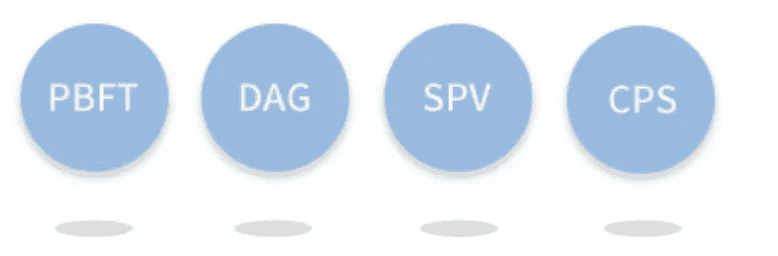

# 替代加密:物联网链(ITC)

> 原文：<https://medium.com/hackernoon/the-alternative-crypto-iot-chain-itc-b6c8621120ae>

## 深入了解替代加密货币 ITC，它将如何彻底改变物联网空间，以及为什么 2018 年将是它的重要一年。

*(以上为我个人观点，不应作为投资建议。在做任何投资之前做好自己的研究)*

物联网，或者酷孩子称之为 IoT。这可能是过去十年里各种科技公司和行业领袖抛出的头号流行语。我们被卖给了宏伟的愿景，从让你的闹钟在没有设置的情况下叫醒你，因为它已经可以访问你的日历，到你的冰箱知道何时供应不足，并在你在超市时给你发短信购买更多鸡蛋，指的是你 Apple watch 上的位置数据。我们所有的设备和机器共享信息，作为一个整体工作，并带领我们到“应许之地”。

然而今天，物联网最常见的消费者用途可能是告诉 Alexa 为我们订购一包新的卫生纸或打开客厅的色调灯。不要让新的物联网产品的营销和无休止的浪潮欺骗了你。

物联网正在经历一段艰难时期。最近一连串关于用户数据、重大黑客攻击以及行业分散状态的高调安全失误，导致人们在用物联网产品取代他们家庭和生活的关键功能时三思而行。今天的消费者也更加意识到他们正在放弃的个人数据，并选择做出限制公司过去拥有的用户数据自由流动的决定。

# IOTchain 是什么？

这就是物联网链或 ITC 的用武之地。简而言之，IoTchain 是一个面向物联网的安全精简操作系统，由[区块链](https://hackernoon.com/tagged/blockchain)提供支持。它将区块链与直接丙烯酸图形(DAG)技术相结合，以低计算能力操作 IOT 设备。使用这种技术组合，物联网链的宏伟目标是为物联网提供低成本、安全的连接框架。

# 解决当今的关键问题

## 安全性

当今的物联网安全模型来源封闭，大多基于“通过模糊实现安全”的概念。这种模式弱点的最新例子是 Mirai 未来组合僵尸网络攻击，该攻击感染了数万台物联网设备，并利用其创建的僵尸网络军队摧毁了全球关键的互联网基础设施。通过黑客攻击或安全漏洞泄露用户数据的现象也开始越来越频繁。

为了解决这些问题，物联网链提出使用非对称加密。在这种模式下，只要用户私钥保持安全，私有用户数据就无法被破解，即使它已被物联网设备收集。区块链的特性也意味着它(就我们目前所知)不会受到传统的互联网攻击。身份访问和多方共识的管理也将有助于识别恶意节点并阻止恶意节点访问网络。这也将防止制造商、服务提供商以及恶意实体的篡改。

## 费用

如今，物联网解决方案提供商每年要为集中式云和大规模服务器集群支付数百万美元的基础设施建设和维护费用。所需的投资水平是巨大的。对于物联网设备，设备制造企业也没有足够的利润来长期支持基础设施。

物联网链提出使用数万个节点以及分布式账本技术来满足物联网数据存储的需求。区块链的分散性质也确保了不需要集中的、高度密集的服务器集群。这将显著降低物联网基础设施的成本。

# 物联网链基础设施

物联网链旨在解决当今将区块链技术应用于物联网领域的许多关键问题。这些包括共识的形式、设备之间的小额快速同步支付以及个人数据的保护。为了避免过于专业，我将在这一部分简短地介绍一下。(要了解更多信息，请阅读白皮书)

> ITC 将和 DAG 一样快，和 DPOS 一样安全

## PBFT +达格

ITC 使用实用的拜占庭容错(PBFT)来实现主链一致性。如果你不知道它是什么意思，那也没关系，只要知道它是有效的，快速的，可行的。中国中央银行和 IBM 的 Hyperledger 项目已经在使用 PBFT。Stellar、Ripple 和 NEO 已经在使用这种一致性算法的变体。

使用有向无环图(DAG)技术还可以大幅提高交易性能，并使物联网链能够抵御量子攻击。(你可以在这里找到一个关于 DAG [的简短而得体的解释。](https://cointelegraph.com/news/future-of-digital-currency-may-not-involve-blockchains)

## 简单支付验证(SPV)

SPV 还允许在不需要完整的区块链的情况下进行支付验证。这是在区块链拥有成功的物联网支付机制的关键组成部分。SPV 将有助于节省数据和带宽。

## 链码数据分析

出于任何目的寻求访问物联网链用户数据的组织必须使用并向物联网链提交其链码(链码解释[此处](http://hyperledger-fabric.readthedocs.io/en/release/chaincode.html))。然后，ITC 使用概率模型算法进行链码数据分析。这将确保提交给 ChainCode 的合同不能窃取用户数据。它只能获得汇总数据。

# ITC 令牌

ITC 令牌是物联网链生态系统中的一个价值单位。如果公司将用户数据用于分析、算法模型训练、广告或任何其他目的，公司必须向提供数据的用户付费。该确定的金额将因使用 ITC 令牌而被支付。这让用户数据回到我们手中，让我们从过去免费提供的数据中受益。

今天的国际贸易中心代币也只是一个 ERC 20 代币。一旦 mainnet 启动并运行，它将被转换为物联网链的本地令牌。

# 物联网链团队

一如既往，在决定是否投资代币时，我将团队视为最重要的因素之一。物联网链团队似乎具备启动该项目所需的所有资格。该团队不仅精通区块链领域，而且在物联网领域拥有丰富的工作经验。

关于这个团队的细节还不多，但是如果你有任何疑问，请观看 CEO 和团队的一些视频和采访。正是通过观看采访，我开始更加信任这个团队。我相信他们有技术知识和必要的网络来支持他们的主张。但是让我警告你，他们的一些英语相当糟糕。从技术角度来看，这并不重要，但只要准备好你的耳朵。

# 伙伴关系

投资 ITC 的一个重要原因是他们拥有的合作伙伴关系。大多数其他 ICO 创业公司都做出了革命性行业的重大承诺，但老实说，如果没有一些大公司采用该产品或解决方案，什么都不会改变。因此，我非常看好 ITC。作为一家物联网公司，ITC 需要的是拥有物联网产品/硬件现有基础的用户和公司，他们将受益于利用物联网链平台。下面列出了所有已确认的公司，它们将在未来的某个方面与 IoTchain 合作。

*上海高飞电子科技有限公司*
——物联网硬件提供商和制造商。物联网链正在与他们合作，生产包含物联网链固件的芯片。这些芯片将允许其他制造商轻松地将物联网链功能集成到他们的硬件中。这应该有助于加速采用

*上海顺康智能科技
-* 这是一家专注于无线通信领域的公司，也是阿里巴巴智能生活物联网联盟的成员。IoTchain 将与他们合作，将其照明芯片集成到 IoTchain 生态系统中。

*泰联半导体有限公司*
——泰联设计并销售集成电路芯片。英特尔是这家公司的投资者，通用电气已经在他们的智能照明产品中使用 Telink BLE 网格技术。IoTchain 将成为未来确保底层设备安全的平台。

*深圳 Galaxywind 网络系统有限公司*
-这是一家生产高性能无线路由器和智能设备的公司，如智能空调恒温器、智能电源插座、智能 LED 灯泡和智能门锁。未来物联网链固件将集成到他们的产品中。

*#Hashed*
- Hashed 是韩国领先的[加密](https://hackernoon.com/tagged/crypto)基金，投资了 OmiseGo 和 ICON 等众多知名项目。物联网链和 Hashed 将共同努力，向区块链在韩国、美国和其他地区的支持者推广物联网链。他们还将联手探索物联网链在各行业中的应用和实现，并进一步推动区块链技术在商业和住宅中的应用。

*猎豹移动(未经证实)
-* 这种合作关系尚未得到证实，但在猎豹移动首席执行官被 ITC 和 FBG 资本团队包围的照片在网上流传开来后，两家公司已经紧密联系在一起。猎豹移动拥有超过 6 亿的客户。

*+上海贝虎网络科技有限公司*

*+深圳市伦茨科技有限公司*

还有更多，有些已证实，有些未证实。

# 投资者

作为散户投资者，我们做了大量的研究和尽职调查，但我们拥有的信息量和访问权限可能只是机构所拥有的一小部分。因此，拥有优秀的、受人尊敬的投资者可能是一个运营良好、潜力巨大的项目的好迹象。这些机构投资者在投入数百万美元之前，无疑会与团队成员交谈，并对公司进行深入的尽职调查。

物联网链的投资者包括:

*FBG 资本
-* FBG 资本是区块链投资领域最大的玩家之一。他们投资了该领域一些最大的公司，如 0x 和 Zilliqa。他们竖起大拇指肯定是一个充满希望的迹象。

*击球手徐
-* 蚁视的创始人，现名 NEO。

还有更多。

# 市值

正如我一直喜欢说的，尤其是在今天看跌的市场。如果你想获得超额收益，你必须投资市值较小的硬币。虽然 ITC 以前曾以每股 9 美元的价格达到过 3.4 亿美元的市值，但最近几周，每股价格一直在 1.90-3.20 美元的范围内徘徊，目前的市值约为 1.09 亿美元。

现在是进入 ITC 或加入您的堆栈的最佳时机。我不是一个大胆预测的人，但我真的相信，国贸中心将是 2018 年表现出色的项目之一，加上目前的折扣，你可能会获得一些健康的收益。

# 接下来是什么？

*   物联网链刚刚在达沃斯世界经济论坛上颁发了区块链卓越奖
*   GitHub 上最近发布的物联网链 DAG 源代码。你可以在这里查看[。](https://github.com/IoTChainCode/itc-ts)
*   物联网链 DAG 测试网今天刚刚发布，**2018 年 2 月 7 日@ 20:00 (UTC+8)。**在 github 上查看:【https://github.com/IoTChainCode/itc-ts 
*   该小组的下一个目标是在主网启动前达到每秒 100，000 次传输，这比目前的测试网水平高出 100 倍
*   物联网链黄皮书即将发布

# 我的担忧

当然，这不仅仅是阳光和彩虹。

## 极微小

尽管这两个项目的目标略有不同，但许多人都称之为“中国的 IOTA”。我担心的是，IOTA 已经获得了许多主流合作伙伴关系，如果他们开始快速推进他们的路线图，它可能会吸走物联网链空间的所有氧气。

## 白皮书翻译不佳

物联网链白皮书的翻译显然存在许多问题。这对我来说通常是一个危险信号。我的意思是，付钱给一个专业人士把论文翻译成英语有多难？

## 不断的促销和赠品

我不确定这是好事还是坏事。该公司不断有赠品，促销期等。这可能会惹恼一些人，让他们认为创始人只对抬高代币价格感兴趣。我个人还没有决定我对此的感受。我只想说，我已经投资了。

# 最后一句话

自从 ITC 在 Huobi 上推出以来，我一直在买入它，并将继续增加我的筹码，以平均成本买入。诚然，象征性价格已经从其美丽的高点暴跌，但老实说，这种快速攀升来得太快了。

2018 年可能是监管年，对我来说，这也是一个好迹象，创始人似乎已经为此做好了准备。

> 监管与区块链的去中心化并不矛盾，好的监管可以是透明的，引导企业披露相关信息
> 陆新浩，物联网链的联合创始人

这个项目正在解决一个合法的问题，有一个坚实的团队，值得信赖的投资者以及强大的和相关的行业伙伴关系。测试网络允许团队证明物联网链不仅仅是一份白皮书或一个想法，而是具有巨大现实世界应用的有形产品。从长远来看，我相信这将是少数成功的加密项目之一，并将在我们的物联网未来中发挥关键作用。

物联网设备只会越来越普遍地出现在我们的生活中。与此同时，作为用户，我们越来越觉得保护我们的个人数据。这对物联网链试图构建的未来是一个好兆头。让物联网基础设施和设备更加安全，同时将我们数据的所有权交还给消费者。此外，即使在这个熊市中，ITC 也表现不错，我有一种感觉，对 ITC hodlers 来说，这将是一个好年景。

所以，玩得开心，祝你好运，愿我们能在月球上相见。

在你离开之前:*如果你觉得这篇文章无论如何都是有用的和令人愉快的，请投几个硬币帮个忙，这样我就可以在写下一篇文章的时候去咖啡馆喝点咖啡了。任何数额都是值得赞赏的。再多也不算少。下面的链接(:*

*如果你不同意任何事情，或者只是想聊天，请在下面留言。我乐于接受建设性的反馈和想法。*

*平安出门。*

 [## 使用贝宝支付穆罕默德阿迪勒阿卜杜勒哈利姆。我

### 去 paypal.me/therealdilco 输入金额。既然是 PayPal，那就简单又安全。没有 PayPal…

www.paypal.me](https://www.paypal.me/therealdilco) 

*发送* **ETH** *此处*:[0x ee 70 a 49 C4 EC 5463d 6a 253 cdbe 468 b 7d 93 CD 98 e 9](https://etherscan.io/address/0xEE70a49c4Ec5463d6a253cDBEB468B7d93cd98e9)
发送 **ITC** *此处*:[0x ee 70 a 49 C4 EC 5463d 6a 253 cdbe 468 b 7d 93 CD 98 e 9](https://etherscan.io/address/0xEE70a49c4Ec5463d6a253cDBEB468B7d93cd98e9)

*免责声明:加密货币交易有潜在的回报，也有潜在的风险。交易不一定适合所有人。任何希望投资的人都应该寻求自己独立的财务或专业建议。这篇文章不是财务建议，也不应该如此看待。投资风险自担。*