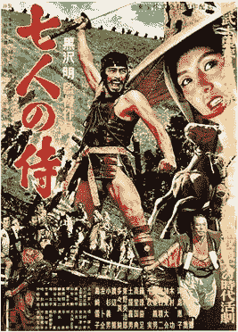

# 比特币之前加密货币的惊人故事

> 原文：<https://medium.com/hackernoon/the-amazing-story-of-cryptocurrencies-before-bitcoin-fe1b0e55155b>

**The fabric of digital dreams: Gold.** Photo by [Color Crescent](https://unsplash.com/photos/RYfZxZwnPas?utm_source=unsplash&utm_medium=referral&utm_content=creditCopyText) on [Unsplash](https://unsplash.com/?utm_source=unsplash&utm_medium=referral&utm_content=creditCopyText)

## 什么——你不相信地惊叫起来。比特币之前的加密货币？是的，确实如此。不要误会，比特币是第一种基于区块链的货币。但目前还不是第一种纯数字货币。那是一部充满梦想、起诉和失败的多彩历史。加密货币的不适应为 Satoshi 提供了教训，让他对我们下手。

> “我们仍然缺乏并且将很快开发的一个东西是可靠的电子现金——通过这种方法，可以在互联网上在 B 不知情的情况下将钱从 A 转移到 B，反之亦然”，Milton Friedman，经济学家，1999 年 1

# 数字现金:没人想要数字货币

David Chaum at age 62\. Source Wikipedia

1983 年，28 岁的大卫·乔姆(David Chaum)发表了一篇科学论文，他是加州伯克利大学计算机科学专业的博士生。他是描述数字货币的第一人。乔姆来自一个富裕的美国家庭，是一位杰出的数学家，被任命为阿姆斯特丹数学学院密码系主任。

在他的论文中，他描述了他的数字货币通过**匿名**区别于信用卡支付的关键点。用户从他们的银行收到数字货币，但随后它被匿名化。这使得银行可以看到谁兑换了多少钱，但不能看到钱的用途。

## 没有区块链怎么做加密货币

Chaum 使用**密码术创建了一个盲数字签名**来匿名赚钱。一个比喻最好地解释了这个签名是什么:我们都知道邮寄投票，通过这种方式，我们可以在选举日不用在小屋里画十字就能投票。就选举卡而言，选举当局必须确认正确的人投了票，而且最重要的是，只投了一次。同时，当局不应该知道这个人投了什么票。

**A postal voting card in Mexico.** By Lguweqaakljgh [[CC BY-SA 3.0](https://creativecommons.org/licenses/by-sa/3.0)] from Wikimedia Commons

因此，这是一个在不知道内容的情况下确认过程的问题。投票人填好选票，放入信封并密封。选举当局收到信封，并与选民名册核对过程是否正确。然后当局在信封上注明这一点。投票清单上写着这个人投了正确的票，信封上只写着这是一张正确的票，与这个人没有任何联系。因此，信封是“隐形的”,“签名”由选举当局写在信封上。

在乔姆的数字货币中，我们用银行代替投票权，用金额代替投票卡。用户从银行购买数字货币，银行对此进行确认。然后每一个货币单位——每一枚硬币——都被放进一个隐喻的信封里，这样就匿名了。然后，用户可以进行交易。银行从它的签名知道它是一个真正的数字货币单位，但不知道谁在使用它。这使得数字货币匿名。

David Chaum 在 1989 年创建了一家公司，并发明了虚拟货币 DigiCash。它能够在互联网上安全便捷地支付商品和服务。这是 DigiCash 与传统信用卡的区别，相比之下，传统信用卡的使用相当不安全——即使在今天也是如此。

这是超前的，因为 DigiCash 还需要 10 年才能被银行和客户接受。为了让数字货币发挥作用，它需要一种电子商务形式的需求，即网上贸易，这种需求在 20 世纪 90 年代后半期才开始出现。

但即便如此，DigiCash 的日子也不好过。《福布斯》的一篇文章对此总结如下:

> “一个美好新世界的美好想法，但有一个问题:没人想要它。不是银行，不是经销商，最重要的是，不是顾客。电子商务正在蓬勃发展[1999 年，作者注]，但事实证明，客户的万事达卡和维萨卡是他的首选货币

像 DigiCash 这样的数字货币与几乎所有处于起步阶段的技术发展都有同样的问题:它们为用户还没有的问题提供了解决方案。 **DigiCash 的优势是匿名，但顾客只是想方便地在网上购物。当然，他们更喜欢使用信用卡，因为他们已经认识信用卡很多年了。**

乔姆有早起鸟儿的不幸，但这是由无能而增加的。接下来是荷兰杂志！3 给 Chaum 1999 一个坏名声:所有的密码学家都是偏执狂，而 David Chaum 是一个优秀的密码学家。他的公司更像是一家精神病院，而不是一家科技公司。他与荷兰 ING 银行谈判了几个月的交易，只是在共同签署合同的当天拒绝签字。

> “他太偏执了，总觉得有什么地方不对劲，”1996 年前一直担任 DigiCash 首席财务官的雷蒙德·斯托弗伯格(Raymond Stofberg)表示:“包括首席执行官在内，共有 8 名 ing 员工，大卫就是不想签字。”

比尔·盖茨希望将 DigiCash 集成到每一个 **Windows 95** 的安装中，但是微软出价的 1 亿美元是不够的。盖茨退出了，当时最重要的互联网浏览器网景的运营商也退出了。

**Bill Gates (right) and a fan on DigiCash. Or not.** By Joi Ito [[CC BY 2.0]](https://creativecommons.org/licenses/by/2.0), via Wikimedia Commons

乔姆的管理人员叛变，要求他辞去首席执行官的职务。他屈服了，任命两名反叛者为新的总经理。他要退休了。此后不久，哗变者争吵，大多数人离开了公司。

但是，尽管这些偏执混乱的条件下，投资者继续相信这个产品。然而，消费者正在宣告数字现金的终结。尽管电子商务在全球范围内不断增长，但客户并没有转向 DigiCash。有些人不相信信用卡是不安全的，其他人也不相信这种新型货币更安全。1999 年，该公司破产，数字货币被封存。

DigiCash 的失败揭示了未来项目将根除的弱点:Chaum 是专利和 T2 版权的粉丝。这对 Chaum 来说是好事，但对把他的技术带给人们来说却是坏事。八年后**比特币将开源**。这位发明家把这项技术带给了全世界。一方面，它以许多模仿者货币的形式创造了竞争，但是它也增加了关于技术的兴趣和知识。

DigiCash 依靠大卫·乔姆。他的错误反映在整个数字货币上。所有错误的总和导致 Chaum 的产品被埋没，为下一次尝试腾出空间。

# e-gold:先锋孤独终老

**The glory! e-gold Office sign.** Source [Wikipedia](https://en.wikipedia.org/w/index.php?curid=44997331) By TMatthew22

1996 既不知道 PayPal 也不知道比特币，还没有相关的网购。但是时代在变。继 DigiCash 之后，肯定会有人下一个尝试蓬勃发展的电子商务。肿瘤学家道格拉斯·杰克逊和律师巴里·唐尼承担了这个角色。他们的想法是:他们把金币放在佛罗里达州墨尔本的一个保险箱里。然后他们创建了一个网站，出售这些金币的数字部分。这些股票以一种新货币命名，他们称之为电子黄金。

在接下来的四年里，e-gold 将会破土动工:至少一百万人使用的第一个数字支付系统。首款非信用卡支付服务，可集成到网上商店中，从而实现纯数字电子商务。

贵金属交易商首先使用，然后是网上交易商、拍卖行、网上赌场、政治和非营利组织。由于电子黄金可以被分割成千分之一克的黄金，杰克逊和唐尼创造了第一个功能性的**微支付系统。你可以用它给你最喜欢的博主寄 10 美分，作为对这篇好文章的感谢。这在信用卡和贝宝上是不可能的，因为交易成本太高了。**

然后，其他公司也加入这一行列，提供从外币到电子黄金的兑换服务。在巅峰时期，e-gold 的市值达到了 20 亿美元。但它在黑客中也越来越受欢迎。e-gold 的中央系统不够安全，它们被黑客攻击了。众所周知，不安全的 Windows 和 Internet Explorer 也无法保护用户。许多客户失去了存款。

**The SEC: “Me eagle, you chicken!”.** By U.S. Government [Public domain], via Wikimedia Commons

运营商正在着手解决这些问题。然而，即使他们依法行事，他们也没有机会对抗美国当局。首先，竞争对手申请货币兑换许可证。申请被拒绝的理由是*“你不需要许可证，因为黄金和虚拟黄金都不是货币”*。电子黄金的运营商要求税务部门检查他们的商业模式是否是合法的资金转移。权威人士证实:没有资金转移，不需要许可证。太棒了。精彩？一点也不。

美国在 2001 年 9 月 9 日之后推出的《爱国者法案》不仅允许中止许多公民权利，例如隐私权。美国——自由贸易的国度——正在追溯性地修改资金转移法，并将杰克逊和唐尼绳之以法，因为他们没有执照。税务机关冻结黄金储备，大部分用户离开 e 金平台。道格拉斯·杰克逊接受了检方的提议:他应该——按形式——承认洗钱，然后申请执照，一切都会好的。

2008 年，他被判 300 小时的社区服务和 200 美元的罚款。他想申请执照，但令人惊讶的是被拒绝了。理由:**被判刑的罪犯可能没有汇款许可证。**

e 金的故事结束了，杰克逊毁了。那些想要追随 E-Gold 脚步的人学到了很多东西:

*   集中式管理易受黑客攻击
*   因此，中央管理并不比银行或信用卡公司更安全
*   基于黄金的货币体系可能会导致国营勒索
*   位于一个国家的公司可能会受到不断变化的法律的支配
*   被认定为真实存在的创始人可能会被联邦调查局预防性逮捕

化名中本聪周围的人也了解到。他们的发明比特币 9 年后市值 1200 亿美元。而他们已经解决了以上几点。由于比特币是 DigiCash 和 e-gold 的直接继承者，所以我想以比特币本身的发明来结束这个故事。

# 比特币的诞生

公众将在 2008 年 10 月 31 日欧洲中部时间 8:10 听到关于比特币的消息。虽然“大众”有点夸张。metzdown.com 网站有一个邮件列表，任何人只要输入他们的电子邮件地址，就可以在那里交流密码学方面的信息。这里的公众由几千名电脑爱好者组成。某个中本聪向邮件列表发送如下开始的短邮件:

> “我一直在研究一种新的电子现金系统，它是完全点对点的(即去中心化，译者注)，没有可信的第三方。(银行或政府，译者注)。(……)电子现金的纯点对点版本将允许在线支付从一方直接发送到另一方，而没有通过金融机构的负担。数字签名提供了部分解决方案，但是主要的
> 
> 如果仍然需要可信方来防止重复支出，那么好处就失去了。我们提出了一种使用对等网络来解决重复花费问题的解决方案。 *5*

接下来是进一步的说明和白皮书的下载链接，这是一份技术说明文件。6 这是一份 9 页的简短文档，描述了如何

*   数字货币交易被处理，
*   为了使用数字日期戳确定交易的顺序，
*   使用所谓的工作证明概念以不发生欺诈的方式对帐公共现金簿，
*   一个世界范围的网络执行这种协调，
*   匹配计算机的所有者为他们的工作得到报酬，
*   隐私得到维护，系统仍然是透明的，哪些代码用于击退黑客攻击。

比特币今天拥有的所有核心功能都在这九页中有所描述。

# 中本聪到底是谁？

**Not Satoshi Nakamoto.** Source: Wikpedia.

白皮书没有留下任何未回答的问题，除了这个问题:谁是中本聪？2008 年在谷歌上搜索并没有发现中本聪这个人。在中本聪发邮件的两个月前，Bitcoin.org 域名已经注册，白皮书可供下载。通常，可以在国际注册数据库(whois.int)中搜索域名的所有者。但是 Bitcoin.org 是通过一种伪装成域名所有者的服务注册的。政治活动家，他们必须保持匿名，但也有罪犯喜欢使用这项服务。

密码学界(到目前为止)唯一发现的是，没有叫中本聪的人。这个名字是**的笔名**。中本聪是男的还是女的？还是甚至不止一个人？甚至无法确定起源。中本聪是日本人吗，顾名思义？

在比特币传播的同时，好奇的人们正在寻找它的发明者。一些人检查加密邮件列表上的电子邮件数据，以找出中本聪与列表交互的时间。对日本来说，这个时间是不合逻辑的，美国东海岸或者英国更合适。这是一个由聪自己推动的传奇的开始。中本聪声称自己出生于 1975 年 4 月 5 日。然而，在 1933 年 4 月 5 日，美国总统罗斯福签署了特别法律，禁止囤积黄金。1975 年，美国再次切断了美元与黄金之间的最后联系。8 其他人分析他的名字是由三星、东芝、中山和摩托罗拉科技公司组成的。

对白皮书的语言进行了语言学分析。它的格式一部分是英国英语，一部分是美国英语。

**Not Satoshi. But Jeff Garzik.** Source: Jeff’s Medium profile.

即使是早期参与比特币软件开发的程序员也没什么好说的。Jeff Garzik 说:“我们就系统问题联系了他，但他并没有真正遵循标准化的编程实践。同事兼披萨爱好者 Lazlo Haynecz 说:“我已经和 Satoshi 交换了电子邮件。我总有一种印象，他不是一个真实的人。” *9*

无论中本聪是谁，都可以假设他是通过他的发明变得富有的:Cryptofan Sergio Lerner 跟踪每一笔交易，直到第一笔交易，并开发了一个程序，能够为每一个比特币分配原始账户(即使不是名字)。还有 100 万比特币(2018 年 8 月 60 亿美元)从未被转移。这堆东西很可能属于中本聪。 *10*

但是我们跳过了很多历史。回到 2008 年，白皮书发布后，比特币 0.1 版本发布需要 3 个月。公开意味着一些计算机配备了用于分散分类账的软件。开发者从软件 11 中得出结论，比特币是由一位学者写的，他不是受过训练的程序员，但有很多理论知识。

2009 年 1 月 3 日，第一批 50 个比特币凭空“生成”，三天后中本聪和开发者、密码学活动家哈尔·芬尼之间的第一笔交易完成。世界没有注意到这个开创性的过程。爱好者可以通过追踪透明的公共账目来研究多年后的第一笔交易。你看不到参与者的名字，但是你可以看到相关的地址。 *12*

同年 10 月，有了初始汇率。1 美元，你得到 1309 个比特币。这个价格是根据比特币电脑的供电成本计算出来的。在接下来的几年里，比特币变得更为人所知。随着越来越多的人购买这种奇怪的货币，它的价值增加。毕竟，只有别人愿意卖比特币，你才能买。因此，买方必须总是提供一个比上次交易更高的价格。如果买比特币的人比卖比特币的人多，价格就会上涨。

剩下的就是历史了。

**Not that famous Bitcoin Pizza. And not Satoshi Nakamoto. But a Pizza Napoli.** By [https://pizza.de/](https://pizza.de/pizza-wiki/pizza-napoli.html) [[CC BY-SA 4.0](https://creativecommons.org/licenses/by-sa/4.0)], via Wikimedia Commons

# 来源

1[https://deal book . nytimes . com/2014/01/21/why-bit coin-matters/](https://dealbook.nytimes.com/2014/01/21/why-bitcoin-matters/)

2[https://www.forbes.com/forbes/1999/1101/6411390a.html](https://www.forbes.com/forbes/1999/1101/6411390a.html)

3[https://cryptome.org/jya/digicrash.htm](https://cryptome.org/jya/digicrash.htm)

4[https://en.wikipedia.org/wiki/E-gold](https://en.wikipedia.org/wiki/E-gold)

5[http://www . Metz Dowd . com/piper mail/cryptography/2008-10/014810 . html](http://www.metzdowd.com/pipermail/cryptography/2008-October/014810.html)

6 http://www.bitcoin.org/bitcoin.pdf

7[https://www . Reddit . com/r/bit coin/comments/18in 3h/metzdowd _ cryptography _ mailing list _ archive/](https://www.reddit.com/r/Bitcoin/comments/18in3h/metzdowd_cryptography_mailinglist_archive/)

8[https://www.diginomics.com/who-is-satoshi-nakamoto/](https://www.diginomics.com/who-is-satoshi-nakamoto/)

9[https://www.diginomics.com/who-is-satoshi-nakamoto/](https://www.diginomics.com/who-is-satoshi-nakamoto/)

10[https://www.wired.com/2013/12/fbi_wallet/](https://www.wired.com/2013/12/fbi_wallet/)

11 编译用 Microsoft Visual Studio 编译，没有命令行界面

12[http://historyofbitcoin.org/](http://historyofbitcoin.org/)