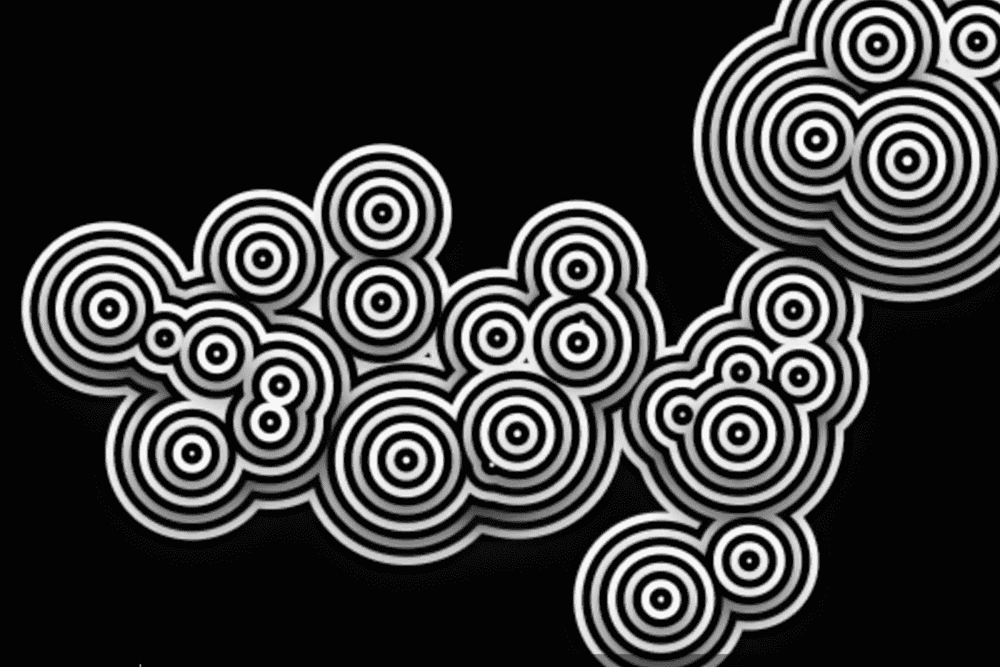
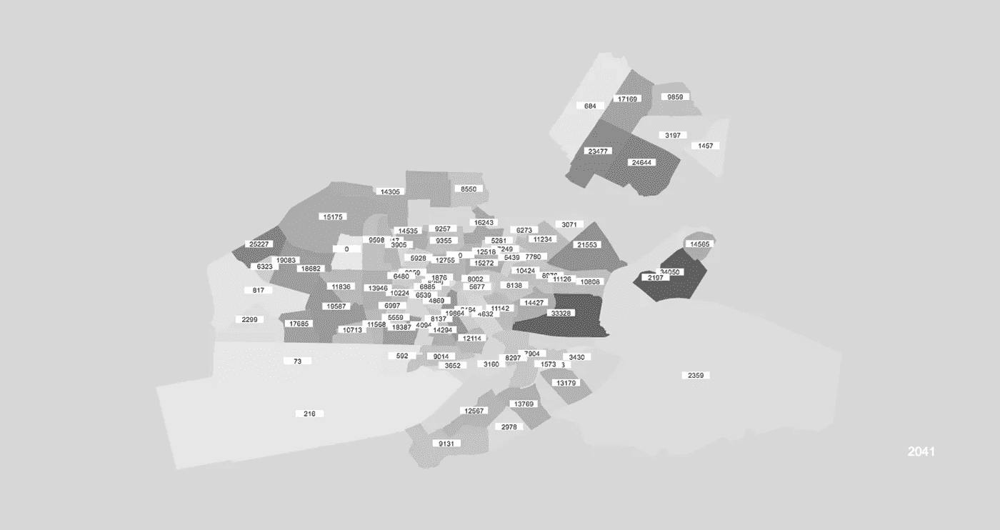
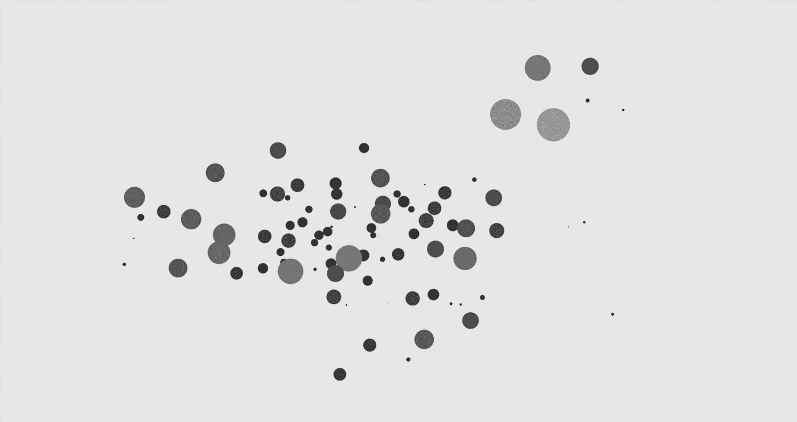
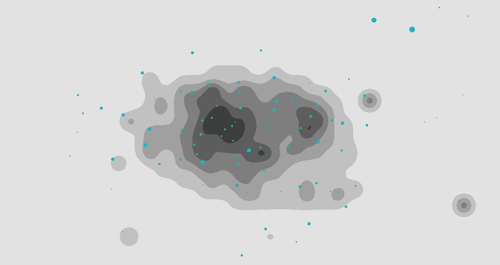
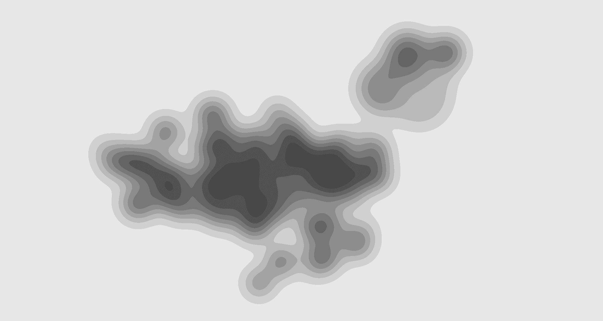
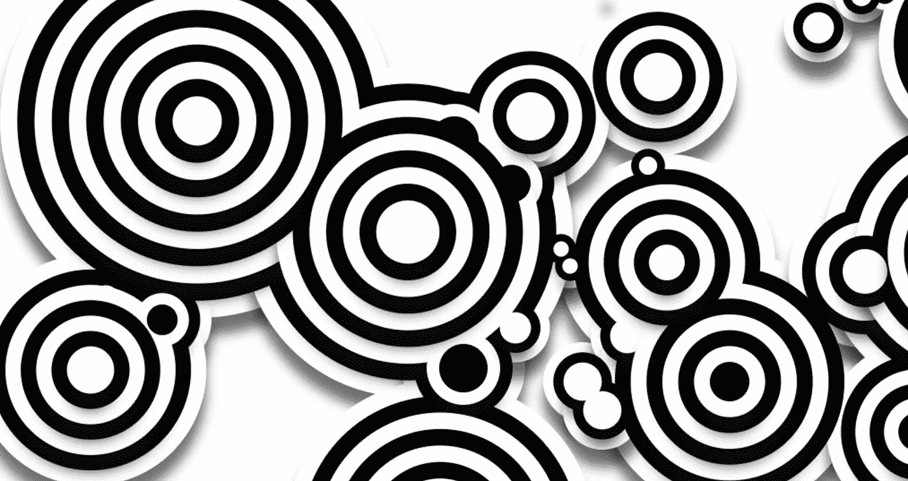
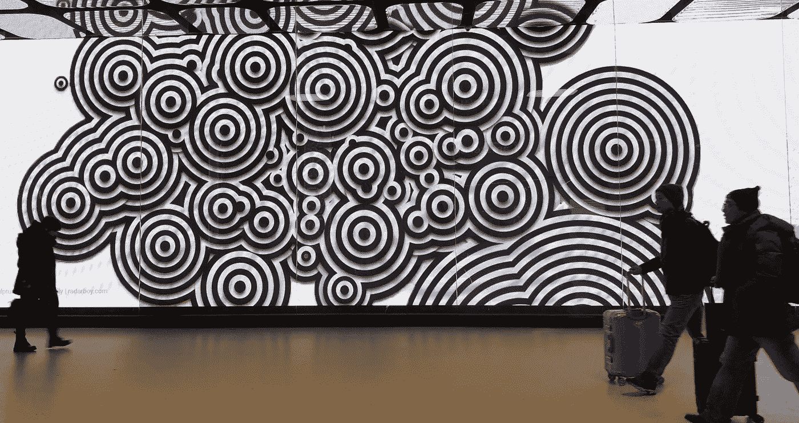
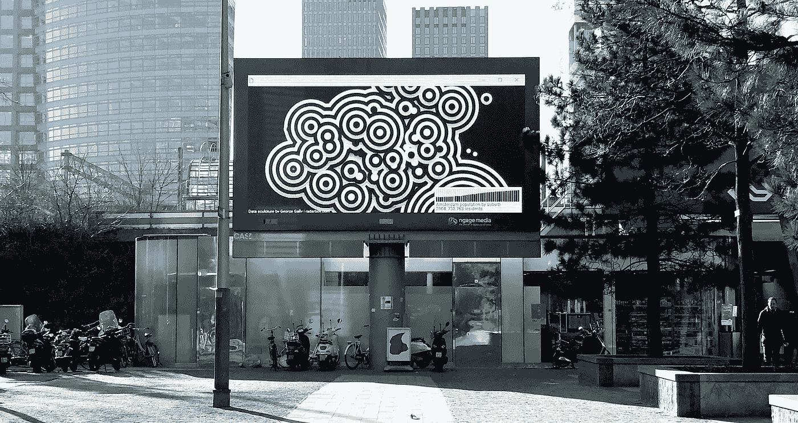

# 阿姆斯特丹数据项目#01

> 原文：<https://medium.com/hackernoon/the-amsterdam-data-project-01-64ba53e7d70>

## “数到一百万”的制作

*数到一百万*是一个公开的[数据](https://hackernoon.com/tagged/data)雕塑追踪和预测阿姆斯特丹 50 年的人口增长。探索每个郊区人口的出生、死亡和变化，随着城市向一百万居民迈进。这座雕塑模糊了郊区之间的界限，跨越了边界，并在不断的推拉、潮起潮落中融合在一起，随着生活的发生，人们迁移、死亡、结婚，新的居民到来和出生。

我一直对大公共数据着迷，将其作为创作艺术品的输入和来源，因此能够创建*阿姆斯特丹数据项目*感到非常兴奋，这是为期一年的阿姆斯特丹开放数据奇妙世界探索的一部分。

下面是我将如何着手构建这样一个大规模数据项目的说明，希望能给你一些关于构建自己的项目的见解或灵感。

# 数到一百万的过程:

该项目的任务是在六个月内每月创作一个新的数据雕塑，并可以选择再创作六个月，在 Ngage 的巨型媒体屏幕上使用数据创作荷兰各地的艺术品。阿姆斯特丹的人口增长——数到一百万，是第一个。

*我真的很感谢*[*Ngage Media*](http://radarboy.com/george/www.ngagemedia.nl)*的人们，他们是荷兰户外数字屏幕的领先网络，是他们实现了这一切，特别是 Ngage 的金奎大·克里宁。一年前，在阿姆斯特丹的纤维节上，我在 Refik Anandol 的* [*建筑智能实验室*](http://2017.fiberfestival.nl/programme/lab2-architectural-intelligence/) *遇见了金奎大。金奎大向我展示了阿姆斯特丹中央车站美丽的巨型屏幕，我立即爱上了它们，并对有机会在上面做点什么垂涎三尺。他对我提到，Ngage 想在他们身上做一些实验性的公共艺术项目，经过几个月的反复研究，我们能够开始这个项目了。*

这些数据雕塑完全是用 Javascript 编写的，使用了我在过去几年从我的 [#Code365](https://www.instagram.com/radarboy3000/) 项目中开发的库。这些数据来自精彩的 [data.amsterdam.nl](https://data.amsterdam.nl/) ，感谢贾斯珀·苏滕达尔和[阿姆斯特丹数据实验室](https://www.amsterdam.nl/bestuur-organisatie/organisatie/overige/datalab-amsterdam/)的慷慨帮助。在决定人口增长之前，我花了很长时间查阅了所有的公共数据。

移民和变化中的欧洲是这些天的热门话题，我想看看阿姆斯特丹是如何随着时间的推移而变化的会很有趣。以及我们对未来的期望。多年来，我一直在阿姆斯特丹旅行，这座城市的开放和包容一直给我留下深刻印象。事实证明，阿姆斯特丹的增长相当正常，我想说，塑造和改变阿姆斯特丹和欧洲的是旅游业，而不是其他任何东西，但这是另一个话题——或许还有数据可视化。

我将人口数据与阿姆斯特丹郊区的数据融合在一起，创建了一个可以在谷歌地图上绘制的特定位置数据集。我可能会用一句话来说，但这是一项堆积如山的工作，以一种我可以开始发挥创造力的方式来查看和处理数据。

这些数据然后通过一个简单的机器学习神经网络来预测未来的人口值，后来发现阿姆斯特丹有自己的(更好的)预测。

然后将人口数量标准化，以便更容易处理，并更好地感受时间的变化。我喜欢和这样的数据坐在一起看一会儿，然后“了解它”。

我还绘制了每个郊区的出生和死亡人数，以及人口的变化，但最终决定使用原始人口数据集，这让我对阿姆斯特丹的人口随时间的变化有了很好的感受。有趣的是，阿姆斯特丹的人口在 90 年代早期减少了。

然后，我在艺术品中构建了 attactors。其中较大的数量将其他郊区拉得更近，显示出郊区随着时间的推移而增长和收缩的运动，在人口最稠密的地区周围形成了代谢球。

视觉效果然后被模糊化和海报化，都是用 Javascript 实现的，越来越接近我想要的外观和感觉。然而，它也变得太慢了(模糊是处理器的疯狂沉重)。我希望他们实时渲染，尽管使用了书中的所有技巧，但从我两年多的日常编码实验中得知，在较小的隐藏屏幕外画布上进行这样的渲染，我仍然无法获得合理的帧速率的平衡。

所以我回到绘图板，模仿我想要的行为，通过简化和使视觉效果更生动(无论如何，这总是我的终点)，合并靠近的数据点，并对一些繁重的地图计算进行编码。最后，我想要的样子开始出现了。

当时所需要的就是将数据制成动画，并对各种屏幕尺寸进行调整，其中一些尺寸很奇怪——阿姆斯特丹中央车站的宽屏尺寸为 2112x608pm。我也给了视觉效果一层阴影，给它更多的深度和轻微的 3D 效果。

在我准备飞往阿姆斯特丹测试屏幕上的可视化效果的前几天，我的 mac 死机了。我的备份是几天前的(是的，我知道，经常提交)——这意味着我已经丢失了对工作的关键最终调整。两家不同的苹果商店和一家苹果服务中心告诉我，控制板烧坏了，需要一个多星期和 500 多美元才能修好。我花钱请人从我那台坏了的 mac 电脑硬盘上取回了我的数据，并买了一台新的 Mac 电脑，这样我就可以测试并向金奎大展示我的进展。我们测试了[设计](https://hackernoon.com/tagged/design)的几个变体，很明显越是图形的效果越好，虽然白色背景看起来很棒——但是它们太亮了。

*(事实证明苹果完全错了，尽管我坚持认为不是主板的问题，而是电池的问题。我的新 Macbook 从第一天开始就给我带来麻烦，电池续航时间不到两个小时。苹果再次坚称没有任何问题。数小时的支持电话。访问 Mac 商店。和最终重新格式化计算机并没有解决任何问题。当我到达纽约去修理我的新 mac 时，你瞧，旧的那台在 Mac 商店里立即启动了，结果发现是电池的问题。与此同时，我的新手机无法更换，因为它是在阿姆斯特丹买的。不同的零件号或一些废话。嗯。而且我得送它去修理一个星期——一旦我的旧的送来。我买新手机的唯一原因是因为苹果告诉我我的旧手机没电了。浪费了上百个小时。苹果公司只会说“对不起，我们无能为力”。大声抱怨。但未完待续……)。*

可视化在浏览器中运行流畅，大约 60fps。我在 url 中使用了一个简单的#hash 方法来调整每个屏幕的插图大小。经过一些调整后，就可以上线了。

我很快会得到一些更好的现场安装文档…但同时，这里还有一些测试…

**阿姆斯特丹数到一百万**可于 2018 年 1 月至 7 月在阿姆斯特丹中央车站、Leidsplein 和阿姆斯特丹-祖伊德 WTC 的巨型媒体屏幕上观看。

特别感谢 [Ngage Media](http://radarboy.com/george/www.ngagemedia.nl) ，荷兰领先的户外数字屏幕网络，特别感谢 Ngage 的金奎大·克里宁对这个项目的支持。

如果你想开始创造性编码，我这里有一堆教程。

如果你愿意，请跟我来这里

[**https://www.instagram.com/radarboy3000/**](https://www.instagram.com/radarboy3000/)

[**https://twitter.com/radarboy_japan**](https://twitter.com/radarboy_japan)

 [## 雷达男孩

### 雷达男孩。145 个赞。艺术、设计可视化、黑客

www.facebook.com](https://www.facebook.com/radarboy3000)