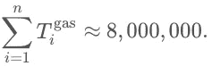
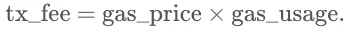
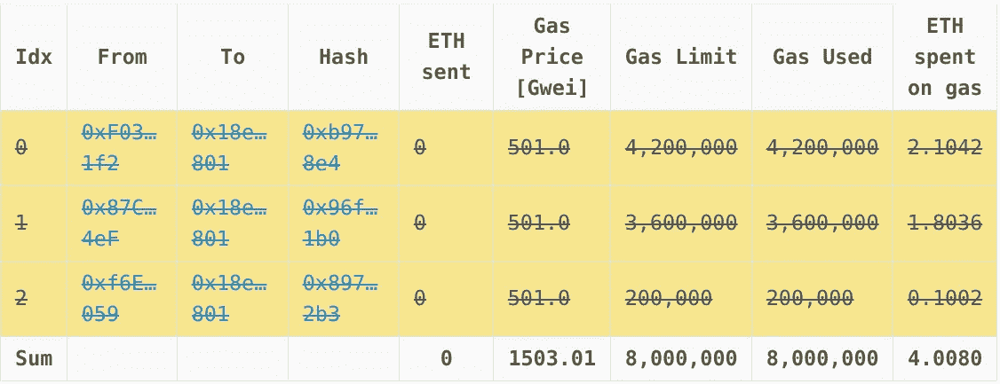
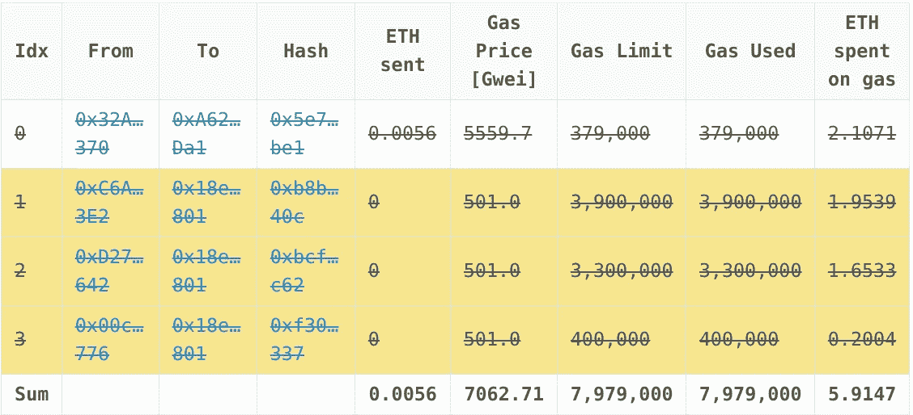
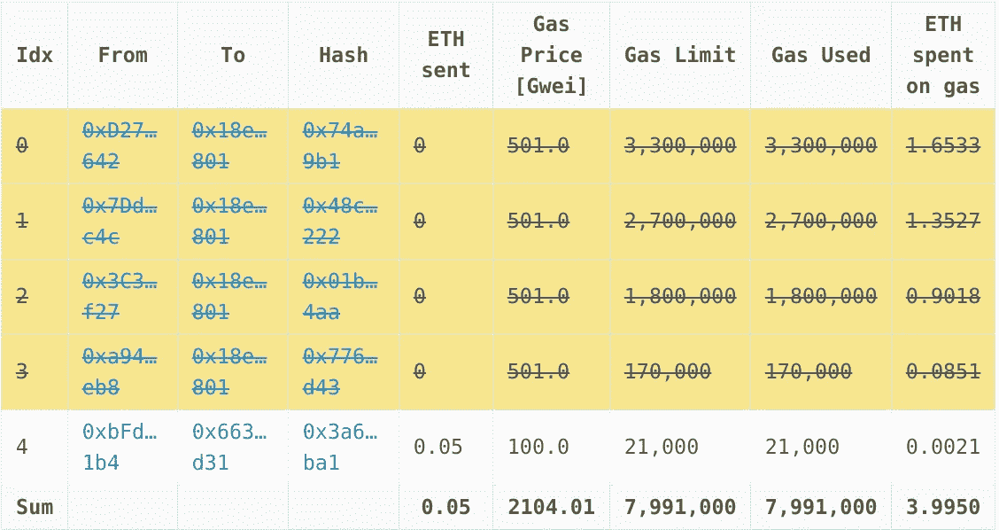
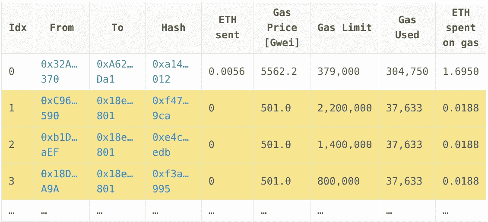
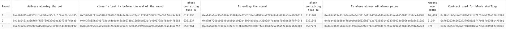

# 对块填充攻击的剖析

> 原文：<https://medium.com/hackernoon/the-anatomy-of-a-block-stuffing-attack-a488698732ae>

## FOMO3D 第一轮是怎么赢的

*阻塞填充*是[区块链](https://hackernoon.com/tagged/blockchains)的一种攻击，攻击者提交交易，故意填满该块的气体限制，并阻止其他交易。为了确保矿工包括他们的交易，攻击者可以选择支付更高的交易费。通过控制事务消耗的气体量，攻击者可以影响包含在块中的事务数量。

The attack is like constantly cutting in line using your money.

为了控制交易花费的汽油量，攻击者利用一个特殊的合同。契约中有一个函数，它将攻击者想要燃烧的气体量作为输入。该函数在一个循环中运行无意义的指令，当所需的量被消耗时，或者返回或者抛出一个错误。

例如，假设在过去的 10 个街区，平均油价为 5 Gwei。为了对下一个区块施加影响，攻击者需要提交天然气价格高于 100 Gwei 的交易。天然气价格越高，被矿商纳入的几率就越高。攻击者可以选择将使用 8，000，000 gas(当前块的 gas 限制)的任务划分为他们想要的尽可能多的事务。这可能是 80 个 100，000 天然气支出的交易，或 4 个 2，000，000 天然气支出的交易。

决定如何划分任务是一个最大化包容机会的问题，取决于下面概述的因素。

## 矿工选择交易的策略

矿商希望通过纳入收费最高的交易来实现利润最大化。在以太坊的当前 PoW 实现中，挖掘块比执行事务花费的时间要多得多。因此，让我们假设池中的所有事务一到达就被平凡地执行，并且矿工知道每个人使用的气体量。

对于矿工来说，利润最大化是一个[最优包装问题](https://en.wikipedia.org/wiki/Packing_problems)。矿商希望选择交易池的一个子集，让他们每块获得最大利润。因为在任何给定的时间，池中至少有数万个事务，所以不能通过强制每个组合来解决问题。矿工使用算法来测试可行的组合数量，并选择奖励最高的组合。

区块填充者的主要目标是通过精心设计一组最有可能被矿工选中的交易，以耗尽区块的天然气限制，从而瞄准选择过程。他们无法设计出 100%有保证的策略，因为每个矿工可以使用不同的算法，但他们可以通过测试整个网络来找到最佳点。

(在 PoS 系统中，我们的假设可能是错误的，因为与验证块相比，执行交易并不简单。验证者需要根据 PoS 实现开发更复杂的策略。)

## 攻击者想要停止的事务:

这可能是因为攻击者想要用一个特定的契约来拖延事务。如果对该契约的函数调用使用了相当高的气体量，比如 300，000 到 500，000 之间，那么攻击者必须以针对该范围的方式填充该块。

例如，攻击者可以定期提交价格非常高的 n 笔交易 *{T₁、T₂,…、Tₙ₋₁、Tₙ}* ，其中

如果攻击者针对 *(R_lower，R_upper)* 范围内的交易，可以选择第一个 *n-1 个*交易来短步骤消耗*800 万-R_upper* 气，提交 *Tₙ* 消耗剩余的 *R_upper* 气，价格相对较高。请注意，包含单个事务的收入是

随着天然气使用量的减少，被矿工捡走的概率也降低了，因此价格应该会上涨以进行补偿。

## 示例:Fomo3D

Fomo3D 是一种赌博游戏，玩家从合同中购买钥匙，他们的钱进入一个底池。在每一轮开始时，启动一个计时器，从 24 小时开始倒数计时。每买一把钥匙，计数器就增加 30 秒。当计数器计数到 0 时，最后一个买了钥匙的玩家赢得大部分底池，剩下的分配给其他人。奖金的分配方式取决于获胜者所属的团队。

密钥价格随着密钥供应的增加而增加，这使得购买密钥越来越难，并确保一轮将在某个点后结束。随着时间的推移，赌注增加，计数器减少到最小值，如 2 分钟。在这一点上，玩家支付高汽油和钥匙价格成为“它”并赢得游戏。玩家[编程](https://hackernoon.com/tagged/program)机器人为他们购买钥匙，获胜就变成了编码正确策略的问题。从题中可以理解，第一轮是通过一次格挡填塞攻击取胜的。

2018 年 8 月 22 日，地址 [0xa16…f85](https://etherscan.io/address/0xa169df5ed3363cfc4c92ac96c6c5f2a42fccbf85) 通过遵循我上面概述的策略，从第一轮中赢得了 10，469 ETH。获胜者设法成为区块 [6191896](https://etherscan.io/block/6191896) 的最后一个买家，并设法用 Fomo3D 拖延交易，直到区块[6191909](https://etherscan.io/block/6191909)175 秒，结束这轮交易。一些细节:

*   Fomo3D 长合约地址: [0xA62…Da1](https://etherscan.io/address/0xA62142888ABa8370742bE823c1782D17A0389Da1)
*   攻击开始前赢家的最后一笔交易: [0x7a0…349](https://etherscan.io/tx/0x7a06d9f11e650fbb2061b320442e26b4a704e1277547e943d73e5b67eb49c349)
*   交易结束本轮并触发分发底池的`onBuyAndDistribute`事件: [0xa14…012](https://etherscan.io/tx/0xa143a1ee36e1065c3388440ef7e7b38ed41925ca4799c8a4d429fa3ee1966012)
*   中奖者提取奖品交易: [0xe08…508](https://etherscan.io/tx/0xe08a519c03cb0aed0e04b33104112d65fa1d3a48cd3aeab65f047b2abce9d508)
*   用于块填充的合同: [0x18e…801](https://etherscan.io/address/0x18e1b664c6a2e88b93c1b71f61cbf76a726b7801)
*   其他可能属于中奖者的地址: [0x3c3…f27](https://etherscan.io/address/0x3c316def240b1c5ab5e0be027cb91e8ae850ff27) ， [0xc6a…3e2](https://etherscan.io/address/0xc6a4f7f08300a614756f20d823f08417f3ba43e2) ， [0x81e…0ac](https://etherscan.io/address/0x81eff1f7a6bf826d550e9503f31e4f2d1973a0ac) ， [0xc96…590](https://etherscan.io/address/0xc96b8de929aea89eb242ed50412da0e4a6e7e590) ， [0xd27…642](https://etherscan.io/address/0xd27d2afdd35650629c63d4d702eb5f5d2d893642) ， [0x18d…a9a](https://etherscan.io/address/0x18da94903de79c18eb0f4f6e6327a4266ef60a9a) ， [0x87c…4ef](https://etherscan.io/address/0x87c7babe2a9bf81c622a346ffbe57671545854ef) ， [0x9da…0cf](https://etherscan.io/address/0x9dab207b6c366bb7e1a5d930b865ebda410af0cf) ， [0x](https://etherscan.io/address/0x7ddae8209776f2c0c94840e3e11c9f3862e2fc4c)
*   胜利者在攻击前可能部署用于测试的其他合同: [0xaf1…eae](https://etherscan.io/address/0xaf1fca749a6625801bb28c93eee763ec346a4eae) ， [0x0c0…5ad](https://etherscan.io/address/0x0c0cee774f02b2f05ad230f1292d8846070255ad) ， [0x88e…d04](https://etherscan.io/address/0x88ef961497f8205d36a53c2e81574fbeae15ed04) ， [0x4f4…6f8](https://etherscan.io/address/0x4f427bc21334102943c082ace86b5f3974ab76f8) ， [0x487…4e5](https://etherscan.io/address/0x4870580c874e13b050109c5111e30b06cdc864e5)

上面的用户地址是从以太坊交易图中抓取的，因为它们与一个向它们提供资金的主账户相关联。合同地址是从用户地址发送的 0 值交易中收集的。这些地址的[距离](https://en.wikipedia.org/wiki/Distance_(graph_theory))为 1，可能还有其他距离更大的地址。

下面是这一轮结束前最后 4 个方块的细节。用黄色突出显示的行是攻击者提交的交易。划掉的行是失败的交易。攻击者的所有交易都以 501 Gwei 的天然气价格提交，填充单个区块的成本约为 4 ETH。买钥匙的电话一般要花 30 ~ 50 万左右的气，具体要看调用的是哪个功能。下面，你看到的是成功填堵的 6191906 块。

[Block 6191906](https://etherscan.io/block/6191906). *View the* [*original post*](https://osolmaz.com/2018/10/18/anatomy-block-stuffing/) *it if you want clickable addresses.*

区块 6191907 对获胜者来说是一次势均力敌的呼叫，因为他们在该区块获得的交易总额不到 8，000，000 英镑，而另一笔交易是对手购买密钥的 Fomo3D 呼叫。请注意，它的天然气价格为 5559 Gwei，这意味着提交交易的机器人或个人可能知道这次攻击。由于低气体限制，交易失败，可能是由于机器人或人的计算错误。

[Block 6191907](https://etherscan.io/block/6191907)

块 6191908 中的交易属于攻击者，除了一次不相关的转账。这个区块也被认为是成功填充的，因为攻击者使用了 7，970，000 次汽油，没有为购买钥匙的呼叫留下空间。

[Block 6191908](https://etherscan.io/block/6191908)

到了块 6191909，计数器已经到达零—更像是当前 UTC 时间超过了存储在契约中的回合结束变量—并且对 Fomo3D 的任何调用都将是结束回合并分发底池的调用。该块中的第一个交易是——等等——对手调用 Fomo3D 来购买密钥，该对手的交易在几个块之前失败，提交时为 5562 Gwei。所以那家伙基本上是付了 1.7 ETH 才宣布攻击者是赢家！

[Block 6191909](https://etherscan.io/block/6191909)

另一件要注意的事情是，攻击者可能在一轮结束时精心制作了支出者合同来停止攻击，大概是为了降低成本。因此，该合约使用的 37，633 gas 可能会调用 Fomo3D 合约来检查回合状态。所有这些都指出了一个事实，攻击者是一个经验丰富的程序员，知道他们在以太坊周围的道路。

[在这里](https://osolmaz.com/assets/fomo3d_round1_tx_details.html)，您可以看到本轮结束前 100 个区块的详细信息，以及交易中 ABI 调用和触发事件的附加信息。

自第一轮结束以来，又有两轮攻击以类似的方式结束。我没有全部分析，因为对于这篇文章来说太多了，但如果你想自己做，这里有一些细节。

*View the* [*original post*](https://osolmaz.com/2018/10/18/anatomy-block-stuffing/) *it if you want clickable addresses.*

后面几轮需要注意的一点是，游戏的参与度和底池量逐渐下降，大概是因为打游戏的方式已经系统化了。虽然任何人都可以尝试这样的攻击，但知道如何赢得它会使“有趣”的因素消失。

鸣谢:虽然我在网上找到过“块填充”这个术语的例子，但是 Nic Carter 是第一个在这种情况下使用它的人。

*原载于 2018 年 10 月 18 日*[*【osolmaz.com*](https://osolmaz.com/2018/10/18/anatomy-block-stuffing/)*。如果你想在表格中点击地址，请访问它。*