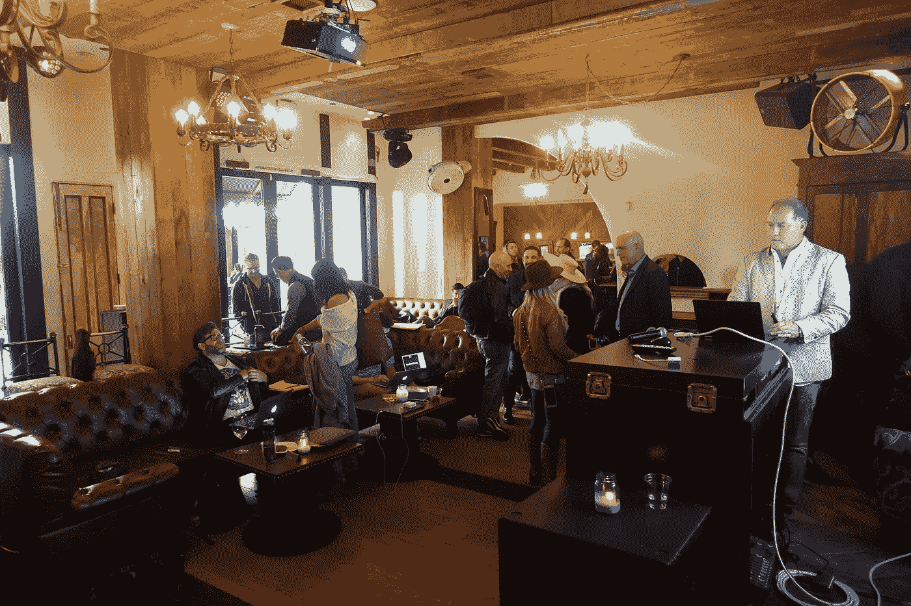
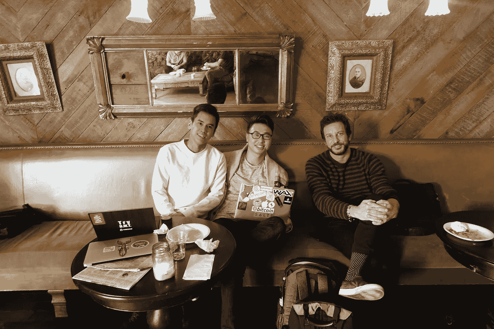
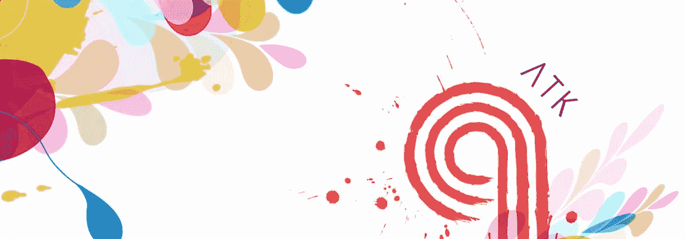
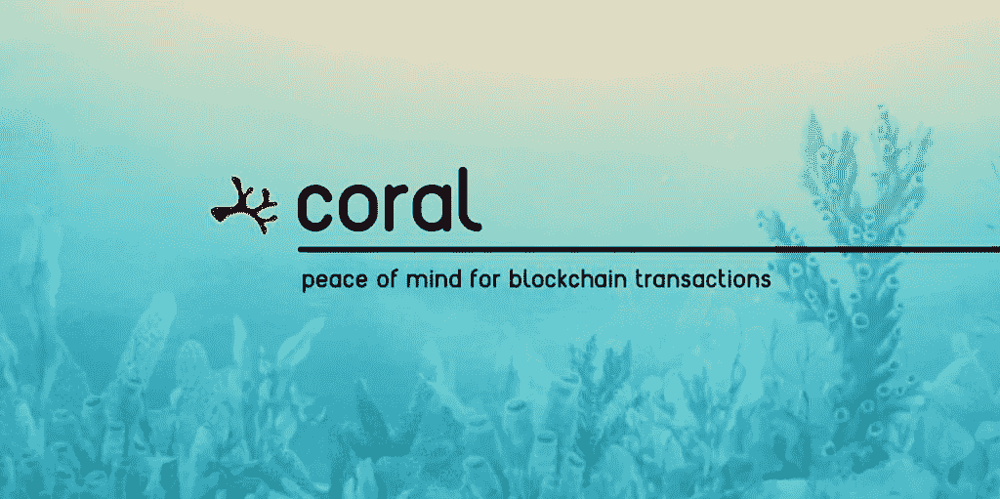
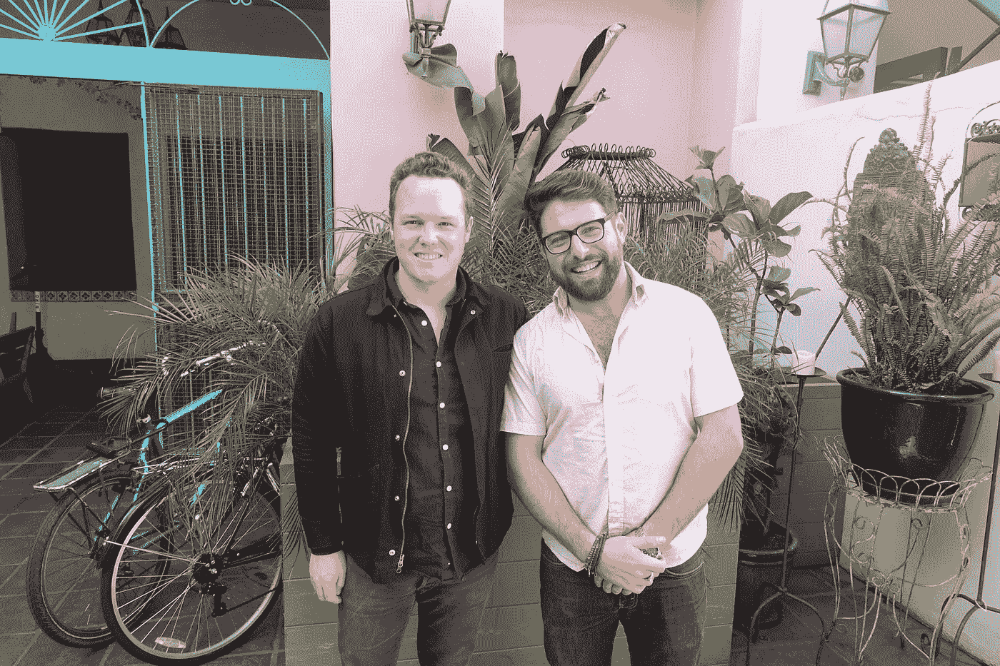

# 对 ICO 推销日的剖析

> 原文：<https://medium.com/hackernoon/the-anatomy-of-an-ico-pitch-day-4ed747cf315>

## 参加圣莫尼卡的 DNA 基金每周 ICO 推介日

走进圣莫尼卡的 41 Ocean，多样化的人群立刻让我大吃一惊。穿西装、t 恤的人，还有一个看起来像现代版印第安纳·琼斯的人。

人群由各行各业的人组成。有成功的商人和已经有几个项目的女性，也有更年轻的人群。我只能想象人群中挤满了开发者和区块链专家，他们都希望成为下一个 Vitalik。

让我倒回去一点。

最近，我被介绍给来自 DNA 基金的马克·温斯滕。分布式网络顾问基金投资于早期阶段的区块链项目，并在项目启动的过程中帮助培育它们。该基金由一个区块链专家团队运营，他们帮助企业家推出代币生态系统。

**DNA 在最近的博文中描述了他们的选择标准:**

## DNA 标准

DNA 在区块链项目中寻找的六把钥匙

*   结构性竞争优势又名“灯塔”
*   独特的创新解决方案或可防御的技术
*   对令牌和分布式分类帐技术的明确需求
*   管理团队和顾问
*   竞争格局和支持它们的机会
*   分权治理模式

*你可以从他们的博客* [*阅读更多关于《灯塔》的文章*](/thisisdna/searching-for-a-lighthouse-49be33ae8882) *。*

我一直在为 ICO 的白皮书生成/设计提供建议，所以你可以想象，我被迷住了。马克让我知道他们每周二在圣莫尼卡有一个 ICO 推广日。希望加入该基金的公司将在这里推介其商业模式和使用案例。希望获得资本和资源。

我很好奇。我认为自己擅长网上交际。强迫自己离开家去见人是完全不同的事情。我很容易迷失在我的电脑屏幕里。日复一日地写文章，制图，研究有前途的硬币。我很高兴能够在家工作。这既是祝福也是诅咒。一件幸事，因为我可以在家工作。一个诅咒，因为，嗯，我从来没有离开这该死的房子。我是个秘密隐士。尤其是最近。我已经开始每天阅读 5-10 份白皮书，为我正在撰写的[系列](https://hackernoon.com/top-icos-rated-by-white-paper-complexity-a7d2a2fda93d)确定最佳实践。该系列将涵盖[完美 ICO 秘方](https://hackernoon.com/top-icos-rated-by-white-paper-complexity-a7d2a2fda93d)的所有要素，已经完全消耗了我。

虽然我很紧张要离开蝙蝠洞，我孤独的堡垒，如果你愿意的话。我也很兴奋终于可以出来见见洛杉矶的区块链社区。

(Left to Right) Andy Do, Takashi Yanagi, and Tommy Alastra

表白；我不是最干净利落的人。我很少刮胡子，我的头发一直垂到肩膀。我看起来像刚从丛林中出来的泰山。在家工作让我可以放松自己。我从来没有对自己说:“我要把头发留长了”。我刚开始做生意，6 个月后照镜子，发现自己长得像约翰·斯诺的棕色表亲。或者卓戈·卡奥，如果他永远不再去健身房的话。

在前往 ICO pitch day 之前，我刮了胡子，梳好头发，穿上我最喜欢的 t 恤。

谁会想到我会在这种场合穿得有点过了。

这就是为什么我喜欢加密。没有人会假装自己不是。这个房间里的人在这里是因为他们是这个领域中最优秀和最聪明的人——他们被带到各自的团队是因为他们的技能，而不是他们的外表。而不是他们攀登公司阶梯的能力，那会促进精神变态。他们在这里是因为他们推动结果。

**Crypto 根本不在乎你的长相。**

不管怎样，我到了 41 Ocean，几乎立刻就碰到了 Marc。他很快给了我关于正在发生的事情和地点的概要。我匆匆赶到酒吧，因为现在大约是太平洋标准时间下午 1 点，这意味着现在是美国东部时间下午 4 点，这意味着可以喝啤酒。

随着我的饮料被喝光，房间变满了，很快，当天的第一个 ICO 就进入了临时工作阶段。我以前参加过很多推介日，从来没有严格针对专注于区块链的公司，但我看到了我的公平份额。DNA 基金推介日的环境是我见过的最平静和随意的。这些创始人试图获得数百万美元，一个将梦想变成现实的机会——但令人惊讶的是，他们对此都漠不关心。

> 一天下来，我看了四个 ICO 的推介。在本文中，我将讨论前两个问题。在接下来的几天里，我会写一篇关于 **WaterChain** 和 **Impact PPA 的文章——**我没有在这篇文章中涉及的项目。

# [alpha token](https://www.atoken.org/en/index.html)

[网站](https://www.atoken.org/en/index.html)
[推特](https://twitter.com/alphatoken_atk)链接

## **什么是 AlphaToken？**

阿尔法令牌或 ATK 是区块链数字内容的货币。alpha browser 为您在创建或消费内容时付出的时间和精力提供奖励。它建立了一个点对点的内容交易平台，允许生产者、消费者和广告商直接互动，无需通过第三方。

内容创建者可以发布免费或付费内容，并给出价格——消费者然后用 AlphaTokens 付费(如有必要)观看内容。广告客户从该平台中受益，因为消费者被激励分享更多关于自己的信息，从而让广告客户与他们的人口统计数据更密切地接触。作为对消费者的额外好处，他们因观看广告而直接从广告商那里获得报酬。

## AlphaToken 的案例

在他的演讲结束后，我有幸与创始人兼首席执行官华莱士·林奇博士进行了交谈。在我们的谈话中，我很确定林奇博士一直面带微笑。根据他的简历，林奇博士是一个，

"连续创业者，哥伦比亚大学博士，经验丰富的技术媒体专家，创业社区连接者，HSHub，MenuMeet，JianyueApp 的创始人，Svinsight，SVACE 的联合创始人."

我不确定他获得的博士学位是什么，但鉴于他热情友好的态度，如果是心理学，我也不会感到惊讶。他对我向他提出的一连串问题的耐心，以及他用简单的词语表达复杂话题的能力。

**我喜欢 AlphaToken 有几个原因:**

1.  他们有工作产品。他们目前在他们的私人测试，林奇博士将会给我访问权限，所以希望我能尽快更新你们！
2.  他们有一支强大的队伍。
3.  他们有强有力的顾问。
4.  他们正在解决影响大量人口的痛点。

我的背景是数字营销，我花了无数时间为品牌策划影响者活动。以及为有影响力的人构思产品进行销售，努力从他们的追随者身上赚钱。这可能不是一个流行的观点，但是成为一个有影响力的人是一个可怕的职业。你不知道你的保质期有多长，尽管你可能有巨大的在线“影响力”(关注者、观众等)，但很难找到将它转化为生活的方法。在影响者营销中，你经常会遇到两种情况。有影响力的人要么要价过高，因为他们被灌输了一个机构，这个机构教会他们如何溢价销售，要么他们被利用，因为他们没有弄清楚自己的价值。很少有中间立场。

作为一名内容创作者(不管你信不信，这篇文章是“内容”)，我看到了 AlphaToken 这样的平台的吸引力。能够为人们消费我的内容设定自己的价格；那听起来像是一个我能支持的想法。

然而，真正激起我对这个项目兴趣的是林奇博士对消费者说的一些话。

“我们称之为优步·黑仔。当我们推出时，人们坐在家里看我们平台上的广告将比开车去优步赚得更多”。

我既兴奋，又有点担心；因为那天我带了一个优步人去，希望在我回到好莱坞之前，他不会把他们的生意搞砸。

# 珊瑚协议

[**网站**](http://heycoral.com)[**电报**](http://t.me/heycoral)

*珊瑚协议今天刚刚推出他们的网站！(3 月 5 日)在 www.HeyCoral.com*[*结账*](http://www.heycoral.com)

## 什么是 Coral 协议？

当 Coral Protocol 登台时，我学到的第一件事是，我这辈子都在拼错“Coral”。

我学到的第二件事是，这个行业需要像 Coral 这样的公司来扩大规模，鼓励大众采用区块链技术。

它们解决了一个问题，而在此之前，我认为这只是分权的一个缺点。如果没有第三方监管机构的介入，这是一个无法避免的不幸问题。

Coral 协议可以防范基于区块链的欺诈。Coral 为加密货币地址分配区块链信任分数，并提供区块链支付保护，为网络钓鱼受害者提供赔偿。

> “加密交易是危险的。如果你发送加密到一个不兼容的钱包，噗。如果你输错了钱包地址，噗。你的钱不见了。”大卫·库查尔

(Left to Right) David Kuchar & Jon Gillon from [CoralProtocol](http://heycoral.com)

## 珊瑚协议的案例

对于普通用户来说，最大的障碍之一就是你辛辛苦苦赚来的钱可能会因为最简单的错误而掉进黑洞。就像 David 在上面的引用中提到的，当输入钱包地址时，一个不合适的字符可能会导致您试图转移的所有内容丢失。作为美国人，我们经常被牵着手。政府助长了依赖性。对你来说，事情就是这样。东西坏了？打电话给你的保险公司。有人偷你的东西？把他们告上法庭或者报警。现有的制度和规定给了我们纠正我们认为对我们犯下的错误的工具。这在加密货币中是不存在的。

如果你曾经有幸体验过“加密推特”，你就会知道骗子多的是。对于 Twitter 上每一个真正有帮助的影响者，都有 3-6 个(保守估计)假账户会伪装成影响者，试图欺骗 Twitter 用户向他们发送加密货币。这些被称为“网络钓鱼诈骗”。Coral 协议旨在阻止网络钓鱼欺诈。

目前，如果你成为欺诈的受害者，你不能拿回你的钱。这是权力下放和缺乏监管的一个退路。

珊瑚是我们这个世界需要的伙伴。

> “由于缺乏对支付者的保护，数字货币作为交易媒介仍然受到限制。这些保护措施中最重要的将是一个普遍的、匿名的信任体系。Coral 是一种可互操作的区块链协议，为加密货币的支付者提供了一种分散的防范欺诈的措施。Coral 为每个加密货币地址创建一个信任分数，使发送者能够知道接收者地址是否值得信任，同时保持用户的匿名性和自主性。这个信任分数提供了一个信任的基线系统，在此基础上可以建立其他安全层，包括区块链支付保护。”

## 进行加密支付很可怕。

向欺诈性地址汇款会导致资金全部损失。当前的诈骗预防方法非常糟糕，导致联邦理工学院和 BTC 每天损失近 400 万美元。Coral 协议可以防范基于区块链的欺诈。Coral 为加密货币地址分配区块链信任分数，并向网络钓鱼受害者提供赔偿。

> 当前的诈骗预防方法非常糟糕，导致联邦理工学院和 BTC 每天损失近 400 万美元。

我真的被 Coral 协议演示的简单性震惊了，事实上以前没有人想到这一点。同样，在听说 Coral 之前，我认为解决加密货币欺诈活动的唯一办法是聘请第三方监管机构。虽然 Coral 在某种程度上是一种监管方法，但它是去中心化的——使用智能合同来消除对信任的需求。

珊瑚今天发布他们的网站。Coral 团队的另一个方面让我对他们的未来持积极态度，那就是他们“产品第一”的心态。在推出他们的网站之前:他们已经建立了自己的 API，并开始与潜在客户交谈。

> ***免责声明:我不接受文章的付款，我也没有投资或参与本文中提到的任何公司。***