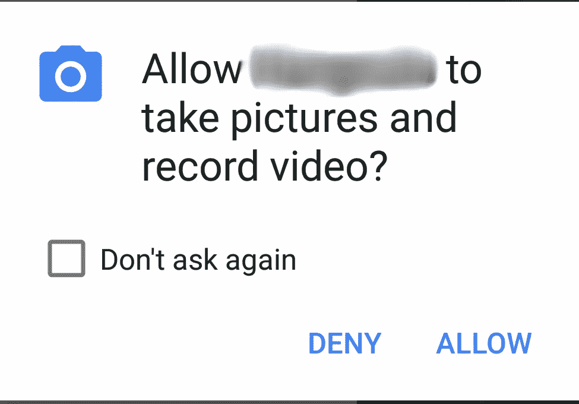

# Android 异端，问题 1:运行时权限烂透了！

> 原文：<https://medium.com/hackernoon/the-android-heretic-issue-1-runtime-permissions-suck-26501d39dacb>


My expression when I first heard about Marshmallow’s runtime permissions. I then threw the book against a wall and it **broke**. True story.

## 一系列消除因果报应的帖子

*“Android 异端”是一个新的系列，在这个系列中，我将讨论让我恼火的关于 Android 和 Android 开发的事情。它们不会是你通常所说的“相机 API 很烂”类型的帖子。相反，我会抱怨一些机器人世界的圣人。*

现在，在正常情况下，这些帖子会毁掉任何 Android 开发者的信誉，但既然我一开始就没有信誉，那就不是问题。

## 2009 年:“模态对话框烂透了，哈哈”

嘿，还记得 2009 年我们安卓粉丝是如何取笑 iPhone 的吗？每当有人收到一条消息，就会在屏幕上弹出一个停止工作流的弹出窗口，这看起来是多么奇怪？

对于我们这些 Android 爱好者来说，情况就不一样了:我们会在通知下拉列表中得到一个漂亮、谨慎的通知，并在滚动条中预览显示的消息(既然我们在这里:该死的，决定移除滚动条的人——该死的见鬼去吧！)

你还想让我提醒你 Windows Vista 的用户账户控制(UAC)吗？在当时，所有人都认为它是撒旦和舒布·尼格拉思(Shub-Niggurath)的后代。


UAC’s mom and her thousand young. What a whore.

你猜怎么着？随着 Android Marshmallow 中运行时权限的引入，Android 用户也将开始尝到这种滋味。但这次他们会喜欢，因为谷歌这么说了。

## 2016:“OMG，模态权限对话框摇滚！”

每当我提到我不喜欢运行时权限，我就会被群起而攻之:“用户终于有了选择！他们可以精确地接受或拒绝权限。你疯了吗？*你是共产党员吗？”*

虽然我不能否认这种许可模式在某种程度上是有道理的，但我认为谷歌(它本质上抄袭了苹果的许可模式的所有可怕之处)本可以做得更好。

那么，我为什么讨厌这种模式呢？因为在开发商这边，很乱。在用户方面，它很烦人，而且会停止工作流。

## 实现运行时权限或:第八层地狱

实现运行时权限迫使开发人员在他们的活动中添加授权代码(并检查权限是否已经被授予)。在每个人都试图让他们的活动类变得更轻的时候(在谷歌自己的架构组件的帮助下)，这有什么意义呢？

API 包含的方法名比威尔士村庄的德语单词还要长，这也于事无补。

`ActivityCompat.**shouldShowRequestPermissionRationale()**`？

真的吗？

那些建议的“优雅降级”指导方针如何？在这些指导方针下，即使用户拒绝*某些*权限，应用程序仍应工作。

显然，开发人员也应该关心确保应用程序保持功能，即使一些权限被授予，一些被拒绝。祝你在编写意大利面条代码时愉快。

“但是……但是……安东尼斯。有第三方库使得处理权限变得容易得多！”

当然:一个精心制作的第一方 API 的标志是需要第三方库来使它可用。

## 停下你正在做的事，我之前忘记问你了！

作为一个用户，运行时权限也会变得非常烦人，非常快。

想象一下，安装了那个闪亮的新相机应用程序，突然发现一只鹿在吃一只狼。或者猫追狗。或者特朗普尊重女性。你想当场就拍下那张照片！所以你按下快门按钮，让混蛋大吃一惊！



App name redacted under instructions from Shub-Niggurath

这个时刻已经过去了。

鹿又开始假装它不是邪恶的化身。狗已经跑了，唐纳德又开始不管三七二十一抓阴道了。

你可以争辩说这是开发商的错:他们本可以更早地请求许可。但是更早的*什么时候*？在应用程序发布时？这是什么样的用户体验？如果用户在这之前还没有启动应用程序呢？

另一个真正困扰我的方面是一些应用程序的流动突然中断，几乎是粗鲁的。

例如，用我的应用程序 Veterondo ( [Play Store](https://play.google.com/store/apps/details?id=com.saladdressing.veterondo) ， [Github](https://github.com/Antonis427/veterondo) )我试图做一个时尚、简约的天气应用程序。第一次打开应用程序时，你会得到一个动画介绍，然后第二个活动会显示实际信息。

尽管我很想让应用程序流畅地从一个屏幕切换到另一个屏幕，但我做不到:我必须请求某个地方的位置许可。在应用程序启动时，它破坏了气氛(安装应用程序，看看:想象一下，你首先得到的不是开场动画，而是一个侵入性的弹出窗口和*然后是*动画)。同样的事情在两个屏幕之间，但我不得不妥协。

不仅如此，因为你不能设置对话框的样式(这是可以理解的，至少——它必须看起来像一个系统级的东西),弹出窗口在试图看起来与众不同的应用程序中看起来很不合适。

## 所以，你的解决办法是什么，聪明人？

逻辑上说，我不一定要想出一个更好的解决方案，才能被允许批评谷歌的做法。然而，这里有一些我想到的解决办法

*   允许用户选择在安装时授予所有必需的权限，或者为受虐者提供一个随用随授的模式
*   如果你担心应用程序会开始做一些事情，而不是显示一个该死的弹出窗口，你会向用户显示一个正在进行的通知，说“[在此输入应用程序名称]当前正在录制音频”怎么样？请注意，我并不是不讨厌正在进行的通知，但是您并不认为为后台进程这样做是不值得的。额外酱:使它成为一个可操作的通知，让用户禁用通知的行为。不客气
*   打开一个浮动终端窗口，让用户输入

```
sudo grant PERMISSION_NAME
```

这仍然很烦人，但至少他们会觉得自己像个黑客。

或者你知道吗？也许谷歌的工程师和 UX 专家大军可以用一种比一个业余时间在媒体上敲键盘更好的方式来解决这个问题。随便说说。