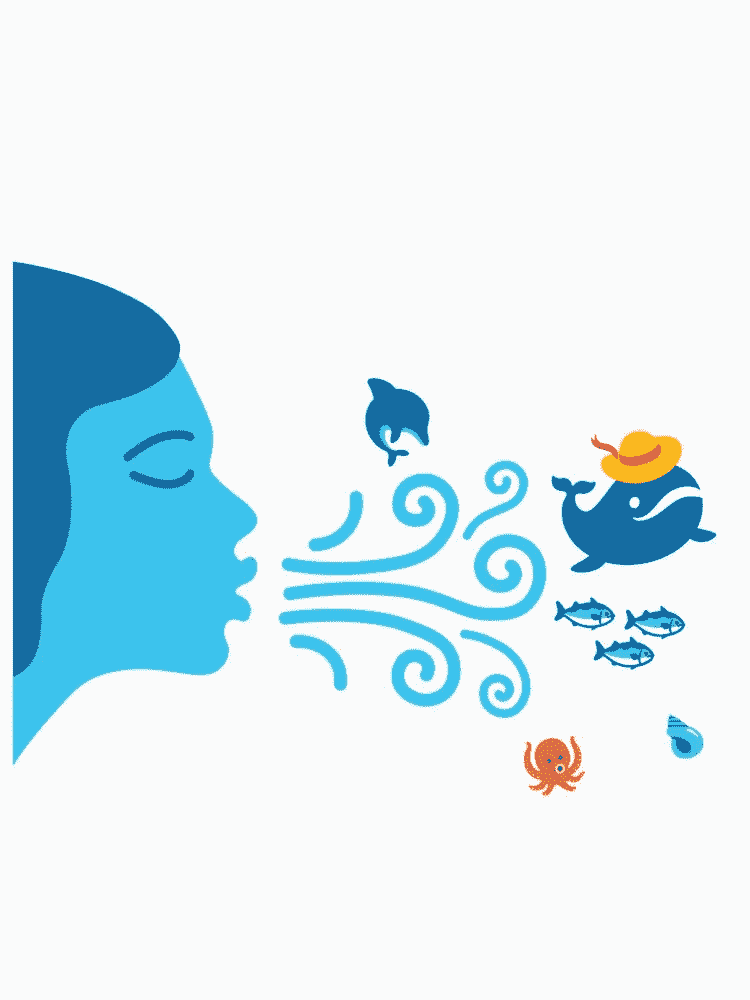
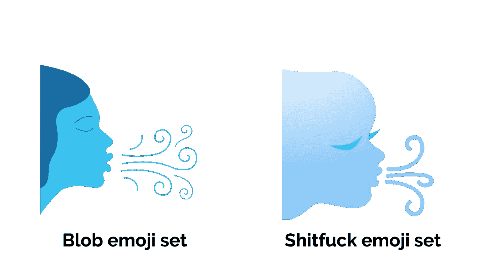
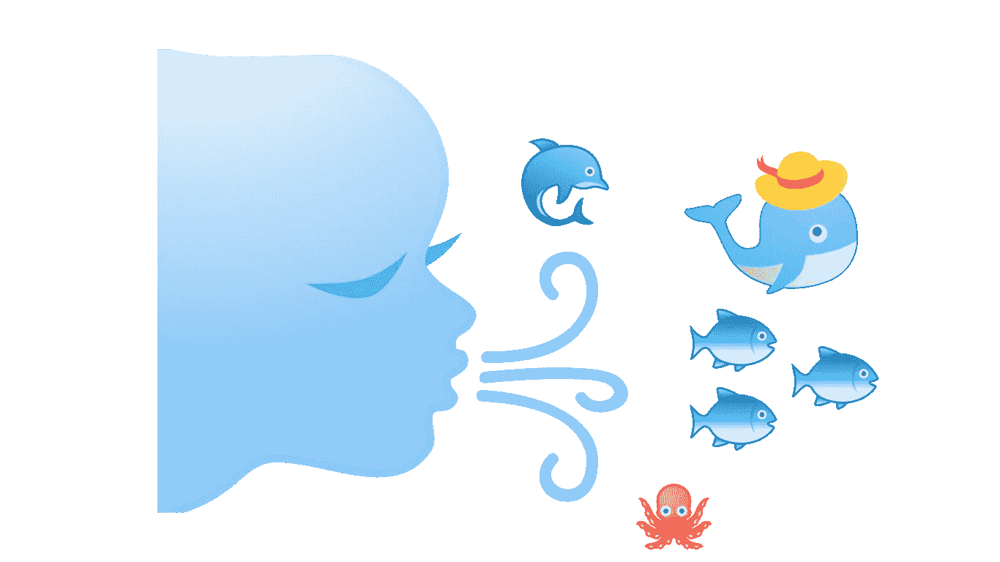

# Android 异端，第 2 期:通过删除 Blob 表情符号，谷歌将 Android 的灵魂撕裂

> 原文：<https://medium.com/hackernoon/the-android-heretic-issue-2-by-removing-the-blob-emojis-google-ripped-the-soul-out-of-android-fb99f9a2c3be>

## 是的，我对此感觉很强烈

一个版本之前，谷歌决定从安卓系统中移除高度特异的 blob 表情符号，并用一套温和、无特色的新表情符号取而代之，这将使安卓系统更接近其他平台。

虽然不是每个人都同意我的观点，但是新的一套看起来就像，嗯…狗屎。*他妈的*狗屎。

我将诚实地告诉你:我非常喜欢 blob 表情符号，非常讨厌新的表情符号，以至于我没有将我的 Pixel XL 升级到 Android 8.0，也不打算这样做。对我来说，让 Android 变得如此特别的东西之一已经被拿走了，取而代之的是对它以前的嘲弄。

## 为什么这么严肃，安东尼斯？大不了。成熟点吧。

不，不，谢谢。

你看，你可能没有意识到，但 blob 表情符号集实际上包含了大量美丽、古怪、复古风格的插图，这些插图是*而不是* blob 人。

这些表情符号以一种有机的方式与 Android 界面相连:材料设计，大胆使用颜色和字体，经常让人想起过去几十年(特别是五六十年代)的平面设计趋势，并转移到 21 世纪。blob 表情符号集插图同样具有复古未来感，给人的印象是它们属于这个环境。

另一方面，新的一套，自由使用渐变和强烈的轮廓，看起来像是 90 年代中期 Geocities 网站上的东西。很简单，这是一场灾难。

## 这是主观的。这个不能一概而论。有些人喜欢这套新衣服。

你妈妈很主观。

另外，有些人喜欢抚摸小孩，也喜欢喝百事可乐而不是可口可乐。并不意味着他们是对的。

事情是这样的:在谷歌决定从 Android 上移除 blob 表情符号集后不久(在 Reddit 上进行了 48 小时的短暂抗议后，他们转向了更紧迫的问题，比如哪一款旗舰在 Geekbench 上表现更好之类的问题)，我决定将事情掌握在自己手中，至少尝试保留一些可爱的表情符号。

怎么会？基于它们做出设计，并把它们印在 t 恤、杯子和各种按需印刷服务的文具上。

其中一个设计就是你在这篇文章的标题上看到的那个。我把这个叫做“夏日微风”,我非常喜欢它——这是一个与海洋和夏天相关的 blob 表情符号的拼贴画。是的，整个事情是由来自 blob 表情符号集的插图组成的。

现在，为了说明这一点，我将使用“更新”奥利奥套装中完全相同的表情符号来重新创建这幅拼贴画。

首先，让我从新的场景中得到吹着空气的脸(插图画家称之为“风脸”),并把它放在第一个斑点场景的旁边

除了新的看起来像有一对夫妇的额外染色体，空气流通，阶级，技巧，克里特文明启发的艺术已经完全被删除，取而代之的是一个糟糕的加权，令人作呕的梯度(新词警报！)不对称的一坨屎。

但是我们不要就此停止:让我们重新创建整个事情！

给你。

海豚和章鱼看起来都像是刚从活组织检查中得知坏消息，鲸鱼看起来像是在做巧克力布丁的白日梦。或者老二。你决定吧。至于鱼的表情符号，它应该是一种鱼的塑料复制品吗？

请注意，贝壳不见了，因为在我试图用新表情符号重建拼贴画的最后，我失去了活下去的意愿。

现在有人会认真地坐在这里告诉我，用新表情符号创建的拼贴画甚至可以与用 blob 表情符号创建的拼贴画相比吗？

我的意思是，你可以清楚地看到他们两人在风格和艺术上的进步。

在 blob 表情符号集的例子中，它是这样的

*   有人在克诺索斯宫看到了一些克里特文明的绘画
*   她用一种 20 世纪中期典型的轻盈感对它们进行了过滤
*   她把它们带进了现代，但没有忘记是什么让艺术变得特别

在奥利奥表情符号的例子中，它是这样的

*   有人在海底发现了一些米诺斯文明时代的花瓶，里面有腐烂的枣椰
*   尽管他很饿，他还是吃了那些该死的东西
*   然后他突然拉肚子，用难闻的、滴滴答答的大便喷我们设备的墙壁、地板和屏幕。

## 你他妈的混蛋，表情符号不是用来拼贴的

你闭上你的臭嘴。

不管是不是拼贴画，在我看来，毫无疑问，新的表情包是丑陋的、乏味的、不一致的，是谷歌模仿其他平台表情包中表情的可悲的模仿尝试(对不起，我的意思是“让它们一致”)。为了实现这一点，它拿走了旧设备的特别之处，并在这个过程中扼杀了 Android 的一个小但有机的部分。

泡泡万岁。

如果你喜欢我的作品，并希望支持我，请考虑在“给我买杯咖啡”网站捐款。任何捐赠的人都有丰厚的奖品和奖金！

 [## 给安东尼斯·查加利斯买杯咖啡——BuyMeACoffee.com

### 我写机器人，生活，宇宙和一切。

www.buymeacoffee.com](https://www.buymeacoffee.com/XozUExS) 

*想以非金钱的方式支持我吗？嗯，*还好*。尽可能多地鼓掌，并分享这篇文章。谢谢！*