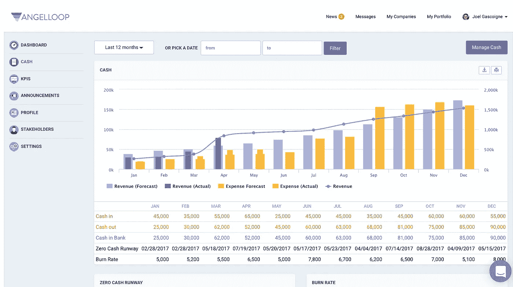

# AngelLoop 团队和产品路线图

> 原文：<https://medium.com/hackernoon/the-angelloop-team-and-product-roadmap-8d1af1eddc9d>

## 创始人访谈

> 披露: [AngelLoop](https://goo.gl/G7ZSp6) ，投资者交流平台初创公司，之前曾赞助过黑客正午。
> 
> 阅读这篇采访的第 1、2、3 部分:[AngelLoop CEO Igor Feerer 的创业之旅](https://hackernoon.com/tentrepreneurial-journey-of-angelloop-ceo-igor-feerer-b9029748a002)、[你当前业务的问题如何引领你的下一个业务](https://hackernoon.com/how-the-problem-of-your-current-business-can-lead-to-your-next-business-842b1f786652)、& [创始人应该与投资人分享哪些信息？](https://hackernoon.com/what-information-should-founders-share-with-their-investors-360619add450)

David Smooke:我们来谈谈产品路线图。从长远来看，你认为它会走向何方？然后你如何看待短期内会发生什么？简而言之，你如何确定构建内容的优先级？

Igor Feerer :当然，肯定会有更多的 API。我们希望尽可能自动化数据捕获。所以，从创始人的角度来说，仅仅要求你的队友给你提供正确的数据集是一件痛苦的事情。所以，只要有 API，你就可以即插即用。

> 至于我们正在考虑添加的其他路线图项目，那只是来自与用户的交谈。

我们推出了基线产品，奇怪的是，我们开始看到它被用于其他目的，而不仅仅是更新你的投资者。像后期阶段的公司或后期阶段的创始人一样，他们会去筹集 2000 万美元，但他们不会坐以待毙，等着钱用完，他们几乎立即就开始筹资。

因此，我们看到许多创始人不仅邀请他们目前的利益相关者，还邀请潜在投资者进入应用程序，并与他们建立联系。这实际上激发了一个想法。我们肯定希望帮助创始人更好地管理他们的投资渠道，所以这意味着引入一个 CRM 工具来帮助他们跟踪应该的投资者，然后当他们准备好关闭时，只需简单地点击几下，发出所有的文件，然后关闭这一轮。

我们希望成为一套整合的工具。因此，工资表肯定是(公司)感兴趣的。这是一个非常静态的工具，许多公司都使用电子表格，但为了使它标准化和正确，我们正在我们的律师和其他几位非常了解这个领域的顾问的帮助下建立一个 cap 表，这样一旦你结束了你的回合，你就可以输入你的利益相关者信息，我们将为你排序，然后你就可以随时访问你的 cap 表，并以非常直观的方式查看它。我们实际上已经构建好了，只需将后端部件组装在一起。

另一方面，投资者也在积极寻找工具来帮助他们管理融资后的关系，你知道，现在他们正在通过 slack、电子邮件、电子表格来管理，他们不得不雇用助理或实习生来追踪他们为任何相关数据而成立的投资组合公司。

因此，我们有点想把自己想象成投资者的一个 [Mixpanel](https://hackernoon.com/inside-the-mind-of-mixpanels-ceo-3f58d2324aa7) ，只要接入你的投资组合公司，捕捉正确的数据，拥有社交工具来帮助你更好地与他们沟通，并真正依靠这个平台来提高你的底线。

**数据输入的 API 听起来很棒……因为听到这些大型投资公司让实习生到处跑着填写电子表格的故事有点令人难过。您是否将电子表格视为您的主要竞争对手？**

我是说，是的，当然。电子邮件、电子表格，它们绝对是一股竞争力量，但我的座右铭是:

> 不管你有多少资源，如果你不知道如何正确使用它们，你永远都不会有足够的资源。

因此，我们喜欢将 AngelLoop 视为一个指南、一种资源、一个路线图，来帮助您更好地培养您的投资者关系。有点让所有的想法去，但更不用说，我们是一个大的时间节省者。所以，你花在更新投资者信息上的时间实际上可以用来与他们交谈，更好地了解他们，也许还可以相互分享一些信息，但最终，你的目标是尽可能牢固地建立这些关系。

**是的，绝对的。我的意思是，真正能推动长期投资的关系。对于您之前提到的 API，他们目前使用最多的是哪种 API 来将信息输入系统？**

所以，我们实际上整合了格子。Plaid 帮助他们直接进入他们的银行，他们的银行将他们的交易发送给我们，Plaid 将他们的交易调整为现金、收入、费用，这使他们的生活更容易简化。但我们也在 Mixpanel、Google analytics、不同的 CRM 中构建 API，所以这将使创始人的生活变得容易得多……这是一个相当大的团队，他们不想追逐和获得任何类型的更新，所以它只是从正确的来源获取正确的数据。

**我们能稍微转换一下话题，谈谈 AngelLoop 的营收模式吗？它的进展如何，你如何看待短期收入和长期收入在收入流方面的对比？**

当然可以。我们的商业模式是基于 SaaS 的模式，因此公司每月支付 65 美元使用平台，投资者免费获得。这背后的思维过程是，一家公司让所有的利益相关者加入 AngelLoop 非常重要，所以如果我们向投资者收取费用，你不会让所有的投资者都加入。

> 就 AngelLoop 的收入而言，我们有 750 个客户。我们最近摆脱了数据，建立了一个付费墙，所以我们看到每月增长约 20%至 30%。

这是一个利基市场，所以它不是一个十亿美元的想法，但它肯定是一个对我们的生态系统有帮助的想法。

所以，我喜欢这样想:我们是生态系统的后台管理员，也就是说我们帮助风投和创始人处理信息、交流和合作。所以，你只要看看在我们的生态系统中交易的资金总额，我认为这个市场只占很小的比例，可能只有 5%，所以我们计算出这是一个 5 亿美元的市场机会，这只是基于我们所在的垂直行业。所以，我确实看到它在增长。

并不是说很多公司都在做后融资关系。事实上，两家公司正在建立后融资关系，所以这仍然是一个非常小的市场，但它肯定在增长，因为你有不同的融资渠道开放众筹，就像突然之间所有这些 ico 一样。但是风投和天使们，这些绝对是帮助你扩大风险的合适的利益相关者，所以我们处在正确的位置，我认为时机也是正确的。

**是的，在一个你可以清楚地看到很多价值留在桌面上的地方肯定是件好事，这肯定是一件很酷的事情，因为很多时候创始人不是试图抓住留在桌面上的价值，而是试图创造新的价值并把它放在桌面上。**

好吧，看看 ico 正在发生的事情，他们正在吸引大量投资者，并且正在讨论一种新型的加密治理，因为他们正在等待帮助推动业务。因此，最终，你所做的是依靠人们的建议和反馈，以及他们拥有的任何投票权，来真正帮助你的公司取得成功。现在，让一个人来掌舵肯定是有好处的，但是当他们可以依靠他们现有的资源来给他们反馈和想法时，这就像是一种增压，让首席执行官做得更好？

是的。因此，就该领域的其他公司而言，你实际上已经进行了收购。2016 年 1 月，你收购了 SeederBoard。您能告诉我们一些关于那次收购的情况，以及它是如何使贵公司受益的吗？

是啊，当然。还记得我告诉过你，我正在寻找一个平台来帮我管理我在转录我的投资者吗？

**是啊。**

嗯，我差不多找到了一个适合我需求的平台。它在投资者方面没有任何东西，在社交工具方面也没有任何东西，但当时该公司的首席执行官，他在做 SeederBoard，或者说他在相当长的一段时间里都在运营 SeederBoard。我认为他在时间上有点偏离，但我进来了，我说，“嘿，蒂姆，我在硅谷，这里有很多投资者。我们为什么不做一笔交易，让 AngelLoop 收购 SeederBoard，然后我们在这里扩大业务规模？”这就诞生了 AngelLoop，但最终，AngelLoop 增加了一系列其他功能，真正简化了许多创始人和投资者所期望的沟通和合作。

**酷。所以，看起来…那是核心的初始产品吗？**

是的，那是最初的核心产品，没有 API，…如果有什么不同的话，那就是一个外壳。这是一个外壳，但这是一个伟大的想法，只是我们需要添加一些东西，使它更友好的用户界面。所以，是的，这也是一个非常有趣的收购，但我和蒂姆我们仍然交谈，他是一个很棒的人，他帮助了我。他现在在亚马逊工作，所以他肯定还在整个创业生态系统中。但是，是的，收购种子板是对的。我以前从未收购过公司。

是的，我也没有。听起来会很有趣…你把现有的东西映射到你的视觉中，就好像你有了骨架，然后你构建出身体的其余部分。

绝对绝对。我甚至不打算去前台。事情就是这样。

**那么，你能告诉我一些关于你团队其他成员的信息，以及你未来优先考虑的技能吗？**

是啊，当然。所以，我一直想和像我一样的企业家一起工作。

我认为他们肯定可以为其他企业家增加很多价值，所以为什么要建立另一个轮子，或者，这有点像站在巨人的肩膀上。比如我们从过去的经验中了解到的，我们可以为用户提供什么，这样他们就不必重复同样的错误。我在寻找企业家。

我现在有六个人，他们都创立过公司，出售过公司，失败过的公司，我的意思是，他们肯定有丰富的经验，但迈克是我们的产品负责人。他是一名前绿色贝雷帽成员，进入了一个数据领域，他真的很有兴趣尝试找出是什么让公司成功。当他告诉我的时候，我说，迈克，你得和我一起研究这个想法。我认为用户对此很感兴趣，但更重要的是，我们有很多方法可以回馈社区。

然后我们有特雷弗。特雷弗负责我们的产品营销。他本人是一名前海军老兵。他还在这里开了一些公司，他经历了一些加速器。他知道投资者在寻找什么，创始人在寻找什么。所以他绝对是有帮助的。

然后是阿尼什。他是我们的首席技术官。他已经建立了几个这样的平台，所以我绝对信任他的产品。除此之外，他还建立了自己的公司，因此他了解管理、领导力和筹资，我认为这将是关键，特别是在建立创始人需要帮助他们成功的工具时。

**爽。我发现了一件事，这几天我一直在玩这个产品，看看它是如何工作的。我发现的一个有趣的事情肯定是电子邮件模板，所以这种想法是，每当你想进行更新时，你可以选择 10 个标签或单词中的一个，然后你就可以得到基本的电子邮件模板。**

**我很好奇你是如何为此创作内容的？当我尝试一些不同的选项时，它实际上工作得很好——就像好吧，我想庆祝什么，或者我想谈谈现金流，然后你会提示我一个问题来回答。宣传片框定了讨论…很多人以前没有做过，作为第一次创业者，然后作为重复创业者，也许他们已经做过了，但有这个模板很好。那么，你是从自己的经历中建立这些的吗？客户的使用在多大程度上推动了这些不同的投资者沟通模板？**

是啊，当然。所以，这些模板，对创业者来说是一个路线图，可以用来从投资者那里得到他们想要的东西。更重要的是，它们是培育工具。

> 因此，有趣的是，我们仅仅通过查看英雄之旅的故事板来设计我们的投资者更新。我是说，给我们亮点，给我们暗点，你有什么挑战吗？我们能帮你提供一些荣誉吗？

我的意思是，它本质上是为了让创始人专注于他们需要讨论的事情，但它也是从更有说服力的角度设计的，所以当投资者阅读它时，他们对结果感到满意，他们看到了你公司发生的积极的事情，他们看到了消极的事情，他们看到了你在量化表现方面的表现，但他们也明白你在寻求他们的帮助。

总之，您可以覆盖该模板。你可以创建自己的模板，添加任何你想要的东西。在 TranscribeMe，我们的模板随着时间的推移而改变，只是因为公司开始变大。因此，它绝对足够灵活，可以一轮又一轮地帮助早期公司。无论什么样的公司管理他们的投资者。

**目前使用 AngelLoop 的最大公司规模是多少？**

于是，我们有了一家 C 轮公司。他们已经经历了一大堆回合。他们已经获得了大约 70 名投资者，其中一些是风投，所以他们想采取措施来帮助管理他们的天使投资者。他们利用我们的目的是真正地、真正地利用他们的早期投资者，因为他们是早期进入的人，他们对创始人有足够的信任，会给他一张支票。因此，他们带来了很多价值。他们邀请的其他风投对这个工具很满意。他们甚至邀请更多的投资组合公司开始使用这个工具，如果可以的话，这是一个很好的病毒循环，这正在发生。

**然后稍微改变一下市场格局，在你认为合适的时候，随意重新引导这些问题。但是我很好奇的一件事是，你认为天使名单应该进入投资者管理吗？**

我认为他们不应该。我的意思是，显然我会说…不，我的意思是，我喜欢 Naval，我喜欢他在 Instagram 和 Twitter 上发表的言论，我喜欢阅读他的小帖子。但是回到 AngelList，他们正在做一项了不起的工作。他们帮助公司寻找投资者，他们帮助公司推出一些产品，雇佣更多的人，至于他们的辛迪加，我认为他们有一些工具，只是我不希望他们进入那个行业。我更希望 Naval 专注于从前期融资方面帮助公司真正发展壮大。

**是啊。专注于你擅长的事情是很好的，他们似乎已经赚了很多钱。**

这真的是一件很难回答的事情。我知道他们有一些报告功能，这只是一家公司在那里，他们在那里的目的是建立关系网，所以他们可能忽略了很多密切的融资增值，因为我们肯定会提到这一点。