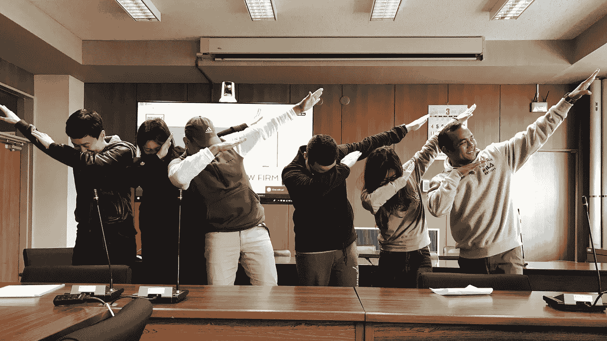

# 颠覆性技术的答案是“教育”

> 原文：<https://medium.com/hackernoon/the-answer-to-disruptive-technology-is-education-103a73601a4>

## 但是我们还没有到那一步

Students in Fukuoka Japan celebrated their “creative thinking” presentation with Usian Bolt’s signature move — “To Di World”.

> 我们应该如何为颠覆性的新技术做好准备？
> 
> 在快速变化的数字世界中，我们如何区分“炒作”和“现实”？

在会议、研讨会和其他活动中，我经常被问到这些问题。对许多人来说，数字世界的不确定性是相当大的焦虑和困惑的来源。

回答这些问题很难。毕竟，我们没有人能有任何把握地预测未来。然而，我发现自己一遍又一遍地给出同样的答案。

> ***而答案是“教育”***

我们需要做得更好，让年轻人为未来的不确定性(以及机遇)做好准备。

我所说的“教育”并不是指传统的教育方式。我相信传统的模式大多被打破了，而且对小学生和学生为未来甚至现在做准备没有什么作用。

所有教育工作者——从学前教育一直到大学——都必须在数字时代对颠覆性技术更加积极主动。他们需要了解技术如何改变社会，并采取更适合这些新现实的教育方法。

# **现在什么教育在做(错)**

目前的教育方法存在许多明显的问题。

例如，我以前写过关于教每个人如何“编码”或学习像区块链这样的新兴技术背后的数学的重要性。我遇到的大学生中，很少有人在他们的中学教育中研究过这些问题。那对我来说没有意义。

但在当前教育和教授颠覆性技术的方法中，我注意到了三个“不太明显”的趋势。

## *# 1——孤立地思考新技术*

当颠覆性技术在教育中被提及时，它们通常被孤立地考虑。我越来越多地遇到关于“人工智能”、“区块链”、“T10”、“T11”或“T12”、“T13”、“机器人”的讨论

但是这个世界正越来越多地围绕这些技术协同工作。颠覆性技术正在加速彼此的发展，创造新的社会、经济、法律和商业现实。

例如，颠覆性的数字技术(协同运作)正在改变商业运作的方式。我们看到的不是等级森严、重资产的公司，而是更扁平的组织/平台，拥有更少的资产和员工。

资产和工人的协调不是由传统的管理者完成的，而是由数字技术、传感器和数据分析完成的。有些人甚至预测公司的末日。

## *#2 —用“旧世界概念”思考新技术*

然而，仍然引人注目的是，在考虑新技术时,“旧世界”、集中和等级思维占了上风。这有两个明显的缺点。

首先，用传统的社会、经济和法律模式教授数字创新会扼杀创新、创造力和经济增长。

颠覆者通过重新定义性能来创造增长，这些性能要么为传统市场的低端带来简单、廉价的解决方案，要么使“非消费者”能够解决他们日常生活中的紧迫问题。在追求新事物时，采用“旧世界”的想法似乎不太可能奏效。

这给我们带来了第二个缺点:颠覆性技术会在多个层面产生影响。我们已经看到，新技术有可能颠覆现有的经营方式。

举个例子。数字技术鼓励公司从销售“产品”转向提供“服务”。在新世界，重点从“所有权”转移到“获得服务”。

数字技术的广泛采用(想想物联网或“智能环境”)意味着重新思考我们所知道的关于财产所有权、隐私和就业的一切。同样，这也不能用“旧世界”的思维来实现。

## *# 3——思考“极端”的新技术*

我的印象是，大多数当前的讨论倾向于“过于简化”，然后——作为一个直接的后果——“过度宣传”新技术及其社会影响。

想想目前“人工智能”的框架。人工智能通常被认为是自动化的最后一步。知识工作者也将不再安全。科技即将取代人类。在其最具启示录的版本中，机器将接管世界。

这(显然)把事情过于简单化了，仅仅是增加了技术炒作。

或者区块链。我是分布式账本和区块链技术的信徒，但即使是我也认识到，区块链技术在未来不会用于所有类型的传统组织、交易和业务流程。区块链的价值取决于具体情况。当“中央机构”不可信，信息历史必须永久存储时，区块链应用程序似乎很有意义。例如，土地所有权登记或加密货币交易历史。

新技术常常以“要么全有，要么全无”的方式出现。这助长了炒作，但也助长了怀疑，让人们——尤其是年轻人——忽视和摒弃这些技术。

# **教育应该做什么**

这里有三件事可以帮助学生更好地为数字未来做准备。根据我的经验，教育必须包括“设计思维”、“去中心化”和“共同创造”。

## *# 1——关注“设计思维”*

这个重塑社会的挑战既是一个设计问题，也是一个技术问题。

“设计”侧重于理解人类经验和期望的领域，然后开发一种服务，利用技术来改善这种体验，并以新的和以前无法想象的方式赋予人们权力。

技术将是交付新用户体验的核心，但体验——同样是真实的和想象的——将是关键，这是一个设计挑战。

在当代背景下值得注意的是，“技术体验”需要专注于将技术意义上的“连接性”(考虑“云”服务和物联网)与微调的“社会意义”(满足当今消费者的共享和可持续发展需求和保护)结合起来。

## *# 2——关注“去中心化”*

技术正在创造一个更扁平、更分散的世界。透明度、速度和连通性正在让传统的组织和经济模式变得过时。

这个新世界充满了挑战，但机遇也是巨大的。然而，满足技术驱动世界的潜力需要不同的思维方式。

新建立的世界围绕着合作和声誉。中央机构和等级制度不会对此进行协调。例如，一个人的地位将越来越不依赖于机构，如大学、大公司和品牌。

声誉必须由掌握讲故事艺术的个人来建立。他们将需要自己创建内容，以变得可见和可访问。

例如，毫无疑问，通过讲故事(包括理解社交媒体)来建立和投射身份需要成为学校课程不可或缺的一部分。

## *# 3——关注“共同创造”*

在这个新世界里，个人会变得越来越挑剔，但也更有创造力。更多的权力将被归还给个人。这意味着我们必须培养学生的创造力，让他们能够合作和共同创造。

我以前写过关于“古怪夫妇”(技术专家和非技术专家)一起工作的重要性。

理解技术是一回事，知道它们如何改变世界是另一回事。

这种变化需要教育给予更多的关注。因此，教育者需要多教他们自己创造的东西，少教他们在“旧世界”学习的东西。

# **接下来是什么**

似乎很明显，目前正在经历的这种破坏正在迅速成为全世界各个社会的“新常态”。

由于技术的指数级增长只会导致进一步的设计挑战，每个人都需要具备终身学习的技能。

为了应对这些挑战——特别是考虑到未来的不确定性——现在需要在课堂上更多地关注设计思维、去中心化和共同创造。

*感谢您的阅读！请点击*👏*下面，还是留下评论吧。*

*每周都有新的故事。因此，如果你关注我，你不会错过我关于数字时代如何改变我们生活和工作方式的最新见解。*