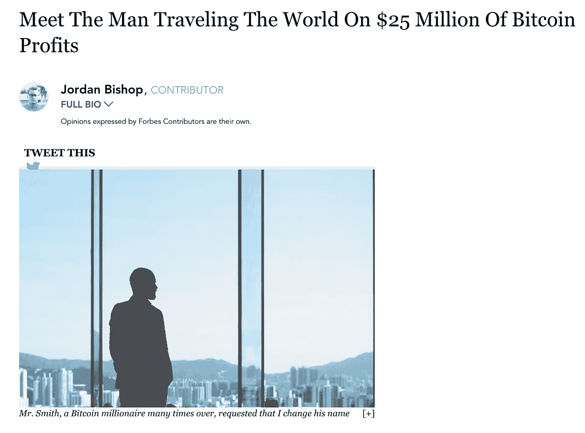
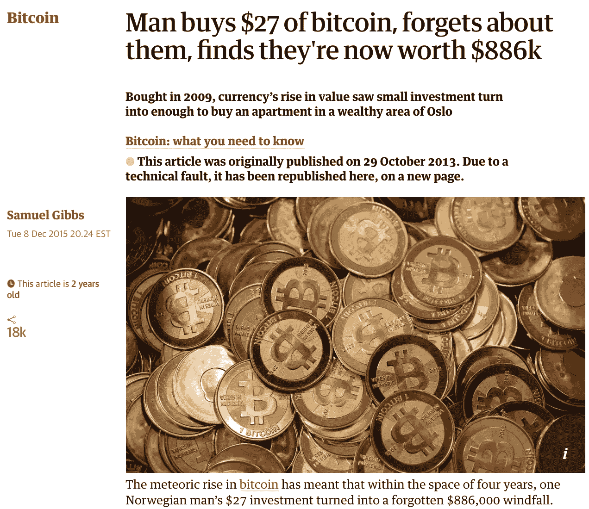
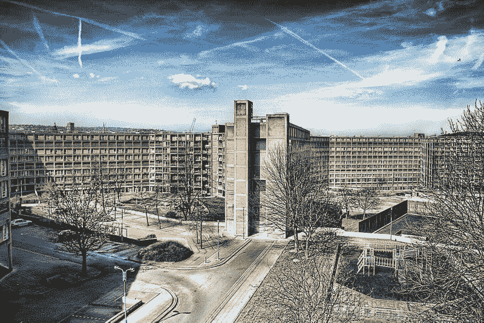

# 反密码百万富翁

> 原文：<https://medium.com/hackernoon/the-anti-cryptomillionaire-fcb554ec03d5>

随着 2017 年加密市场的繁荣，你最有可能听说过的典型比特币百万富翁故事可能分为以下两类:

1.  他们持有多年前购买的比特币。

[https://www.forbes.com/sites/bishopjordan/2017/07/07/bitcoin-millionaire/#71402bad6261](https://www.forbes.com/sites/bishopjordan/2017/07/07/bitcoin-millionaire/#71402bad6261)

2.他们忘记了自己拥有的比特币，并找回了它。

[https://www.theguardian.com/technology/2015/dec/09/bitcoin-forgotten-currency-norway-oslo-home](https://www.theguardian.com/technology/2015/dec/09/bitcoin-forgotten-currency-norway-oslo-home)

但是今天，我要和你分享一个不同类型的秘密百万富翁的故事。他的成功不仅仅是“拥抱”或遗忘。一个他们赢得成功的地方。

# 非典型开端

我们的故事从一个名叫比利的男孩开始，他出生在英国最贫穷的地区之一。当别人支付账单时，比利的妈妈支付电费和煤气费。

Council Housing- Subsidized housing by the city for low income families in the UK. This is a random photo taken from [wikimedia](https://commons.wikimedia.org/wiki/File:Park_Hill,_half-abandoned_council_housing_estate,_Sheffield,_England.jpg).

当其他父母去工作的时候，他的妈妈挣扎着活下去。在与癌症、吸烟导致的慢性阻塞性肺病(COPD)、甲状腺问题甚至抑郁症的斗争中，他们两人努力实现收支平衡，不得不经常在支付租金、购买食物或放弃热水与他们从残疾补助中获得的收入之间做出决定。

正是在这种背景下，我们这位非典型的密码百万富翁在 7 岁时，他的祖父给了他一张 Kubuntu Linux CD，以及一台配备奔腾 4 和 2g DDR2 RAM 的旧戴尔 Inspiron 台式机。通过这种过时的配对，Billy 对 Linux 和编码的迷恋被点燃了，他在互联网上搜寻技巧，使这台几乎不可用的计算机发挥作用。

正是这个关键时刻改变了比利的人生轨迹。比利没有跟随家人的脚步在工厂工作或当接待员，而是开始走上了一条最终将使他成为一名秘密百万富翁的道路。

问:你第一次听说加密货币是什么时候？

答:2011 年的某个时候，我决定要在网上赚钱。我从浏览各种“点击付费”网站、调查网站、流量付费网站等开始。

问题是，由于我还未成年(当时大概 14 岁)，要让 AlertPay(现在的 Payza)或 PayPal 这样的公司在不输入虚假信息的情况下收到钱是不可能的。这导致了我的资金随时可能(并且已经)被没收的问题，仅仅是因为这个世界的支付系统歧视未成年人。

后来我发现了比特币。我很高兴终于有了一个系统，我可以收到付款，而不会有支付提供商仅仅因为我未成年就把我拒之门外的风险。

然后，我花了很多时间清理比特币的水龙头，并为当时的两种主要货币比特币和命名币开发了一些应用程序。我很高兴终于为一个没有歧视我的支付平台做了些工作。这就是我热爱加密货币的原因，因为它不在乎我的年龄。

**问:Lol yea 水龙头在早期是比特币的命脉。现在没那么多了。你曾经决定购买任何东西吗？**

a:我以前从未通过菲亚特购买过密码货币。我现在拥有的每一枚硬币都是我赚来的，除了我用其他密码货币购买的那几枚(例如，比特币->litecoin)

**问:那么，当你说“赚”的时候，是否包括矿业？或者只是水龙头？**

我已经开采了一段时间了。有趣的故事——我的箱子里有一些便宜的 PSU。当我第一次开始采矿时(我有一台 AMD HD6870)，我的 PSU 被错误地贴上了 500 瓦的标签。在挖掘比特币大约一天后，我的 PSU 起火并关闭了。谢天谢地，我爷爷好心给我买了一辆新 PSU。

我不确定在那次事件之后我开采了多少，我想我害怕第二次烧掉我的 GPU 或 PSU，在那之后我没有开采多少。

**问:好的，最后一个问题。2017 年，你成了百万富翁。这个过程是什么样的？持有多少？它赚了多少钱？**

答:2016 年初，我有大约 2 万美元分散在比特币和 lite 币中。它主要是从捐款和小型发展项目中积累起来的，我是靠这些项目获得报酬的。

2016 年年中，我加入了 Steemit，这是一个运行在 STEEM 上的社交媒体平台。我为 Steem 做了一些开源项目，也发布了一些帖子，这让我在一周内赚了超过 1 万美元。这是我从这样的小项目中得到的最多的钱。

在加入 Steemit 后的几周内，我开始成为 STEEM 的见证人(有点像采矿，但你会被选入)。开始时，我只挣几便士，但随着地位的提高，我慢慢挣得更多。已经花了一年多的时间，但我现在是每月收入超过 1 万美元的高级证人。我也继续定期发帖寻求额外收入。

2017 年初(当时我 20 岁)，我在 STEEM、Litecoin 和 Bitcoin 有大约 30 万美元的资金。其中很大一部分主要来自于我从早期开发项目中获得的比特币和 Litecoin 支付/捐赠。但另一个重要部分是通过我作为 STEEM 证人的帖子和报酬获得的。

终于在 2018 年 1 月 2 日，21 岁的我检查了我的密码文件夹，发现我的总净值超过了 100 万美元。

老实说，我过着非常简朴的生活，每月花销一般不超过 600 美元。这有助于维持和增加我的密码持有量。我也不会把钱花在像兰博基尼或其他“富人的东西”之类的疯狂的事情上，但我真的不需要那种东西。

比利的故事体现了许多人希望区块链科技能带来的财富再分配的理想化承诺。没有密码货币，他就不会有现在这样的财务和赚钱机会。然而，比特币给了他不受审查的付款自由，并把他介绍给了支持他的区块链社区。

正是在比利生活的这一细节中，我们可以区分出当今加密货币状态的一个关键特征:有人可以仅仅通过区块链经济赚钱，甚至茁壮成长。

现实地说，区块链生态系统是否是一种可行的经济模式，人们可以仅靠赚取和消费加密货币来生活，这仍有待确定。但是如果说我们能从这个反加密的亿万富翁的生活中学到什么的话，那就是永远不要低估抵制审查的钱的价值，永远不要把失败者排除在外。

比利是个笔名。

# 记得给我左边的掌声，下面的捐款，和你的朋友分享！直到下一次，向前和向上。😁

**捐款地址**

LTC:lgghrsbyhs 93 gkttbmehlzth 3 xdau 3 tcsz

BTC:3 hfcmjr 6 xqksfmu 7 wcpzrzjvvgwrdf 7 qzd(seg wit 地址。接受传统和 Segwit 链)