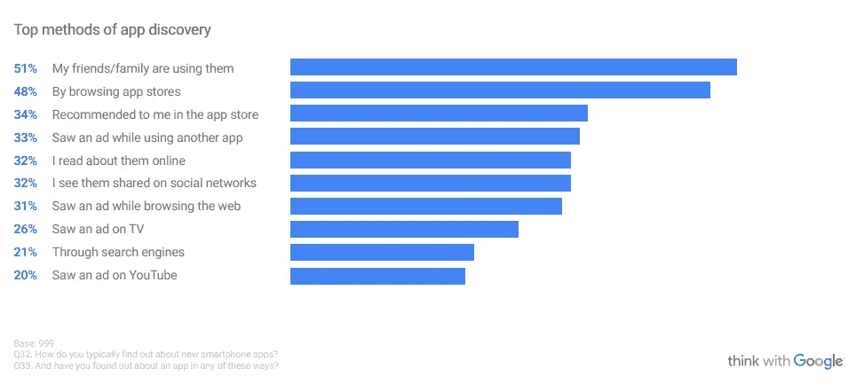
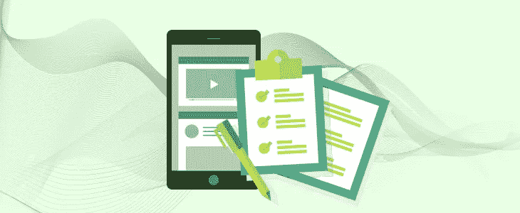

# 适用于您业务应用的应用商店优化清单

> 原文：<https://medium.com/hackernoon/the-app-store-optimization-checklist-for-your-business-apps-64e4f813227e>

对于任何企业来说，一个直观且吸引用户的移动应用都是他们的王牌。这些应用扩大了市场覆盖面，对每个用户都有魔力。

到今天为止，SayOne 已经在[应用开发](https://www.sayonetech.com/services/application-development/)联盟呆了 7 年。我们已经开发了 300 多个搜索引擎优化友好的网络和移动应用，包括谷歌 Play 商店和应用商店。

但每当有客户向我们提出移动应用需求时，他们的第一个问题就是‘我们的商务应用如何才能在 App Store 或 Play Store 的 200 万应用中脱颖而出？’。

而我们的答案是‘应用商店优化或 ASO’。

# 面向商业应用的应用商店优化(ASO)

几个月前，谷歌进行了一项调查，以了解移动用户从发现新应用程序到使用或放弃它的旅程。这些是结果:

*来源:谷歌——用户如何发现、使用和保持对应用的关注*

从上图可以看出，最常用的方法之一是浏览应用商店。48%的参与者表示，他们根据需要手动搜索应用程序。再次强调，Forrester 报告表明，63%的应用是通过应用商店搜索发现的。

除了 Google 和 Bing，还有一个全新的领域需要你的应用程序的可见性。如果你认为创建一个多功能的应用程序和超越提交指南是唯一的障碍，那么你错了。除非你为搜索结果优化你的应用程序，否则你的应用程序不会得到正确的受众。

你越优化应用，它就越快出现。应用程序商店优化是一种营销技巧，用于提高应用程序在各个应用程序商店中的可见性。

App Store 优化已经发展成为一个与为商业应用寻找合适的移动开发合作伙伴或技术平台同样重要的步骤。除非对可见性进行了优化，否则拥有一个优秀的应用程序是行不通的。

# 应用商店优化技术给你带来的好处

每年有数百万的应用程序被推送到应用商店，应用商店优化是你脱颖而出的提示。

ASO 为像您这样的企业提供了许多好处，例如:

*   在应用商店中的高排名。
*   提高品牌认知度和知名度。
*   更多的应用程序页面访问和下载次数。
*   更积极的评论和评级的可能性。
*   提高用户参与度和保留率。
*   用户获取成本低。

# App Store 优化清单

这里我们不打算深入复杂的 SEO 细节。让我们保持它的基本性，以便您可以在发布应用程序之前使用它作为检查清单。此外，您可以与您的移动开发合作伙伴保持同步，并在每个步骤完成时从您的盘子中划掉一些东西。

# 关键词

确定您希望您的应用程序出现在搜索结果中的[关键词](https://developer.apple.com/app-store/search/)。获得正确的关键词是为正确的受众优化你的应用的第一步。当您选择关键字时，请确保它符合您的应用目的，并且与您的用户相关。

# 应用名称

选择一个能表达你的应用目标的应用名称。然而，我们不是在谈论诸如“音乐应用”或“如何组织你的一周”之类的名称。相反，应用程序的名字应该简洁、有意义、简单。

# 小标题

这是您的应用程序名称下的一个吸引人的短语。简而言之，一行 30 个字符传达了你的应用的核心价值。尽量在副标题中包含关键词，但不要太长。

# 描述

虽然描述部分对 SEO 和排名的影响较小，但以有意义的方式简要介绍你的应用程序是很重要的。类似于在网站上看到的元描述，应用程序页面中的描述让用户了解应用程序的特性和功能。

被删节的代码片段是放置你的应用程序推介并迫使用户下载你的应用程序的最佳部分。所以，把你的主要卖点放在那里，说明为什么他们应该下载你的应用。

# 类别和外观

将你的应用放在正确的类别中会有很大的不同。它帮助潜在用户搜索和过滤应用程序。选择最适合你的应用目标和类型的主要类别。

你在应用商店展示应用的方式也会对其可见性和下载量产生巨大影响。添加最好的应用程序预览视频和截图，向您的潜在客户展示他们想要什么。

# 评论和评级

如果你选择有竞争力的关键词，那么下载量和评分肯定会对你的排名产生影响。随着越来越多的竞争对手争夺所选择的关键词，搜索算法会在第一页挑选出评分和下载量较高的关键词。

虽然这部分不完全掌握在你手里，但是你可以想办法在其他平台上推广你的 app，增加它的触及面。如果你的应用程序具有坚如磐石的特性，那么它无疑会获得你的客户的移动存储空间！

# 结论

你的优化策略并不仅限于以上几点。这些只是入门的基础。这场比赛比你想象的更加激烈。

定期更新您的应用程序，并推广应用程序内购买以获得更多机会。找到一个移动应用程序开发合作伙伴，他知道如何从应用程序开发的一开始就考虑 ASO。然后，你就不会因为沉迷于错综复杂而伤透了脑筋。在 SayOne，我们长期以来一直在协助客户进行应用商店优化。我们可以自豪地说，我们的许多应用程序从出现之日起就在应用商店中处于领先地位。

如果你还没有优化你的移动应用，那么你就错过了一大部分潜在客户！

*最初发布于*[*https://www . sayone tech . com/blog/App-store-optimization-check list-for-business-apps/*](https://www.sayonetech.com/blog/App-store-optimization-checklist-for-business-apps/)*。*