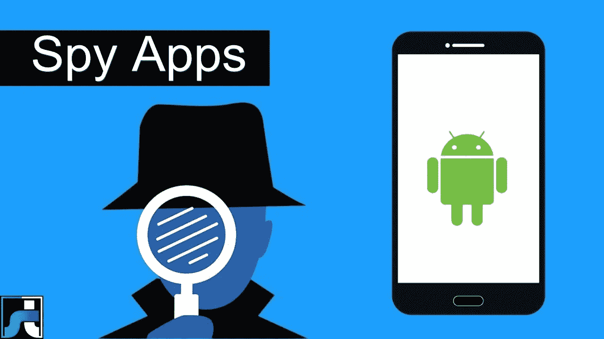

# 该应用程序的好处是可以在家里和工作场所秘密间谍

> 原文：<https://medium.com/hackernoon/the-apps-benefits-that-can-secretly-spy-at-home-and-work-premises-8c3dd96fb812>

在一个充满技术的世界里，手机已经发展到了下一个终极水平。随着这一点，可疑活动的比率也增加了，造成了世界各地的浩劫。因此，为了解决这类问题，手机间谍软件开始流行起来。与他们第一次出现相比，他们的需求每天都在以[的速度增长。](https://hackernoon.com/tagged/increasing)

嗯，这些间谍应用程序在 2018 年变得流行有很多原因。渴望了解手机间谍 app 上的全部洞见？让我们希望进入主题，发现一些重要的信息。

**介绍间谍软件及其绝妙的好处**

从基础开始，每当我们听到“间谍”这个词，它经常给人一种负面的感觉。此外，我们会产生不信任感、怀疑感，谎言的想法确实会在我们的大脑中形成。但是，这绝对不是开发间谍软件的主要原因。

嗯，创建一个间谍手机应用程序的主要目的是监视用户的活动。此外，您甚至可以跟踪他/她的自我，并保持一定程度的安全。

如果我们谈论庞大的公司世界，就很难跟踪员工的活动。在这里，公司希望确保他们的员工在工作，而不是放松。有不同的报告显示，员工下班后会放松一下自己的活动。
因此，在这种情况下，间谍手机应用程序可以提供帮助。使用一个好的间谍应用程序，公司可以有效地跟踪员工的活动。
稍微深入一点，间谍应用程序对从事货运业务的人来说可能很有用。在这种情况下，司机有责任选择正确的运输路线。因此，它将推动整个卡车运输业务达到全新的成功和荣耀水平。

对于看起来比较焦虑和担心的家长来说，[一款手机间谍 app 是必备工具](http://blogs.christianpost.com/nauti-nati-blog/top-9-parenting-apps-that-actually-made-their-life-easier-29522/)。作为孩子，我们真的没有太多的大脑，可能会突然掉进一个错误的陷阱。在这些事情下，强盗可以绑架孩子，吸毒和强奸可能是一些严重的案件。更多的时候，我们告诉孩子“不要和陌生人说话”，但事情并不像我们经常喜欢的那样。

无论哪种情况，你都可能在街上看到一个罪犯试图从你那里抢东西。在这种情况下，您可以激活间谍应用程序，并让罪犯为此付出代价。对于女性来说，间谍应用程序可以带来一些很大的优势。我们不时看到妇女被强奸，这使她们崩溃。万一，如果每个女人都有一个间谍 app，她就可以确定自己的安全，可以放心地走路了。

**手机间谍追踪应用的特点**

现在是 2018 年，应用行业充斥着不同的间谍应用。虽然有些应用程序在各个方面都很棒，但有些可能会破坏气氛。如果你仔细观察每一个间谍软件，并不是所有的都有一个基本的界面。他们中的大多数都拥有外行人无法理解的复杂功能。
但是，如果你谈论一个好的移动间谍，有更好的事情你可以考虑。是的，在庞大的功能列表中，一个好的间谍应用程序将具有以下功能:

 **实时控制面板在这里，您可以高效、轻松地实时管理每一件事。**

****·实时监控****

**使用一个好的间谍软件可以让你实时监控你爱人的位置**

****·个人电话活动的可见性****

**在任何情况下，如果你发现需要查看其他人的电话活动，间谍应用程序可以在这种情况下帮助你。使用一个伟大的间谍应用程序，您可以有效地监控，查看其他人的手机活动，轻松自如。**

**除了上述功能，还有一大堆功能等着你。但是，问题是你必须始终选择一个好的公司移动间谍应用程序。

**收拾东西****

**所以你走吧。嗯，选择一个最好的移动间谍应用程序似乎是一项非常困难的任务。在选择一个人之前，有很多事情需要考虑。但是，除此之外，这些应用程序提供了大量的好处。在这个混乱和犯罪的世界里，你可以最早使用最好的手机间谍 app。企业界！移动间谍应用程序必须成为你的所有时间的追踪者。**

**此外，如果你想使用任何间谍应用程序，通过不同的[手机间谍](https://www.toptrackingapps.com/)应用程序审查是至关重要的。这样，你可以获得更好的知识，可以毫无问题地选择最好的应用程序。**

**最终，在使用了最好的移动间谍之后，你会感受到你整体生活方式的不同。结果？你会感到自信、无所畏惧，并能塑造你的孩子，让他们拥有更美好、更繁荣的明天。**