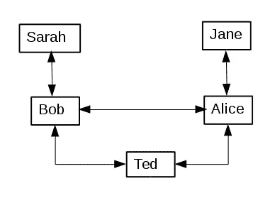

# 地下建筑:为隐私而建的社交网络

> 原文：<https://medium.com/hackernoon/the-architecture-of-nderground-www-nderground-net-a-social-network-built-for-privacy-cbd19c9d64e8>

# 地下建筑的设计理念

> 社交媒体的蜜月期已经结束。对那些会失去任何东西的人来说没有任何好处。
> [社交媒体对唐纳德·格洛弗来说已经死了，Action Bronson 和伊吉·阿德利亚](/cuepoint/social-media-is-dead-to-donald-glover-and-action-bronson-bf3d59de68f2)Paul Cantor，Medium，2015 年 2 月 25 日

人类是群居动物。我们渴望得到他人的联系、认可和关爱。像脸书这样的社交网络旨在将我们对人际关系的渴望货币化。事实上，社交网络被设计成将我们对联系的渴望变成一种强迫。

支付社交网络访问的货币是我们的个人信息，这些信息成为复杂软件分析的输入，这些软件分析将这些信息作为各种广告商的素材。

社交网络上呈现的生活形象通常是完美生活、人际关系和美食的合成虚假形象。学术研究表明，当用户将他们的实际生活与他们在社交网络上看到的精心策划的生活进行比较时，人们在看社交网络帖子时会感觉更糟。

地下世界是一个为隐私而设计的社交网络。贴在地下的东西在网上是看不到的。贴在地下的文字和照片只能被一群精选的朋友和家人看到。地下世界被设计成一个更真实的环境。

> 截至目前，我在脸书的所有信息都是由图片、评论、生活事件和更多我从未听说过的人组成的——几乎都是我从未听说过或见过的人。这似乎是一个实验，我的所有帖子都是由我不认识但我的脸书朋友喜欢或评论过的人发布的。
> 
> 糟透了。但更重要的是，这让我大开眼界，也让我感到有些不安和不快。萨特说，地狱是别人的；实际上，它是你不认识的人的生活事件。
> [乔希·马歇尔，谈话要点备忘录](https://talkingpointsmemo.com/edblog/facebook-in-hell)，2015 年 7 月 1 日

在脸书，一个常见的(也是令人不安的)经历是，你发表了一条针对朋友的评论，却被朋友社交圈里的陌生人打包了。在最糟糕的情况下，一个不小心的评论可能会被陌生人发现，传播开来，给你的生活带来混乱。

地下的帖子和照片只能在你的社交圈里看到。我们称这个社交圈为*卡拉斯*，这个术语来自库尔特·冯内古特的小说*猫的摇篮*。除非他们也是你的朋友，否则你朋友的朋友永远不会看到你在地下发布的任何内容。

# 卡拉斯与地下隐私

在地下，卡拉斯是你生活中的一部分。你的朋友，你的家人或者任何你想邀请进入你的地下世界的人。您在地下发布的内容只有您的卡拉斯在登录地下后才能看到。

在下图中，鲍勃、爱丽丝和泰德在同一个卡拉斯。他们都可以看到他们每个人在地下张贴的材料。

莎拉在鲍勃的《卡拉斯》中，但不在爱丽丝的《卡拉斯》中，简在爱丽丝的《卡拉斯》中，但不在鲍勃的《》中。这意味着 Bob 和 Sarah 可以看到他们各自张贴的材料，但是 Alice 看不到 Sarah 张贴的任何材料。同样，Jane 在 Alice 的卡拉斯中，可以看到 Alice 发布的内容，但是 Jane 看不到 Bob 或 ted 发布的任何内容。

# 地下工程目标

## 安全性和隐私

地下社交网络的核心是隐私。为了保护隐私，nderground 必须是一个“硬目标”web 应用程序，使用最新的 web 安全功能。

## 可量测性

nderground 旨在支持成千上万的用户。当用户在地下提出要求时，应该平稳地添加资源来处理负载。

## 费用

nderground 是一家 bootstrap 创业公司。没有风险投资资金可以烧钱。地下工程的创始人支付所有的费用，所以尽可能降低成本的设计是很重要的。

# 地下董事会和照片画廊

*The nderground board for one of the test accounts*

*The nderground photo galleries for the authors nderground account*

地下世界的两个基本特征是属于地下世界用户的图板和图片库。该板允许地下用户张贴文字和照片。用户卡拉斯的其他成员可以看到并评论论坛帖子。地下用户也可以访问他们的卡拉斯成员的董事会，并发表帖子或评论。

一些社交网络用户喜欢通过张贴照片来与他们的社区互动，也许还附有简短的说明。地下世界支持命名图片库，允许地下世界用户发布他们想要与他们的卡拉斯共享的照片。

# 亚马逊网络服务的地下世界

利用亚马逊网络服务的机会让 nderground 以更低的成本更快地为用户做好准备。地下世界使用的所有服务都是“零维护”的，这样就可以将时间集中在开发地下世界上，而不是维护网络和数据库服务器。

下图概述了地下组织使用的自动气象站服务。

## 路由 53 DNS 解析

满足 Web 请求的第一步是域名服务(DNS)解析，它将域名(如 nderground.net)映射到实际的 IP 地址。Route 53 服务使得为 AWS 上托管的域设置 DNS 解析变得容易。

## 弹性豆茎

Elastic Beanstalk 是一个负载平衡的 web 服务器环境。可以配置一个或多个 web 服务器来运行 web 应用程序。随着需求的增加，Elastic Beanstalk 将增加额外的 web 服务器来处理负载。当需求再次下降时，分配来处理需求的 web 服务器将会缩减。

是一个 Java 虚拟机(JVM) web 应用程序。为了运行 nderground，Elastic Beanstalk 被配置为运行 [Apache Tomcat](http://tomcat.apache.org/) JVM 应用程序 web 服务器。AWS 提供了最新版本的 Apache Tomcat 和 JVM 环境。升级到新版本只需点击一个按钮。

## 弹性计算云(EC2) Linux 实例

当为 web 应用程序配置了 Elastic Beanstalk 环境时，会选择一个或多个 EC2 实例。在 Tomcat 应用服务器的情况下，这些实例将运行 Amazon 版本的 Linux。为了省钱，亚马逊可以购买[预约实例](https://aws.amazon.com/ec2/pricing/reserved-instances/)。这些实例将自动用于弹性 Beanstalk 配置中。

与任何 EC2 Linux 实例一样，用户可以使用 ssh 登录并检查 web 日志，这在跟踪与执行相关的问题时非常有用。

## RDS/Postgres

亚马逊的[关系数据库服务(RDS)](https://aws.amazon.com/rds/) 提供“托管的”(例如，零维护)数据库实例。在交易更新很重要的情况下，nderground 使用 RDS/Postgres 数据库存储关键信息。这包括地下加密的登录信息和卡拉斯会员信息。

Postgres 数据库很少使用，因为它只包含相对少量的关键信息。尽管数据库很少使用，但必须分配一个 24/7 运行的 RDS 服务器。

2017 年 11 月，亚马逊宣布了[无服务器极光服务](https://aws.amazon.com/blogs/aws/in-the-works-amazon-aurora-serverless/)。Aurora 是亚马逊的可扩展关系数据库。Aurora 同时支持 MySQL 和 Postgres 版本。MySQL 版本的 Aurora 于 2018 年初上市。Postgres 版本计划于 2018 年下半年推出。

对于像 nderground 这样需要相对低频率访问关系数据库的 web 应用程序来说，Severless Aurora 是一个非常有吸引力的服务。无服务器的 Aurora 应该会大大降低关系数据库服务的成本。

在未来，目前由 nderground 使用的保留 RDS/Postgres 实例可能会被无服务器 Aurora 所取代。Topstone 软件咨询公司也将在未来的 web 应用程序中使用这种无服务器的 Aurora。

## 简单存储服务(S3)

S3 是亚马逊高度可靠的网络存储服务。可以通过类似于存储路径的目录(例如，“我的目录/照片/我的照片. jpg”)来逻辑地引用在 S3 存储的照片和文本。每个地下用户被分配一个随机命名的顶层“目录”,该目录存储他们在地下存储的图像和文本。随机顶级“目录”名称用于使 S3 访问更有效，因为 S3 引用将随机分布。

## DynamoDB

DynamoDB 是亚马逊的“NoSQL”服务。DynamoDB 是 nderground 使用的核心数据库服务。DynamoDB 存储地下论坛帖子、论坛帖子上的线程评论、照片元数据和“内务管理”信息，如地下 IP 访问跟踪(出于安全目的维护该信息，以帮助识别地下帐户泄露)。

精心设计的 DynamoDB 表和键可以支持非常快速和廉价的 DynamoDB 访问。DynamoDB 的成本是基于查询的。与 RDS/Postgres 服务不同，在不使用 DynamoDB 时是没有成本的。

DynamoDB 不仅是一项极具吸引力的地下服务，也可以用于其他 Topstone 软件咨询移动和网络应用程序。

## 希腊字母的第 11 个

创建下载到地下的照片的缩略图和缩放版本是一项内存和计算密集型操作。在 Lambda 可用之前，nderground 配置了额外的 EC2 资源，以避免通过弹性 Beanstalk 伸缩添加新的 EC2 实例时的延迟。当 Lambda 可用时，照片处理转移到 Lambda，可以快速扩展。这使得 nderground 可以使用更少的预分配 EC2 资源运行。

Lambda 服务附带了[自由层“处理](https://aws.amazon.com/lambda/pricing/)。这包括 100 万个请求和 3，200，00 秒的处理时间。这是 37 天的连续处理时间。这意味着对于地下，λ处理本质上是免费的。

关于 Lambda 照片处理的讨论可以在【Topstone 软件出版物中找到。

## 简单电子邮件服务

地下世界为各种活动生成电子邮件，包括邀请地下世界和通知卡拉斯成员关于董事会和画廊的帖子。SES 是一种托管电子邮件服务，允许在不配置电子邮件服务器的情况下发送电子邮件。

和 Amazon Lambda 一样，SES 的价格对 nderground 来说极具吸引力。目前，亚马逊 EC2 应用程序每月发送的前 62，000 封电子邮件是免费的。额外邮件 0.10 美元/1000。这意味着，即使大量使用地下资源，电子邮件服务的成本也将远远低于部署电子邮件服务器的成本。

*这篇文章的早期版本最初发表在* [*托普斯通软件*](http://www.topstonesoftware.com) *的网页上。*