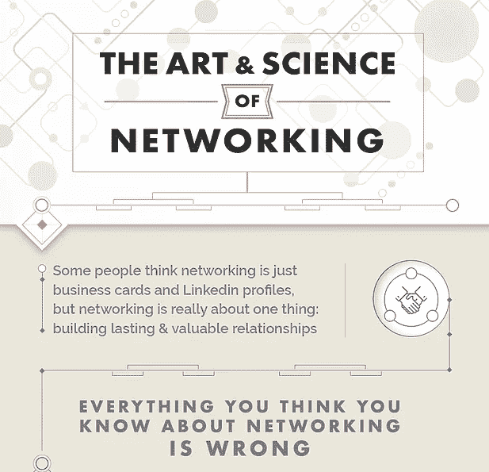
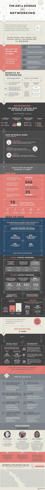

# 入侵你的网络的艺术和科学

> 原文：<https://medium.com/hackernoon/the-art-and-science-of-hacking-your-network-e3d8cd9b14ed>

许多人认为网络只是交换名片，然后就到此为止，但网络的核心其实是建立关系。人类本质上是社会性动物，这种天生的社会性本能渗透到我们的职业生活中。建立持久而有价值的职业关系与建立个人关系一样有益，此外还有独特的职业发展机会。

你所知道的关于网络的一切可能都是错的。通常被认为仅仅是获得工作或客户的工具，网络不仅仅是握手和新的 Linkedin 联系。聪明的专业人士知道社交技能的价值，并善用这些技能。商业领袖使用网络来发展与各个层面的员工的关系，科学家使用网络作为进入研究资助领域的一种方式，甚至音乐家和音乐制作人也使用网络来建立重要的行业联系。

我们通常只从专业角度考虑人际关系，但事实是我们每天都在交往。看看这张来自 Networkwise 的[信息图，了解更多关于人际交往的艺术和科学，建立和管理新的联系，并最大限度地利用你的人际交往技能。](https://www.networkwise.com/art-science-networking)

image credit: [NetWorkWise](https://www.networkwise.com/art-science-networking)