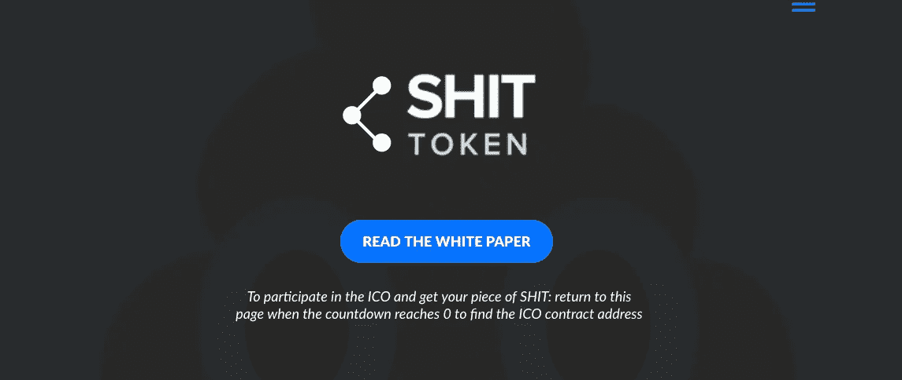

# 躲避加密货币骗子的艺术

> 原文：<https://medium.com/hackernoon/the-art-of-dodging-cryptocurrency-scammers-9863c3b91ad0>

## 在一个硬币市场上限列出了 2000 多种代币的世界中发现“诈骗硬币”。

不幸的是，随着我在加密货币上越来越多的时间，我越来越擅长识别骗局。世界正以惊人的速度前进。当我们看到智能手机等技术的进步，惊叹于我们的进步时，我们在其他领域也取得了进步。

比如**骗子**。

What I imagine scammers look like in person.

我们都知道他们，无论是在 Vitalk Buterin 说的每一句话下发送垃圾推文的以太坊免费机器人，还是那些突然出现在你的电报中要求与管理员交谈的奇怪友好的人——如果你在这个行业，你可能会遇到一两个骗子。

很像智能手机，*骗子技术*已经取得了令人印象深刻的飞跃。当电子邮件被发明的时候，没过多久，尼日利亚的王子们就不顾一切地向我们寻求帮助。当加密货币(一种数字形式的价值)被发明时，它为骗子创造了一些新的选择。

I [made a fake ICO website](http://shittoken.io) during the ICO mania in 2017, it never launched or accepted funds. It’s just how a nerd with too much time pokes fun at something.

# 如何知道加密货币或 ICO 是不是骗局

在深入研究这些之前，有一点需要注意。相信你的直觉；每次我心里想“这可能是个骗局”，结果都是个骗局。如果这看起来像是真的，那就是真的。这个世界上没有免费的钱。

如果你需要另一个理由来学习如何避免骗局，可以这样想——**能够识别骗局是一种逆向识别好项目的方法**。如果它朝着诈骗硬币的相反方向移动，它可能只是一个体面的硬币。

> “在考虑加密货币(代币和硬币)时，重要的是要超越宣传。无视价格谈判，谣言和其他毫无根据的信息。相反，看看加密货币的核心；基本面。代币/硬币当前是否被使用和被需求，它是否被集中(如果是，是什么阻止了发行者/控制者的恶意活动？这个团队声誉好吗？)，是技术本身和记号化思想强大，还是区块链只是被贴上了一个流行语？这些是你需要问自己的一些问题，不仅要发现骗局，还要发现/好的/项目。”— [约阿金·约恩内沃格](https://www.linkedin.com/in/joakimhj/)，联合创始人& CMO @ ERCSwap

## **匿名团队**

不是所有有匿名团队的币都是骗局，但大部分骗局都有匿名团队。顺便说一下，我喜欢比特币和区块链诞生的意识形态基础，我认为团队应该能够保持匿名，除了中情局没有人知道 Satoshi 是谁，比特币是(并且一直是)市场上最大的货币。也就是说，如果我们想要大规模采用，我们需要所有相关方的妥协。

如果一个团队想获得数百万或数亿美元的信任，他们不应该选择匿名。我们想知道我们在信任谁，比起你的真实面孔，相信你的卡通人物形象要难得多。如果“团队”页面看起来像成人游泳节目的阵容，我就退出。

当你确定要投资的加密货币时，最好的做法是对他们的团队进行广泛的尽职调查。对一个匿名的团队进行尽职调查是不可能的。

## 半吊子白皮书

风险投资家不会投资一家在活页纸上有商业计划的初创公司，为什么你会投资一种加密货币，一张看起来像是在几个小时内拼凑起来的白纸？

白皮书不需要有 50 页那么长，但最好是经过深思熟虑的。我需要知道你是谁，你在做什么，为什么这很重要，以及你将如何去做——至少要知道。如果你不能让我相信你已经准备好回答所有这些问题并采取行动，我不想参与你的项目。

如果一家公司根本没有白皮书，那就远离它。这并不意味着这是一个 100%的骗局，但即使这不是一个骗局，你为什么要投资一个不想花时间为他们的项目制定商业计划和技术路线图的团队呢？

## **缺乏透明度**

这主要与首次发行硬币有关，但也超越了 ICO，延伸到公司如何长期经营业务——“长期”是指带着被盗资金退出的时间。

## 缺乏社区

这是一个棘手的问题，因为不幸的是，骗子真的很擅长建立社区。人们很容易对白日梦感到兴奋，因为它只是一个白日梦。如果看起来不可行，那很可能就是不可行。与容易理解的事物相比，围绕一个几乎无法理解的事物更容易激起人们的兴奋。如果有人能理解，那么什么是革命性的，对不对？

不，如果它很容易理解，那么创始人在精心制作他们的信息和通信方面做得很好。如果你不了解一个基于 AI 的交易平台是如何使用 AI 的，可能他们自己也还没搞清楚。

## 我错过了什么吗？

如果你对空间里躲避骗子有什么想法，请在下面留言评论！很高兴在文章中加入你的想法。

*保持安全，*

*礼萨*