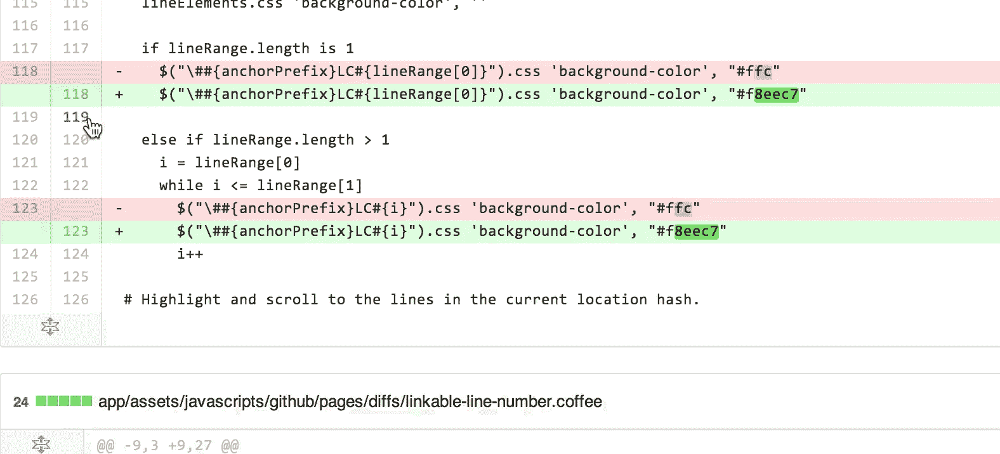
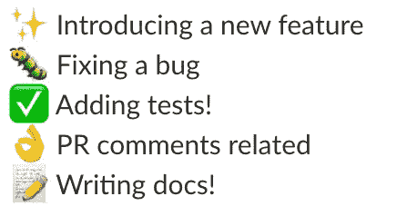

# 人性化拉式请求(PR)的艺术

> 原文：<https://medium.com/hackernoon/the-art-of-humanizing-pull-requests-prs-b520588eb345>

## 什么是公关，如何有效地创建公关，如何对公关提供反馈，以及如何回应反馈

# 什么是拉动式请求(PR)？

这是一个改变存储库中代码的请求。一旦你在代码中做了你需要的修改，你提交一个 PR。一旦提交，感兴趣的各方将执行代码审查，并向您提供任何反馈/所需的更改。

团队*通常使用拉请求进行共享协作和特性工作或错误修复。*这个想法是为了确保写得好且没有错误的代码被推送到存储库。这是开发高质量代码的一种方式。

# 如何创建拉式请求

## 分解你的故事/特写

在你开始写一个故事/专题之前，**记下/写下你想如何把它分成几个更小的公关。这不仅有助于你的评价者，也有助于你跟踪自己的进步并获得频繁的反馈。另一个好处是，由于代码库与其他开发人员共享，恢复更改变得容易得多。因此，试着把你的公关范围控制在一个单独的问题上，同时把它分解开来。**

例如，假设您正在实现一个待办事项列表，并有以下故事:

> 作为用户，我可以分别在列表中添加和删除项目

我会把它分解为:

> 在页面上添加一个文本框和一个添加按钮。
> **PR #2:** 点击添加按钮将项目添加到列表中
> **PR #3:** 点击列表项目上的删除按钮将项目从列表中删除

你会得到评论者的祝福🙏因为这样做。想象一下，如果你的同事爆了一个巨大的 PR，你不会想回顾吧？🙈

## 在你的简历上添加评论

How to add a code comment

无论你做了什么不同的事情，通常，这是一个好主意🔗[在行号](https://help.github.com/articles/commenting-on-a-pull-request/)上添加注释，解释你为什么这么做。如果你不完全确定你的代码，你应该在那些对代码最有背景的人身上加上“@”来获得一些反馈。举个例子，

> 你使用了库`L[odash](https://lodash.com/docs/4.17.10)`中一个名为`isNan`的新函数，这个函数在代码库中可能不会经常使用，你可能想在那里添加一个注释`this function basically checks if the value is Nan and returns a boolean`。

这对你的评审者很有帮助，因为这节省了他们的时间(也就是说，如果他们还不知道这个功能是干什么的)。

## 添加截图/gif

截图和 gif 是你提交的代码工作的证明！这增加了被接受的可能性，也让你的评审者看到你已经实现了什么。虽然当你的代码比截图能捕捉到的更多的时候，截图肯定是有用的，创建一个 gif。通过使用 gif，你可以点击显示你的公关所涉及的一切。我最喜欢的是: [Licecap](https://www.cockos.com/licecap/) 🔗

## 测试是你代码的文档

每当你做了对你有意义的事情，你想向[未来的](https://hackernoon.com/tagged/future)开发者解释这个复杂的代码，你对这个特别的改变的意图。不要在代码中添加代码注释，问问自己这些问题，如果它很难理解，

*   我能把这段代码分成更小的函数吗？
*   我能把这个函数重命名为更明显的名字吗？如果你愿意，可以向你的团队征求函数名的建议。
*   我怎样才能进一步简化我的代码，这样我就不会说它复杂了？

不管你选择什么，你都应该写一个测试。🔥

你的测试是为了测试你的逻辑，同时也是你代码的文档。尝试添加一个测试来解释你的那部分代码。

# 如何审核拉式请求？

## 感同身受

作为评审者，以礼貌的方式提供反馈非常重要。**你需要记住**你正在检查你的队友的代码，你喜欢和他们聊天，一起出去郊游，吃午餐等等。**他们是人，他们有感情，感情很容易受伤！💥**因此，在你的评估中要更加感同身受。

## 让自己更熟悉代码

永远要养成教学的习惯，不管你认为自己是初级还是高级开发人员。不要告诉他们问题是什么，而是问他们问题，**让他们思考**并使用友好的语气。以下是几个例子:

*   你认为我们可以把它赋给一个变量并在第 9 行重用它吗？
*   我们可以使用我们亲爱的队友 Sarah 已经为我们做了的有用的工具吗？
*   我们能不能把这段代码移到它自己的函数里，这样我们就能写更多的测试了😃？
*   你觉得尝试这个选项怎么样🤔？
*   我不确定我是否理解了整个画面，但是你能解释一下这个函数是做什么的吗？这可能会让他们认为函数名可以被重命名。在他们解释了它的作用之后，接着提出一个建议，例如:

> “我现在明白了，抱歉反应慢了！我不确定，但是你认为我们可以把这个函数重命名为选项 1，选项 2 或者类似的东西，你的想法是什么？

**总是询问他们的想法**因为记住你是一个评审，他们写代码，所以他们可能比你有更多的背景。

想象一下，如果你的同事使用了“不要这样做，只需重命名该功能”之类的话。这听起来太直接了，不太友好，而且**听起来像是你在给他们下命令，而不是听取他们的意见。**

## 总是提供代码改进的建议

而不只是告诉他们，“这个代码可以改进”。向他们提供如何进一步改进的建议/示例，例如，

> 这段代码运行得非常完美，但是在我开始进一步阅读它之后，我想到了另一个想法，我想让你来运行它。我不确定，但是关于什么？
> 样码#1，
> 样码#2
> 你有什么想法？

## 使用表情符号

网上的批评很容易被曲解。因此，表情符号是在线交流的最佳工具之一。使用它们会自动给你的句子增加友好的语气。*当你开始觉得谈话变得太严肃的时候使用* **。但是如果那不是你，那就不要勉强，保持真实。**

## 使其脱机

如果你发现自己在和你的队友的对话中来来回回，对话变得太长而且没有结果，让它离线。当你可以快速接听电话时，花时间打字是没有意义的🤙或者只是走走🚶‍走向他们的办公桌。

*当你面对面时，你会自然而然地产生更多的同理心，并进一步理解他们的观点，或者，他们也理解你的观点*。当你得出结论时，在简历上发表评论，总结你的讨论，这样其他读者就会知道，你未来的自己也会因此感谢你。

## 挑剔的

在审查代码时，您可能会发现一些基本上是吹毛求疵的东西，即它可能不一定会阻止 PR 的批准，但却是需要考虑的东西。*吹毛求疵不重要但技术上正确。*它们可能与语法更正、无意的新行、任何美学、小代码重构等有关。举个例子，

> nit:额外的空白空间
> nit:为了更好的可读性，我们能把这个值赋给一个“常量”吗？

# 如何回应反馈

提交 PR 时适用的规则同样适用于回复 PR。

## 当提供建议时

永远记住你是在合作和写代码。如果有人给你提了一个建议，一定要把它当作改进你的代码的可能性。如果你有不明白的地方，比如要求澄清，

> “您能提供一个例子或者进一步澄清吗？我完全不理解。”

如果你认为反馈是有效的，就实施它！无论变化是大是小，如果你认为反馈是有效的，一定要回复并让评审者知道你采纳了他们的反馈。举个例子，

> 这是一个很好的观点，改变马上就来了！说得好，谢谢你明白这一点。

## 如果你不同意👈

由于不同的开发人员有不同的代码编写方式，分歧是必然会发生的。尽管如此，试着用非常友好的方式表达你的观点。**如果你部分同意他们的观点，那么让他们知道，但也要提供你不同意他们观点的理由。**例如，

> 这是一个伟大的观点。我同意你的第一个建议，我会马上做出改变。完全错过了那个。虽然对于第二个场景，我确实考虑了这个选项，并决定不走这条路线，但是对于下面的场景，我们不想显示它。// **不管你的推理是什么，要诚实。👈**

## 让你的提交信息清晰可见

Gitmoji — commits example

既然你在反馈上花了时间，写一条好的提交信息，让评审知道你确实考虑了他们的反馈，但不要让信息太长。一个非常方便的工具是🔗 [Gitmoj](https://gitmoji.carloscuesta.me/) i。😍它们提供了一种简单的方法，通过查看使用的表情符号来识别提交的目的或意图。

## 更进一步

根据您得到的反馈，您对代码进行了一些修改。现在你的代码处理一个你没有想到或者没有意识到或者可能已经错过的额外场景，但是你有机会**“写一个测试”**。

一旦你的代码被合并，缺陷就被填补了。一旦你修复了这个缺陷，添加一个测试来确保这个缺陷确实被修复了，并且有证据🕵️‍.现在，它被记录下来了！！😃你得到布朗尼🍫如果你更进一步的话。你会自动获得团队的信任

我希望你喜欢阅读这篇文章，并学到了一些东西。如果你有，请给它一个👏此外，请在评论中分享你的个人经验。如果你有任何问题，请随时联系我的推特。

💌如果你觉得这篇文章有帮助，那么你会喜欢我的时事通讯。我每周写一篇时事通讯，内容涉及前端开发、领导力、职业发展、我的内容创作之旅，以及许多我在其他地方不分享的幕后故事。

👉如果您想了解更多或订阅，请访问下面的链接。[https://kulkarniankita.com](https://kulkarniankita.com/)