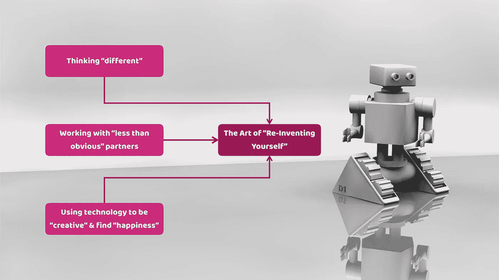

# 自动化世界中“重塑自我”的艺术！

> 原文：<https://medium.com/hackernoon/the-art-of-reinventing-yourself-in-an-automated-world-3188e0d70ec5>

## *为什么每个人都必须掌握这项技能*

Photo by [Benjamin Davies](https://unsplash.com/photos/FiZTaNTj2Ak?utm_source=unsplash&utm_medium=referral&utm_content=creditCopyText) on [Unsplash](https://unsplash.com/search/photos/person-on-beach?utm_source=unsplash&utm_medium=referral&utm_content=creditCopyText)

上周，我写了关于“自学”的重要性。我确定了实现这个目标所必需的六个要素——我称之为**的“6Cs”。**

**这篇文章得到了很多好评。提出了几个额外的“c”(好奇和批评)，还提到了“不学习”的重要性。**

**这个反馈帮助我认识到“自学”是一个更大挑战的一部分:**

> **在一个快速变化的世界中，每个人都需要生活在一个“永久的过渡状态”或“彻底改造”中**

**我们需要不断调整自己，在这个新的技术驱动的世界中抓住机遇，迎接挑战。**

**以自动化和工作的未来为例。**

# ****《工作的未来》****

**整整一年前，我写了一篇参观消费电子工厂的文章。在过去的十年里，劳动力减少了 70%，主要是由于自动化和其他技术的发展。**

**这种“自动化趋势”将会继续。在不久的将来，没有人会再在这样的工厂工作了。一切都将自动化。**

**但是，同样明显的是，新的数字技术也不会放过“知识工作者”。传感器、大数据和“人工智能”解决方案已经在颠覆和取代医学、金融、营销、管理、人力资源和法律领域的专业人士。**

**我经常在开始上课时谈论自动化的“威胁和机遇”。我希望我的学生认识到，他们生活在一个越来越智能的机器世界，这些机器将逐渐取代传统工作的许多方面。**

**然而，与工厂不同，我不相信工人会完全被机器取代。相反，工作本身将被改变，只有人类才能提供的“附加值”将被提高。**

**随着工作需求的变化，适应的需求变得更加迫切。**

**在一个事物永远不变的工作世界里，我们也不能一成不变。我们所有人都需要准备好调整自己，以适应更加多变的环境的要求。**

**那么，我们怎样才能不断地重新发明自己呢？我们需要做什么？**

**以下是“重塑自我”的三个关键想法，它们对我有用，对每个人都有用。**

****

**[Source](https://pixabay.com/en/robot-3d-print-wallpaper-ai-2937861/)**

# ****思维“与众不同”****

**每个人都必须学会“与众不同”地思考。认识到什么已经改变，接受新的现实，然后适应它的能力是“思维不同”的本质**

**这种技能一直是必要的，但在数字化转型的背景下，这种技能从未像现在这样紧迫。想想最近的一些变化，以及它们对未来工作的意义:**

*   **数字技术大大提高了预期寿命和健康水平，提供了比以往更多的机会。**
*   **新的数字技术正以前所未有的速度出现，迫使我们所有人不断获取和采用新技能。**
*   **数字技术使新的组织和经济得以出现。想想“共享经济”、“零工经济”和“平台经济”。每一种“经济”都创造了自己的机遇和挑战。**

**很明显，这些技术不仅仅是逐步改进传统的工作方式。它们改变了一切:“明天的世界”不会与“今天的世界”相似。**

> **“以不同的方式思考”有助于我们认识并抓住新的(通常是未知的)可能性，从而过上更快乐、更健康、更有成效的生活。**

# ****与“不太明显”的合作伙伴一起工作****

**为了理解并充分受益于自动化世界中已经出现(并将出现)的新机遇，我们必须与他人合作。**

**再说一遍，建立和经营伙伴关系对生活的方方面面都至关重要。但是现在，重点更多的是建立“不可能”的伙伴关系和合作，让我们更有创造力。**

**例如，我们在企业界看到这种情况，大公司与在其传统核心业务范围之外经营的“初创公司”结成伙伴关系并收购它们，而没有将它们完全整合的意图。“更聪明”的大公司明白，如果这些初创企业保持自己的身份，它们会更有价值(从财务和战略角度来看)。**

**另一方面，初创企业意识到，通过放弃所有权，他们可以获得更多自由，并对未来产生更大影响。**

**这个想法总是让我想起*腾讯*首席探索官在 2015 年收购洛杉机游戏公司*Riot Games*100%股份后的声明:**“我觉得我们拥有的 *Riot* 越多，他们就越独立。”****

**这种非传统的合作还有很多例子。**

**让我强调一点:我的一个朋友是美国一所法学院的教授，他最近与一名数学教授共同创办了一家区块链初创公司。他们的合作清楚地表明，与“不可能”的合作伙伴一起工作不仅有助于更好地理解自动化，还可以(更重要的是)帮助我们创造新的现实和不同的未来。**

**此外，联系到第一个原则，他们的合作是一个例子，通过“不同的思维”，我们可以成为更好的(也更有趣的)合作伙伴，这将使我们能够更好地释放自动化世界的潜力。**

# ****利用技术“创造”并找到“快乐”****

**在自动化的世界里，这不仅仅是技术本身的问题。**

**技术是帮助我们“完成任务”的工具因此，我们需要不断确保新技术补充我们人类的不足。这意味着技术应该帮助我们变得“更像人类”,过上更健康、更幸福的生活。**

**拿人工智能和工作来说。人工智能有能力消除我们工作生活中不太愉快的方面。人工智能只是数字技术如何增强我们的智能并帮助我们变得更加高效、富有成效和快乐的一个例子。**

**此外，研究和咨询公司 Gartner 预测，到 2020 年，人工智能将创造 230 万个工作岗位(超过最有可能被淘汰的 180 万个工作岗位)。**

** [## Gartner 对 2018 年及以后的顶级战略预测

### 从机器人和人工智能到伪造现实和假新闻，这些预测要求 it 领导者加快其采用速度。在…

www.gartner.com](https://www.gartner.com/smarterwithgartner/gartner-top-strategic-predictions-for-2018-and-beyond/) 

但是，为了找到这些新的工作，我们必须另辟蹊径，建立非传统的伙伴关系。我们还必须利用技术让我们更有创造力。除了技术创新，我们必须关注新技术的潜在破坏性和不太明显的应用。

> 这让我想到了*苹果*最近的主题活动。

这一事件引起了各种不同的反应。我同意，缺乏真正的创新和专注于改进和更新令人沮丧，并使*苹果*看起来只是另一个寻求投资者回报最大化的“公司”。

关于他们的“新”产品令人失望的经历的故事比比皆是。我理解这些故事。我也对最近的产品发布感到失望。

然而，苹果*的某些东西一直吸引我进入他们的生态系统。他们仍然试图通过在技术、设计和激发创造力之间找到正确的平衡来“个性化”他们的产品。*

或许更重要的是，最新的产品发布会表明*苹果正在*专注于利用数字技术应对新的社会挑战，如“健康老龄化”和“个人成长和幸福”

新的 Apple Watch 就是一个明显的例子，表明我们不应该低估这种“新”方法的“颠覆性潜力”。

它不是关于提供创新产品，而是思考现有的创新如何为消费者提供更快乐、更健康和更有生产力的机会。

# **外卖**

新数字技术对经济、社会和文化的影响是前所未有的。然而，清晰地预测我们的数字未来仍然极其困难。因此，*每个人*(包括企业和其他组织，以及个人)都需要存在于一个**的永久过渡状态**

> 坦率地说，我们都需要培养自己的“内在企业家”。

“重新发明”自己的能力成为在今天和明天的社会中生存和发展的一项关键生活技能。

为了找到幸福和满足感，我们都需要掌握重塑自我的艺术。** 

***感谢您的阅读！请按住*👏*下面，还是留下评论吧。***

**每周都有新的故事。因此，如果你关注我，你不会错过我关于数字时代如何改变我们生活和工作方式的最新见解。**