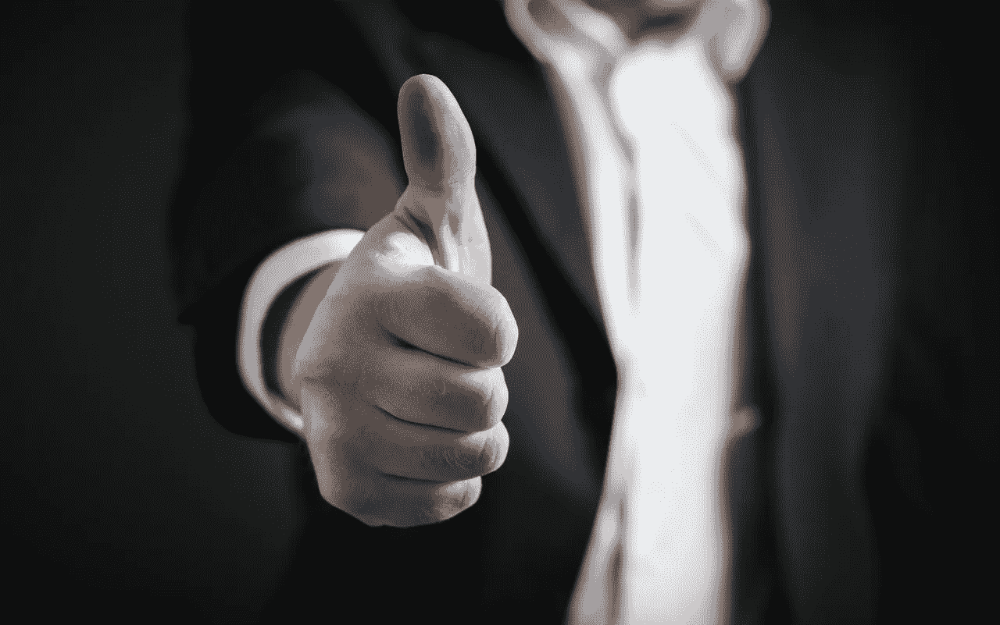

# 自我反省的艺术:通往幸福和成功生活的终极钥匙

> 原文：<https://medium.com/hackernoon/the-art-of-self-reflection-an-ultimate-key-to-a-happier-and-successful-life-3be602aadb1b>

*“你无法把向前看的点点滴滴串联起来；你只能把它们联系起来”——史蒂夫·乔布斯*

那是 2007 年 5 月。我在攻读工商管理硕士学位，并在印度一家主要银行找到了工作。一切都按照计划进行，包括从一所知名大学学习，然后读 MBA，找到一份高薪工作。

奇怪的是，即使在这次壮举之后，我也看不到一丝快乐，甚至成就感。感觉有些不对劲，在内心深处，我知道我并不快乐。

一个晴朗的日子，没有人可以倾诉，我坐下来开始沉思，并在日记中记下我的想法。这一天对我来说不亚于一次顿悟。当我了解到更加快乐和成功的[生活](https://hackernoon.com/tagged/life)——*自我反省的关键时，我意识到了这一点。*

**什么是自我反省？**

简而言之，自我反省是一种行为或过程，在这个过程中，你脱离了这个世界，反省自己的行为、思想、优先事项和成为更好的人的愿望。

对一些人来说，这可能看起来像是一次常规的白日梦，但在我看来，这是了解自己的最佳方式之一。如果正确而有规律地进行，自我反省可以帮助你在职业和个人方面成长，并极大地丰富你的生活。

**为什么自我反省很重要？**

在我们的日常生活中，我们总是在想一些事情或 otherㅡ关系，一个神秘的同事，最近推出的最新产品，如何成为一个更好的儿子，如何获得晋升和…..什么不是？

具有讽刺意味的是，我们把这么多的思想和精力放在了其他事情上，却忘记了把这个概念应用到自己身上。如果我们定期花些时间检查我们的想法、感觉和行为，我们的个人成长只会提升。

有许多非常成功的商人、运动员、世界级的领导者，他们会深入审视自己的想法和行为，以最大限度地发挥自己的潜力。奥普拉·温弗瑞、理查德·布兰森、铁人三项运动员和世界冠军克雷格·亚历山大就是其中几个。

我确信以下几点可以澄清自我反省的重要性:

*   *提供了不同的观点*

通常情况下，事情不会按照计划进行。这就是生活——事情不会总是随你的方便而发生。没有必要自责或浪费时间抄袭。

让我们假设一个项目或活动在工作中不顺利。你会如何处理这种情况？你和你的团队成员将安排一次会议，分析哪里出了问题，下次可以做哪些不同的事情。同样，当生活中发生了一些不太可能的事情时，花一点时间在沉默中反思。我相信一个新的视角和理解会回答你的问题，减少你的担忧。

*   *让你专注于大局*

有时候，我们太专注于微小的细节和错综复杂的事情，以至于忽略了全局。自省的全部目的是看看你现在正在做的事情是否与你的愿景和长期目标同步。

当你自我反省的时候，你是在指导你的大脑优先处理那些实际上会增加价值并提供可靠结果的任务。结果，你把注意力放在了生活中的必需品上，把非必需品从生活中剔除。

*   *提高自我意识*

太多的人没有取得成功，因为他们不知道成功对他们意味着什么。成功，作为一个模糊的术语，与自我意识有关。你越有自知之明，你就越了解自己的优先事项。而且，你知道的越多，就越容易去追逐它们。

美国商人、主题演讲人和《高效人士的 7 个习惯》一书的作者史蒂芬·柯维说:“*自我意识是我们站在自己之外审视自己的思维、动机、历史、剧本、行动、习惯和倾向的能力。”*

*   让你准备好面对你的恐惧

太多的人没有实现他们的梦想，因为他们生活在恐惧之中。这阻止了他们成功和成为更好的自己。

无论是害怕被评价，失败，还是其他什么，自我反省都有助于你承认它，并最终想出处理它的最佳方式。

*   *让你做出深思熟虑的决定*

我们大多数人至少曾经说过或做过一些我们想收回的事情。在盛怒之下，没有预见到后果，让愤怒占据上风，这是人之常情。然而，当你花时间去反思或反省一个情况时，你会打算在未来更深思熟虑地行动。

当你自我反省时，你看到了一切——好的或坏的，这就是它的美妙之处。如果你不得不做一个重要的决定或者一些事情需要你的反应，至少等 24 小时。这段时间会让你以更好的视角来思考和处理问题。

*   *挑战你的假设*

通常，我们相信并认可*我们的*版本的真相——这可能是也可能不是真实的真相。事实上，这些是我们对特定事物的假设和先入为主的观念。有观点或想法并没有错，但有必要知道真实的真相。

当你对这些想法进行自我反省时，你会不带任何偏见或虚伪地看待事物，并思考这些信念的有效性。要想在生活中变得成功或快乐，挑战你的假设并以事物的本来面目看待它们是很重要的。

**自我反省的循序渐进指南**

到目前为止，你可能已经知道什么是真正的自我反省，以及为什么要过上更快乐的生活需要自我反省。这意味着我们应该讨论如何实践这门艺术，成为一个更好的人。

我自我反省的方式相当简单直白。这是一个分为四个步骤的过程，我:

*   找个安静的地方坐下
*   闭上眼睛，想象发生的一件大事
*   以第三人称的身份默默地想象这个事件
*   分析我的行为——对或错，好或坏

你可以想想在家里或办公室发生的任何事情，开始思考和确定你可能需要做出的改变。

这里有一些问题，你可以思考，以提高其有效性；

1.  *我代表什么？*
2.  *我的核心价值观、目标以及对自己和生活的期望是什么？*
3.  我做的事情对我的生活有价值吗——无论是个人的还是职业的？
4.  我是否充分利用了自己的才能、技能和优势？
5.  *我需要努力的关键领域是什么？*
6.  今天我本可以做得更好的是什么？
7.  有什么信念或想法在限制我吗？
8.  几年后，我会在哪里看到自己？
9.  我现在处于最佳状态吗？
10.  要成为我最好的版本，我需要学习的三样东西或技能是什么？

**最后几个想法**

自我反省是一种强大而解放的体验，它能帮助你拓展视野，获得更好的理解，并发挥你的全部潜力。如果是你天生不会的东西，那么只要稍加练习和坚持，你就可以变得更加快乐。

*不断反思，不断成长！*

***作者简介:***

*Vartika Kashyap 是* [*ProofHub*](https://www.proofhub.com/?utm_source=Medium&utm_medium=Referral&utm_campaign=Growth&utm_term=Author%20Bio&utm_content=The%20Art%20of%20Self-reflection%3A%20An%20Ultimate%20Key%20to%20a%20Happier%20and%20Successful%20Life) *的市场经理，是 2017 年领英顶级声音之一。她的文章灵感来自办公室情况和与工作相关的事件。她喜欢写关于* [*生产力*](https://hackernoon.com/tagged/productivity) *、团队建设、工作文化、领导力、企业家精神以及其他方面的内容，这让她很受欢迎。*