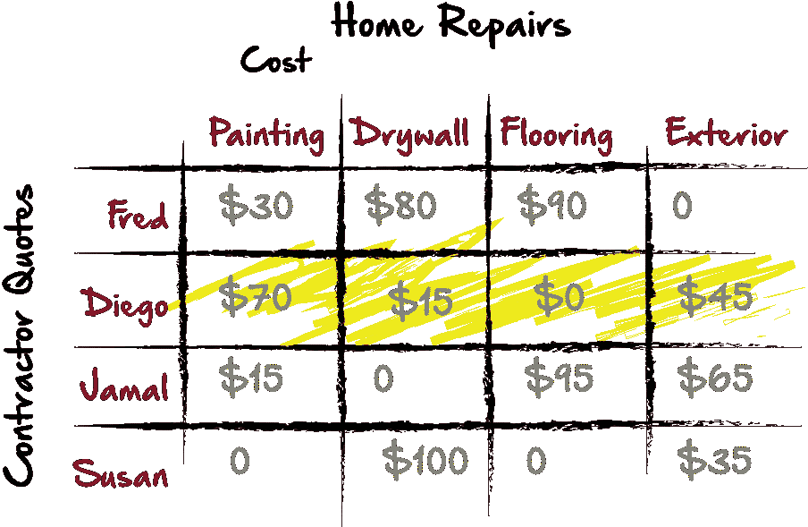

# 指派问题&计算最小矩阵和(Python)

> 原文：<https://medium.com/hackernoon/the-assignment-problem-calculating-the-minimum-matrix-sum-python-1bba7d15252d>


考虑以下问题:

由于疏忽，你的家急需修理。很自然地，你会去获取关于改造和修复需要做的事情的报价。让我们假设您收到的四个报价如下所示:


从各方面考虑，这似乎很合理。我们自然会选择苏珊，因为她给了我们最好的综合价格。然而，另一个解决方案可能是将我们需要做的事情分解成单独的项目。然后我们可以从我们的承包商那里得到每个维修项目的价格。这在两个方面更有利:

1.  我们将节省时间，因为所有承包商可以同时处理每个维修项目，从而更快地完成整个项目。
2.  我们也可以根据承包商的最低项目成本来雇佣他们，从而获得更好的价格。

看看下面的图表，这些单个价格可能是什么样的:


在我们这样做的时候，我们需要记住两件事:

1.  为了最大限度地利用时间，我们可能只想为一项工作雇用一名承包商。
2.  这意味着我们不能两次使用同一个承包商，自然，我们在任何时候都不会有两个承包商从事同一项工作。

例如，我们可以选择以下内容:


通过使用这种策略，我们可以通过将工作分配给 4 个承包商来最大限度地减少我们的时间，但是我们也可以通过为每个维修项目雇佣承包商来最大限度地降低我们的成本。尽管这看起来很简单，但如果我们有更多的承包商可供选择，或者有更多的维修工作要考虑，计算起来可能会非常困难。幸运的是，有一个很好的公式可以解决这类问题。我将使用一种叫做匈牙利方法的东西。**匈牙利方法**是一种组合优化算法，它在多项式时间内解决分配问题，并预测了后来的原始对偶方法。该算法是由哈罗德·库恩于 1955 年开发并发表的，他将该算法命名为“匈牙利方法”，因为该算法在很大程度上是基于两位匈牙利数学家德内斯·kőnig 和 jenő·埃格尔瓦里的早期工作。在使用伪代码解决了这个问题之后，我将看看我们如何使用 Python 创建一个函数来使用相同的方法解决它。使用 Python 的优势在于，无论网格大小如何，我们都可以创建一个动态函数来求解我们的方程。如果像上面的例子一样，我们决定增加更多的维修，或者获得更多的承包商报价，这可能会特别方便。希望随着我们的深入，这一策略的其他应用将变得显而易见。

匈牙利方法基本上有三个步骤:

## 1.找出每列中的最小值。

*   将每列中的最低值转换为零。
*   从同一列中的其他值中减去每列中的最小值。

## 2.找出每一行中的最小值。

*   如果行中的最小值还不是零，那么将其转换为零。
*   再次从每行的剩余值中减去每行的最小值。

## 3.选择只有零的行/列(如我们在上面的例子中所做的)。

这种方法背后的原因是:在每一列中，我们都有自己的工作。每一列中的最低值代表我们必须支付的最低价格。因此，通过将该值设置为零，我们可以从其他列值中减去该值。这些行代表我们必须支付给承包商的价格。最小行值表示我们必须支付给每个承包商的最低价格，同样，将它设置为零允许我们从该行的其他值中减去它。让我们看看如何将这种方法应用于我们当前的问题:

## 步骤 1:将最低的列值设置为 0。


在这里，我们可以看到每一列都有一个零。但是，只有第 1、3 和 4 行有零，第 4 行有 2 个零。现在，我们将从剩余的列值中减去已经转换为零的最小值。这里，我已经更新了列 1，从剩余的列值中减去最小值 70，剩下 15、30 和 80:

## 步骤 1:从其他列值中减去最低的列值。


现在，我们将浏览剩余的列，并对它们进行更新:

## 步骤 1:从其他列值中减去最低的列值。


现在，我们会注意到每一列都包含一个零。但是，只有第 1、3 和 4 行有一个零，第 2 行有两个零。从这里，我们继续第二步。我们现在循环遍历这些行，仅当该行当前没有零时，才将每行中的最小值转换为零。

## 步骤 2:确定不包含 0 值的行中最低的行值。


现在，重复上一步，我们将从该行的剩余值中减去该值:

## 第 2 步:从该行的其他值中减去最低的行值。



## 第三步:确定并分配最底层的工作给承包商。

完成第 2 步后，我们可以看到每一行和每一列都有一个零，这给我们带来了将适当的工作分配给每个承包商的挑战。从这里开始，我们将只选择值为零的行或列。在第 4 行，我们可以选择 Susan 进行粉刷或铺地板。我们可以选择迭戈或苏珊铺地板。如果我们手动分配适当的列和行值，而不使用 Python 或其他程序，我们可能只是首先选择没有其他选择的值。这里，列 2 和列 4 只给我们一个选择，所以我们可以先选择那些。在为 Susan 选择铺地板还是刷油漆时，我们可以看到，如果我们为 Susan 选择铺地板，我们就删除了第 4 行，这样第 1 列就没有替代零了。因此，唯一可能的解决方案是 Diego 负责地板，Susan 负责油漆，这样我们就可以为每一行和每一列选择一个零。

这是我们最初决定的，只有一个 4x4 的矩阵，并不困难。但是想象一下如果我们的矩阵大得多。试图以这种方式分配工作，以最大限度地减少时间和费用将是非常困难的。这种方法使得那些计算变得容易得多。

现在，让我们看看如何创建一个程序来解决这个问题。我的目标不是简单地编写一个程序来解决这个问题，而是编写代码来解决任何大小矩阵的问题，允许我在多个应用程序中重用代码。您可以看到这样做在各种环境中是多么有用。

首先，我将把我们的矩阵放在一个数组中，这样会更容易处理。然后，如果我需要重复使用代码，我只需刷出一个新的数组。

```
arr = [100, 130, 115, 55, 150, 75, 35, 110, 85, 50, 120, 120, 70, 150, 25, 90]
```

现在，清楚地知道我们下一步要做什么是很好的。对我来说，记录几件事是有意义的。我有这个数字列表，但是记住匈牙利方法是如何工作的，我们想知道关于每个数字的几件事，比如它的当前值是什么，它的修改值是什么，数字在哪一行，在哪一列。我可能还想知道列表中出现的索引值。对我来说，将我的数字列表转换成 python 字典列表是有意义的。python 字典看起来很像 JavaScript 对象。基本上我想做的是:


这样，在将每个值转换成一个字典后，我就可以在循环中从每个数字中获得更多信息。拥有修改后的值和原始值也有帮助，因为虽然修改后的值将帮助我们分配最终要使用的值，但是原始值是实际的价格或成本，我们最终需要参考它。

首先，我将设置一些变量，帮助我将数字列表转换为词典列表:

```
arr2 = []
numberOfRows = 4
numberOfColumns = 4
column = 0
```

## arr2

—当我遍历我的原始列表`arr`时，我会将修改后的字典推送到我的新列表`arr2`的字典中。

## 行数和列数

这些变量的伟大之处在于，它们将帮助我们跟踪我们在矩阵中的位置。此外，它将帮助我们保持代码的可重用性。将来，如果我们改变这个矩阵，或者开始一个新的矩阵，我们可以只更新列表，行数和列数，Python 会重新计算剩下的。这让我们在未来几乎没有什么可改变的。

## 圆柱

这个变量将为我们提供一个遍历列表的起点。我们可以不断增加它，并相应地更新我们的字典。

现在，我们将开始我们的 for 循环，并给它一个条件:

```
for idx, val in enumerate(arr):
    row = len(arr2)/numberOfRows+1
    column = column + 1
    if column > numberOfColumns:
        column = 1
```

## 对于 idx，枚举中的值(arr):

Python 中的 enumerate 方法将允许我们查看每个列表项中的值和索引号。这将帮助我们获得添加到对象中的`index value`，以及`original value`。

## row = len(arr2)/numberOfRows+1

这就是我们跟踪将哪个行值添加到当前字典中的方式。例如，如果我们在 For 循环中的第一项，我们还没有向`arr2`添加任何东西。所以`arr2`的长度会是 0。我们知道，在这个练习中，行数是 4，所以 0/4+1 = 1。因此，我们的行将是 1。但是如果我们在最后一个项目上，我们已经为`arr2`增加了很多。此时`arr2`的长度为 15。所以 15/4 = 3 + 1 = 4。那么这一行就是 4。

## 列=列+ 1

在这里，因为我们的原始值是 0，我们只是增加 1，因为没有列 0。在每个列表项之后，我们的列将增加 1。

## 如果列>列数:
列= 1

我们这里的条件有助于我们跟踪这些列。例如，在这种情况下，我们不能连续增加列数，因为最大列数是 4。因此，由于我们是将列递增 1，如果在循环中的每一项的开始，如果当前列号大于 4，它将重置回 1，并再次开始递增，直到我们再次到达 5，并将重置。

现在，我们将创建我们的字典:

```
idx = {
        "row": row,
        "column": column,
        "index": idx,
        "original_value": val,
        "modified_value": val,
    }
    arr2.append(idx)
```

在这里，我们只是使用我们已经设置的值，并创建键值对以允许我们以后访问这些值。下面是整个代码块的样子:

```
for idx, val in enumerate(arr):
    row = len(arr2)/numberOfRows+1
    column = column + 1
    if column > numberOfColumns:
        column = 1
    idx = {
        "row": row,
        "column": column,
        "index": idx,
        "original_value": val,
        "modified_value": val,
    }
    arr2.append(idx)
```

现在，我将按照列表中的原始值键对列表进行排序。稍后，我想访问每一列和每一行中的最低值，如果我将它们按最低的原始值排序，这将容易得多。我们将这样做:

```
newlist = sorted(arr2, key=lambda k: k['original_value'])
```

我现在用的变量是`newlist`。从现在开始，我不再需要`arr`或`arr2`，但是我将只与这个列表`newlist`交互。以下是我的输出，供参考:

```
{'column': 3, 'index': 14, 'original_value': 25, 'modified_value': 25, 'row': 4}
{'column': 3, 'index': 6, 'original_value': 35, 'modified_value': 35, 'row': 2}
{'column': 2, 'index': 9, 'original_value': 50, 'modified_value': 50, 'row': 3}
{'column': 4, 'index': 3, 'original_value': 55, 'modified_value': 55, 'row': 1}
{'column': 1, 'index': 12, 'original_value': 70, 'modified_value': 70, 'row': 4}
{'column': 2, 'index': 5, 'original_value': 75, 'modified_value': 75, 'row': 2}
{'column': 1, 'index': 8, 'original_value': 85, 'modified_value': 85, 'row': 3}
{'column': 4, 'index': 15, 'original_value': 90, 'modified_value': 90, 'row': 4}
{'column': 1, 'index': 0, 'original_value': 100, 'modified_value': 100, 'row': 1}
{'column': 4, 'index': 7, 'original_value': 110, 'modified_value': 110, 'row': 2}
{'column': 3, 'index': 2, 'original_value': 115, 'modified_value': 115, 'row': 1}
{'column': 3, 'index': 10, 'original_value': 120, 'modified_value': 120, 'row': 3}
{'column': 4, 'index': 11, 'original_value': 120, 'modified_value': 120, 'row': 3}
{'column': 2, 'index': 1, 'original_value': 130, 'modified_value': 130, 'row': 1}
{'column': 1, 'index': 4, 'original_value': 150, 'modified_value': 150, 'row': 2}
{'column': 2, 'index': 13, 'original_value': 150, 'modified_value': 150, 'row': 4}[Finished in 0.089s]
```

这是一个好主意，因为我们正在打印每个列表的结果，以确保我们得到了我们期望的数据。

接下来，我将创建空白列表:

```
columnsTested = []
columnAndValue = []
```

我这里的想法是循环通过 newlist。因为它是按原始值组织的，所以我将把每一列中最低的值追加到`columnAndValue`中，只把列值推入`columnsTested`。这样，我可以创建一个条件，检查`x`列是否已经在`columnsTested`中。如果是，我就略过。

```
for i in newlist:
    testObj = {
        "column": i['column'],
        "minVal": i['original_value']
    }
```

为了开始我的列表，我创建了一个列和`original value`的对象，稍后我将对照我的`newlist`列表测试这个对象。我可以说，如果这个`testObj`中的列与我的`newlist`项的列匹配，我将从 newlist 中修改后的值中减去`testObj`中的`minVal`。只是想让你知道我的计划是什么。

接下来，我来补充我的条件:

```
if i['column'] not in columnsTested:
        columnAndValue.append(testObj)
        columnsTested.append(i['column'])
```

现在，`newlist`中的前 6 或 7 个条目可能在不同的列中，但是因为它是从最低值开始组织的，所以它可能会抓取第 2 列中的条目和索引 3。那么索引 4 处的值也可能在列 2 中。但是它不会获得第二个值，因为第 2 列中的一个值已经存在于`columnsTested`中。并且它附加到`columnAndValue`的第一个值低于第二个值。

下面是这段代码的整体外观:

```
columnsTested = []
columnAndValue = []
for i in newlist:
    testObj = {
        "column": i['column'],
        "minVal": i['original_value']
    }
    if i['column'] not in columnsTested:
        columnAndValue.append(testObj)
        columnsTested.append(i['column'])
```

现在，我将执行一个嵌套的 for 循环，根据 columnAndValue 中的字典测试 newlist 中的字典。如果每个中的列都匹配，我将根据 newlist 中的 modifiedValue 从 columnAndValue 中 sub rect minVal。在这一点上，modifiedValue 和 originalValue 是相同的，但是这将给出我们想要的两个值的差异。

```
for i in newlist:
    for j in columnAndValue:
        if i['column'] == j['column']:
            i['modified_value'] = i['modified_value'] - j['minVal']
```

很直接，对吧？同样，检查是个好主意，通过打印`newlist`的内容来确保我们得到了我们期望的数据。我们的输出可能如下所示:

```
{'column': 3, 'index': 14, 'original_value': 25, 'modified_value': 0, 'row': 4}
{'column': 3, 'index': 6, 'original_value': 35, 'modified_value': 10, 'row': 2}
{'column': 2, 'index': 9, 'original_value': 50, 'modified_value': 0, 'row': 3}
{'column': 4, 'index': 3, 'original_value': 55, 'modified_value': 0, 'row': 1}
{'column': 1, 'index': 12, 'original_value': 70, 'modified_value': 0, 'row': 4}
{'column': 2, 'index': 5, 'original_value': 75, 'modified_value': 25, 'row': 2}
{'column': 1, 'index': 8, 'original_value': 85, 'modified_value': 15, 'row': 3}
{'column': 4, 'index': 15, 'original_value': 90, 'modified_value': 35, 'row': 4}
{'column': 1, 'index': 0, 'original_value': 100, 'modified_value': 30, 'row': 1}
{'column': 4, 'index': 7, 'original_value': 110, 'modified_value': 55, 'row': 2}
{'column': 3, 'index': 2, 'original_value': 115, 'modified_value': 90, 'row': 1}
{'column': 3, 'index': 10, 'original_value': 120, 'modified_value': 95, 'row': 3}
{'column': 4, 'index': 11, 'original_value': 120, 'modified_value': 65, 'row': 3}
{'column': 2, 'index': 1, 'original_value': 130, 'modified_value': 80, 'row': 1}
{'column': 1, 'index': 4, 'original_value': 150, 'modified_value': 80, 'row': 2}
{'column': 2, 'index': 13, 'original_value': 150, 'modified_value': 100, 'row': 4}[Finished in 0.107s]
```

现在，我们将重复最后两步，但是目标是行而不是列，但是该代码的所有构建块将完全相同:

```
rowsTested = []
rowAndValue = []
for i in newlist:
    testObj = {
        "row": i["row"],
        "minVal": i["modified_value"],
        "modified": i["modified_value"]
    }
    if i['row'] not in rowsTested:
        rowAndValue.append(testObj)
        rowsTested.append(i['row'])for i in newlist:
    for j in rowAndValue:
        if i['row'] == j['row'] and j['modified'] > 0:
            i['modified_value'] = i['modified_value'] - j['minVal']
```

瞧啊。现在，如果我们打印 newlist，我们可以看到带有 0 的四个值位于列表的顶部，我们可以很容易地选择那些没有出现在重复的行或列中的值。我们的输出应该如下所示:

```
{'column': 3, 'index': 14, 'original_value': 25, 'modified_value': 0, 'row': 4}
{'column': 3, 'index': 6, 'original_value': 35, 'modified_value': 0, 'row': 2}
{'column': 2, 'index': 9, 'original_value': 50, 'modified_value': 0, 'row': 3}
{'column': 4, 'index': 3, 'original_value': 55, 'modified_value': 0, 'row': 1}
{'column': 1, 'index': 12, 'original_value': 70, 'modified_value': 0, 'row': 4}
{'column': 2, 'index': 5, 'original_value': 75, 'modified_value': 15, 'row': 2}
{'column': 1, 'index': 8, 'original_value': 85, 'modified_value': 15, 'row': 3}
{'column': 4, 'index': 15, 'original_value': 90, 'modified_value': 35, 'row': 4}
{'column': 1, 'index': 0, 'original_value': 100, 'modified_value': 30, 'row': 1}
{'column': 4, 'index': 7, 'original_value': 110, 'modified_value': 45, 'row': 2}
{'column': 3, 'index': 2, 'original_value': 115, 'modified_value': 90, 'row': 1}
{'column': 3, 'index': 10, 'original_value': 120, 'modified_value': 95, 'row': 3}
{'column': 4, 'index': 11, 'original_value': 120, 'modified_value': 65, 'row': 3}
{'column': 2, 'index': 1, 'original_value': 130, 'modified_value': 80, 'row': 1}
{'column': 1, 'index': 4, 'original_value': 150, 'modified_value': 70, 'row': 2}
{'column': 2, 'index': 13, 'original_value': 150, 'modified_value': 100, 'row': 4}[Finished in 0.082s]
```

伟大的事情是，虽然这需要一些时间来建立，我们现在可以评估任何矩阵，对于任何类似的问题。