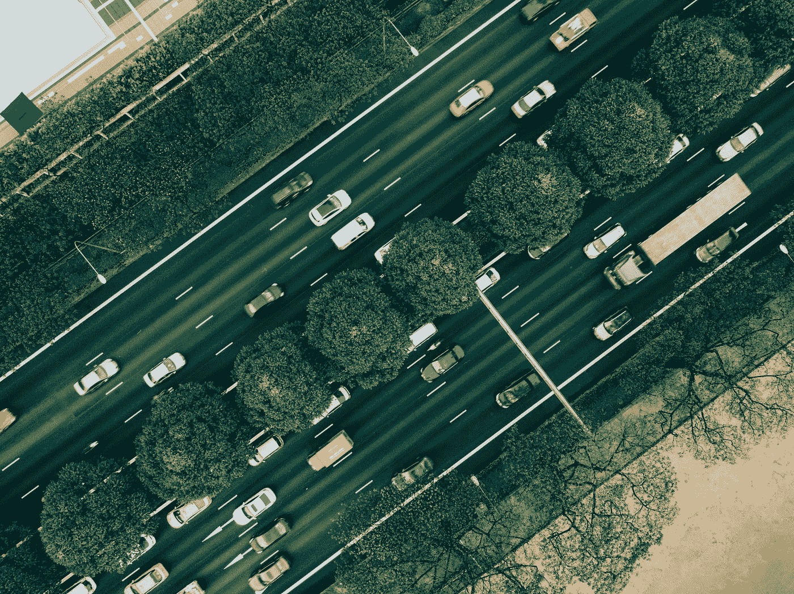
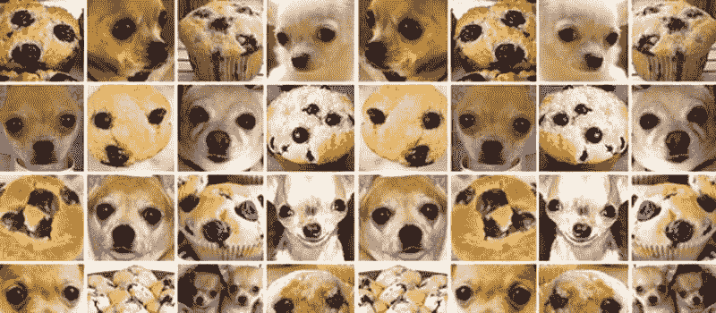
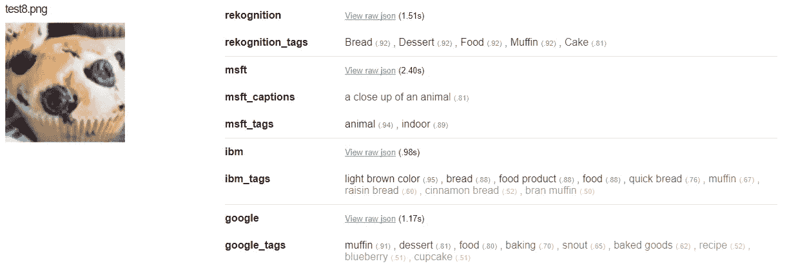
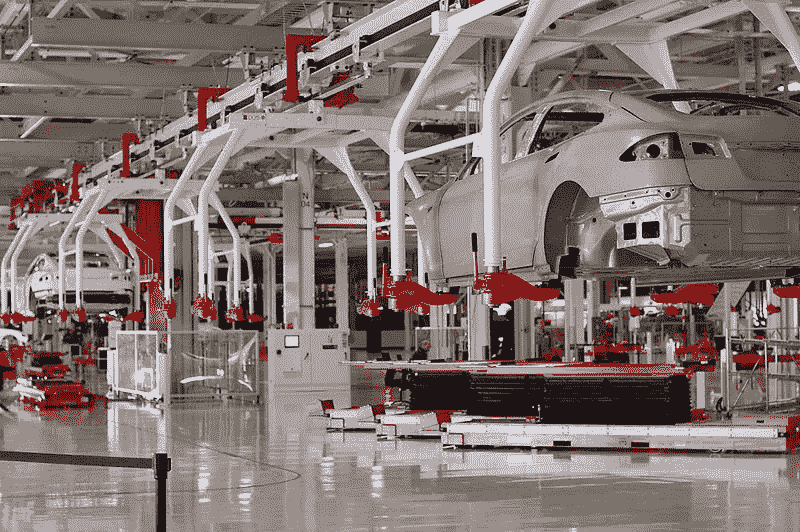

# 汽车行业正在发生变化，制造商如何跟上变化？

> 原文：<https://medium.com/hackernoon/the-automotive-industry-is-changing-how-are-manufacturers-keeping-up-3de351655b71>

“How we use our vehicles is changing” by [chuttersnap](https://unsplash.com/@chuttersnap?utm_source=medium&utm_medium=referral) on [Unsplash](https://unsplash.com?utm_source=medium&utm_medium=referral)

汽车行业正接近一个关键时刻。在更大的公众需求、政府政策和新进入市场者的推动下，人们开始转向电动动力系统。沃尔沃、福特、捷豹路虎和丰田宣布，在未来十年左右的时间里，他们的全部汽车都将实现某种程度的电气化。特斯拉甚至戴森等新进者也在积极追求纯电动动力总成。

汽车领域一个潜在的更大变化(有人可能会说是一场革命)是自动驾驶汽车的到来。如今，大多数汽车原始设备制造商都在大力投资开发自动驾驶汽车。即使在这个领域，也有非汽车领域的挑战者在争夺第一个部署自动驾驶汽车的资格。

从科技公司来看，谷歌的姐妹公司 Waymo 似乎最接近实现这一目标。2017 年底[他们开始在美国亚利桑那州的道路上驾驶自动驾驶汽车](https://www.wired.com/story/waymo-google-arizona-phoenix-driverless-self-driving-cars/)，没有安全司机作为后备，并一直在与公众测试打车服务，作为其早期骑手计划的一部分。2018 年初，Waymo [订购了 62，000 辆克莱斯勒 Pacifica 小型货车](https://www.theverge.com/2018/5/31/17412908/waymo-chrysler-pacifica-minvan-self-driving-fleet)和 20，000 辆捷豹 I-Pace SUV。他们计划在 2018 年[年底推出全球首个商业无人驾驶叫车服务，并在 2020 年](https://www.wired.com/story/waymo-buys-jaguar-suvs/)扩大到每天 100 万次。中国搜索引擎巨头[百度也于 2017 年底在中国进行了自动驾驶汽车](https://www.ft.com/content/8c506d06-d02d-11e7-b781-794ce08b24dc)的试验。百度被视为中国自动驾驶竞赛的领导者，它决定走一条与其他公司不同的路线，以阿波罗为品牌开源其技术。

自动驾驶汽车的采用可能会从打车服务的推出开始。随着 2017 年推出的叫车试点项目数量的增加，这一点变得越来越明显。大众的子公司 MOIA 专注于移动即服务，推出了一款专为共享移动设计的电动客车。2018 年初 [MOIA 向汉诺威的有限人群推出了测试服务](https://www.moia.io/blog/2018/we-are-about-to-start-in-hanover/)，并计划在年底向所有汉诺威人开放。通用汽车和它在 2016 年收购的自动驾驶初创公司 Cruise 正在推进他们的开发。[通用汽车计划在 2019 年推出自主打车服务](https://techcrunch.com/2017/11/30/gm-and-cruise-on-track-to-field-a-self-driving-ride-hailing-service-by-2019/) ( [无方向盘和踏板](http://www.autonews.com/article/20180112/MOBILITY/180119919/gm-seeks-waiver-autonomous-cars-without-steering-wheels-pedals-in-2019-))，最初专注于大城市，然后扩展到其他城市地区。Lyft 是美国第二大最受欢迎的打车服务，它已经与 Waymo 和通用汽车签署了合作伙伴关系。

我们习惯的车辆拥有模式也在改变。在英国，获得驾驶执照的年轻人数量一直在稳步下降，最近，美国和欧洲似乎也有类似的趋势。越来越多的人依赖优步等打车服务的便利来通勤，并放弃维护私人车辆的麻烦。

当然，所有权不会消失，但它似乎会与时俱进。沃尔沃已经在试验订阅模式。沃尔沃(Volvo)和吉利(Geely)的子公司 Lynk & Co 推出了一款以连接性为中心的汽车，带有订购模式。沃尔沃随后宣布, [XC40 将以每月 600 美元的价格订购。了解到客户对移动性的要求会有所波动，订阅让用户](https://techcrunch.com/2017/11/30/volvos-car-subscription-service-sounds-like-good-way-to-get-the-new-xc40/)[每年有 14 天可以使用不同的汽车](https://www.volvocars.com/uk/buy/shop/care-by-volvo)。搬家时要大一点的车还是聚会时要小一点的跑车？

# 制造业将如何跟上这种转变？

SpaceX 首席推进技术官汤姆·穆勒(Tom Mueller)在解释埃隆·马斯克(Elon Musk)对特斯拉制造的[愿景时说，“汽车的主要成本不是汽车中的材料，而是制造汽车的工厂”。](https://electrek.co/2017/05/15/tesla-kill-auto-industry-elon-musk-manufacturing-spacex-cto/)

为了让产品向前发展，制造产品的机器需要跟上技术进步的步伐。通过更多地利用技术，有机会大大改善制造业。增加[自动化](https://hackernoon.com/tagged/automation)，使用[机器学习](https://hackernoon.com/tagged/machine-learning)并利用数据可以提高所需的效率、质量和灵活性。

如果我们能造出一辆能在繁忙的城市街道上行驶并能应对人类不可预测行为的汽车。那么，我们一定想知道，是否也有可能制造出在受控环境中执行预定任务的机器人？

当然，这无疑过于简化了手头的问题——人类的灵活性是非凡的。[机器发现很难拾起](https://www.fastcompany.com/3066863/why-its-so-hard-for-robots-to-get-a-grip)形状奇怪的物体或将夹子固定在线束上——但是仍然有很多过程可以自动化，或者机器可以用来增强人类的灵活性和直觉。

# **机器视觉**

[Chihuahua or a muffin?](https://medium.freecodecamp.org/chihuahua-or-muffin-my-search-for-the-best-computer-vision-api-cbda4d6b425d) Easy for us to see but for machines, it’s a challenge

在神经网络的帮助下，机器视觉在过去十年中有了长足的发展。由于有如此多的数据可供处理，今天的机器视觉系统可以高精度地分类和检测物体。机器现在能够区分一些非常相似的图像。以上图为例，吉娃娃和松饼有着惊人的相似之处。直到最近，人工智能(AI)还在努力准确区分具有这种相似性的图像。令人欣慰的是，今天大多数流行的在线计算机视觉工具都能够正确识别宠物的食物，尽管微软的系统在这种特殊的松饼上苦苦挣扎。

[Looks like Microsoft (msft) still has some learning to do.](https://www.topbots.com/downloads/code/vision/chihuahua_vs_muffin/)

通过使用[谷歌的云视觉平台](https://cloud.google.com/vision/)等工具，质量控制和在线零件检测可以得到显著改善。由计算机视觉监控的生产线不同点的摄像系统可以发现质量问题，并在零件到达生产线末端之前将其送去返工。许多汽车原始设备制造商一直在为他们的自动驾驶汽车开发大量投资开发计算机视觉技术，同样的技术重点应该用于制造业。

# 自动化

装配线上的自动化也有很大的潜力。今天的大部分制造都是半自动化的，很大一部分车辆装配是在工业机器人的协助下进行的。人类操作员与重型机械一起工作来组装车辆，人类提供灵活性和敏捷性，而机器人提供耐力和一致的可重复性。今天的汽车可能会以破纪录的速度行驶，但生产汽车的生产线仍在缓慢前进。

为自动化而设计产品和制造可以增加机器可以完成的工作量。特斯拉是将赌注压在全自动生产线上的新制造商之一， [Model 3 的生产线可能是任何现代汽车中自动化程度最高的](https://techcrunch.com/2017/11/07/tesla-acquires-automated-manufacturing-machine-supplier-perbix/)生产线。直到 2016 年 7 月，特斯拉的生产副总裁 Greg Reichow 在他的 [Wired 文章中写道:“一些机器人移动速度如此之快，以至于它们的手臂需要用碳纤维而不是钢来制造。”。Model S 和 X 生产线目前的速度约为每秒 5 厘米，通过](https://www.wired.com/story/teslas-secret-second-floor/)[增加自动化，特斯拉预计将速度提高 20 倍](http://blog.ycombinator.com/elon-musk-on-how-to-build-the-future/)，达到每秒 1 米，这是一个缓慢的中等步行速度。这种自动化优势将推动特斯拉制造能力的吞吐量和效率，使其能够超越老牌巨头。

[Tesla Fremont Factory](https://commons.wikimedia.org/wiki/File:Tesla_Factory,_Fremont_(CA,_USA)_(8763129679).jpg)

# 数据

正如他们所说，数据是新的黄金，我们目前正处于收集更多数据的淘金热中。这很有用，因为有了足够多的特定领域的数据，就可以观察到非常规的关系和趋势。这种洞察力可以给公司带来优势。亚马逊等公司收集了大量数据，用于为客户提供更好的服务。他们可以预测哪些产品可能会在某个地区被购买，并为送货车备货，这样当它真正被购买时，它已经在路上了。网飞收集了观众观看的每一个场景的数据，以及哪些剧集被重复播放或被疯狂播放。这让他们对观众的欲望和习惯有了无与伦比的洞察力，他们用这些来创造自己的原创内容。

制造厂收集了大量的数据。从供应链到仓库，从机器状态到产品质量、健康和安全事件的数据都被记录在某个地方。通常在筒仓里，很少相互交流，有时还记录在纸上！许多公司都在努力利用收集到的数据，尽管大多数公司都有利用这些数据的欲望。

让数据变得有用的第一步是让它可用。向不同的部门和员工提供，以便他们能够做出明智的决策。并且访问应该尽可能简单，以直观的形式呈现。

制造业中的数据是一座金矿，它具有 OEM 所需的洞察力，可以为制造业带来重大变革。但是，不仅仅是机器提供了提取洞察力的智能。2005 年，两名业余棋手用 3 台 PC 打败了超级计算机和特级大师。单个来说，他们的技术不如对手，但将人类的直觉和洞察力与计算机预测结合起来。这种人机共生体，当内置到软件中时，可以让员工找到他们正在寻找的洞察力。PayPal 早期曾与欺诈作斗争。对于他们来说，手动捕捉太多了，所以决定编写可以预测欺诈交易的软件。该软件能够捕捉到 80%的交易，但无法捕捉到 20%的交易，这 20%的交易更加复杂，并且可以避免被发现。因此，他们建立了分析工具，允许人类使用他们的[直觉来检测数据中的可疑活动](https://www.technologyreview.com/s/523666/software-that-augments-human-thinking/)。

为了跟上汽车行业的发展步伐并在竞争中保持领先，制造商需要从他们的数据中获得所有的洞察力。公司各个层面的直观可视化和分析工具将使组织能够共同前进。

如果你喜欢我的帖子，你可以鼓掌(最多 50 次)并关注我更多关于技术的帖子。如果你有兴趣进一步谈论以上任何话题，请在下面评论或在 [LinkedIn](https://www.linkedin.com/in/shahabarif/) 上给我发消息