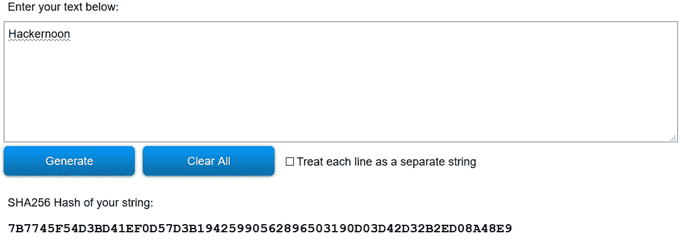
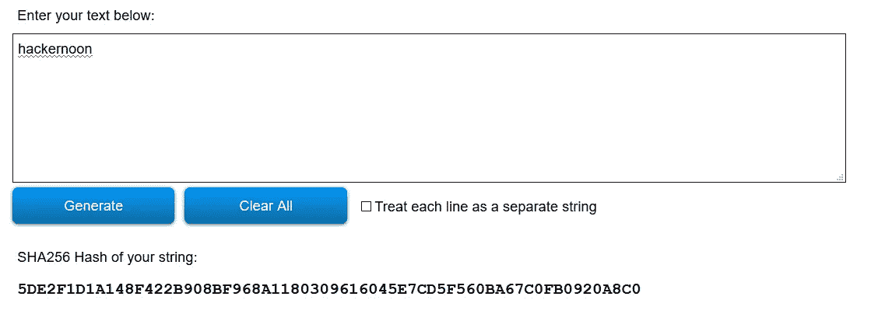
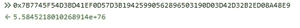
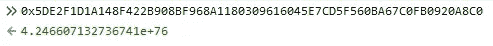

# 雪崩效应

> 原文：<https://medium.com/hackernoon/the-avalanche-effect-cfb6642d35dd>

## 注意:这篇文章是在我关于[单向函数](https://hackernoon.com/a-simple-introduction-to-one-way-functions-a2429d427546)的文章之后阅读的。

让我们为下面两个词生成 sha 256:“Hackernoon”和“hacker noon”。

借助像 [SHA256 哈希生成器](https://passwordsgenerator.net/sha256-hash-generator/)这样的在线工具，为任何文本生成 SHA256 都相当容易。

## “哈克农”的 SHA256:

SHA256(Hackernoon)

## “哈克农”的 SHA256:

SHA256(hackernoon)

上面我们为同一个词计算了 SHA256，但是其中一个在**句格**里。

让我们将十六进制散列转换成相应的十进制数。使用 Javascript Web 控制台可以非常容易地完成这种转换。

Decimal value SHA256 of “Hackernoon”

Decimal value SHA256 of “hackernoon”

如果你仅仅通过**大写【h】**，来观察，在输出中有一个**剧烈的变化**。

输入的微小变化导致输出的剧烈变化称为**“雪崩效应”**。

理解雪崩效应非常重要，因为 SHA256 的这一特性是 **Satoshi Nakomoto** 将其用于**比特币区块链**的底层加密的原因之一。

在下一篇文章中，我们将深入探讨**“散列算法”。**敬请关注更新！

下面这段话是我写这篇文章的动机:

> “让我们努力保护好一切。”~尼克·萨伯

感谢您阅读我的文章。

*如有任何问题，欢迎随时给我发* [*邮件*](mailto:pamanalionline@gmail.com) *。也可以通过*[*Linkedin*](https://www.linkedin.com/in/amanali1/)*联系我。也可以关注我的* [*推特*](https://twitter.com/aliandco) *。*

*为了区块链入门阅读我的* [*文章*](https://hackernoon.com/blockchain-learning-path-2019-e54d6763dd6c) *发表在*[*hacker noon*](https://hackernoon.com/)