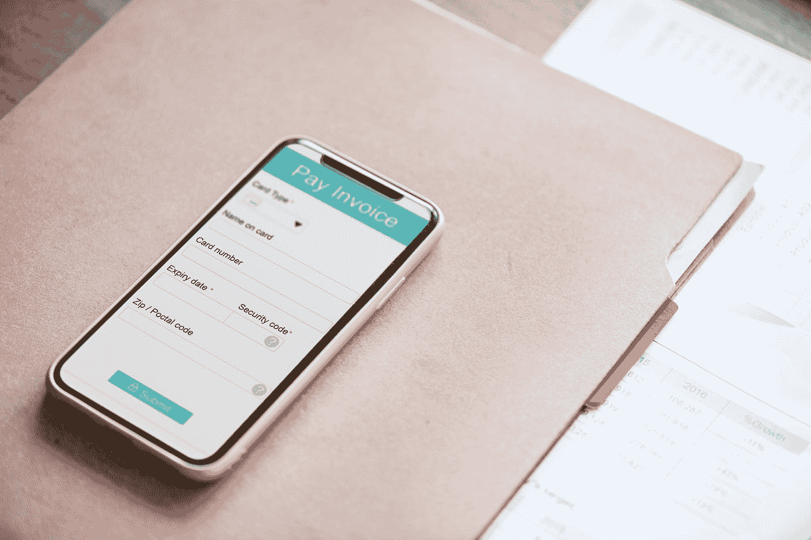

# 贝宝的尴尬处境

> 原文：<https://medium.com/hackernoon/the-awkward-state-of-paypal-54417cfd72b>

## 网上转账的最佳平台是…

Photo by [rawpixel](https://unsplash.com/@rawpixel?utm_source=medium&utm_medium=referral) on [Unsplash](https://unsplash.com?utm_source=medium&utm_medium=referral)

我必须承认这篇文章来自我使用 PayPal 的亲身经历。我不会在这里谈论那次经历，但我谨慎地在这里谈论了它(这是一个锁定的帖子)。**我不喜欢批评或试图破坏他人的努力工作或业务，所以我尽可能地保持建设性**。但是不管我们喜不喜欢，未来就在我们面前。要么创新，要么沉沦。这就是现在的世界。适应不再是生存的关键，人们需要新鲜。这使得你或你创造的任何美妙的产品或服务很快被遗忘。这是一个快速的世界，我们在这里谈论的是贝宝。

在贝宝真的惹怒了我之后，我开始思考，**贝宝在货币转账或在线支付的未来真的有什么优势？**他们会在 10 年后出现吗？他们的定位是成为行业之王吗？他们有什么可能意味着在金钱运动领域的领导地位？如果你不知道 PayPal 是做什么的，他们基本上只需要你的电子邮件地址就可以帮助你“轻松”和“跨境”转移资金。他们的账户可以连接到你的各种银行账户，这可以帮助你在网上购物或汇款。

> 在我的研究中，我上网寻找使用 PayPal 的优势，以及它们是否仍然是优势。所以，我就利用我发现的优点，一个一个的解剖。我会尽可能地坚持事实，远离观点。然而，这是一个社会世界，很容易预测事情的发展方向。

第一个好处是据说速度快。立即想到的问题是:比什么快？嗯，显然这意味着(正如我发现的)比西联汇款或银行支付更快。我以前没有用过西联汇款，最近一段时间我身边也没有人用过。但是我可以说银行转账。银行转账已经不是过去的样子了。随着借记卡和信用卡最近的长足发展，加上它现在在在线支付方面的兼容性，我认为没有理由更快地调用 PayPal。据我所知，它并不比银行转账更快。此外，事实上，付款可以在 21 天左右回滚(对于那些接受的人来说),这意味着这笔钱在那之前真的不“可收取”,这使得它真的很慢。我认为，直到钱到了我手里，我可以用我想要的方式使用它，交易才算完成。另外，加密货币速度更快。所以，PayPal 很快？我不相信。

接下来，他们会为您进行货币兑换。这是一个很好的优势，但你知道吗？我的银行也是！我的银行对此有限额，但很大程度上是这么做的。我可以用我的卡购买另一种货币，他们会为我兑换。有趣的是，PayPal 也有限制。那么，这是优势吗？对我来说不是。如果其他人都这样做，那就不是优势了。加密货币甚至可以让你对冲法定货币(尽管非常不稳定)。

接下来，他们声称可以帮助定期付款。这怎么会是优势呢？**我的借记卡这么顺利地做到了**。几乎每一个在线支付渠道都有能力帮助经常性支付。所以这绝对不是优势。

现在一个好的；它被广泛接受。这就像是真正的优势。**贝宝的可接受性已经到了如此深远的程度。但这只是在营销和市场采用方面的奉献和勤奋的结果。任何其他渠道拥有的资源都可以达到同样的效果。这充分说明了迄今为止管理该公司的人。他们在收养方面做得很好。然而，许多项目和公司都在努力采用。我的印象是，他们中的许多人将在未来 10 年内满足并超过 PayPal 的普遍接受度，特别是在加密生态系统内的项目。但是现在这仍然是一个优势。**

接下来是信用卡安全。在这里，他们声称，通过使用他们的平台(而不是直接使用你的银行卡)，你不会不止一次地披露你的详细信息(当你与他们分享时)。与银行转账相比，这无疑是一个优势，但 crypto 做得更好。另外，不会被骗的一丝不苟的人(是的，很多人从来没有被骗过)不认为这是一个优势。你必须完全无视银行的指示，做一些超出你所知的事情，这样才会(经常)被骗。在 crypto 里，你可以这样贴你的比特币地址(我的)；19n 35 jl5te 89 modgmxrmuvqvvye 6 fvd typ 和你的 litecoin 钱包地址这样(我的)；lhscntqjqgxxv 6 ggfen 9g 5a 3 fuvp 1 xnsly 并且要自信到不会有什么好笑的事情发生。只有好事。

接下来，贝宝有一个应用程序。**如今人人都有 app**。没什么大不了的。一个 app，一个二维码，生活就这么简单了。一个 app 肯定不是优势。此外，贝宝被称为在线钱包。“在线钱包”这几个字触发了我脑海中的密码。如果你考虑加密生态系统中正在发生的事情，我不认为它们真的适合在线钱包的叙事。它们实际上是一种在线钱包，但被加密钱包超越(只是因为加密钱包持有加密货币)。

另一个听起来很强大的优势是易贝在线拍卖的使用案例。当然，易贝与贝宝关系密切。这在很大程度上解释了 PayPal 被广泛接受的原因。实际上，PayPal 的前身是易贝。现在，我认为易贝开始接受其他支付渠道。因此，不确定这种优势会持续多久。此外，当使用 PayPal 时，许多零售店都有**折扣。这也是一种优势，它基本上有助于(如前一点)被广泛接受。**

最后关于优点，据说 PayPal 是免费使用的。实际上，寄钱是免费的(据我所知)，但收钱是有成本的。**这可能比银行转账更有优势(在某些地方)，但 crypto 做得更好**。如果你不喜欢你的比特币的 tx 费用(如果你在 LN 上，这真的不存在)，使用 litecoin 或 ether 或任何其他合适的硬币。

已经看到了假定的优点，让我们也考虑假定的缺点。所谓的不利条件比所谓的有利条件要严重得多，也更令人担忧。只能证实一个真正的优势，让我们看看我们会发现多少缺点。首先，有人提到了**它没有连接到任何自动取款机**的事实。这是令人吃惊的。他们可能会说，PayPal 基本上是一个在线钱包，不需要与 ATM 兼容。但这又引出了另一个人提出的另一个观点。PayPal 是一个不必要的中间人。这里有一点。既然它所提供的一切(在功能上)银行都可以自己实现，为什么还要使用这个平台呢？唯一的原因仍然存在，因为你想连接的支付渠道正在使用它或要求你使用它。如果允许我猜的话，我会说他们没有像以前那样增加新用户。

对于使用这种渠道收款的人来说，最大的缺点是买家或顾客可以敲竹杠。他们可以收到产品或服务，然后取消付款。我从四面八方听到了许多关于这件事的抱怨。这真的把人们惹火了，我想知道 PayPal 对此做了什么。恼人的是，当 PayPal 撤销支付时，他们不会跟进双方之前发生的任何交换。你知道对你来说有多沮丧，当你想到你做了一笔生意，却发现它又回来了，你的产品永远消失了。天佑聪；一旦付款，就不可逆转。这可能会让一些人感到害怕，但对我和许多其他人来说却很舒服。

另一个大缺点是，PayPal 可以无限期冻结你的账户，而不会及时给你任何具体的解释。这是一个瞬间关闭。我不想处于那种境地。没有警告，什么都没有，你的钱会被冻结一段时间。如果你的生命取决于此呢？有人在评论中写道，这意味着这种情况经常发生。这比他们声称提供的任何保障都要糟糕得多。

这是我所能找到的，但是发生在我身上的事情并不在已经提到的任何事情中。很明显，**在某些国家，您无法将款项存入您的 PayPal 账户**。我碰巧在这些国家中的一个，我不能收到寄给我的钱。有意思的是，除非你具体问他们，他们也没说清楚。此外，他们继续运营他们的服务，允许来自这些国家的人们在线支付。所以，他们可以发送，但不能接收。我认为这非常不公平。如果要取消这项服务，那么应该在这些国家完全取消。你怎么能允许没有收款能力的人汇款(当每个人都知道你在其他地方提供的全套服务时)？在我第一段链接的帖子中，我用一些惊人的想法表达了我的不满。

现在你已经看到了 PayPal 的现状，现在的问题是这样的；**你认为未来 10 年他们会在哪里？**