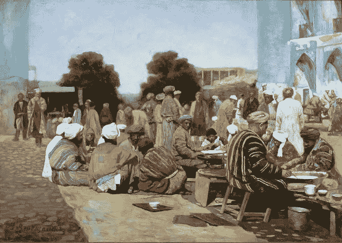

# 数据集市

> 原文：<https://medium.com/hackernoon/the-bazaar-of-data-9850f0f246f9>

你去过集市吗？这是一个无穷无尽的东方市场，你可以逛上几天，在每个角落都发现一些新东西。琳琅满目，品种繁多，口味多样。即使你从未真正经历过，你也可能在阿拉丁的电影中看到过这样的例子，这对于谈论数据集市来说已经足够好了。抽象地说，集市的基本特征是众多的卖家。对于一个集市来说，它需要包含几乎无限数量的卖家，就像沙粒的数量或互联网上的用户数量一样。让我们来看看结果:

*   多样性——许多卖家意味着许多不同质量和价格的商品。
*   低门槛——成为卖家很容易。事实上，作为一个卖家，这不是一个是或否的属性，而是一个频谱，许多集市买家也可以出售一些东西。
*   审查阻力——与区块链一样，许多节点意味着更难审查商品。
*   容错—同样，如果一个节点出现故障，会有许多其他节点出现故障。

阅读这个集市听起来不错，但有一个缺点。做出选择很难:你需要扫描大量独立买家，并与其中一些人建立信任关系，而且这里有很多便宜货。这使得集中超市(或大教堂)对购买者来说更加容易。也许这就是西方世界集市萎缩的原因(也是规模经济的原因)，但我们在这里不是要谈论历史。

让我们继续我们的食物主题，假设你正在寻找一个吃饭的地方。线下世界的餐馆非常适合集市模式。大公司和连锁店确实存在，但也有许多独立的小地方。我们都喜欢 SME(中小企业),了解它们对当地经济的重要性，所以让我们关注它们。

想象一下，一条满是餐馆的街道，当你沿着它走的时候，窥视每一家餐馆，感受氛围，看看里面供应什么。每个地方都有一个标志，以便更容易找到，菜单在外面。你正试图根据氛围、质量和价格来选择一个最适合你的地方。

另一方面，假设你想在网上订餐。一家餐馆可能有一个网站，但只有大公司才能负担得起一个易于导航、移动友好和最新的网站。更不用说开发一个在线订购的界面了。对于一个专门制作食物的小地方来说太多了，没有技术。但是我不能过分强调现在上网的重要性。

这就是在线市场概念的来源。这些为中小企业提供了在网络上创建一个存在所需要的所有功能。另一个重要的优势是，它提供了一个统一的界面来查看市场上的所有业务。由高科技公司开发的在线市场是用户消费的一个很好的入口。

但是从治理的角度来看，在线市场根本不是一个市场。它不属于公众，也不受地方当局管理，它是一家私人公司。这对所有参与的人来说都是游戏规则的改变者。用户可能仍然有 P2P 的感觉，但实际上它是高度集中的。所有交易和数据都由市场所有者存储和批准。难道我们要给他这样的权力吗？

可以有很多创业公司，但最终只有极少数最强的能够存活下来。虽然一家年轻的公司为了吸引新业务而愿意合作，但随着公司的成长，他们对客户的要求越来越严格，不太可能与市场上的新参与者建立开放的关系，以保护自己免受业务被这些新参与者抢走的威胁。最终，寡头垄断形成，大玩家开始支配其他玩家的游戏。这意味着:

*   对相关企业收取更高的费用，这转化为对消费者更高的价格。
*   市场所有者可以操纵和审查收入数据。
*   当变得有利可图和成熟时，封闭系统停止进化。该公司只是不想在下一次中断之前改变一些有效的东西。一个开放的系统有很多头，所以进化不会停止。

## 去中心化拯救世界

虽然区块链的第一个用例是比特币等加密货币，但我们可以使用相同的技术建立一个由社区所有的在线市场，而无需集中管理或私人实体作为唯一的利益相关者。我们可以利用以太坊或 IPFS 等现有技术，开始从数据大教堂向数据集市转变。我们仍然处于这条道路的起点，我不知道我们需要什么工具来实现它。但是，为了共同利益，未来应该是分散的。

*当然，我从 ERS 的经典[大教堂和集市](https://en.wikipedia.org/wiki/The_Cathedral_and_the_Bazaar)中得到这个比喻。