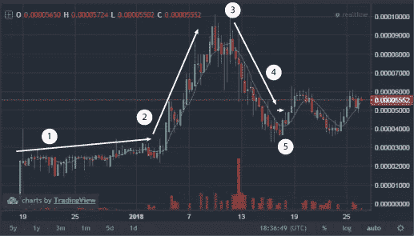

# 阿该因第一岔口(ABTC)的“前后”

> 原文：<https://medium.com/hackernoon/the-before-and-after-of-achain-first-fork-abtc-ae7f3a050516>

是由 Aqua Zhao 先生、Arthur Qiang 先生和一群技术爱好者将[比特币](https://hackernoon.com/tagged/bitcoin)和[阿查因](https://www.achain.com/)混合在一起成立的一个分支。它结合了比特币和 Achain 的优点:光速契约、跨链通信、反量子攻击、低费用和 DPOS 共识机制。这是 Achain 最伟大的技术创新之一，最重要的是，这是 Achain 的[叉子理论](https://blog.goodaudience.com/achain-simply-the-future-53c905a43019)的首次测试。

编号为 [**1498888**](https://browser.achain.com/#/BlockInfo/1498888) 的木块是第一部史诗《阿该因之叉》中被选中的木块。分叉正好发生在 2018 年 1 月 13 日凌晨 01:43:30(GMT+8)，在拍摄快照时，BTC 持有者按照 1:100 获得 ABTC，ACT 持有者以 1:1 获得 ABTC。

让我们分析一下 ABTC 发生了什么，以及分叉前后的情况。

# 演戏怎么了？

8 hr candle of ACT/BTC on Kucoin exchange

事情是这样的，自从它加入库币交易所以来，市场对持有人(1) 有了线性的接受，然后价格在一月初开始上涨，因为越来越多的人开始发现即将到来的分叉。叉子(3) 之后，价格立即下跌了-50%,因为在那里拿叉子的人以尽可能高的价格出售，所以价格开始下跌到初始值。很多人买了蘸酱**【4】**但是那段时间整个硬币市场都是红色的，所以它仍然持续下跌了几天，之后价格开始稳定。

我真的很好奇，想知道这种*叉子泵和倾倒*的模式是否会**在每个阿钦的叉子**中重演。与此同时，所有人都已经在思考**的下一个分支**:[**BitcoinOS**](http://www.bitcoinos.io/)(BOS)，一个集成了比特币和[区块链](https://hackernoon.com/tagged/blockchain)技术的新操作系统。到目前为止，还没有很多关于新 fork 和 BitcoinOS 的信息，但是这个项目似乎很有趣，我肯定会继续关注它。

# ABTC 怎么了？

与此同时，在 ACT 积累持有人的同时，ABTC 制造了第一个比特币**分支**，比特币被添加到 [OurDax](https://www.ourdax.com/) (一个新的交易所)和 [Kcash](https://www.kcash.com/) (一个新的多货币钱包)，当然，它仍然不可交易。OurDax 在数学上设定了每 ABTC 150 美元的价格，因为它考虑了比特币的价格和流通供应量的 x10。目前，OurDax **的价格跌至 30 美元**，同样，在这种情况下，数学上是由两个连接在一起的分叉混合得出的。

所以在这一点上，**发生了三件事**:

1.  人们开始**等待**收到他们的 ABTC:几天后已经送到 Kcash 和 Achain 官方钱包用户手中；一周后，ABTC 团队将为在拍摄快照时对库币采取行动的人保留的硬币交付给了库币。
2.  在 KuCoin 上收到 ABTC 的时间感觉像是无限长，因为与此同时在 OurDax 上人们开始在 ABTC 的初始价格上进行交易:它从 30 美元跌到 0.05 美元。
3.  但是 **Kcash 还是显示了 150$** 的 ABTC 价格所以有很多困惑:**想象一下，一觉醒来，看着自己的钱包，读到自己是百万富翁**，会震惊吧？

Wallet of an Achainer posted on the telegram group

ABTC 的未来是未知的，它肯定可以与其他比特币模仿者竞争，它背后确实有一个很酷的技术，现在这一切都取决于团队，营销和交易所(直到现在 ABTC 只能在 OurDax 交易)。

# 这把叉子对亚该隐来说是好东西吗？

首先，每个分叉对 Achain 都有好处，把它当成一个**检查点:**在 Achain 上制作的每个分叉总是会让主链更加健壮和安全，因为每个分叉都是主链的备份。

我认为，总的来说，这把叉子对阿切因来说是一件非常好的事情，至少有几个原因:
-这是叉子理论的第一次实际应用，所以它不再仅仅是理论上的；
——**阿琴顶住了叉子**，它没有消失；
-他们表明新分叉的硬币和行为之间的价格不需要相关，**他们可以遵循自己的道路**；
-他们**引入并测试了第一个给新生硬币赋予价值的机制**这要归功于数学预测和特征。

# 根据功能来定价格对吗？

我认为这是一个设定价格的好方法:**你算算，然后市场自己决定**。以这种方式定价也是非常健康的，以比特币的主要分叉为例:分叉后，它们的价格几乎都是 100 美元，没人知道为什么。至少现在初始价格非常低，由于其内在价值，几乎为零，但不为零，如果有一天它达到 100 美元，这意味着硬币真的有价值和使用案例。

此外，如今很难理解某些东西的价值，尤其是加密货币。**比特币的真实价值是什么？以太坊？Achain？一枚比特币？**