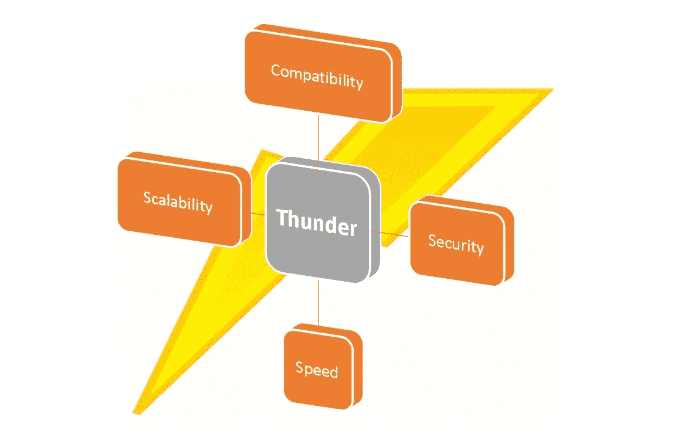
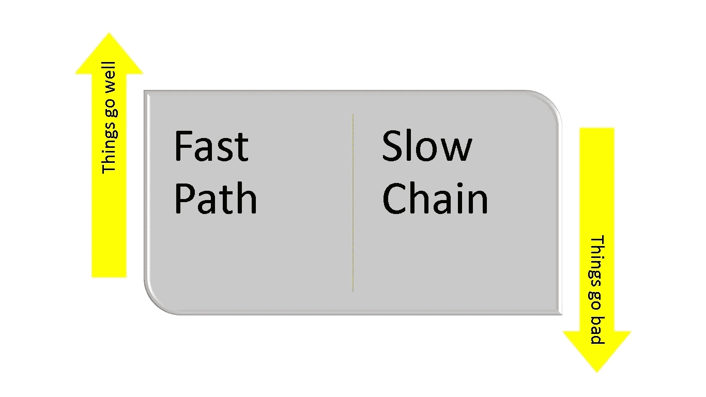
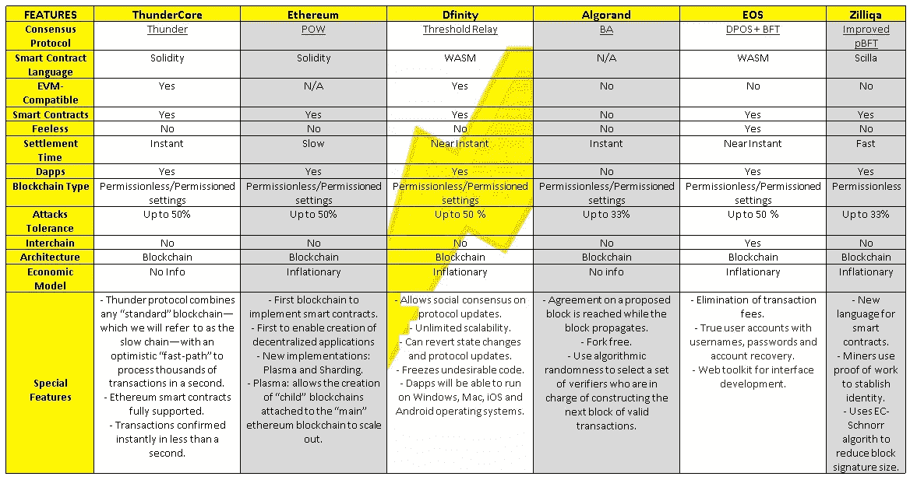

# 初学者使用 ThunderCore 的方法

> 原文：<https://medium.com/hackernoon/the-beginners-approach-to-thundercore-fc5d906dd857>

Image obtained from ThunderCore´s [website](https://www.thundercore.com/team).

[ThunderCore](https://www.thundercore.com/) ，在我看来是 2018 年最扎实最精彩的项目之一。他们正在研究一个可以适用于任何[区块链](https://hackernoon.com/tagged/blockchain)的解决方案，它包括以下内容:在标准的区块链“慢链”之上的一条快速路径，在这里交易被立即确认，以及当事情变糟时使用的慢链。这篇文章尽可能简单地解释了这个项目，因为目标受众是非技术人员。

这是“初学者方法”系列文章的第一篇，该系列文章将包括在我看来将引领[区块链](https://hackernoon.com/tagged/blockchain)革命的最有前途的项目。

## **简介**

## **一言以蔽之的迅雷核心**

迅雷是一款安全、高性能的区块链；其目标是使分散式应用程序能够被大规模采用。

## 【ThunderCore 能提供什么？

*   **兼容性:**以太坊智能合约将得到全面支持。您将能够将 DApps 迁移到 Thunder，并立即提高它们的性能。
*   **可伸缩性:**一秒钟内处理成千上万个事务，没有任何事情被搁置。
*   **速度:**让您的交易在不到一秒的时间内立即得到确认。
*   **安全:**享受基于数学的安全保障。Thunder 与现有的区块链一样安全，但速度和效率大大提高。

## 从技术角度来看，是什么让 ThunderCore 与众不同？

迅雷在被称为“慢链”的标准区块链的基础上增加了一个“快速通道”。在正常情况下，所有交易都在快速通道上即时确认，几乎不用使用慢速通道。如果快速路径曾经被中断，则调用可证明正确的机制来退回到慢速链，并且节点可以继续在慢速链上通信和确认事务。一旦诊断出问题，快速通道就会恢复。[迅雷的共识协议](https://docs.thundercore.com/thunder-whitepaper.pdf)的每一步都有严谨的数学证明做后盾。因此，迅雷以每秒数千笔交易的速度实现了高吞吐量和快速确认。

## **为什么 ThunderCore 是最简单、最快、最具表现力和最安全的区块链解决方案？**

*   实现高吞吐量和快速确认时间。
*   提供高达 50 %攻击的安全性和鲁棒性。
*   直接支持 EVM(以太坊虚拟机)-智能合同和 EVM-dapp 设计的以太坊很少或没有修改。
*   有其安全性的数学证明。

## 谁是 ThunderCore 的幕后黑手？

ThunderCore 是一个由成功的企业家和获奖的科学家和工程师组成的团队。他们不仅创立了加密货币和合约(IC3)的[倡议(T3)，还合作撰写了关于](http://www.initc3.org)[比特币](https://hackernoon.com/tagged/bitcoin)和智能合约的第一份学术出版物。关于团队的进一步信息[在这里](https://www.thundercore.com/team)。

## **雷霆协议一言以蔽之**

Great analogy to explain what ThunderCore is capable to do. Elaine Shi is the ThunderCore´s Chief Scientist.

> Thunder 协议将利用简单的快速路径协议结合底层的慢速链来确保最坏情况下的最坏情况安全性，以及乐观情况下的即时确认和高吞吐量。关键的想法是，当事情进展顺利时，利用“快速路径”协议，而只使用慢速链从故障中恢复。

## 该协议及其主要特征

## **快速通道的主要功能是什么？**

快速通道提供高吞吐量和即时交易确认。

## **慢链的主要功能是什么？**

“慢链”确保不会对区块链造成任何损害，然后以可证明的良好方式恢复。

## **快速发展道路的主要参与者是什么？**

*   **委员会:**快速通道协议由利益相关方委员会执行。
*   **加速器:**快速路径协议由一个称为加速器的中央机构协调。加速器的工作是将交易和数据线性化(这是一项分散化很难完成的任务，但对中央政府来说却很容易)。

## **在什么情况下必须使用慢链？**

*   加速器运行不正常或受到攻击。
*   不到四分之三的委员会工作正常。
*   网络条件很差。

## **如何通过快速通道即时完成交易？**

Transactions Flow. Images obtained from [here](https://www.youtube.com/watch?v=DY2qhydRK_0).

**S1:** 领导提出带有序列号的交易，并将它们发送给一组委员会成员。

**S2:** 委员会成员确认他们收到的带有序列号的交易，在上面签名，然后将它们发回给负责人。如果委员会玩家收到多个具有相同序列号的交易，他们只签署一个。

**S3:** 如果一笔交易有足够多的确认，则被视为已确认。

**S4:** 交易需要略多于 2/3 的确认才能确认。

**S5:** 一旦条件满足，交易**确认 。**

## 更深入地解释交易是如何即时完成的。

1-所有新事务都发送到加速器。

2-加速器将事务捆绑成微块，用递增的序列号 seq 对每个微块进行签名，并将签名的微块发送给玩家“委员会”。

3-委员会成员通过签署来确认所有加速器签署的微块，但是每个序列号最多只确认一个微块。

4-当微区块收到超过 3/4 的委员会成员的确认(即签名)时，该微区块将被公证。

5-参与者可以直接输出其最长的连续(根据其序列号)公证微块序列——其中包含的所有交易都被视为已确认。

## **快速通道如何从故障中恢复？**

如果委员会成员看到慢链上的一些交易没有在足够长的时间内得到公证，他们就知道加速器(或大部分委员会成员)一定在作弊或离线。此时，委员会成员将停止签署心跳消息。为了纠正这种情况，会发生以下情况:

1-只要只有 1/4 的委员会是诚实的，一个作弊的加速器将被“窒息”，因此没有加速器的新心跳将被公证。

2-观察慢链的每个人都将进入“冷却”阶段，随后进入慢模式。

3-一旦进入慢速模式，所有交易都在慢速链上发布，重新启动快速路径的最简单方法是向慢速链发布“召唤”消息，以召唤委员会成员在某个时间点重试(Thunder 节点可以使用慢速链讨论并投票决定如何以及何时重新启动)。

## **如何挑选委员会？**

在利益相关者中选择委员会的方法有很多:

**方法 A:**

1- Thunder 要求任何想在委员会工作的人都要在慢链上交一笔托管费。

2- Thunder 从已经在慢链上放下托管的实体中选择 500 个成员。

3-选择由算法执行(来自他们早期作品[白雪公主](https://eprint.iacr.org/2016/919.pdf)的方法)。

**方法 B:**

迅雷选择投入最多股份的成员，因为我们希望鼓励更多的股份加入委员会，保护快速通道。

Thunder 实现的实际算法就是受这一思想的启发，但它是一个精心制作的变体，因此 Thunder 可以证明平衡行为满足某些期望的属性。

## **第一个迅雷版本的主要特点是什么？**

*   它将完全兼容 EVM(以太坊虚拟机),支持现有以太坊 DApps 的直接迁移。
*   以太坊的区块链将成为潜在的“慢链”。
*   迅雷将依靠单加速器；在以后的版本中，该系统将扩展到支持多个碎片，每个碎片都有自己的专用加速器。

## **THUNDERCORE 对比其他区块链**

Refer to the spreadsheet [here](https://docs.google.com/spreadsheets/d/1mRFJTDx5MACuxtMD3WTFnZDOGe4Jq5NPK-LNqRdg4pc/edit?usp=sharing)

## 结论

当谈到建立突破性的[技术](https://hackernoon.com/tagged/technology)时，拥有一个经验丰富、能力出众的团队可以极大地提高任何项目的成功率。ThunderCore 拥有在现有和新区块链项目中脱颖而出的强大基础，成为 EVM 兼容的区块链给了他们优势。如果 Thunder 的团队成功地实现了所有提议的特性，并建立了一个强大的开发者社区，那么该协议有很大的机会被新的和现有的基于以太坊的项目所采用。

该项目仍处于早期阶段，让我们看看未来几个月 ThunderCore 的进展如何。

如果你喜欢这篇文章，请拍下来分享给其他人，让他们也能找到。别忘了关注我，成为第一个知道我即将出版的出版物的人。

*鸣谢:感谢* [EOS 白皮书](https://medium.com/u/d96854da30dd#accounts)。

*   [阿尔格兰德白皮书](https://arxiv.org/pdf/1607.01341v8.pdf)。