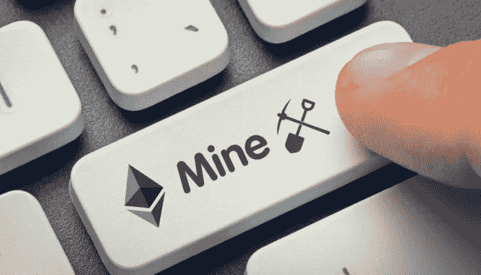
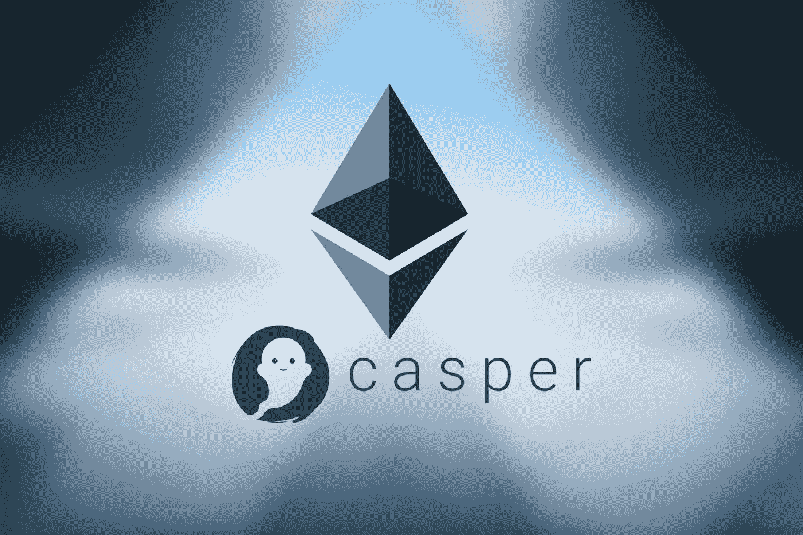
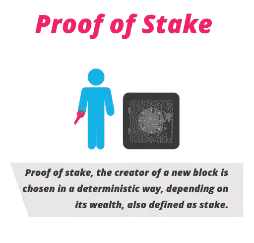

# 以太坊挖掘和 Casper 更新初学者指南。

> 原文：<https://medium.com/hackernoon/the-beginners-guide-for-ethereum-mining-and-casper-update-45b9ca938698>

以太坊基于比特币协议及其区块链设计，但经过修改，可以保留货币系统以外的应用程序。这两个区块链唯一的相似之处是它们存储了相应网络的全部交易历史，但以太坊[区块链](https://hackernoon.com/learn-blockchains-by-building-one-117428612f46)做的远不止这些。除了交易历史，每个以太坊网络节点还必须下载网络中每个智能合约的最新状态或当前信息、每个用户的余额以及所有智能合约代码及其存储位置。

# 如何挖掘以太坊？

你需要用你的电脑去[挖掘以太坊](https://hackernoon.com/how-to-mine-ethereum-in-5-min-3f3bc80d0c4b)。如果你参与过以太坊，你应该知道它是在区块链中工作的。协议上的所有交易都需要批准。每一笔交易都需要验证，放入以太坊区块链。这个验证过程被称为 PoW 或[工作证明](https://hackernoon.com/proof-of-work-vs-proof-of-something-else-272d2f5cf20a)。

嗯，如果你是一名矿工，你需要确保在区块链没有人欺骗协议。这是通过解决复杂的数学问题来实现的。一旦你这样做了，你就把它传达给其他矿工。如果 51%的矿工同意这个数字是正确的，新开采的区块将被添加到区块链。

为了能够破坏，你需要一台配备显卡的电脑，最好是台式机。由于以太坊采矿主要使用视频内存，您必须确保您的显卡至少有 2GB 的内存。这个前提条件通过了，我们接下来就有必要开矿了。

# 采矿池

总的来说，[加密货币协议](https://hackernoon.com/will-cryptocurrency-protocols-be-fat-or-thin-36584863b0f8)只奖励发现真实交易“块”的未成年人。只有计算“好”交易块的未成年人会得到奖励。在同等计算能力下，破块的概率是随机的。为了增加它的机会，人们于是增加了计算的能力。除非你在采矿设备上投入了巨资，否则靠自己找到一个区块的可能性微乎其微。这就是采矿“池”介入的地方。

# 采矿选项

嗯，有几个选项可以用来开采以太坊。不过其中最受欢迎的还是[池采](https://hackernoon.com/bitcoin-mining-understanding-mining-pools-and-increasing-daily-payouts-2b3b01eb87ba)。事实上，它被认为是最值得信赖的采矿方法。其他挖掘方法包括单独挖掘或使用基于云的挖掘服务。

专家建议不要选择单独采矿或使用云服务。通过池采矿选择采矿是一个最好的，值得信赖的和最舒适的选择。集体挖掘将让你与其他人一起工作，因此他们将能够彼此达成一致(或者达成共识，如果我们使用确切的术语的话)并分享奖励。

然而，你应该保持足够的警惕，而选择泳池。并非所有的池都是相似的。你需要考虑几个问题。你需要注意的一些特征是泳池的大小、支出和泳池费用。一个大小合适的游泳池将有助于与更多的矿工一起工作，并舒适地分享奖励。去找一个透明的，公平的，容易使用的池矿。此外，检查池具有较低的最低支付水平。这将帮助你获得更好的日常回报，而不是等到你达到门槛。

更高的池费可能不是一个实际的选择。看看游泳池的费用是否很低。这些付款是基于百分比的。这取决于你正在开采的加密货币。优选的池费一般应该在 1%到 3%左右。任何收费超过 3%的泳池都不是一个好主意。如果你正在寻找一个联营矿，一个很好的选择就是 [2Miners Pool](https://2miners.com/eth-mining-pool) 。服务工作以这样的方式设计，即使是新手也能够舒适地使用它。它为你提供了挖掘以太坊的算法。其实它给你提供了两种挖掘以太坊的选择。你可以选择 PPLNS 模式，所有的矿工一起工作，分享他们之间的回报。如果你足够自信，你可以在单人模式下独自采矿。

# 开采以太坊需要什么？

一旦你有了一台电脑来挖掘你的以太坊，并选择了一个合适的和有效的池矿，你将需要一些配件来工作。

您需要的其他一些配件包括

以太坊钱包，用于存放新发现的货币。

高效的 GPU 驱动器

采矿应用。你可以选择一种克莱莫地雷的形式。

采矿池地址。

显卡。你至少需要 3 GB 的内存

高效运行的操作系统。64 位架构的 Windows 7 或 10 应该是您可以选择的最佳选择之一。

确保您已经为您的 GPU 下载了正确的驱动程序，这样您就不会遇到任何问题。

# Casper 更新-以太坊的里程碑

一个被称为 Casper 的升级版本将会完成“赌注证明”的传递。最近以太坊的开发者发布了一个新版本的 [Casper 代码供公众使用](https://github.com/ethereum/casper)。开发人员的目标是让 Casper 尽可能地多才多艺。

一旦升级到 Casper，以太坊将变得更加稀有。卡斯珀 FFG(友好的终结小工具)是工作证明(POW)和利益证明(POS)的结合。很快，他们计划完全转向 POS 共识。通过这一升级，区块将获得 0.82 ETH 而不是 3 ETHs 的奖励，从而降低通货膨胀率。

# 然而，卡斯帕是什么？

卡斯帕·FFG 于 2017 年 10 月出版。目的是创建一个混合共识系统，以纠正与加密货币提取相关的问题。

因此，从工作证明网络到问题证据的过渡将通过 Casper 倡议进行。

对于以太坊来说，从工作证明(POW)转向利益证明(POS)一直是长期计划的一部分。电力消耗大量能量，没有绝对的货币价值。

Casper 的 FFG 协议可以在任何块提议机制上实现，这将给出它所依赖的字符串。FFG 覆盖机制需要最少的协议修改，这允许网络完全测试和评估功率上的卡斯帕 FFG。(类似比特币和 segwit + LN 的层系统)

# 出于什么原因要转到利害关系证明？

其中一个原因是高能耗。然而，平等使用采矿设备、控制“矿池”和 ASIC 矿商市场的发展也是问题。

在某种程度上，开采以太坊将变得具有挑战性，因为高昂的成本无法抵消收益。

[利害关系证明](https://hackernoon.com/what-is-proof-of-stake-8e0433018256)将依靠用户的计算能力来保护网络。然而，与传统的证明工作相比，它消耗的能量要少得多。

目前正在开发解决方案来解决以太坊的一些最紧迫的问题。Casper、sharding 和 plasma 旨在改善网络及其性能。以太坊目前存在严重的问题，去年 12 月，当该系统在一堆数字小猫的影响下几乎停止运行时，这一问题就突显出来了。

# 我们对卡斯帕的结论是:

Casper 开发人员非常清楚这种即将到来的变化所带来的风险。为了应对潜在的问题，Casper 将使用“程序化经济”模型。任何试图通过恶意或其他行为攻击网络的网络节点都将受到惩罚。

尽管 Casper 在理论上看起来很有前途，但仍有许多工作要做。它将在未来几年让以太坊变得更安全、更高效。卡斯帕似乎是以太坊发展的一个突破口。

以太坊的联合创始人 Vitalik Buterin 最近展示了关于 Casper 测试的所有最新细节。注意，有可能是 2 到 4 个月内成立。他说，对最终用户来说，这个过程将像点击鼠标一样简单。

# 结束语

挖掘以太坊是保持分散状态和赚取奖励的正确方法。事实证明这是值得一试的。市场对以太坊矿业反应良好。随着大量的人选择以太坊采矿和不断增长的成功率，我们确实可以预见这个概念的美好未来。