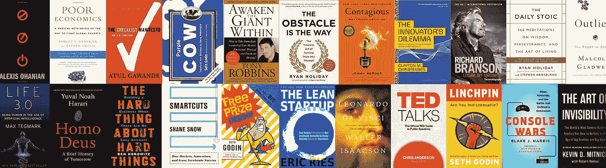
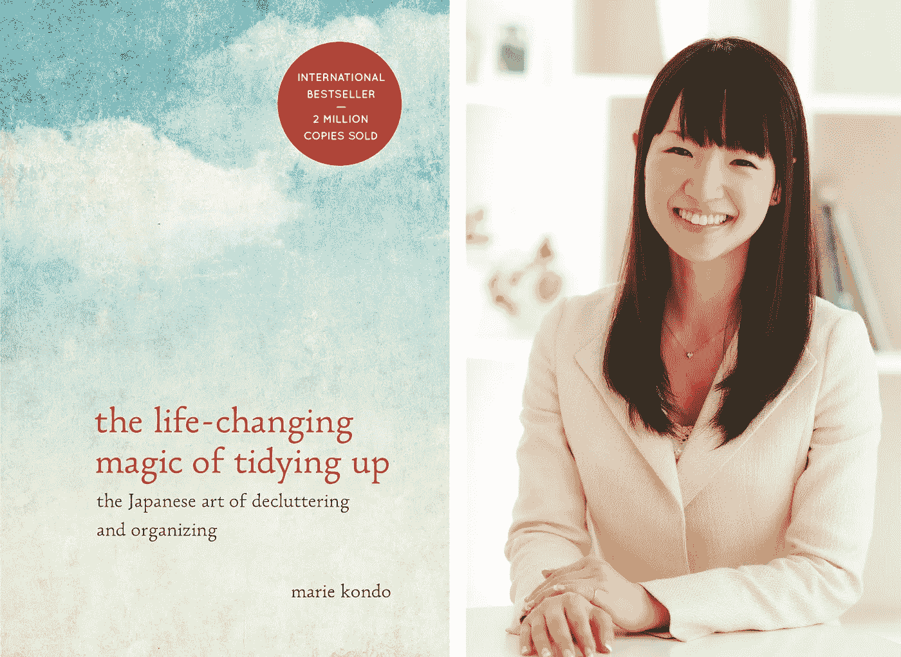
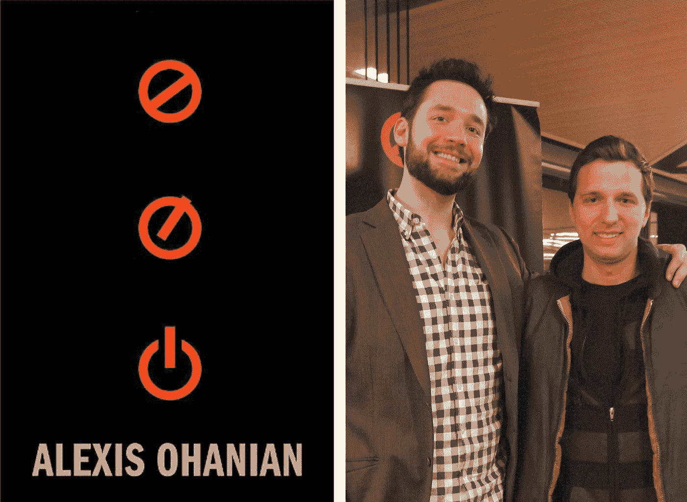
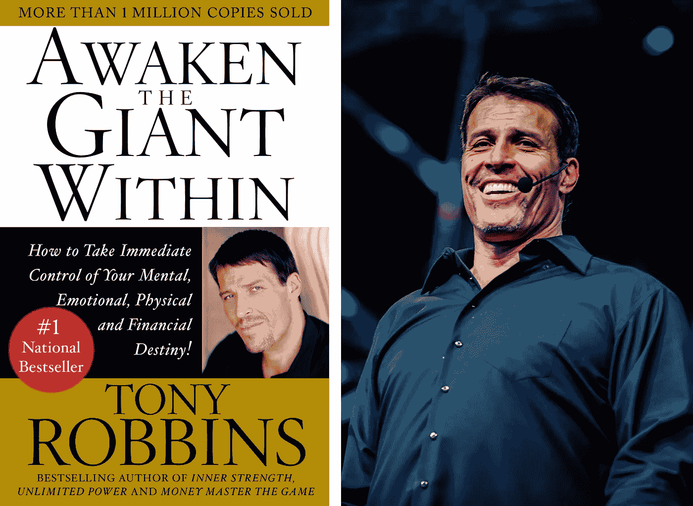
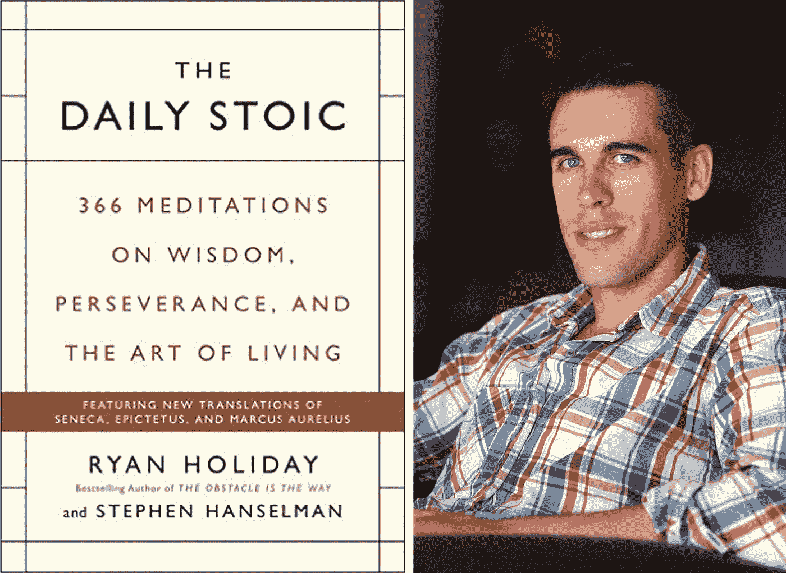
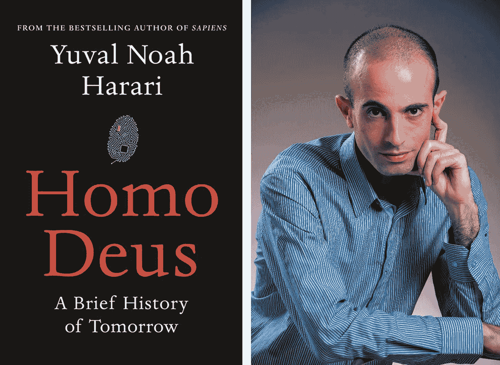
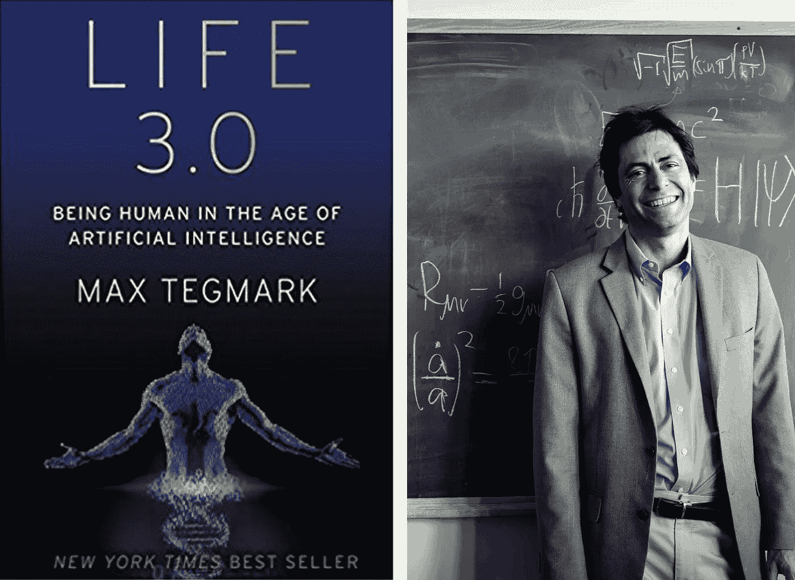
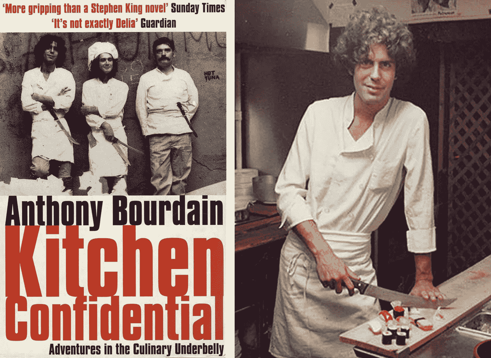
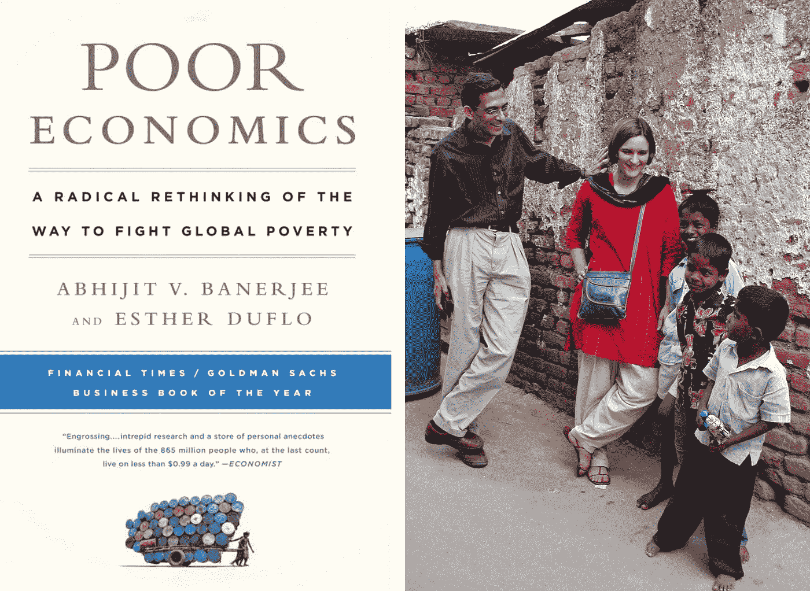

# 2017 年我读过的最好的书

> 原文：<https://medium.com/hackernoon/the-best-books-i-read-in-2017-79b09802db8c>

我在 2017 年不知何故设法读了 30 本书。与作者 Ryan Holiday 每年阅读的 250+相差甚远，但我希望很快达到这个水平。有些书很有启发性，有些则不然。以下是我喜欢并强烈推荐的八个(排名不分先后):

## 1.改变生活的整理魔法:日本的整理艺术

我第一次听说玛丽·近藤是通过她对蒂姆·费里斯的播客采访。我一直发现自己每周或每月都在清理自己的生活空间，但读了她的书后，我已经能够应用她改变生活的 KonMari 方法(在一定程度上)。下次你需要整理的时候，拿起每一件物品，回答一个简单的问题:“这给我带来快乐了吗？”如果没有，也不是必须的，是时候为它找个新家了。不要陷入在几个月不碰或不看物品后说“我可能有一天需要它”的陷阱。

## 2.没有他们的许可:21 世纪将如何被创造，而不是由亚历克西斯·奥哈尼安管理

几年前，我在 Reddit 的联合创始人亚历克西斯·奥哈尼安(Alexis Ohanian)巡回售书时，见过他本人。这是我第二次未经他们允许阅读*，我想再看看他和保罗·格拉厄姆在 Y Combinator 的早期开端，以及他的后续创业；Hipmunk。*

## *3.唤醒内心的巨人:如何立即控制你的精神、情感、身体和财务*

**

*你很可能已经看过或听过网飞的纪录片*我不是你的导师*关于托尼·罗宾斯的一个事件。我一直对自助大师持怀疑态度。但是托尼是真材实料。他的伟大和活力帮助人们更加了解自己的生活。*

*这本书的一个主要观点已经成为我每天的口头禅:“关注无所作为的痛苦”。*

## ***4。《日常的斯多葛派:关于智慧、毅力和生活艺术的 366 次冥想》***

**

*我读过的最发人深省的书之一。有人建议每天读一页这本书，但我发现自己一次读得多一点，跳过几天。斯多葛主义让我在更深的层次上审视自己的情绪。这是一个我们可以用来成为更好的企业家、更好的朋友和更好的人的工具。*

*作为一名企业家，你可以看到实践不幸是如何让你在逆境中变得更强大的；如何颠倒障碍，将问题转化为机遇；以及记住自己有多渺小如何让你的自我变得易于管理和正确。*

*最终，这就是斯多葛主义的意义所在。这不是对世界为什么存在或如何存在的系统讨论。这是一系列关于过好生活的提醒、提示和帮助。*

## *5.《德乌斯人:明日简史》尤瓦尔·诺亚·哈拉里著*

**

*我拿起这本书和《生活 3.0》是因为 T2 在他的博客上推荐了它们。人工智能将在不久的将来重塑我们的生活。我们需要严肃对待这个话题，并意识到它对我们个人和职业的影响。*德乌斯人*解决人类和人类的可能性。因此，这两本书对我思考人类的未来产生了深远的影响。*

## *6.生活 3.0:成为人工智能时代的人类*

**

*随着人工智能散布恐惧的 clickbait 文章的流行，这些文章是由假记者写的，他们唯一的工作目的是从你的点击中赚钱，我发现了这本伟大的书，它对我们拥有的技术以及它可能带我们去哪里提供了很好的基本理解。所以不要点击你在 LinkedIn 上看到的标题为*的下一篇文章，你会被机器人抢走工作——而且比你想象的还要快*，请阅读这本书。*

## *7.《厨房机密:安东尼·鲍代恩的美食冒险》*

**

*去年一月，我在飞往迪拜的飞机上开始阅读这本书，但一直没有读完。去年 11 月，我拿起它，在一周内从头到尾读了一遍。Bourdain 给了烹饪界一个原始而滑稽的视角。这是一本写得很好的娱乐性的书，我强烈推荐给任何想进入餐饮业的人或者对这个行业很好奇的人。他的后续书籍 *Medium Raw* 是我 2018 年阅读清单上的下一本书。*

## *8.《贫穷经济学:彻底反思与全球贫困作斗争的方式》Abhijit Banerjee & Esther Duflo*

**

*这本书是任何关心世界贫困问题的人的必读之作。虽然我们大多数人生活在安全的空间和泡泡里，但还有数百万人每天都在为满足基本的生理需求而挣扎。贫穷经济学想要我们做的是重新思考我们向那些需要帮助的人提供援助的方式，但更重要的是理解穷人如何做出令人质疑的决定，这些决定助长而不是对抗贫穷。*

*这是我去年读过的其他书。虽然他们中的许多人都很棒，但他们没有进入前 8 名。*

*   ****主机大战:世嘉、任天堂和定义一代人的战斗*** 布莱克·j·哈里斯著*
*   *谢恩·斯诺著 ***Smartcuts:黑客、创新者和偶像如何加速成功****
*   ****会传染:为什么事情会传染上*** 作者约拿·伯杰*
*   ****隐身的艺术:世界最著名的黑客教你如何在老大哥和大数据时代安全*** 作者凯文·米特尼克*
*   *清单宣言:如何把事情做好*
*   ****紫牛:通过卓越改变你的业务*** 塞思·戈丁著*
*   ****《精益创业:今天的企业家如何利用持续创新来创建彻底成功的企业》作者埃里克·里斯****
*   ****免费奖品内幕:下一个大营销创意*** 作者塞思·戈丁*
*   ****异类:成功的故事*** 马尔科姆·格拉德威尔著*
*   *本·霍洛维茨 ***关于困难的事情:在没有简单答案的情况下创业****
*   *障碍是道路:将考验转化为胜利的永恒艺术*
*   ****失去童贞*** 理查德·布兰森著*
*   *创新者的困境:当新技术导致大公司失败时克莱顿·M·克里斯坦森*
*   *TED 演讲:官方 TED 演讲指南，克里斯·安德森著*
*   *关键:你是不可或缺的吗？ 塞思·戈丁著*
*   *罗伯特·恰尔迪尼 ***影响:科学与实践****
*   *谢家华的《传递快乐:通往利润、激情和目标之路》*
*   ****达芬奇*** 沃尔特·伊萨克森*
*   *唐·诺曼设计的*
*   **马克·曼森的《不给一个 F*ck 的微妙艺术:过上美好生活的违反直觉的方法》**
*   *****谷歌如何运作*** 埃里克·施密特和乔纳森·罗森伯格著**

## **如果你喜欢这篇文章，请👏并分享给你的朋友。记住，你最多可以鼓掌 50 次——这对我真的很重要。**