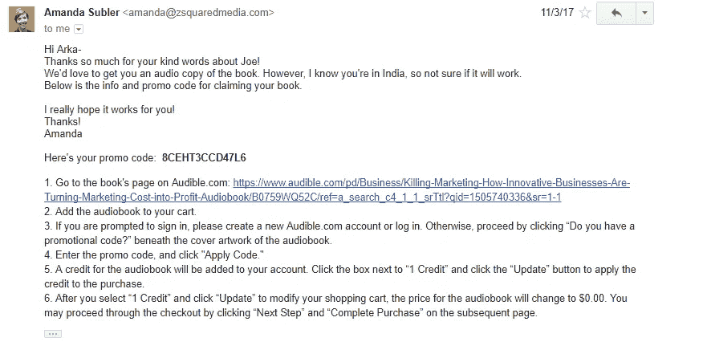

# 我去年学到的最好的商业技巧来自 Joe Pullizi 和内容营销协会。

> 原文：<https://medium.com/hackernoon/the-best-business-hack-that-i-have-learned-last-year-is-from-joe-pullizi-and-the-content-marketing-c043cfee1dcc>

2017 年是反常的一年。

我犯了更多的错误，学到了很少，尝试了更多，最终努力离开我的茧和连接。

## 结果就在那里，就在最上面。我需要解释这个吗？

是的，你转动的眼睛可以看到我收到了伟大的乔·普利兹的一封漂亮的回信。现在，如果你在内容[营销](https://hackernoon.com/tagged/learning)领域忙碌，你就会知道这个名字的重要性。

你知道这个人是如何开创了一种潮流，将其扩展到商业领域，并与其他先驱一起开创了一个行业。说够了。海量尊重！！！

**那么，我是怎么得到乔的爱的呢？**

因为我爱乔。是的，就这么简单。

A letter for a man, a catalyst and a touchstone

# **快速回顾:**

内容营销研究所的创始人乔在他令人心碎的帖子中表示，他将很快告别他的研究所。

这让我震惊，让我激动，我猛攻键盘。

## 我想感谢乔做我的向导。我想告诉乔我会多么想念他。时至今日，我仍不希望 Joe 离开 CMI。所以，我写了这封信。

乔回答说，我高兴得手舞足蹈。然后，CMI 的另一位伟大的灵魂人物 Amanda 带来了更多的惊喜和美食。

Hope, you have not missed this.

我像被施了魔法的灵魂一样答应了。

Can you smell the happiness here?

瞧，阿曼达遵守了她的诺言。如今，信守承诺听起来有些矛盾，但像内容营销研究所这样的大企业很清楚自己的底牌。

Awesome Amanda!!!

如果你足够老练，你现在知道我接下来要说什么了。你看，我没有创立过任何六位数或八位数的企业，但我一直在与那些坚持不懈地开创成功事业的初创公司合作。

我在那里探索的虚空已经被 CMI 漂亮地回答了。**我们来说说他们——**

# **传播爱但不出卖爱:**

我不是名人。帮我 CMI 和 Amanda 不会有很大的后果。那么，乔为什么回复我呢？为什么阿曼达会给我这样的免费赠品？

我认为这就是伟大企业的标志(是的，以我对商业运作的零基础经验来看)。他们是来建立关系的。

在一系列推文和电子邮件中，CMI 与我打了一个结。现在，在将来，如果他们拿着乔的另一本书来找我，他们会立刻引起我的注意。当你有注意力时，剩下的只是建造乐高玩具。

# 伸出手。立即联系:

是掷骰子和反省的时候了。

当我想到抓住乔的电子书的整个事件链时，我明白，我没有采取正确的步骤。

1.  与乔联系。
2.  向乔转达我的信息。
3.  建立关系。

我们来分解一下。

乔一发表他的文章，我就精神抖擞。我的缪斯将我置于她的羽翼之下，我立即写下了这封信。

是好还是坏？我不知道。但是，我的信息引起了乔的共鸣。这对我至关重要。我相信乔也这么想。

下一个任务是引起乔的注意。推特拯救了我。我的第一次尝试是徒劳的。所以，我决定再试一次。

This is Hustle, I guess.

称之为黑客或研磨，我只是尝试，尝试，直到我从乔或他的团队得到一些东西。我的目标是引起注意。抓起一本有声读物？不，那不在我的蓝图里。

我被乔的回答逗乐了。不是每天乔都会回复你，但是当他们回复的时候，我们必须在他们的记忆中留下一个小小的凹痕。所以，我以最大的诚实描绘了一幅更大的画面。

A small effort! :)

现在，这不是一个聪明的回答。我知道。但是，不知何故它起作用了。乔没有承诺，他们的下一次 CMI 会议将在印度举行。我对此感到遗憾。

***但是阿曼达已经很好地补偿了我。***

当你把这些事件串联起来，“创造一个能引起共鸣的内容——传递你的信息，让对话升温”，一个有意义的商业前景就萌芽了。

现在，把乔想象成我的顾客，把我想象成一个机会主义者(诚实的)推销员，经历一系列事件——这就是销售漏斗的样子。不是吗？

# 从骚动中脱颖而出:

对于每一个企业和内容创作者来说，第一场战斗就是对抗数字噪音。在为乔创造“东西”之前，我也不知所措。

我本可以做海报的。

我可以给乔发一条普通的微博。

但是，我决定玩一个不同的游戏。作为对乔来信的回复，我又给乔写了一封信。这在两个方面帮助了我-

1.  给了我更多的空间来表达我所有的情感。
2.  谁不喜欢收到信呢？

这对我来说是一个很大的收获。为了获得关注，为了引发吸引力，我们需要确定正确的渠道和正确的内容策略。

## 这不是必须的，我们必须制作一个花哨的信息图或一个很酷的视频。有时候，一种古老的交流方式可以引发互动。

问我。:)

# 包扎

谢谢你乔。谢谢你阿曼达。帮助我理解内容和参与的力量。谢谢你帮我揭开商业元素的神秘面纱。现在，我知道了**“爱的力量”，“伸出手的需要”。**

它们听起来很简单。当你把你的心倾注在那里时，它们是简单的。再次感谢乔和阿曼达帮助我解码咒语。

页（page 的缩写）你什么时候来印度？