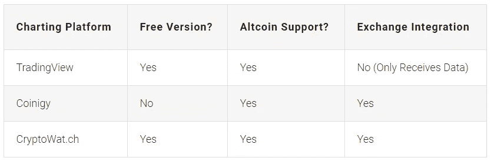
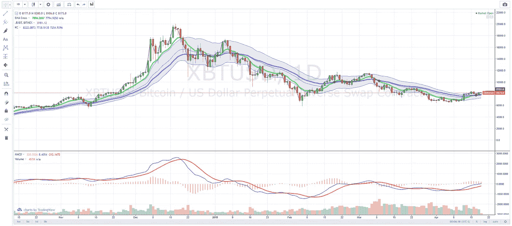
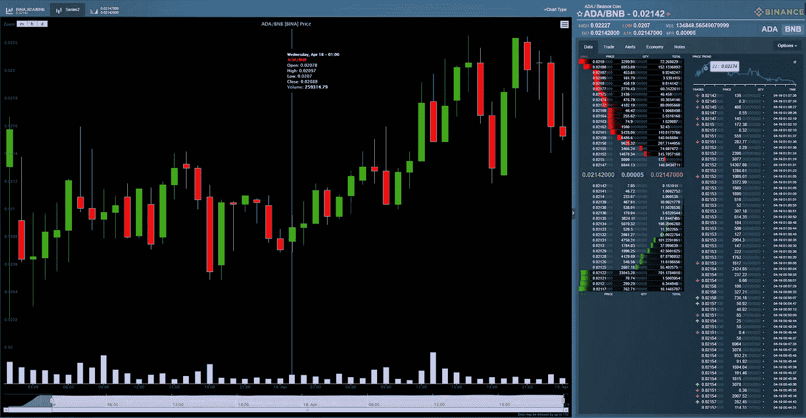
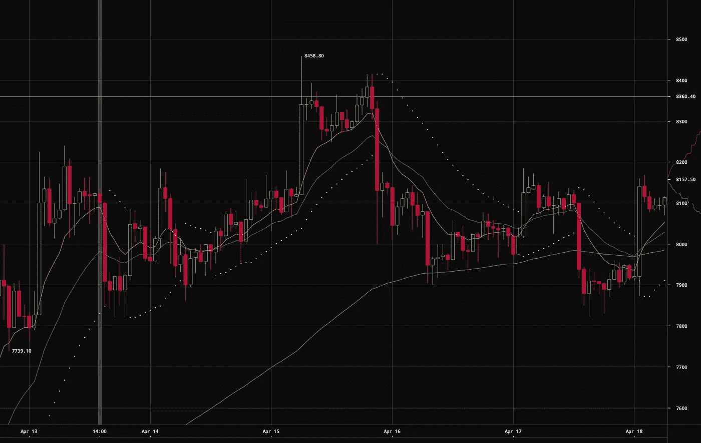

# 密码交易员的最佳制图工具

> 原文：<https://medium.com/hackernoon/the-best-charting-tools-for-crypto-traders-d491cfb33a88>

如果你是第一次接触[加密](https://hackernoon.com/tagged/crypto)交易，甚至是一个有经验的交易者，绘制[工具](https://hackernoon.com/tagged/tools)在发展你的技术交易策略时会非常有帮助。市场上有许多不同的图表解决方案，但就功能集、易用性和 exchange 集成而言，这三个是我们能找到的最好的。

如果你正在寻找更多的东西，一定要看看我们的[密码交易员终极资源列表](https://www.cryptotrader.tax/trading/the-ultimate-resource-list-for-crypto-traders-investors/)。

# [交易视图](https://tradingview.go2cloud.org/aff_c?offer_id=2&aff_id=10306)

TradingView 是迄今为止最受所有市场交易者欢迎的图表和技术分析工具。近年来，他们努力将他们的工具集与最受欢迎的加密货币交易所集成在一起，结果令人印象深刻。他们的在线图表工具对免费用户和专业用户开放。

对于大多数交易者来说，一个免费账户应该足够开始学习技术分析的基础知识了。免费帐户仍然可以像专业用户一样使用专业工具，但是每个图表只能有三个技术指标和覆盖图。

列出 TradingView 的所有功能需要几个小时。如果你在他们的[网站](https://tradingview.go2cloud.org/aff_c?offer_id=2&aff_id=10306)上查看它们，那是最好的。

# [Coinigy](https://www.coinigy.com/?r=fad206e0)

[Coinigy](https://www.coinigy.com/?r=fad206e0) 是加密领域另一个非常著名的技术分析工具。这个工具被认为是一个图表工具，但是捆绑了许多其他功能来帮助交易者开发和执行他们的策略。Coinigy 的图表服务建立在 TradingView 平台之上，但使用自定义数据馈送与超过 45 个加密货币交易所紧密集成。除了使用 TradingView 上提供的相同指示器之外，用户还可以在自定义事件上设置短信提醒，并在交易所内执行交易订单。

不幸的是，Coingy 不提供免费计划，但如果你发现自己在多个交易所交易，他们的功能集是非常值得的。

# [CryptoWat.ch](https://cryptowat.ch/)

[Cryptowat.ch](https://cryptowat.ch/) 是北海巨妖拥有的另一个全面的图表工具，交易者可以从 800 多个交易所获得实时的价格、交易量和订单数据。尽管你第一次到达该网站时，仪表盘令人生畏，但 Cryptowatch 是一个非常容易上手的工具，是任何交易工具包的一个很好的补充。

除了可视化实时交易所数据，CryptoWatch 还包括几个技术分析指标和覆盖图，以帮助您进行呼叫。虽然这个图表工具没有包括那么多的指标和绘图工具和其他工具，但北海巨妖一直在更新网站，以包括更多内容。

**指标支持:**

*   卷
*   MACD
*   RSI
*   随机 RSI

**叠加支持:**

*   导弹电子搜索系统
*   主题区（subject matter area 的缩写）
*   特别行政区
*   布林线
*   凯尔特纳海峡
*   市云

*用*[***CryptoTrader***](https://www.cryptotrader.tax)***轻松申报您的加密货币资金收益。*税**。

*原载于 2018 年 4 月 19 日*[*www . cryptotrader . tax*](https://www.cryptotrader.tax/trading/best-charting-tools-for-cryptocurrency-traders/)*。*