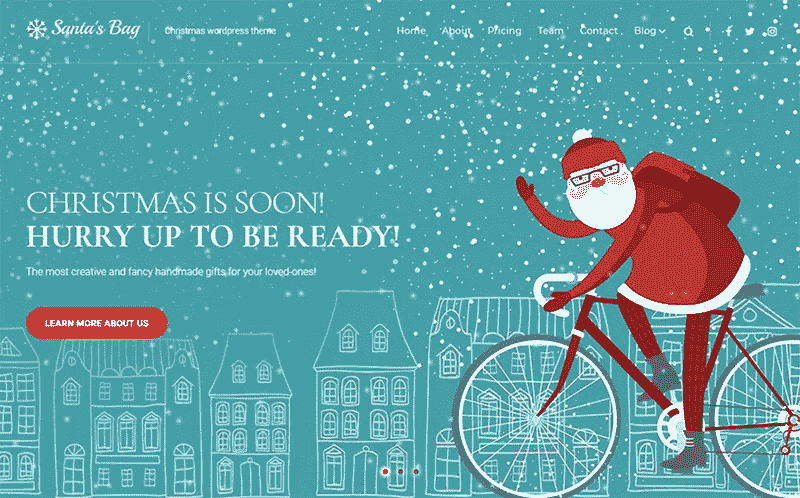
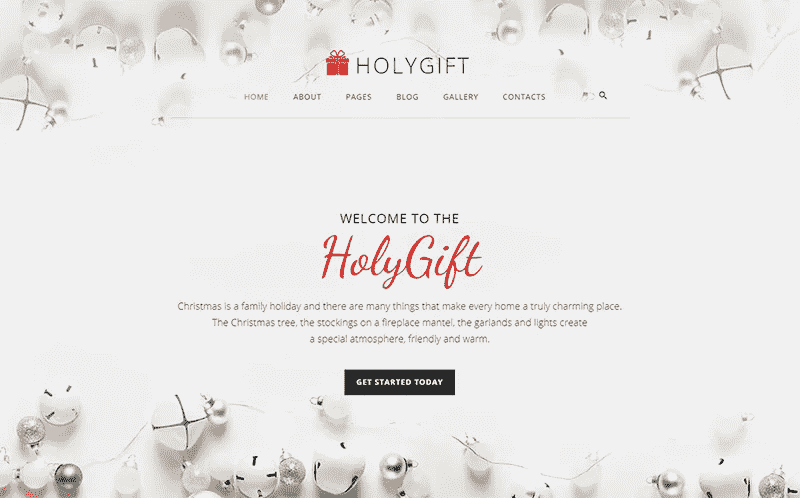
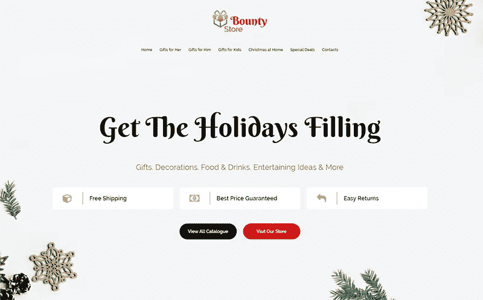
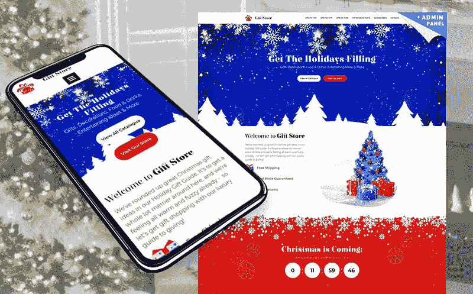
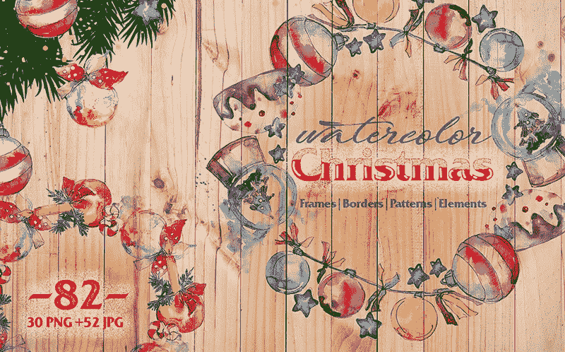
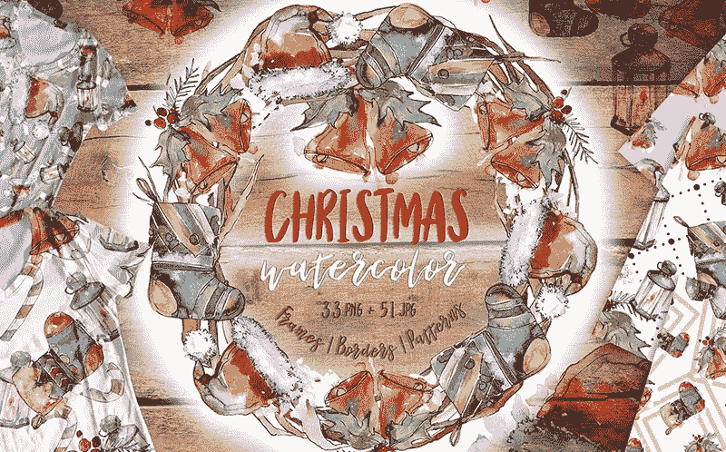
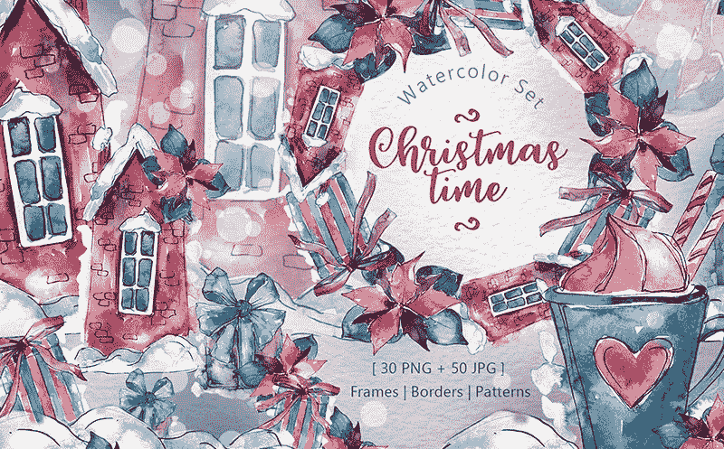
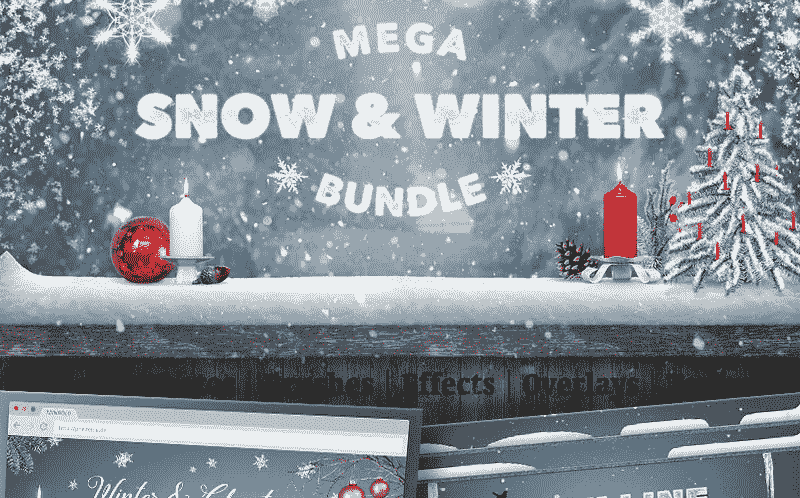

# 你博客上最好的圣诞装饰创意

> 原文：<https://medium.com/hackernoon/the-best-christmas-decorating-ideas-for-your-blog-6bd0d8c2dc69>

时间过得真快，从这一天起，全球零售商的**圣诞季**开始了。

人们忙碌而兴奋地为节日装饰他们的街道和房子。房子、商店、街灯、汽车——一切都闪闪发光。你想过为这个神奇的节日装饰你的博客或网站吗？这是一个很好的主意来吸引你的目标观众的注意力，并增加舒适和节日气氛。

[**template monster market place**](https://www.templatemonster.com/marketplace/?aff=hackernoon)提供大量有趣且高质量的产品来装饰您的网站，并在节日气氛中欢迎您的客户。

我收集了一些节日主题产品来激发你的创造力。花点时间来获得灵感……

# **你博客的最佳圣诞装饰创意**

## **1。为你的登陆主题使用假日调色板**

[**详细信息**](https://www.templatemonster.com/wordpress-themes/santa-s-bag-christmas-landing-wordpress-theme-66026.html?aff=hackernoon)

圣诞老人的包是你完美的圣诞登陆 WordPress 主题，专为即将到来的魔法假期设计。WordPress 网站设计的****布局易于使用并且高度可定制。圣诞节即将来临，请立即查看包装中包含的功能:****

****●适合所有场合的吸引人的页面****

****●拖放页面生成器****

****●额外的高质量图像****

****● 4 个博客布局****

****●全天候专业支持****

## ******2。用 Joomla 模板**的假日版本创造圣诞气氛****

********

****[**细节**](https://www.templatemonster.com/joomla-templates/holygift-christmas-gifts-store-joomla-template-joomla-template-66178.html?aff=hackernoon)****

****你正在寻找一个优质的圣诞 Joomla 模板？不需要再找了，你已经找到了！只要看看这个美丽的节日设计，它可以在任何现代设备上正常显示。其有效的语义代码和大量的定制功能将保证令人愉快的体验。在下面找到更多功能:****

****●视差效应****

****●附加页面****

****●用户界面元素****

****● Instagram****

****●跨浏览器兼容性****

## ******3。使用圣诞节登录页面模板**为您的网站添加更多节日装饰****

********

****[**详情**](https://www.templatemonster.com/landing-page-template/bounty-store-christmas-landing-page-template-73648.html?aff=hackernoon)****

****认识一个壮观的赏金商店-圣诞节登录页面模板，为您的 web 资源添加节日气氛。它不仅功能强大，而且超级时尚。用一个漂亮的登陆页面模板装饰你的  [。了解更多包括的功能:](https://www.templatemonster.com/wordpress-themes.php?aff=hackernoon)****

****● 100 响应布局****

****●惰性负载效应****

****●跨浏览器兼容性****

****●有效的语义代码****

****●详细的文件****

## ******4。圣诞节要到了！你的登陆页面准备好了吗？******

********

****[**详细信息**](https://www.templatemonster.com/landing-page-template/gift-store-christmas-landing-page-template-73785.html?aff=hackernoon)****

****礼品店是另一个引人注目的圣诞节登录页面模板，用于为圣诞节装饰您的网站。这个选项非常简单，即使初学者也可以安装和定制模板。不要犹豫，去看看一个现场演示，看看这个模板对你的主题有什么好处。探索以下几个附加功能:****

****●拖放页面编辑器****

****● 100%响应式设计****

****●现成的设计模块****

****●搜索引擎优化友好****

****●社会融合****

## ******5。要有创意！为你的博客使用水彩插图******

********

****[**细节**](https://www.templatemonster.com/illustrations/christmas-balls-toy-png-watercolor-set-illustration-73605.html?aff=hackernoon)****

****用这套顶级的圣诞水彩插画为你的观众创造一个令人惊叹的效果。该软件包包括 82 个文件，供您发挥创造力。这是贺卡、报价、博客、菜单、海报等的完美解决方案。不需要成为编码专家来应用这些例子。现场演示将展示如何充分利用该产品。看看下面的一些其他功能:****

****● 300 dpi 文件****

****●图案和框架为 JPG 尺寸 3500x3500px****

****●手绘****

****●包装包含框架|边框|图案|元素****

****● 100%响应式设计****

## ****6。在你的博客上用美丽的水彩画集插图祝你有一个温暖而充满爱的圣诞节****

********

****[**详情**](https://www.templatemonster.com/illustrations/amazing-new-year-s-ollection-png-watercolor-set-illustration-73218.html?aff=hackernoon)****

****熟悉下一个惊人的新年收集巴布亚新几内亚水彩集插图。插图集以 84 个文件的水彩风格展示了一个受欢迎的圣诞节和寒假标志。你可以随意打印或使用这个插图包做任何你想做的事情。看看该产品提供的更多优势:****

****●包括 33 个巴布亚新几内亚和 51 个 JPG 文件****

****●非常适合相框、图案或单幅图像****

****●完全可编辑的布局****

****●非常详细的插图****

****●跨浏览器兼容****

## ******7。用水彩套装插图上的圣诞符号启发游客******

********

****[**细节**](https://www.templatemonster.com/illustrations/christmas-time-png-watercolor-set-illustration-72156.html?aff=hackernoon)****

****圣诞时间巴布亚新几内亚水彩画集插图显示了一个伟大的圣诞象征收集-一个礼品盒，一个舒适的房子，一个咖啡杯，一朵花，等等。该套件包括 80 个文件，以满足您的创作需求和偏好。查看细节并评估其无限的可能性。下面列出了更多的功能:****

****●图案和框架为 JPG 尺寸 3500x3500px****

****●手绘****

****●完全可编辑的布局****

****●包装包含框架|边框|图案|元素****

****● 100%响应式设计****

## ******8。用为你的卡片设置的节日插图来传播快乐******

********

****[**详细信息**](https://www.templatemonster.com/illustrations/merry-christmas-and-happy-holidays-illustration-65933.html?aff=hackernoon)****

****另一套精美的插图是精心制作的，可以在节日期间给你和你的顾客带来灵感。你会发现圣诞节和寒假主题的 16 个独立元素。每幅图像的分辨率超过 4000×4000 像素。更多功能如下所述:****

****● 6 种冬季元素，包括熊、袜子、树和球****

****● 6 篇手写文本****

****● 4 片雪花****

****●完全可编辑和可调整大小的布局****

****●非常详细的插图****

## ******9。为您的设计项目享受冰雪套餐******

********

****[**细节**](https://www.templatemonster.com/ui-elements/mega-snow-and-winter-bundle-ui-elements-65945.html?aff=hackernoon)****

****最后但并非最不重要的是，大型雪和冬季捆绑包可供购买。该包包括真正的雪刷 v2，雪线元素 v2，抽象雪花，真正的雪覆盖 v2，无缝雪纹理 v4，冬季和雪股票照片包，冬季和圣诞节的网页设计对象。这些手绘矢量元素是专门为圣诞节和冬季假期制作的。这些功能包括:****

****●照片般逼真的高分辨率画笔****

****●非常适合给物体和表面添加冻结效果****

****●完全响应的设计****

****●跨浏览器兼容****

****●全天候支持****

******结论******

****你印象深刻吗？我是！写这篇文章的时候得到了很多假期灵感。由于即将到来的假期，TemplateMonster 的市场提供了很好的销售和交易。不要错过这样一个以特殊节日价格购买顶级产品的机会。不要无聊，为圣诞节和新年前夕装饰你的博客。毫无疑问，你会从我收集的精选网络创意中找到最适合你企业的产品。要有创意，在你的设计中加入一些圣诞气氛，让客户惊叹不已。****