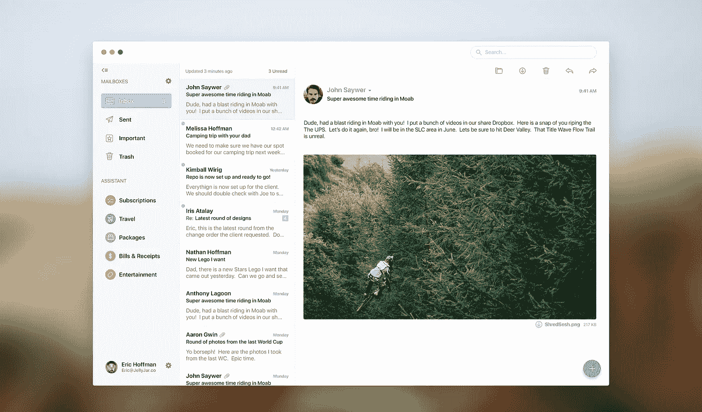
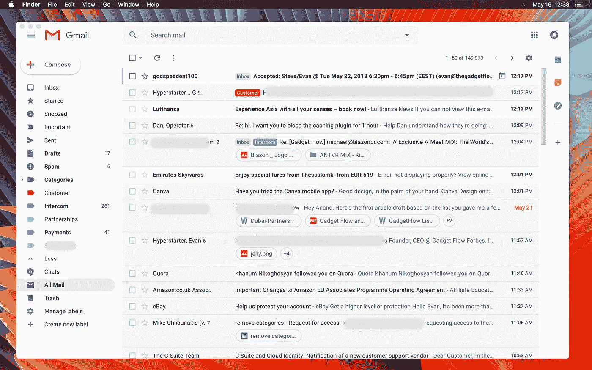
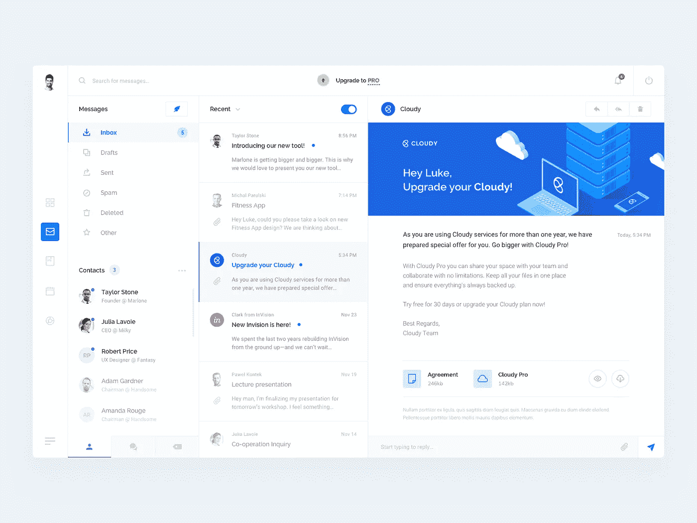

# 2018 年实现终极生产力的最佳电子邮件设置

> 原文：<https://medium.com/hackernoon/the-best-email-setup-2018-productivity-1ea82606cbb9>



电子邮件是我们日常生活的一部分，无论你是受雇于星巴克还是营销公司，你可能每天都会收到几十封甚至几百封电子邮件。管理所有这些都是一项挑战。我一直在寻找关于如何改善我的电子邮件工作流程和生产力的技巧。一些最有效的技巧是捷径，如果你花几分钟去熟悉它们，你将永远不会回头。

从 Outlook 到 Inbox，再到 Spark 和其他产品，我已经尝试了 Mac 和 iOS 的大多数电子邮件客户端。一年前，我最喜欢的设置是 Mac 上的原生邮件应用。我有具体的工作流程，但我意识到在定制和效率方面存在限制。然后，我发现 Boxy 使用了谷歌的收件箱机制，非常简洁。但是，如果你像我一样每天收到超过 500 封电子邮件，即使你有最新的 MacBook Pro，也很慢。

## 在尝试了大多数 Mac 应用程序后，我最终满足于使用 Gmail @ Work 和 Web Catalog 进行自定义设置。它看起来是这样的:



Gmail Setup using Web Catalog on a Macbook Pro

如你所见，由于有了[网络目录](https://getwebcatalog.com)和 [Juli 框架](https://juli.getwebcatalog.com)，它看起来像一个原生应用。

> Gmail 最近进行了重新设计，我不得不说，它看起来很棒。这肯定比我第二喜欢的服务[的 Gmail 收件箱](https://www.google.com/inbox/)要好，考虑到他们仍然没有更新他们的 iOS 应用程序来支持 iPhone X(已经快一年了)，这感觉就像是谷歌最近推荐的。

## 那么，如何在 Mac 上使用 gmail 作为原生应用，有什么好处呢？

1.  下载[网页目录](https://getwebcatalog.com)
2.  下载[巨力](https://juli.getwebcatalog.com)
3.  打开 Web 目录
4.  搜索 Gmail
5.  安装应用程序
6.  打开应用程序
7.  转到首选项
8.  关闭“显示导航栏”
9.  关闭“显示标题栏”
10.  打开“注入 CSS”框
11.  复制粘贴下面的代码来润色用户界面

```
.LW-avf.Am {font: 15px/1.5 sans-serif;}.gb_Xa:not(.gb_Za) .gb_Ed {padding-top: 20px;}.aj5.J-KU-Jg {display: none;}.gb_Xa:not(.gb_Za) .gb_Va {display: none;}.a3s, .g6 {
font: 15px/1.5 sans-serif !important;}
```

12.单击保存

13.点击重新启动，你都设置好了！

## 启用自定义键盘快捷键

1.  转到设置
2.  启用自定义键盘快捷键
3.  进入设置

> S=打盹
> 
> a =档案
> 
> R=全部回复
> 
> I =标志重要
> 
> m =垃圾邮件

## 进一步优化

1.  启用更新、促销和社交标签
2.  创建你自己的类别，如(伙伴关系，家庭，工作，付款，某一天等)，并分配特定的颜色。

## 移动呢？

不幸的是，对于 iOS (iPhone/iPad)，我仍然使用谷歌的收件箱，尽管它与 iPhone X 并不完全兼容。谷歌创建的工作流非常强大，当你在旅途中到达收件箱时。



Mockup from [Luke](https://dribbble.com/shots/4020485-Inbox-Client+)

## 下一步是什么

作为一名自学成才的 UI 设计师，我总是对好的 UI 设计感到兴奋，尤其是当涉及到我日常使用的应用程序时。但是，我对 Dropbox 和谷歌等市场上的大部分巨头感到失望。Dropbox 在 2014 年收购了 Inbox，并决定关闭它，我不知道为什么。另一方面，谷歌为 iOS 重新设计了 Gmail。然而，他们把事情复杂化了。他们没有添加左右滑动功能来暂停电子邮件，而是决定只使用左右滑动来归档电子邮件(唉..).

谁知道呢——也许有一天我会设计一个自己的应用程序。

— — — — — — — — — — — — — — — —

**在**[**insta gram**](https://instagram.com/evanvar)**或** [**Linkedin**](https://www.linkedin.com/in/evanvarsamis) 上关注我

— — — — — — — — — — — — — — — —