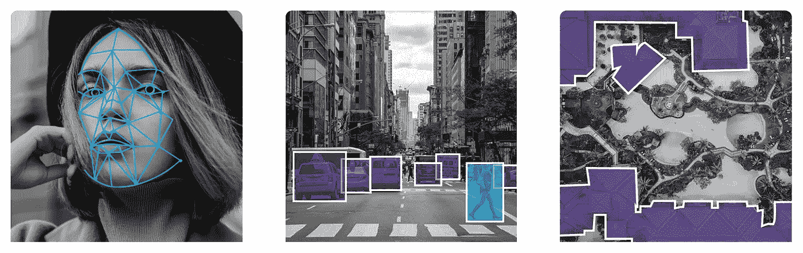
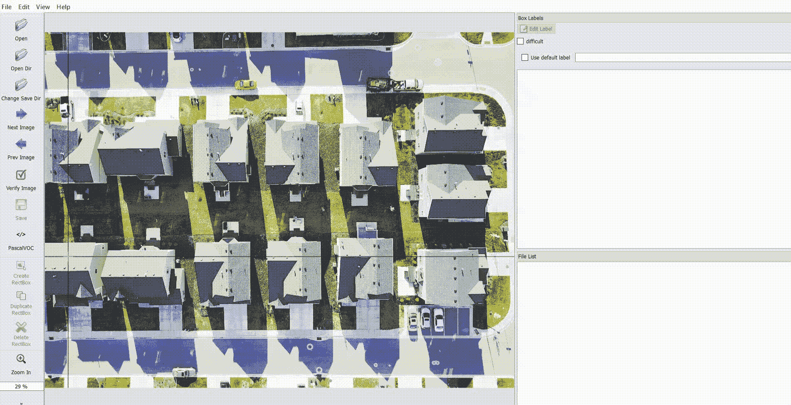
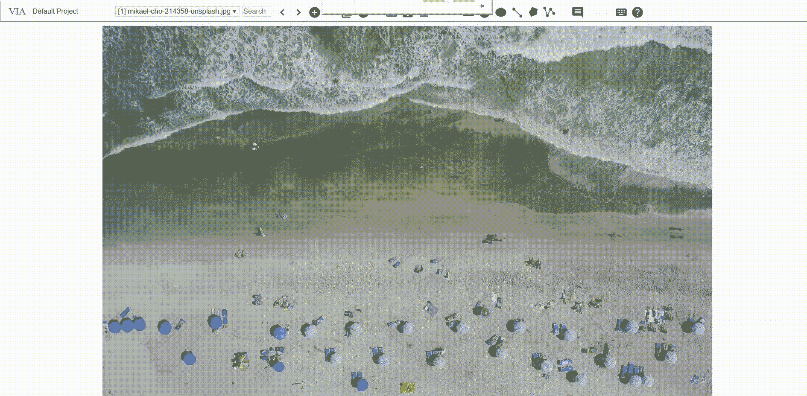
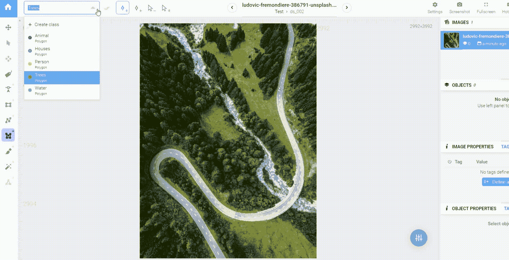
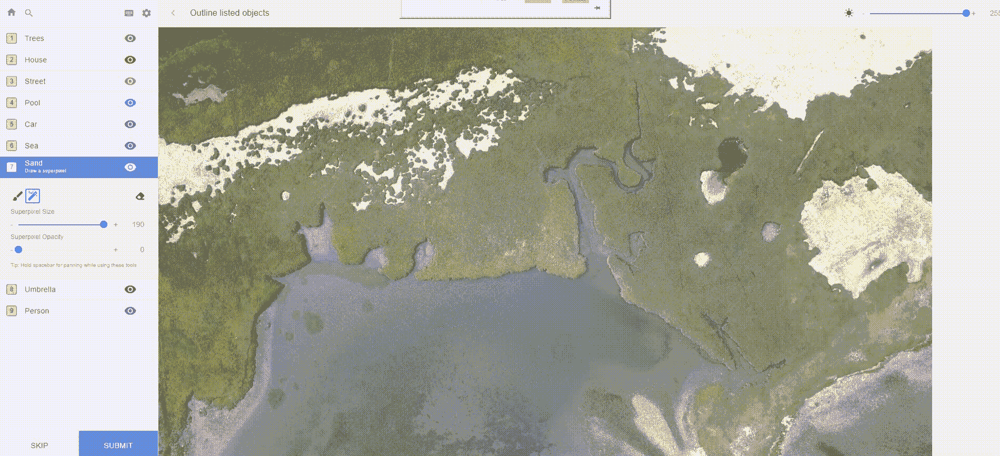

# 计算机视觉的最佳图像注释平台(对每个平台的诚实评论)

> 原文：<https://medium.com/hackernoon/the-best-image-annotation-platforms-for-computer-vision-an-honest-review-of-each-dac7f565fea>

我们在[的人在循环中](https://humansintheloop.org/)不断寻找最佳的图像注释平台，该平台提供多种功能、项目管理工具和注释过程的优化(当您必须注释 50k 张图像时，即使每张图像少 1 秒钟也很重要！).

基于我们对每一个平台的经验，我们在这里分享我们诚实的评论，希望这对希望手动标记数据的数据科学家有用。

**以下是我们的标准:**

*   价格
*   各种功能、工具和格式
*   项目管理和易用性

1.  [贴标](https://github.com/tzutalin/labelImg)

LabelImg 是一个开源的图像标注工具，它为 Windows 预建了二进制文件，因此非常容易安装。

*   价格:免费
*   功能:仅支持边界框(还有一个版本为 [RotatedRect 格式](https://github.com/cgvict/roLabelImg)和一个优化版本为[一类标记](https://github.com/udaypk/FastAnnotationSingleObject))，但没有更高级的。格式为 PascalVoc XML，注释文件为源文件夹中的每个图像单独保存。
*   项目管理:它实际上没有项目管理属性，但是它提供了一种简单的方法来导入和可视化注释，并在必要时进行修改。简单的离线界面使得注释过程非常快，即使它不支持许多热键快捷方式。

2. [VGG 图像注释器](http://www.robots.ox.ac.uk/~vgg/software/via/via-1.0.6.html)

VGG 是一个开源工具，就像 LabelImg 一样，它可以在不需要项目管理的简单任务上做得非常出色。它可以作为在线界面使用，也可以作为 HTML 文件离线使用。在其最新版本中，它还提供了各种各样的视频标记工具。

*   价格:免费
*   功能:提供了更多的工具，包括点，线，多边形，圆和椭圆(在这个列表中只有平台支持圆和椭圆！).还可以选择添加对象和图像属性/标签。注释可以作为一个包含所有注释的 JSON 文件下载，也可以作为一个 CSV 文件下载，如果需要查看的话可以上传。
*   项目管理:在数据集管理和用户方面没有什么太高级的东西，但他们的界面是多边形注记最有效和最精确的界面之一，因为它允许您看到多边形的线，而不是其他任何东西。它们支持一些热键快捷方式，并且应用程序总体来说是非常轻量级的。

3.[监督. ly](https://supervise.ly/)

Supervisely 是一个非常棒的基于网络的平台，它提供了一个高级的注释界面，但也涵盖了计算机视觉训练的整个过程，包括一个深度学习模型库，可以在平台内直接训练、测试和改进。

*   价格:免费社区版和自托管版的企业定价
*   功能:大量的工具，包括点、线、框、多边形和用于语义分割的位图笔刷(虽然我们没有发现他们的智能工具太有用)。还包括在多边形中画洞的可能性，这是非常有价值的。另一个非常有用的功能是添加图像和对象标签的选项，以及对图层中的图形进行排序。每个图像或 PNG 蒙版的输出都是 JSON 文件，该平台还允许您上传诸如 Cityscapes 和 COCO 等格式。此外，还有一个直接在平台上进行数据转换的选项。
*   项目管理:该平台为不同级别的项目管理(团队、工作区、数据集)和注释者管理(标记工作、权限、统计)提供了大量选项。他们还有一个数据转换语言和一个 Python 笔记本选项来管理数据，这非常方便。缺少的一些东西是时间统计，以及质量控制机制。出现问题时，他们的技术支持团队随时待命。该界面允许非常精确的工作，并支持可定制的热键快捷方式，但最近性能有时很慢，如果平台需要大量时间在图像和记录注释之间切换，这可能会非常令人沮丧。

4.[标签盒](https://labelbox.com/)

Labelbox 是另一个伟大的基于网络的平台，于 2018 年初推出，自那以来一直在不断更新和改进其功能。它还提供了通过导入模型预测和查看贴标机和模型之间的一致性来集成人在回路中的可能性。

*   定价:免费社区版仅限 5000 张图片和一个企业版
*   功能:提供了一系列完整的注释工具，如点、线、框和多边形，最近还为他们的语义分割画笔添加了一个令人敬畏的新功能——一个超像素着色选项，当边界清晰时，生活会变得容易得多(很像[这个](https://github.com/kyamagu/js-segment-annotator)和[这个](https://github.com/yuyu2172/image-labelling-tool)开源工具)。输出为一个包含所有注释的 JSON 或 CSV 文件，或者输出为 PNG 掩码(但是，每个类都有一个掩码，用户需要弄清楚如何处理重叠区域)
*   项目管理:建立一个项目是非常容易的，并且有许多监控性能的选项，包括标记图像所需的秒数统计。您可以实施多种质量控制机制，包括激活不同贴标机之间的自动共识或设置黄金标准基准。您可以选择邀请用户(尽管权限没有那么细)并检查每个人的工作。标签界面超级用户友好，支持热键快捷键(虽然不可定制)。免费版本中缺少的一点是上传注释的选项，以便可视化或编辑它们。

还需要别的吗？以下是您可以考虑的一些其他平台:

*   [Diffgram](https://diffgram.com/)——一个仍处于测试阶段的非常有前途的平台，它通过训练 RCNN 来优化图像注释，将在本系列的第二篇文章中介绍！
*   rect label——MAC OS 上一个强大的包围盒和多边形的工具
*   [Prodigy](https://prodi.gy/) —他们提供了一个自托管的后端，具有不同的注释接口，包括带有边界框的图像注释；他们产品的个人使用起价为 390 美元(每个用户终身使用)
*   [DataTurks](https://dataturks.com) —一个提供许多注释功能的平台；免费版本中带注释的数据是公开的，小型团队的企业定价从每月 300 美元起
*   [image tagger](https://github.com/bit-bots/imagetagger)——一个用于协作图像标注的开源平台
*   [快速注释工具](https://github.com/christopher5106/FastAnnotationTool)——另一个开源工具，使用 OpenCV 生成 RotatedRect 格式的边界框
*   [LabelMe](http://labelme.csail.mit.edu/Release3.0/) —麻省理工学院的一个行业经典开源工具，用于多边形注释；但是精确度非常低
*   [PolygonRNN+](http://www.cs.toronto.edu/~amlan/demo/) —仅作为演示版提供，但仍然非常有前景；一个在 Cityscapes 数据集上训练的工具确实可以通过强化学习为自动驾驶汽车生成自动标签

—

处理大型数据集，并需要扩大您的注释工作？请随时与我们 hello@humansintheloop.org 联系——我们的注释者接受过使用所有这些平台的培训，我们很乐意为您的项目做出贡献。