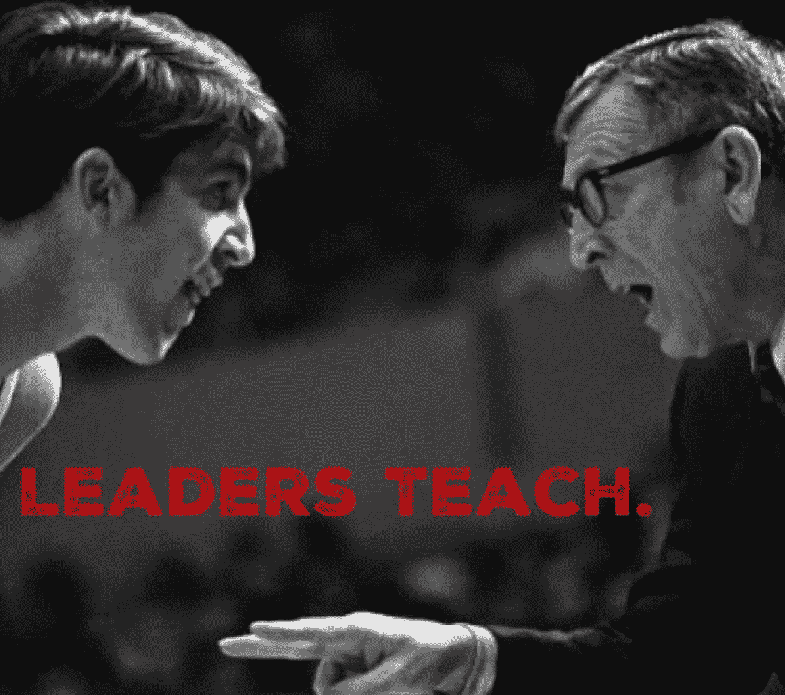

# 最好的领导者都有这个共同点…

> 原文：<https://medium.com/hackernoon/the-best-leaders-have-this-in-common-594a9ff104a6>

你有没有遇到过有人放慢脚步，花时间带你经历一些你并不完全理解的事情？尤其是当这个时刻压力很大而且很重要的时候？

可能是队友或者导师。也许是你妈妈或朋友。不管是谁，也不管是关于什么的…你都感觉到了一些解脱，你对那件事的信心得到了提升。

在那一刻，你是一个由老师带领的学生。这个世界上还有什么比基本的人际交往更强大的吗？想想吧。从一个人到另一个人的智慧传递是无价的，说得轻一点。

Roshan Thiran 分享了他对百事公司前董事长兼首席执行官 Roger Enrico 的观察，“他制定了一个名为*执行领导力的[项目](https://hackernoon.com/tagged/program):建立业务*，这是一个由 Enrico 亲自领导的为期五天的异地项目。”

“Enrico 会花五天时间全力教九名员工。随后是为期 90 天的跟进，参与者将在 Enrico 的指导下应用他们所学的知识。在为期 90 天的课程结束时，每个人都会在为期三天的课程中分享自己的见解。”

想象一下这种互动对个人和集体的影响。世界上最大的公司之一的 CEO 亲自教导和指导团队成员。作为一个要求如此之高的品牌的掌门人，在无数的需求中，这位[领导人](https://hackernoon.com/tagged/leader)理解时间使用的深度和广度。

> 毫无疑问，最有效的领导者是不会忽视机会的好老师。

所以，不要忽视这个机会！

注意什么时候该慢下来，认真听讲，然后作为老师带领别人；因为在那个时刻，只有你有机会以一种深刻的方式去领导和服务。

**要了解更多关于企业家精神、领导力和战略的观点，请在**[**www.jeffchavez.net**](http://www.jeffchavez.net)**或**[**www.authenticdev.com**](http://www.authenticdev.com)注册，获取真正的智库时事通讯