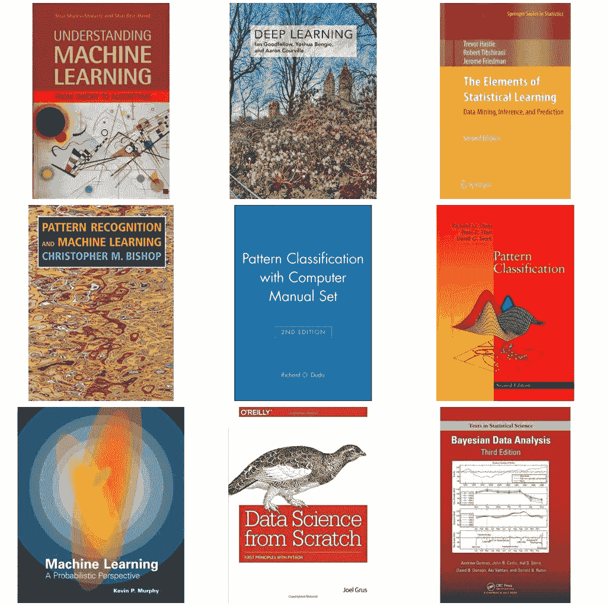

# 2019 年更新:最佳机器和深度学习书籍

> 原文：<https://medium.com/hackernoon/the-best-machine-deep-learning-books-e1bcec2c0a17>

机器和深度学习是近年来最热门的领域之一。我们正在见证世界上几乎任何行业的巨大成就，这要感谢那些知道如何收获机器学习以创造惊人产品的才华横溢的研究人员。

因此，当我们听到这么多人想进入这个世界，希望开始学习这些学科的基础知识时，并不令人惊讶。了解一门新学科的最好方法是什么？ ***书籍，没错！***

我让“[机器&深度学习以色列](https://www.facebook.com/groups/543283492502370/)”社区的成员投票选出最佳机器&深度学习书籍，结果如下:

The best Machine & Deep Learning books

# 2019 年新增:

# 一百页的机器学习书

这本新书， [**百页的机器学习书籍**](https://amzn.to/2G2vLoQ) ，由[安德烈·布尔科夫](https://www.amazon.com/Andriy-Burkov/e/B07MYKVJ6T/ref=dp_byline_cont_book_1)撰写，几乎瞬间成为机器学习类别的 **#1 畅销书**。安德烈选择了这样一个复杂的话题，并设法以一种非常清晰易懂的方式写了出来。这本书将对你可能熟悉的许多主题进行排序，甚至教你这个领域的新东西。**试试看。**

这本书的摘要:

> **成为机器学习专家。加快你的职业发展。今天的顶级公司经历了自工业化以来最重大的转变。人工智能颠覆了工业，颠覆了我们工作、思考和互动的方式。Gartner 预测，到 2020 年，人工智能将创造 230 万个工作岗位，同时消除 180 万个工作岗位。机器学习是人工智能的驱动力。这一领域的专家很少，雇主们争夺高技能人才。通过这本书，你将了解机器学习是如何工作的。从现在开始的一百页，你将准备好构建复杂的人工智能系统，通过面试或开创自己的事业。**
> 
> 你需要知道的机器学习一百页
> 监督和非监督学习、支持向量机、神经网络、集成方法、梯度下降、聚类分析和降维、自动编码器和转移学习、特征工程和超参数调整！数学，直觉，插图，都在短短一百页里！

*原帖:*

# 1.理解机器学习:从理论到算法

 [## 理解机器学习:从理论到算法

### 机器学习是计算机科学发展最快的领域之一，具有深远的应用。的目的是…

amzn.to](https://amzn.to/2DkkUXw) 

获得最多票数的第一本书是由 [Shai Shalev-Shwartz](https://www.amazon.com/Shai-Shalev-Shwartz/e/B00J8MP358/ref=dp_byline_cont_book_1) 和 [Shai Ben-David](https://www.amazon.com/Shai-Ben-David/e/B077MTN6JG/ref=dp_byline_cont_book_2) 所著的《理解机器学习:从理论到算法》。该书于 2014 年由剑桥大学首次出版，旨在帮助学生学习机器学习的基础知识，并熟悉该领域的所有重要算法。

这本书的摘要:

> 机器学习是计算机科学发展最快的领域之一，具有深远的应用。这本教科书的目的是以一种有原则的方式介绍机器学习，以及它所提供的算法范例。这本书提供了机器学习的基本思想和将这些原则转化为实际算法的数学推导的广泛理论说明。继该领域的基础介绍之后，这本书涵盖了以前的教科书没有涉及的广泛的中心主题。这些包括学习的计算复杂性和凸性和稳定性的概念的讨论；重要的算法范例包括随机梯度下降、神经网络和结构化输出学习；以及新兴的理论概念，如 PAC-Bayes 方法和基于压缩的界限。为一个先进的大学本科或开始研究生课程设计，文本使机器学习的基本原理和算法对统计，计算机科学，数学和工程的学生和非专家读者可访问。

# 2.深度学习

第二本书是《深度学习》，作者是[伊恩·古德菲勒](https://www.amazon.com/Ian-Goodfellow/e/B01MQGN8N0/ref=dp_byline_cont_book_1)、[约舒阿·本吉奥](https://www.amazon.com/Yoshua-Bengio/e/B00IWC47MU/ref=dp_byline_cont_book_2)、[亚伦·库维尔](https://www.amazon.com/Aaron-Courville/e/B01N8XGWRL/ref=dp_byline_cont_book_3)、[弗朗西斯·巴赫](https://www.amazon.com/s/ref=dp_byline_sr_book_4?ie=UTF8&text=Francis+Bach&search-alias=books&field-author=Francis+Bach&sort=relevancerank)(编者)。该书于 2016 年问世，被认为是关于深度学习的最佳书籍之一。写这本伟大的书花了超过两年半的时间，它将在书中的后面向你解释所有你需要处理机器和深度学习算法的数学。

 [## 购买选择:深度学习(自适应计算和机器学习)

### 对深度学习的广泛主题的介绍，包括数学和概念背景，深度…

amzn.to](https://amzn.to/2QSqymk) 

这本书的摘要:

> “由该领域的三位专家撰写，*深度学习*是关于该主题的唯一一本综合书籍。”
> **——埃隆马斯克**，OpenAI 联席主席；特斯拉和 SpaceX 的联合创始人兼首席执行官
> 
> 深度学习是机器学习的一种形式，它使计算机能够从经验中学习，并根据概念的层次结构来理解世界。因为计算机从经验中收集知识，所以不需要人类计算机操作员正式指定计算机需要的所有知识。概念的层次结构允许计算机从简单的概念中学习复杂的概念；这些层次结构的图表可以有许多层。这本书介绍了深度学习的广泛主题。
> 
> 该文本提供了数学和概念背景，涵盖了线性代数，概率论和信息论，数值计算和机器学习的相关概念。它描述了行业从业者使用的深度学习技术，包括深度前馈网络、正则化、优化算法、卷积网络、序列建模和实用方法学；它调查了自然语言处理、语音识别、计算机视觉、在线推荐系统、生物信息学和视频游戏等应用。最后，这本书提供了研究视角，涵盖了线性因子模型，自动编码器，表示学习，结构化概率模型，蒙特卡罗方法，配分函数，近似推理和深度生成模型等理论主题。
> 
> *深度学习*可用于规划行业或研究职业的本科生或研究生，以及希望开始在其产品或平台中使用深度学习的软件工程师。一个网站为读者和教师提供补充材料。

# 3.统计学习的要素

这本书《统计学习的要素》是我们社区成员最喜欢的书之一，很多人都推荐它。这本书于 2001 年由特雷弗·哈斯蒂、[罗伯特·蒂布拉尼和](https://www.amazon.com/Robert-Tibshirani/e/B00H3VSM7W/ref=dp_byline_cont_book_2)[杰罗姆·弗里德曼](https://www.amazon.com/s/ref=dp_byline_sr_book_3?ie=UTF8&text=Jerome+Friedman&search-alias=books&field-author=Jerome+Friedman&sort=relevancerank)出版。自 2001 年以来，它更新了几次，最后一个版本是在 2013 年发布的。

 [## 亚马逊网站:购买选择:统计学习的要素:数据挖掘、推理和…

### 这本书描述了在各种领域的重要思想，如医学，生物学，金融和营销在一个…

amzn.to](https://amzn.to/2MW17Nu) 

这本书的摘要:

> 这本书在一个共同的概念框架里描述了在各种各样的领域里的重要想法，例如医学，生物学，金融，和市场营销。虽然这种方法是统计学的，但重点是概念而不是数学。给出了许多例子，大量使用了彩色图形。对于统计学家和任何对科学或工业中的数据挖掘感兴趣的人来说，这是一个有价值的资源。这本书的覆盖面很广，从监督学习(预测)到非监督学习。许多主题包括神经网络、支持向量机、分类树和 boosting——这是任何书中第一次全面讨论这个主题。
> 
> 这个主要的新版本的特点是许多原来没有涉及的主题，包括图形模型，随机森林，集合方法，最小角度回归&套索路径算法，非负矩阵分解，和谱聚类。还有一章是关于“广泛”数据(p 大于 n)的方法，包括多重测试和错误发现率。

# 4.模式识别和机器学习

“模式识别和机器学习”这本书是由 Christopher M. Bishop 在 2006 年写的，已经帮助了许多学生学习机器学习的艺术。这本书相对于其他书的重要优势是在书的结尾有大量的测试和问题，可以帮助你练习和提高你的机器学习技能。

 [## 亚马逊网站:购买选择:模式识别和机器学习(信息科学和…

### 这是第一本介绍贝叶斯观点的关于模式识别的教科书。这本书介绍了大约…

www.amazon.com](https://www.amazon.com/gp/offer-listing/0387310738/ref=as_li_tl?ie=UTF8&camp=1789&creative=9325&creativeASIN=0387310738&linkCode=am2&tag=machinelear0a-20&linkId=f87273d6b3e9ef32344751f18f28fa70) 

这本书的摘要:

> 这是第一本介绍贝叶斯观点的关于模式识别的教科书。这本书提出了近似推理算法，允许在精确答案不可行的情况下快速近似答案。当没有其他书籍将图形模型应用于机器学习时，它使用图形模型来描述概率分布。不需要预先了解模式识别或机器学习概念。熟悉多元微积分和基本线性代数是必需的，一些使用概率的经验将是有帮助的，虽然不是必要的，因为这本书包括一个基本概率论的自含式介绍。

# 5.模式分类

最后但同样重要的是“模式分类”，这是由[理查德·杜达](https://www.amazon.com/Richard-O.-Duda/e/B001HMS1CE/ref=dp_byline_cont_book_1)、[彼得·e·哈特](https://www.amazon.com/Peter-E.-Hart/e/B001HMNQ9C/ref=dp_byline_cont_book_2)和[大卫·g·斯托克](https://www.amazon.com/David-G.-Stork/e/B000APUOSI/ref=dp_byline_cont_book_3)在 1973 年写的(这不是一个错误)。后来，我们从杜达得到了第二版的*，里面有更多的更新信息。*

* [## 模式分类(第一部分)

### 第一版，出版于 1973 年，已成为该领域的经典参考。现在有了第二版，读者们…

amzn.to](https://amzn.to/2NzrC0o) 

## 额外收获:我们社区推荐的其他优秀书籍:

1.  [机器学习:概率观点(自适应计算和机器学习系列)](https://www.amazon.com/gp/product/0262018020/ref=as_li_tl?ie=UTF8&camp=1789&creative=9325&creativeASIN=0262018020&linkCode=as2&tag=machinelear0a-20&linkId=3fd0fea3672438199b0ec417d1180f85)
2.  [数据科学从零开始:Python 的基本原理](https://www.amazon.com/gp/product/149190142X/ref=as_li_tl?ie=UTF8&camp=1789&creative=9325&creativeASIN=149190142X&linkCode=as2&tag=machinelear0a-20&linkId=4419ac217f894aba18f641bde4e680c7)
3.  [贝叶斯数据分析，第三版(统计科学中的 Chapman & Hall/CRC 文本)](https://www.amazon.com/gp/product/1439840954/ref=as_li_tl?ie=UTF8&camp=1789&creative=9325&creativeASIN=1439840954&linkCode=as2&tag=machinelear0a-20&linkId=e68eabd32e8de1f2fa376c4ef7588b14)。
4.  [思考贝叶斯:Python 中的贝叶斯统计](https://amzn.to/2NBc4cA)(针对初学者)。*