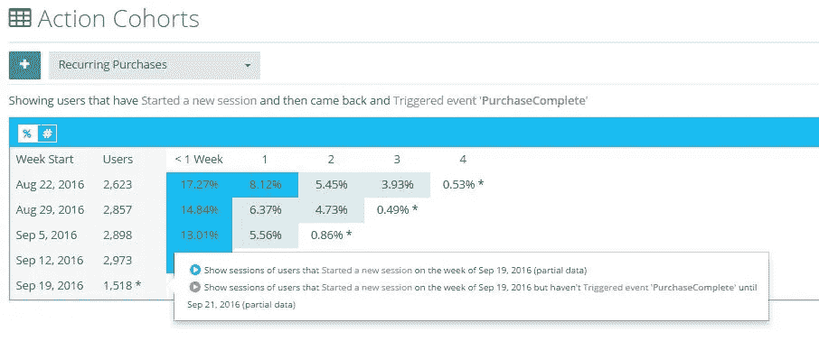
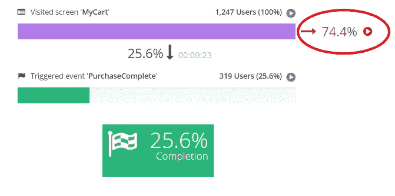
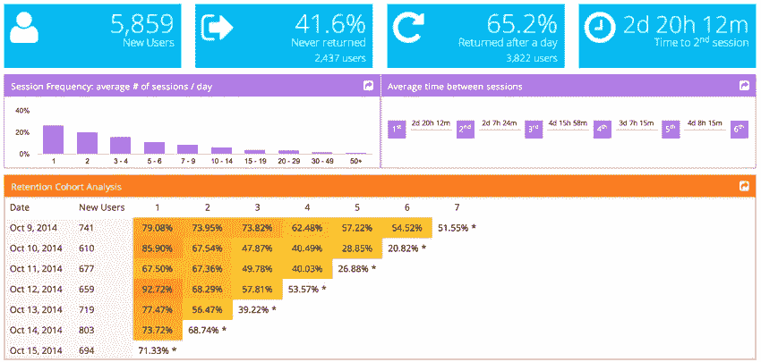

# 衡量用户参与度的最佳指标和工具

> 原文：<https://medium.com/hackernoon/the-best-metrics-and-tools-for-measuring-user-engagement-fb083d9a9be7>

如果你正在阅读这篇博客，你很有可能知道，至少在某种程度上，用户参与是什么以及有多重要。在这一点上，真正的斗争不再是是否度量它——现在是正确地跟踪它，并相应地优化它。

简而言之——它类似于足球。每个人都在谈论它，但不是每个人都真正擅长有效地增强它。这就是本文的内容——您将了解使用哪些工具和指标来恰当地衡量和提高用户参与度。

# 什么是用户参与度？

根据我们谈论的是产品、网站，还是在这种特殊情况下——移动应用，定义可能会有所不同。从广义上讲，它围绕着用户与你的应用程序的互动。用户参与度可以通过许多事情来衡量，从用户打开你的应用程序的频率，他们坚持使用它的时间，他们在使用它时做什么，以及他们是否向朋友推荐它。基本上，如果他们以任何方式使用你的应用。然而，有些指标可能比其他指标更重要，这主要取决于你的应用是关于什么的。

如今，用户参与度被认为是你的应用成功的最重要的衡量标准之一。如果没有更广泛的背景——应用程序何时被使用，持续多长时间以及出于什么目的——仅仅监控下载量毫无意义。通过衡量和理解这些 KPI，你可以阻止人们过早放弃你的应用，让他们继续使用，最重要的是，让他们满意。正确监控用户参与度是成功和提高参与度的关键因素之一。

# 需要关注哪些指标:

# 每日应用发布

**这是什么:**一个显示你的应用在一天内被打开次数的指标

**为什么重要:**下载一个 app 是一回事，每天坚持使用完全是另一回事。这个指标显示了你的关键用户——那些喜欢你的应用程序、经常回来使用它的用户，以及他们对你的应用程序的看法。

# 日常应用用户

**这是什么:**这个指标显示有多少人在一天中至少打开你的应用一次。它不同于日常应用发布，因为它不测量单个人使用应用的频率

**为什么它很重要:**它可以显示你的用户是否很快对应用失去兴趣，并且可以指出用户体验中可能存在的问题

# 会话持续时间

**这是什么:**会话持续时间是一个指标，显示用户打开应用后，在应用上花费的时间。

**为什么重要:**可以显示会话用户参与度的高低。更短的会话持续时间不一定意味着一个糟糕的应用程序。如果用户很快在你的应用中找到了他/她想要的东西，这实际上是一件好事。重要的是不要误解这一指标。

# 会话间隔

**这是什么:**这个指标测量两个会话之间过去了多长时间。

**为什么它很重要:**因为它显示了用户使用你的应用程序的频率，它可以很好地反映用户体验。例如，如果您的受众在智能手机上打开应用程序的频率高于在平板电脑上，这可能意味着它在移动中更有用，并且您可能需要改进可以在家中使用的内容。反之亦然，这可能意味着智能手机有限的空间正在阻碍用户体验，这就是为什么他们选择主要在平板电脑上使用应用程序。

# 保留率

这是什么:可以说是你能找到的最重要的指标。它衡量你的用户是否会回到你的应用。

**为什么它很重要:**帮助你衡量你的用户保持度随着时间的推移是在提高还是在减弱。此外，还可以跨设备和应用版本进行测量。

# 用户获取

**是什么:**是把潜在用户变成实际用户的过程。每当有人新安装和使用一个新的应用程序，他或她被认为是一个获得用户。

**为什么重要:**用户是基础，是你 app 的基础。没有用户，你的 app 完全看不见，仿佛不存在。这一指标将最终影响您的整体用户参与度。

# 每个会话的屏幕数量

**这是什么:**你的用户是否只是打开应用程序，然后立即关闭？他们会在里面滚动，打开不同的部分吗？这就是该指标正在监控的内容。

**为什么重要:**了解用户在应用程序中做什么，他们打开的屏幕以及他们如何使用这些屏幕，对于注意用户体验问题或界面问题至关重要。它还显示应用程序的某些部分是否比其他部分做得更好，让您可以正确地集中开发精力。

# 访问持续时间最长和最短的屏幕

**这是什么:**该指标是“每个会话的屏幕数量”指标的扩展。它深入到每一个屏幕的更多细节，提供关于你的应用程序中最少和最受欢迎的部分的有价值的信息。

**为什么它很重要:**如果你的应用程序的某些功能做得不好，你可以利用这种洞察力来改进它，或者完全删除它，把你所有的资源集中在你的用户认为有用的东西上。

# 大多数用户交互(手势)的屏幕

这是什么:它显示了人们在哪些屏幕上点击、滑动、轻击、拖动等次数最多。

**为什么它很重要:**这是一个很好的指标，可以了解用户如何浏览你的应用程序，这对发现问题区域至关重要。这些信息对于规划未来的版本和帮助你找回已经放弃你的应用的用户是至关重要的。

# 应用内事件的发生次数(在特定时间段内)

**是什么:**应用内活动是用户在使用你的应用时可以做的所有事情。事件不计其数，取决于应用的类型。例如，一个购物应用程序可以包含注册、登录、结账、添加愿望清单、添加支付信息、购买物品等事件。一个手机游戏可以有事件，如完成一个级别，购买游戏中的项目，或创建一个新的角色。

**为什么重要:**通过监控应用内事件，你可以了解到两件重要的事情。首先，您可以了解受众的行为，帮助您转变和优化用户体验。其次，你可以围绕这些信息制定营销策略，以提高用户获取率和保留率。

# 终身价值

**它是什么:**终身价值，或 LTV，主要是一个收入指标，显示你的应用程序的用户有多少钱。换句话说，他们创造了多少收入。有不同的方法来跟踪你的应用客户的 LTV，包括每月价值，每个客户的收入，或每个客户的价值。

**为什么重要:**通过 LTV，你可以了解你的应用的收入、用户参与度、用户留存率以及有多少客户在积极参与你的应用。它为你优化营销策略提供了宝贵的见解。

# 如何衡量这些指标:

当你有一个多元化的用户群时，这通常是移动应用程序的情况，监控这些 KPI 的最佳方式是通过群组分析。Adeven 的西蒙·肯德尔(Simon Kendall)称，群组是“拥有一些共同标准的一群用户”。

通过群组分析，你将比较各组，观察他们每天、每周或任何其他时间段的表现，并寻找他们行为的趋势。有三个你应该关注的主要功能，都可以通过 Appsee 获得:行动群组、转化漏斗和留存分析。

# 行动队列

**是什么:**人们来到你的应用是一回事，了解他们在那里做什么是完全不同的。“群体”是一个术语，用来描述由于相同的属性而聚集在一起的一群人。在分析领域，**行动群组**允许你根据特定时间段内用户在你的应用中的行为来创建用户组。动作群组可以帮助您了解用户实际上是如何与您的应用程序交互的，并检查一段时间内行为和用户参与度的趋势。通过像 Appsee 一样的[动作群组](https://www.appsee.com/tutorials/cohorts?cpnid=701b0000000Wd7c&utm_source=medium&utm_medium=link&utm_campaign=best_metrics_tools_measuring_user_engagement&utm_content=action_cohorts_tutorial)，你可以对执行特定任务的用户进行分组，比如应用内购买。

**为什么它很重要:**行动群组帮助你了解你的用户需要什么，他们对应用程序有什么期望，以及你需要做些什么来让他们再次光顾。动作群组分析可以帮助您优化应用，并为未来的更新做准备。

*Example of action cohorts for recurring purchases.*

# 转换漏斗

**是什么:**[转化漏斗](https://www.appsee.com/tutorials/funnels?cpnid=701b0000000Wd7c&utm_source=medium&utm_medium=link&utm_campaign=best_metrics_tools_measuring_user_engagement&utm_content=conversion_funnels_tutorial)是应用用户经历的整个过程——从他们第一次接触应用的那一刻，到他们进行应用内购买的那一刻。

**为什么重要:**分析转化漏斗可以让你发现用户体验和用户参与中的问题。作为[定性分析](https://courses.appsee.com/qualitative101/?cpnid=701b0000000Wd7c&utm_source=medium&utm_medium=link&utm_campaign=best_metrics_tools_measuring_user_engagement&utm_content=qualitative_course)平台的一部分，转化漏斗还允许你放大从你的漏斗中退出的用户的特定会话。如果一个 app 是一个社交媒体，一个论坛或者类似的格式，它可以帮助你理解为什么用户没有完成注册表单。如果你提供移动商务解决方案，为什么他们放弃购物车。或者，如果你提供的是一款手游——为什么用户无法完成某个关卡或者某个特定的 boss 战。Appsee 还允许您在发布应用程序后创建临时漏斗，而无需重新提交。转换漏斗，特别是当与[会议记录](https://www.appsee.com/features/user-recordings?cpnid=701b0000000Wd7c&utm_source=medium&utm_medium=link&utm_campaign=best_metrics_tools_measuring_user_engagement&utm_content=user_recording_feature)搭配使用时，可以帮助你识别关键用户流程中的摩擦点，精确优化，并增加用户参与度。

*Example of a conversion funnel with Appsee.*

# 留存分析

**是什么:** [留存](https://www.appsee.com/tutorials/retention?cpnid=701b0000000Wd7c&utm_source=medium&utm_medium=link&utm_campaign=best_metrics_tools_measuring_user_engagement&utm_content=retention_analytics_tutorial)围绕着在预定义的时间段内开始使用你的应用的用户，在 Appsee 中，这些数据通过群组分析呈现，将在特定时间点开始使用应用的用户分组。此外，还提供了该应用在不同时间段的使用频率数据。

**为什么重要:**留存分析可以帮助您了解用户有多倾向于再次使用，以及有多少人从未使用过。它提供了关于人们需要多长时间返回应用程序、平均会话间隔或会话数量的宝贵见解。

# 测量两次，切割一次

俗话说:“量两次，砍一次”。在过去，这意味着你应该在真正做某件事之前做好充分的准备。显然，这也适用于应用程序的构建，但是有一个很大的区别——切割一次，测量两次是不够的。当谈到构建一个成功的移动应用程序时，一个更准确的谚语应该是“一直测量，并保持测量直到世界末日”。还有，一有机会就‘剪’。不要忘记，大多数成功的应用程序都会频繁更新。

这不再是一个你是否应该监控你的用户参与 KPI 的问题，现在的问题是监控适合你的应用的 KPI，了解它们和更广泛的背景，并能够相应地进行优化。

