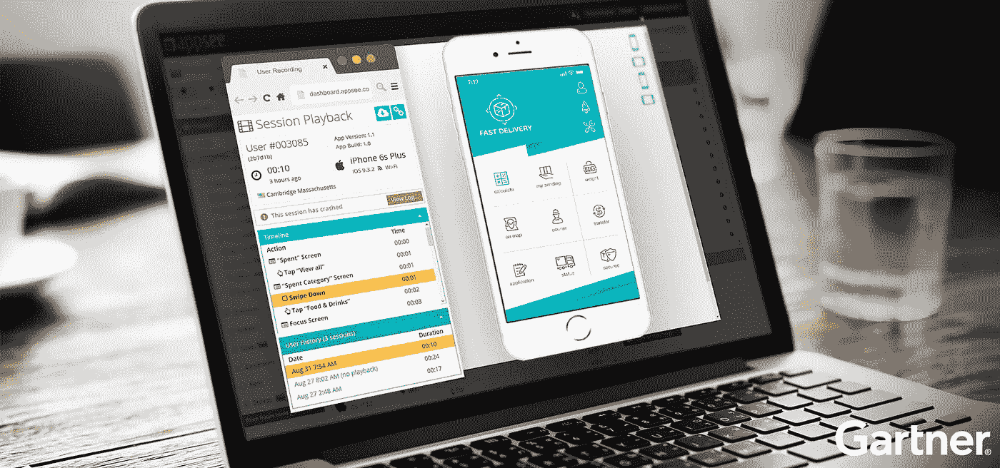
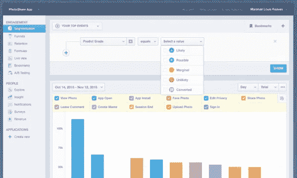
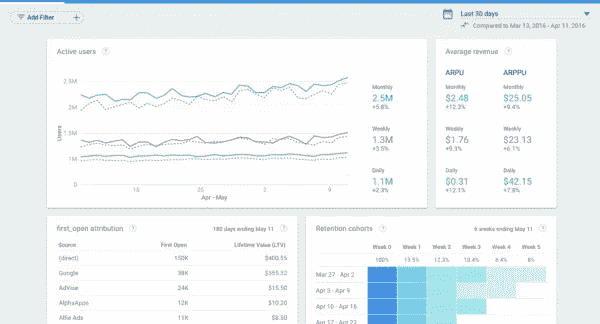
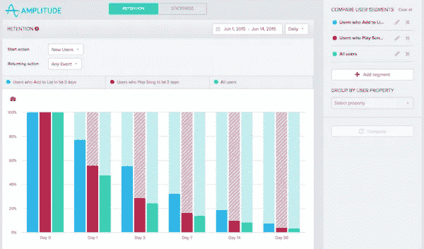
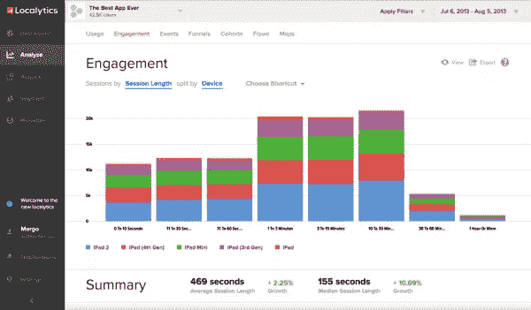
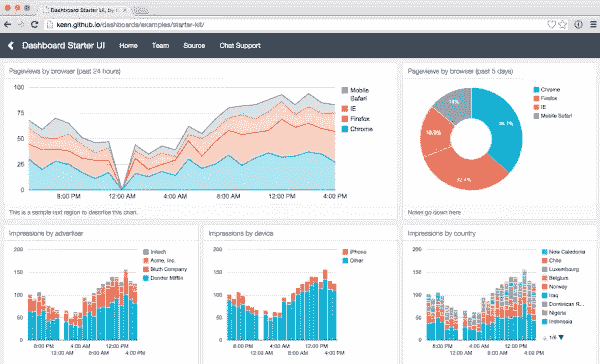
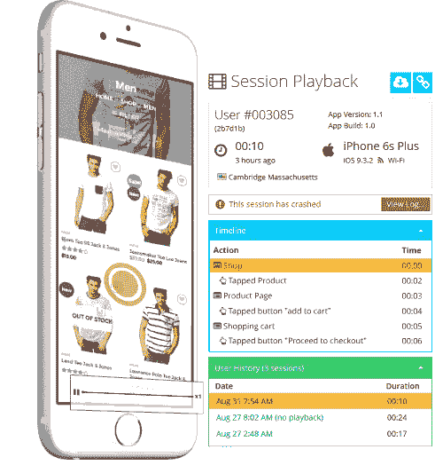
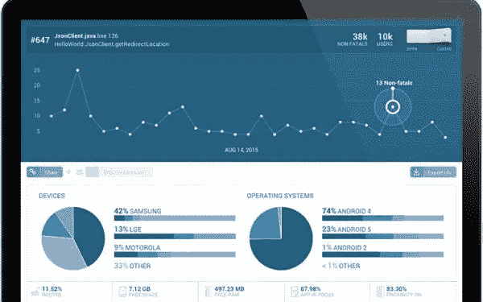
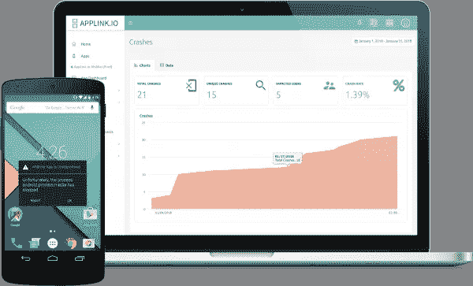

# 2019–2020 年最佳移动应用分析平台

> 原文：<https://medium.com/hackernoon/the-best-mobile-app-analytics-platforms-in-2018-2019-77cd57860d99>

研究应用程序的移动分析通常是一项耗时且令人生畏的任务。然而，这并不需要。尽管有大量可靠的平台可供选择，但只有少数几个值得一提，让您物有所值。几个平台已经成为 2019 年的最爱。在过去的十年中，应用程序的质量发生了巨大的变化，相应地，UX 标准也有了很大的发展，从而极大地影响了移动分析工具的需求和能力。

由于彻底的研究和全面的新报告，如 [Gartner 的网络和移动应用分析市场指南](https://www.gartner.com/doc/3882005)，我们精心挑选了行业内的顶级工具。随着移动专业人士将“[分析”作为优先 SDK](http://blog.safedk.com/sdk-economy/state-mobile-sdks-2018/) ，我们从三个可命名的子类别中提取建议:应用的定量分析、应用的定性分析和性能崩溃分析。保持领先地位，确保您作为移动领跑者的地位，这份包装整齐的指南可为您节省任何进一步调查的时间。

# 定量应用分析——顶级平台

通过数字数据， [quantitative analytics](https://blog.appsee.com/quantitative-vs-qualitative-analytics-everything-you-need-to-know/?cpnid=701b0000000Wd7c&utm_source=medium&utm_medium=link&utm_campaign=best_app_analytics_platforms_2018&utm_content=quantitative_vs_qualitative_blog) 分析指标，为您提供关于[转化率](https://blog.appsee.com/mobile-industry-glossary/#conversion-rate)、用户行为和使用趋势的硬聚合洞察。量化分析将所有东西都用数字表示，为你提供了关于你拥有多少用户总数或平均用户会话时长的问题的答案。以下是定量移动应用分析领域的五个市场领导者。

# [混合面板](https://mixpanel.com/)

对于移动专业人士来说，Mixpanel 是处理一系列数据点和了解桌面、移动网络和移动应用的整体用户旅程的绝佳选择。它是无代码的，这意味着不需要任何代码来跟踪应用程序指标。Mixpanel 是广泛事件跟踪方面的市场领导者，被 Ticketmaster、Intel 和 Viber 等顶级品牌所采用。

**功能:**

*   参与度分析
*   转换漏斗
*   留存分析
*   A/B 测试
*   自动洞察

# [燃烧基地](https://firebase.google.com/)

Firebase 是谷歌为移动开发者提供的工具套件。它与 Firebase 的其他功能配合使用，因此您可以在一个中心位置测量一切，从您的广告支出 ROI 到应用程序崩溃。有一个令人难以置信的全面的仪表板，您可以查看所有用户的行为和跨网络的活动表现。Firebase 为你提供了各种工具，在平台上开发你的 app。此外，您可以将所有原始数据导出到 [BigQuery](https://support.google.com/firebase/answer/6318765) 进行定制查询。

**功能:**

*   崩溃报告
*   深度链接性能
*   应用内购买数据
*   属性
*   深度受众细分

# [振幅](https://amplitude.com/)

Amplitude 专注于帮助初创公司查明和解决用户应用内行为趋势的分析。通过利用受众细分，Amplitude 客户端可以根据各种参数(位置、安装源等)分析他们的用户。)并通过漏斗、[IAP](https://blog.appsee.com/mobile-industry-glossary/#in-app-purchase)和保留来检查这些组。还包括访问行为[协同](https://blog.appsee.com/mobile-industry-glossary/#action-cohorts)和留存洞察，这是识别与强留存相关的特定类型用户行为的关键指标。

**功能:**

*   行为协同
*   单用户分析
*   漏斗和转换
*   保留
*   用户路径

# [Localytics](https://www.localytics.com/)

从传统的应用分析到智能定位和营销自动化，Localytics 提供了各种功能。很容易理解您的用户以及他们与该平台的互动，您可以将这些指标提升到很高的高度-例如，EyeEm 能够瞄准高风险流失率的用户，并采用个性化的重新参与活动，或者 NHL 应用程序通过应用内消息活动成功增加了应用程序收入。

**功能:**

*   会议和活动
*   保留
*   属性
*   卸载跟踪
*   LTV

# [敏锐](https://keen.io/)

Keen 是一个基于云的分析平台，允许开发人员通过单个 API 对所有事件进行流式处理、计算和访问。Keen 为公司提供了跟踪复杂属性、生成警报、建立实时分析仪表板以及各种其他解决方案的可能性。借助 Keen，开发人员可以灵活地定制基础设施，同时为用户提供最佳的用户体验。

**特性:**

*   事件跟踪
*   实时分析
*   属性
*   全分辨率查询
*   智能图表

# 定性应用分析—顶级平台

有了数量，再有质量。当然，两者都有其独特的属性，但在移动分析的情况下，定量优势只能在测量数字方面发挥作用。定性领域跟踪定量领域不能跟踪的内容，即应用程序的用户体验。虽然定性应用分析对这项运动来说相对较新，但它在分析领域是一个强大的团队成员。有些人甚至会说它是整个团队的 MVP，因为它使移动应用程序专业人员能够在单用户和聚合用户级别上探测他们的应用程序，获得对用户行为和应用程序性能的可操作见解。

# [Appsee](https://www.appsee.com/?cpnid=701b0000000Wd7c&utm_source=medium&utm_medium=link&utm_campaign=best_app_analytics_platforms_2018&utm_content=appsee_homepage)

Appsee 是首要的定性应用程序分析平台，帮助为定性运动搭建了舞台。作为该行业的市场领导者，Appsee 继续拥有大量有价值的功能，其中最值得一提的是[用户记录](https://www.appsee.com/features/user-recordings?cpnid=701b0000000Wd7c&utm_source=medium&utm_medium=link&utm_campaign=best_app_analytics_platforms_2018&utm_content=user_recording_feature)和[触摸热图](https://www.appsee.com/features/touch-heatmaps?cpnid=701b0000000Wd7c&utm_source=medium&utm_medium=link&utm_campaign=best_app_analytics_platforms_2018&utm_content=touch_heatmaps_feature)。用户会话记录会自动标记所有用户事件，并提供每个用户的应用内体验的详尽可视化。另一方面，触摸热图提供总体信息，准确显示用户在哪里以及如何与每个屏幕交互，以及他们是否面临任何 UI 问题。

除了这些主要的定性功能，Appsee 还提供了转换漏斗、碰撞记录和象征、动作队列等许多功能供您选择，具体取决于您的分析需求。此外， [integration](https://www.appsee.com/integrations?utm_source=701b0000000Wd7c&utm_medium=medium&utm_campaign=link&utm_term=best_app_analytics_platforms_2018&utm_content=integrations) 平台可用，因此您可以将所有数据配对在一起。

**特色:**

*   用户记录
*   触摸热图
*   坠毁和 ANR 录音和报告
*   转换漏斗与落袋视频
*   保留和参与度分析

# 性能/崩溃应用分析—顶级平台

撞车时有发生。这是移动应用程序生命周期中不可避免的事实，即使是最好的应用程序也偶尔会遇到剧变。但无论如何，你如何处理这些崩溃——无论是监控、分析、重现还是故障排除——决定了你的应用未来的成败。这里有两个顶级的移动应用分析平台，用于跟踪和解决应用内崩溃。

# [防撞系统](https://try.crashlytics.com/)

Crashlytics 是业内最成熟的崩溃解决方案之一，完全免费，支持 iOS 和 Android。它以拥有高度详细的崩溃报告而自豪，这些报告考虑了许多因素，如设备、电池状态、充电进行中、接近传感器、wifi 连接和物理手机方向。总体而言，Crashlytics 会检查您的崩溃，并相应地生成显示关键问题和趋势的报告。一个额外的好处是，如果任何崩溃在一段时间后没有解决，Crashlytics 会向其客户端发送友好的警报。

**主要特性:**

*   全面的事故报告
*   实时处理和警报
*   关于崩溃趋势和见解的智能图表

# [AppLink.io](https://applink.io/)

AppLink.io 提供关于应用程序崩溃的精确信息，从制造商到连接类型到应用程序版本。有了这些区别，您就能够更深入地研究关键指标，比如受影响的用户数量和崩溃发生的比率。Applink.io 兼容 iOS 和 Android 应用程序，仪表盘也很容易使用，可以帮助您了解应用程序的性能。

**功能**

*   崩溃报告
*   转换跟踪
*   事件报告

# 简要概述

选择正确的移动应用分析平台是一个细致入微的过程，但一旦你有了正确的平台，差异将是巨大的。定量数据、定性分析和[崩溃报告](https://blog.appsee.com/mobile-industry-glossary/#crash-reporting)提高了应用性能和用户满意度，从而带来更好的移动应用结果。识别关键的 UX/用户界面问题是关键，只有通过会话回放工具补充传统分析工具，您才能深入了解用户体验。此外，这些工具拥有许多可以跨部门使用的特性，进一步帮助跨团队协作和沟通。

利用这三个分析类别中的顶级平台将为您提供应用中正在发生的事情的最全面的视图，并允许您全面地可视化结果，将您的应用带到最高优化的位置。将这些工具设置到您的战略计划中，将会在无与伦比的水平上改善用户体验。

