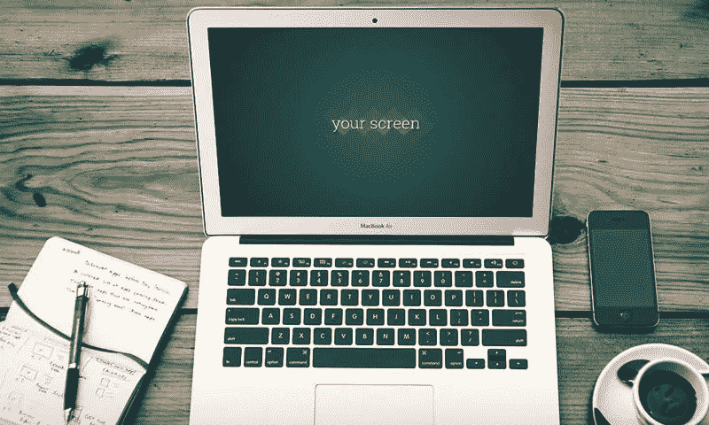
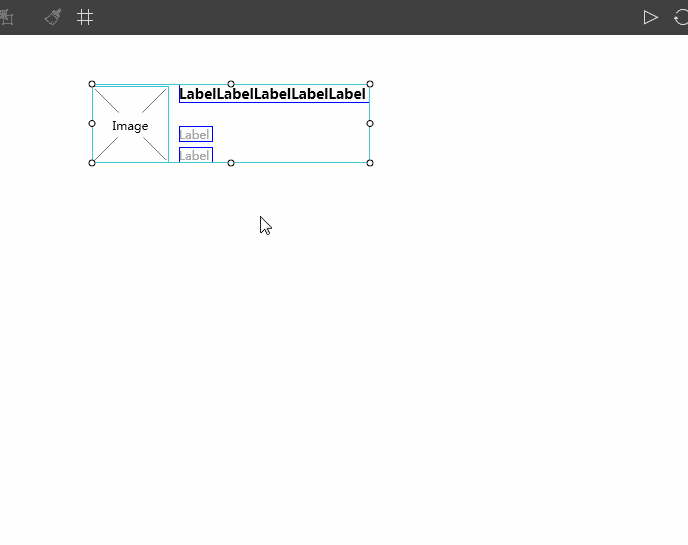

# UI/UX 设计师的最佳模型和线框设计工具和应用

> 原文：<https://medium.com/hackernoon/the-best-mockup-wireframing-design-tools-apps-for-ui-ux-designers-4a8405bde929>

原型/线框工具是交互设计师、[项目经理](https://www.mockplus.com/blog/post/the-project-manager-vs-product-manager-what-are-the-differences-relations/?r=trista)和网站开发者之间最好的沟通方式。这是 web 或移动应用程序开发过程中的一个关键步骤。而原则上，原型的设计必须是[交互设计师](https://www.mockplus.com/blog/post/stepbystep-guide-become-an-excellent-interaction-designer/?r=trista)的产品，以用户为中心的理念应贯穿整个产品设计过程。交互设计师专业的视角和丰富的**用户体验**将直接影响产品的[可用性。](https://www.mockplus.com/blog/post/usability-design/?r=trista)

# 基于桌面的原型工具

1.Axure RP (Mac &赢)|(495 美元/用户)

Axure RP 是一个桌面应用程序，允许设计师创建、测试和共享交互式原型。被称为最全面的(就功能而言)原型工具，它是静态、低保真度原型和更复杂、交互式原型的理想桌面软件。作为一个非常专业的 UX 工具，Axure 需要一个陡峭的学习曲线。

2.[mock plus](http://www.mockplus.com/?r=trista)(Mac&Win)|(129 美元/年)

Mockplus 是一个全面的快速原型制作工具，支持 PC、网站和移动设备的主流平台。打包的交互组件和创造性的预览方法允许设计师在几分钟内完成设计和预览。这是一个坚实的原型应用程序，为专业用户界面/UX 设计师谁想要生产高质量的原型，但没有太长的学习曲线。更强大的功能包括:

[**UI 流程设计模式**](https://www.mockplus.com/newfeatures/post/ui-flow-design-mode/?r=trista) —原型和 UI 流程设计模式的即时切换；显示所有或某些页面的 UI 流程；可以手动调整的页面之间的智能连接；显示页面的重要标记；立即导出 UI 流。

[**中继器**](https://www.mockplus.com/blog/post/mockplus-repeater-vs-adobe-xd-repeat-grid/?r=trista) —将任何组件轻松转换成中继器。拖动重复控件的边框以创建重复元素。您对一个组件所做的调整将应用于所有组件。

**演示项目和模板**——演示项目:结构严谨的演示供您参考。模板:各种各样的内置模板可以帮助你轻松快速地在上面构建原型。

**草图导入** —在 Mockplus 中将选定的草图画板发布为团队项目。将草图画板插入到 Mockplus 团队项目中。

[**表格组件**](https://www.mockplus.com/newfeatures/post/new-table-component-has-been-released/?r=trista) —像使用 Excel 一样，您可以以可视化的方式对这个新的表格组件进行任何更改。您不仅可以轻松地插入、编辑或删除单元格，还可以自由设置一个或多个单元格的样式和文本格式。

3. [Justinmind](http://www.justinmind.com/) (Mac &胜出)|(228 美元/年)

Justinmind 是一个灵活的原型工具，用于 web 和移动应用程序原型和高保真网站线框。Justinmind 中丰富的手势允许设计师更好地构建手势交互移动应用。Justinmind 还需要深度学习曲线，比如值表达式。

4.Balsamiq (赢)|(89 美元/用户)

Balsamiq 样机是一个快速的线框工具，帮助您更快更智能地工作。它再现了在白板上画草图的体验，但使用的是计算机。相比之下，Balsamiq 更关注静态和低保真度的原型。

5.(苹果电脑)|(199.99 美元)

OmniGraffle 是一个强大的设计工具，它有广泛的对象、画布、模板、检查器和模板选项，可以帮助设计师快速地做好一些事情。它赢得了 2002 年的苹果设计奖。

其他一些模拟工具:

折纸术——设计现代用户界面(Mac)的免费工具

[Adobe Experience Design](http://www.adobe.com/products/experience-design.html)—UX 设计师(Mac)的首款一体化工具

[Prott](https://prottapp.com/) —为设计团队(Mac)打造的新移动应用原型工具|(421 美元/年)

[原则](http://principleformac.com/)——一个交互式原型的动画设计工具(Mac)|(129 美元/年)

因此，如何完成一个好的原型设计取决于你如何选择原型/线框工具。以下是基于网站、桌面和移动设备的最流行的**模型** & **原型/线框工具** **&应用**。

# 基于网络的原型工具

1.视觉效果(每月 25 美元)

作为一个基于网络的协作程序，InVision 在可点击和交互式原型、实时设计协作和共享方面非常强大。InVison 是高保真设计的理想选择，它总是令人印象深刻。Invision + Sketch、Invision + Adobe 等不错的功能，对于追求高端产品的设计师来说，是一个很大的帮助。

2. [UXpin](https://www.uxpin.com/) |(每用户/年 44.08 美元，从 4 个用户开始)

UXpin 为设计师们提供了一个 UX 设计平台，它还支持在草图和 Photoshop 上无缝上传文件。UXpin 创建的响应式原型和线框可以在不同的设备和分辨率上运行。此外，该软件还提供了版本控制和迭代功能，您可以通过直观和实时的协作轻松共享和预览原型。

3.[漫威](https://marvelapp.com/) |(每用户每年 168 美元)

漫威也是一个基于网络的原型工具，具有良好的实时协作。您可以简单地从 Sketch 或 Photoshop 导入模型图像，链接到不同设备的可点击交互式原型。只要简单的拖拽和链接，你就可以把你的想法变成现实，而不需要任何代码经验。

4.[fluid ui](https://www.fluidui.com/)|(99 美元/年)

通过内置的 iOS、材料设计和线框库(包含 2000 多个可定制的小部件和图标)，您可以在几分钟内为任何设备或平台设计和共享线框、模型或原型。 [FluidUI](https://www.fluidui.com/) 还具有团队实时协作、用户测试视频链接、设备上测试和带有聊天/评论的交互式预览功能，以便与您的团队分享和迭代您的设计。

5.[协议 io](https://proto.io/)

Proto.io 是一个非常强大的 web app，功能很多。在基于 web 的环境下，支持丰富的手势和触摸风格，如滑动、触摸、缩放、按压等主流动作。有了它，开发者可以为 iOS、Android 和其他移动互联网设备创建交互式原型，并从用户那里获得反馈。

其他一些基于网络的原型工具:

[Pidoco](https://pidoco.com/en) —在线线框和 UX 原型工具|(高级版 660 美元/年)

[模仿鸟](https://gomockingbird.com/home)——飞行中的线框|(25 个项目每月 40 美元)

[mock flow](https://www.mockflow.com/)——为设计师提供出色的设计工具和协作服务|(148 美元/年)

[Moqups](https://moqups.com/web/tagline-syi?utm_expid=100030427-14.HtoXlhzoRfa5wBd-8OtofA.2&utm_referrer=https%3A%2F%2Fwww.google.com%2F) —实体模型、线框& UI 原型工具，用于创建高保真线框|(专业版 228 美元/年)

[Gliffy](http://www.gliffy.com/uses/wireframe-software/) —使用线框轻松快速地模拟网页(10 个项目每年 480 美元)

[Wireframe.cc](http://wireframe.cc/) —最小线框工具|($ 390/年)

[框架器](http://framerjs.com/) —所需代码的设计工具|(159 美元/年)

# 基于移动设备的原型工具

1. [POP(纸上原型)](https://popapp.in/)(iOS&Android)|(168 美元/年)

2016 年底加入漫威。

2. [Tapcase](http://tapcaseapp.com/) (iOS) |

TapCase 允许设计师从手绘草图和屏幕模型中创建应用原型。通过添加热点、链接目标屏幕和选择过渡动画，创建交互元素非常快速和容易。

3.Marvelapp(iOS&Android)|(168 美元/年)

Marvelapp 是一款免费的移动应用原型开发应用，整个设计过程在移动设备上完成。像 POP 和 Tapcase 一样，轻松上传准备好的草图或屏幕模型，并添加内置的过渡和手势，使笔和纸的想法变得生动。

其他一些基于移动设备的原型制作工具:

[Mockplus app](http://www.mockplus.com/?=trista) —轻松&通过扫描二维码或输入查看码，在移动设备上快速预览原型。(iOS & Android)

[JustinMindPrototyper](http://www.justinmind.com/)—Justinmind 原型的原型查看器(iOS & Android)

[模型构建器](http://mockupbuilder.com/) —超级简单的原型和模型(iOS & Android)

[火线](http://www.livewiresapp.com/) —到 iPhone 和 iPad 应用程序(iOS)的快速线框&原型

[app cooker](http://www.appcooker.com/)—iPhone 原型工作室& iPad (iOS)

你认为应该包括在这个列表中的任何你喜欢的模型和原型工具？请随时联系我。希望这篇文章对你伟大的 UI/UX 设计师有用！

您可能还对以下内容感兴趣:

[线框&原型](https://www.mockplus.com/blog/post/basic-uiux-design-concept-difference-between-wireframe-prototype/?r=trista)之间的基本 UI/UX 设计概念差异

[最佳 UI/UX 设计书籍&设计师资源](https://www.mockplus.com/blog/post/the-best-uiux-design-books-resources-for-designers/?r=trista)