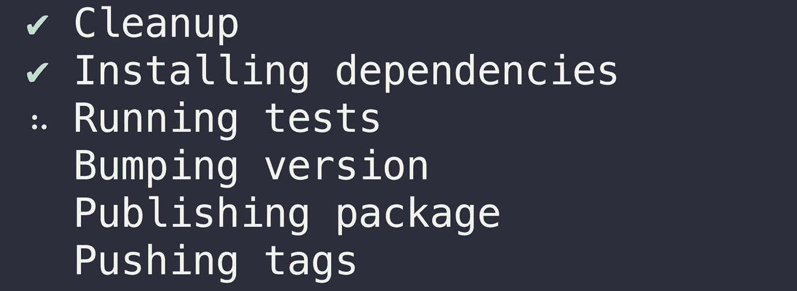

# “npm install -g”的精华

> 原文：<https://medium.com/hackernoon/the-best-of-npm-install-g-9ab9d749eeb1>

使用 Node.js 时，我经常发现自己用`nvm`在不同版本之间切换。不管版本如何，我都维护一个脚本`npm.sh`，在这里我安装了一个全局有用的 CLI 的公共列表。

我想分享这个最好的`npm install -g`CLI 列表，希望其他人也能发现它们的用处！

下面是这个列表的概述——如果其中任何一个看起来不熟悉或者引起你的兴趣，我鼓励你看看下面对它们的描述。👀

**安装您的全球 npm！🔥🔥🔥**

# 与 NPM 合作

> [**nvm**](https://github.com/creationix/nvm) -节点版本管理器，允许您安装和管理多个本地 Node.js 版本。

NVM 是软件包作者不可或缺的工具，因为您经常需要在 Node.js 的不同版本之间切换，以确保兼容性和调试问题。

> [**纱**](https://yarnpkg.com) -兼容`*npm*`的更好的包管理器。

虽然 npm [v5](http://blog.npmjs.org/post/161081169345/v500) 比以前的版本快了很多，但我仍然认为 [yarn](https://yarnpkg.com) 在速度和一致性方面比 npm 更适合本地开发。无论哪种方式，你都是在使用同一个 npm 模块数据库，我觉得这两者之间没有明显的赢家。您应该选择最适合您的项目需求的包管理器。

然而，作为一名 2018 年的 JS 开发者，我会确保你至少熟悉`npm`和`yarn`，并且在它们之间切换自如。

> [**npx**](https://github.com/zkat/npx)——允许你执行 npm 包二进制。

这确实是我最常用的基于 Node.js 的 CLI 之一。它在几个方面对您有帮助:

*   从 npm 运行任何 CLI，而无需全局安装。
*   运行本地安装的 CLI，无需参考`./node_mobules/.bin`。
*   通过让 npx 临时安装节点本身来试验元节点和 npm 脚本！

点击阅读更多关于 npx [的内容。](/@maybekatz/introducing-npx-an-npm-package-runner-55f7d4bd282b)

> [**NP**](https://github.com/sindresorhus/np)——更好的`*npm publish*`。

如果你是一个 npm 作者，我强烈推荐你去看看 [np](https://github.com/sindresorhus/np) ，因为它使得升级版本、添加 git release 标签和发布到 npm 的过程变得轻而易举，尤其是当你开始有很多模块需要维护的时候。同样值得注意的是[时代](https://zeit.co/)发布的[版本](https://github.com/zeit/release)是一个可靠的选择。

Image Credit: [np](https://github.com/sindresorhus/np) by [Sindre Sorhus](https://sindresorhus.com/)

> [**npm-name**](https://github.com/sindresorhus/npm-name-cli) -检查软件包名称在 npm 上是否可用。

一旦你开始用 JavaScript 开发开放源码，创建新的 npm 包就变得很常见，我经常使用这个工具来快速检查给定的包名在 npm 上是否可用。

Image Credit: [npm-name](https://github.com/sindresorhus/npm-name-cli) by [Sindre Sorhus](https://sindresorhus.com/)

# 排除故障

> [**ndb**](https://github.com/GoogleChromeLabs/ndb)——通过 Chrome DevTools 改进了 Node.js 的调试器。

这个调试工具非常新，但是我已经从它那里得到了很多使用。在过去，用[节点检查器](https://github.com/node-inspector/node-inspector)调试 Node.js 总是感觉有点重。NDB 解决了这个问题，并带来了你习惯的从浏览器 JavaScript 到 Node.js 的调试体验

我再怎么强调这个工具对于调试来说有多棒也不为过，我鼓励每个 Node.js 开发人员将它整合到他们的开发工作流程中。

# 通用设施

> **-简化的、社区驱动的手册页。**

**曾经忘记过 UNIX 命令的语法吗？TLDR 最适合做这个了！这基本上是对老式的“man”帮助页面的一种现代的改进，并且确实帮助我在命令行上更有效率。**

****

**Image Credit: [tldr](http://tldr.sh/)**

> **[**现**](https://zeit.co/now)——极其简单的部署。**

**就简单性、可靠性和特性集而言，Now 绝对是当今最好的免费部署系统。它非常适合测试静态和动态部署，并且在您需要更多服务器时可以很好地扩展。Aaaaaaaaaand 我有没有说过，除非你想扩大规模，否则是免费的？！**

**它与 Node.js 和 js 支持的 webapps 配合得非常好。我也强烈推荐看看 Zeit 的其他产品，因为他们的团队是由社区中最好的 JS 开发者组成的。**

****

**Image Credit: [Zeit](https://zeit.co)**

> **[**恶搞**](https://github.com/feross/spoof)——轻松在 macOS、Windows、& Linux 中恶搞你的 MAC 地址！**

**这个工具“工作正常”,在机场、酒店和其他“人”试图限制你的互联网的时候非常有用。**

> **[**fkill**](https://github.com/sindresorhus/fkill-cli) -绝杀进程。跨平台。**

**忘记`ps -ef | grep <name> && kill -9 XXX`。该实用程序允许您直观地搜索并一次终止多个进程。**

****

**Image Credit: [fkill](https://github.com/sindresorhus/fkill-cli) by [Sindre Sorhus](https://sindresorhus.com/)**

> **[**castnow**](https://github.com/xat/castnow) -从命令行将媒体转换到 Chromecast。**

**这是那些在紧急情况下有用的工具之一。快进或倒带有点困难，我通常更喜欢使用像 [Plex](https://www.plex.tv/) 这样更视觉化的东西，但 castnow 有时对我很有用。**

> **[**【GitHub-is-starred】**](https://github.com/transitive-bullshit/github-is-starred-cli)——检查用户是否已经将某个特定的 GitHub repo 标上星号。**

**这是一个有用的一次性实用程序，我经常用它来查看用户是否在 GitHub 存储库中添加了星号。有时，如果有人在 GitHub 问题上寻求帮助或感谢我的项目，我会快速检查他们是否已经标记了相应的回购，如果没有，就加上一句“请标记这个回购以帮助其他人也找到它。”**

> **[**vtop**](https://github.com/MrRio/vtop)—`top`的可视化命令行替代。**

****

**Image Credit: [vtop](https://github.com/MrRio/vtop)**

# **反应**

> **[**创建-反应-app**](https://github.com/facebook/create-react-app) -事实上的标准反应 app 构建器。**

****

**Image Credit: [imgflip](https://imgflip.com/memegenerator/14087310/Dos-Equis-Guy-Awesome) meme generator**

> **[**创建-反应库**](https://github.com/transitive-bullshit/create-react-library) - CRA 的小表弟，让你轻松发布现代反应库。**

**创建反应库(CRL)使用创建反应应用程序(CRA)在引擎盖下。它允许您轻松地创建可发布到 npm 的可重用 react 组件或组件库。它支持你所期望的所有特性，并提供了一个简单得可笑的开发和构建过程，搭载了 CRA 的本地开发，并展示了你的库的示例用法。**

**[react-native-cli](https://github.com/facebook/react-native) - CRA 为 react native。**

****

**Image Credit: [imgflip](https://imgflip.com/memegenerator/14087310/Dos-Equis-Guy-Awesome) meme generator**

# **林挺**

> **[**eslint**](https://eslint.org/)——一个完全可插拔的工具，用于识别和报告 JavaScript 中的模式。**

**I install eslint globally, along with all required peer dependencies for my default config (below).**

**My default .eslintrc located in my user home directory. This config gives me solid JavaScript feature support as well as supporting React and JSX.**

**默认情况下，我使用 [ale](https://github.com/w0rp/ale) 作为 vim 插件来 lint 所有带有`eslint`的 JavaScript 文件。ESLint 将默认这些全局配置设置，或者被特定于项目的配置覆盖。**

> **[**更漂亮**](https://prettier.io/)——一个固执己见的代码格式化程序。**

**Prettier 通过解析您的代码，并根据自己的规则(考虑到最大行长度，在必要时换行)重新打印代码，来强制实现一致的风格。**

**我喜欢 eslint，尤其是作为 JavaScript 标准风格的长期用户，但是自动代码格式化器如漂亮的代码格式化器和不可否认的吸引人。**

**作为开发人员，我们花费了太多的时间和精力来担心代码的表示和样式，而[beautiful](https://prettier.io/)减轻了对这些思考过程的需求，让你专注于你写的东西，而不是你如何写。**

****

**Image Credit: [prettier](https://github.com/prettier/prettier)**

> **[**typescript**](https://www.typescriptlang.org/)——非常流行的类型化 JavaScript 变体。**

**除了 TypeScript 正在吞噬世界，还有什么好说的？**

# **混杂的**

**我仍然在全球范围内安装这些工具，因为它们有时对处理旧项目很有用，但我很少再直接使用它们了。**

**自动化并增强你的工作流程。**

**[减去](http://lesscss.org/)——CSS 的超集。**

# **包扎**

**我希望你已经发现这个分解是有帮助的，即使它只是学习一个你以前不知道的质量工具。**

**有没有喜欢的节点。我遗漏的 JS CLI 实用程序？请在评论中分享你的最爱，让我知道吧！❤️**

## **在你走之前…**

***如果您喜欢这篇文章，请点击👏下面，并与他人分享，这样他们也可以享受它。***