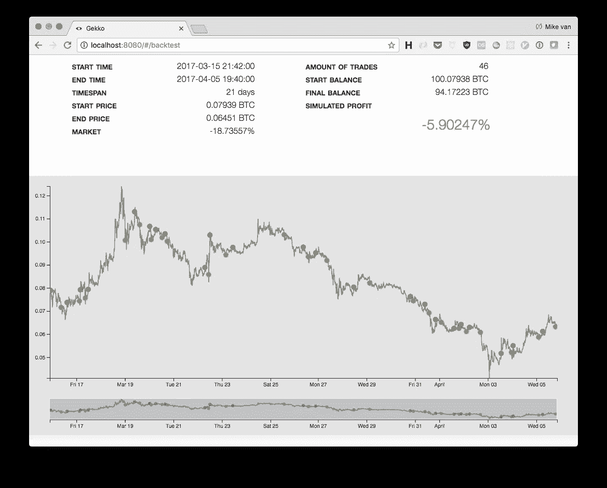
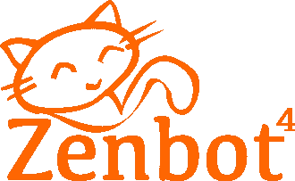
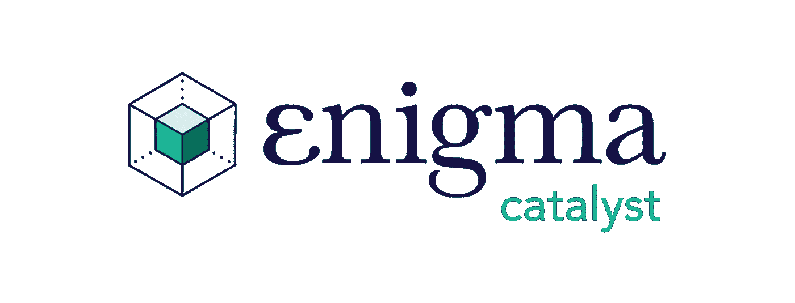

# 最好的开源(免费)加密交易机器人

> 原文：<https://medium.com/hackernoon/the-best-open-source-and-free-crypto-trading-bots-b9dd86d8d305>

交易机器人是交易者用来消除交易中的恐惧和情绪的 T2 工具。这些机器人允许你 24/7 运行交易策略(假设交易所正常工作),并提供所需的定制，使机器人以你喜欢的方式交易。我们收集了一份目前最好的开源(免费)加密交易机器人的列表。

所有这些机器人都可以下载，只需要一点命令行经验就可以启动并运行。尽管它们是免费的，但每一个都提供了许多功能来保持你的自动交易盈利。

# [壁虎](https://gekko.wizb.it/)

**(需要技术经验:初学者)**

Gekko 是目前最受欢迎的开源加密交易机器人，在 Github 上拥有超过 6000 颗星。开箱即用，给用户一个 web GUI，允许他们导入历史市场数据，回溯测试他们的策略，并在他们最喜欢的交易所运行它们。Gekko 的优势之一是它能够绘制回溯测试和实时交易的结果，这对于新手来说是立即开始运行策略的最佳选择。它也有关于如何发展你自己的策略的广泛的文件。

**壁虎优点:**

*   频繁更新
*   支持[多交流](https://gekko.wizb.it/docs/introduction/supported_exchanges.html)
*   活跃的[社区](https://forum.gekko.wizb.it/)
*   易于安装
*   简单的用户界面
*   纸质/实时交易模式
*   通过[插件](https://gekko.wizb.it/docs/commandline/plugins.html)支持交易通知

**壁虎缺点:**

*   回溯测试结果的最少细节

总的来说，Gekko 对于新手和高级交易者来说都是一个优秀的工具，他们简单的网络图形用户界面使得快速回测和分析你的策略变得容易。尽管回溯测试结果视图缺少一些关键的性能指标，如最大提款和赢率，但它仍然是您交易工具箱中的一个优秀工具。

我们建议您在本地机器上运行 Gekko 来测试和开发您的加密交易策略。一旦你的策略准备好上线，就把它安装在像 [Vultr](https://www.vultr.com/?ref=7393934) 这样的 VPS 上，以保证 24/7 的正常运行时间和低延迟交易。

# Zenbot

**(需要的技术经验:中级)**

Zenbot 是一个非常受欢迎和维护良好的加密交易机器人，可以运行在您的桌面上或托管在云中。开箱即用，它带有十几个交易策略，您可以配置并立即在您最喜欢的交易所开始交易。

如果你熟悉 javascript，你也可以尝试开发自己的策略。 [Zenbot 的知识库](https://github.com/DeviaVir/zenbot/tree/unstable/extensions/strategies)提供了用于内置策略的所有代码，并给出了如何在其中使用技术分析指标的例子。

**Zenbot 优点:**

*   频繁更新
*   支持[多种交换](https://github.com/DeviaVir/zenbot/tree/unstable/extensions/exchanges)
*   活跃的[社区](https://reddit.com/r/zenbot)
*   纸质/实时交易模式
*   短信，不和谐，以及许多其他通知服务
*   详细的回溯测试结果

**Zenbot 缺点:**

*   没有用户界面(完全基于命令行)
*   回溯测试可能会很慢

Zenbot 是另一个优秀的加密交易平台，让交易者自动化他们的策略。如果您熟悉命令行的使用，那么您在设置和运行时将不会遇到任何问题。Zenbot 还附带了一些非常有用的工具，如[遗传算法回溯测试器](https://github.com/DeviaVir/zenbot/tree/unstable/scripts/genetic_algo)来帮助你优化交易策略的参数。我们强烈建议在您的机器上本地安装它，以便进行策略开发和更快的回溯测试。一旦你准备好实施你的策略，就在像 [Vultr](https://www.vultr.com/?ref=7393934) 这样的 VPS 上安装 Zenbot，以确保你的加密交易机器人永远不会离线。

# [英格玛催化剂](https://github.com/enigmampc/catalyst)

**(需要的技术经验:高级)**

Enigma Catalyst 是一个为密码交易员设计的算法交易平台，建立在著名的[高空滑索项目](https://github.com/quantopian/zipline)之上。该平台专为有经验的 python 开发人员打造，他们希望在多个加密货币交易所开发、回溯测试和实时交易他们的策略。Catalyst 仍处于早期开发阶段，但已经支持一些最好的统计和机器学习库。

**催化剂优点:**

*   伟大的[文档](https://enigma.co/catalyst/)
*   活跃的[社区](https://catalyst.enigma.co/)
*   统计分析和机器学习库支持

**催化剂缺点:**

*   对实时交易的最小交换支持
*   漫长的安装过程
*   难以在云中设置

Enigma Catalyst 目前支持 Bitfinex、Bittrex 和 Poloniex 之间的实时交易。但是，计划在不久的将来发布与其他交易所的集成。如果你有一个先进的交易策略，并且需要一个足够强大的平台来实施它，这个工具对你来说是完美的。

*用*[***CryptoTrader***](https://www.cryptotrader.tax)***轻松申报您的加密货币资金收益。*税**。

*原载于 2018 年 4 月 13 日*[*www . cryptotrader . tax*](https://www.cryptotrader.tax/blog/the-best-open-source-free-crypto-trading-bots/)*。*

subscribe to coinmonks newsletter