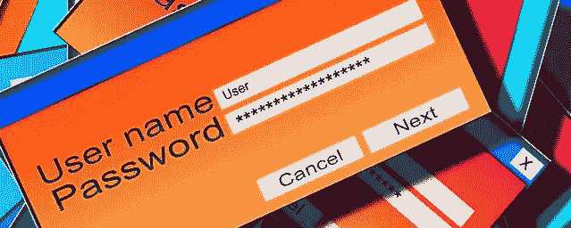
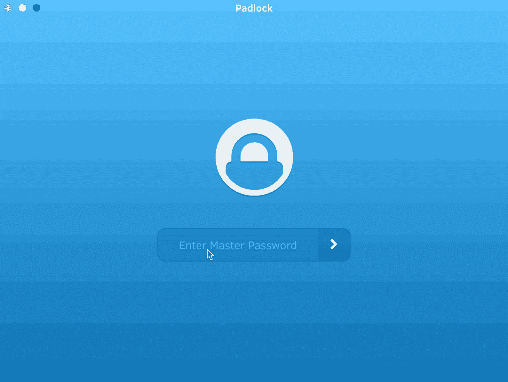
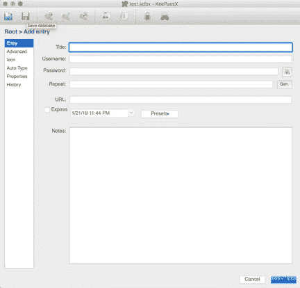
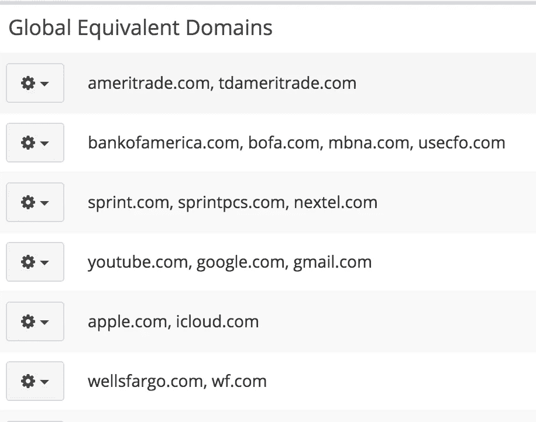

# 最适合你的密码管理器

> 原文：<https://medium.com/hackernoon/the-best-password-manager-for-you-747b92c43d18>

这不是一个性格测试，但它可以帮助你找到正确的答案

# 动作快的人

你总是在逃亡。你甚至没有时间读完整篇文章(6 分钟？真的吗？).

停下来。获取[仪表板](https://www.dashlane.com/)。继续你的生活。

## 成本:

一台设备免费。保费计划起价为每月 3.33 美元

## 优点:

它很快。第一次登录后，他们会自动让你登录，只需访问该域。多因素支持很好。

## 缺点:

我个人不喜欢自动填充/自动提交的东西。但我不是你，而你喜欢快，这篇评论已经读得太久了。所以我就不说了。

# 品牌的崇拜者

我们中的一些人更相信品牌名称，而不是崭露头角的年轻人。我们重视已经成名的品牌。如果这是你，考虑一下 [LastPass](https://www.lastpass.com/) 或者 [1password](https://1password.com/) 。

这些都是密码管理的重头戏。他们卖给财富 500 强公司。多年来，他们开发了用户友好的界面。

## 成本:

两者都提供免费版本。

LastPass:付费版本起价为每月 2 美元
1 pass:付费版本起价为每月 2.99 美元

## 优点:

这两个品牌都是老牌品牌，为付费客户提供了坚实的基础设施支持。在这两个版本中，1Password 拥有更友好的用户界面。从安全角度来看，LastPass 提供了多因素认证，这在我们的书中是一大优势。

## 缺点:

对我们来说，自动填写密码*是不必要的，也是不可取的。许多消费者可能重视自动填充。

1̶p̶a̶s̶s̶w̶o̶r̶d̶̶d̶o̶e̶s̶̶n̶o̶t̶̶p̶r̶o̶v̶i̶d̶e̶̶m̶u̶l̶t̶i̶-̶f̶a̶c̶t̶o̶r̶̶a̶u̶t̶h̶e̶n̶t̶i̶c̶a̶t̶i̶o̶n̶.̶

# 极简派

你的个人生活不需要花里胡哨，你的密码管理器也不需要。

如果你喜欢一个没有多余装饰的干净界面，看看[挂锁](https://padlock.io/)就知道了。

## 成本:

挂锁可以免费使用。如果你想在不同的设备上同步你的密码数据库，你可以每月支付 1 美元。

Padlock in action

## 优点:

我从没想过我能找到一个性感的密码管理员。然后我找到了挂锁。它简洁的界面赢得了我的心，它的开源代码也让我满意。我欣赏可以被外部实体轻松审计的开源项目。这对于访问我们最珍贵的财产——我们的密码——的软件来说尤其重要。

## 缺点:

挂锁只通过电子邮件实现多因素认证。同步新设备的过程包括打开发送给您的电子邮件。这不如支持基于应用的一次性密码(OTP)或基于硬件的令牌理想。

# 潮人

在密码管理器变得“酷”之前，你一直在使用它们……但现在它们正在流行起来。肯定是时候换个下一个最好的了。一个无密码管理器的密码管理器。等等…这怎么可能？

进入 [LessPass](https://lesspass.com/) 的“无状态密码管理器”。它不会把你的密码存储在任何地方，而是在你每次需要的时候使用一个[纯函数](https://en.wikipedia.org/wiki/Pure_function)计算出来。这个纯函数每次都根据输入计算相同的密码。您只需每次都提供相同的输入。

## 成本:

自由的

LessPass in action

## 优点:

这是一个巧妙的密码管理器。用这样独特的东西很酷。它是开源的，这是一个很大的优势。您甚至可以安装浏览器扩展，以便在系统中进行离线计算。

不需要多因子，因为没有同步的东西。

## 缺点:

上帝禁止一个网站的域名改变而你忘记了旧域名，或者你不记得你最初是键入“www.google.com”还是简单地键入“google.com”。使用 LessPass 需要良好的记忆力。

# 偏执狂

仅仅因为你是偏执狂并不意味着他们不追你。记住…当你今晚试图入睡时…或者不睡…敌人从不睡觉。

你的密码管理应该和你一样偏执。你真的能信任由大公司(他们是“系统”的一部分)制造的密码管理器吗？除了自己的三重加密电脑不要相信任何东西？使用离线密码管理器，如 [KeePass](https://keepass.info/) 或 [KeePassX](https://www.keepassx.org/) 。

## 成本:

自由的

Creating a new entry in KeePassX

## 优点:

作为一个开源项目，KeePass 已经通过了欧盟自由开源软件审计项目(EU-·福萨)[和许多其他知名组织](https://keepass.info/ratings.html)的正式审计。这可以说是最值得信赖的密码管理器发明。这是黄金标准。KeePassX 也是开源的，基于 KeePass。然而，它还没有正式的代码审计，但它已经得到了安全行业领导者的担保，如[塔维斯奥曼迪](https://twitter.com/taviso/status/817065731703468032?lang=en)。

它们都在本地运行，不具备本地云同步功能。对某些人来说，这可能是个骗局。

## 缺点:

KeePass 和 KeePassX 是简单的程序，但不是以一种美丽的极简主义的方式。它们是真正的准系统，UI 并不适合所有人。但是这是对完美程序的一个小小的贬低。

# 清洁专家

你想要一个漂亮的界面，但是你不想要多余的东西。你想要一个支持他们产品的公司，但是你不想要华而不实的。你是一个有思想的消费者，你的密码管理器应该反映这一点。

比特典狱长是你的密码管理员。

## 成本:

个人使用免费。家庭和企业账户起价 1 美元/月。

Thoughtful features such as “Global Equivalent Domains”

## 优点:

BitWarden 平衡了密码管理器的竞争需求。它提供云存储，但不试图自动化不必要的功能。它们提供了一个简单的界面，但仍然有一些深思熟虑的东西，如“全球等效域”，这可以防止您需要跨相关域使用相同凭据的重复条目。

该代码是开源的，通过高级订阅(10 美元/年)，您可以使用各种多因素身份验证方案。

## 缺点:

密码共享仅在在线密码库中可用。但是，同步后，您可以使用浏览器扩展或桌面应用程序来访问共享密码。

# 命令行爱好者

`Where all my nerds at?
Who needs a GUI when you have the perfect, simple beauty of a command line?
If you prefer text over human interaction (text doesn't make fun of your glasses), investigate [Pass](https://www.passwordstore.org/)
**Cost:** Free
**Pros:** It's simple to use, open-source and based on tried and true cryptographic software ([GNU Privacy Guard](https://en.wikipedia.org/wiki/GNU_Privacy_Guard))
**Cons:** There's no GUI. It's command line based. But isn't that the point?`

# 你用 Pass 还是 BitWarden 还是 LessPass 还是别的？

你父母没教过你不该问这个问题吗？开个玩笑，我来回答。我的回答是“有”。以上我都用过。我更喜欢只推荐我试过的产品(我个人从加密的角度让**而不是**审计这些程序)。

它们都适合不同场景的不同需求。最终你可能会用到不止一个。您可能会使用云同步管理器来管理您的日常 web 密码，并使用本地密码管理器来管理您永远不想离开高度保护的笔记本电脑范围的备份代码和密码(您偶尔会在咖啡店不上锁……但那是另一篇博客文章:-)。

**更新:** [**1PASSWORD 确实支持 MFA**](https://support.1password.com/two-factor-authentication/) **！谢谢**[**Roustem Karimov**](https://medium.com/u/5eecaf678b9a?source=post_page-----747b92c43d18--------------------------------)**！
*更新:1 密码不会自动填充**

*这是一篇来自* [*以赛亚书*](https://medium.com/u/c9fabda04fb1?source=post_page-----747b92c43d18--------------------------------)*[*的帖子。如果你喜欢这篇文章，一定要鼓掌，看看他在*](https://www.revissolutions.com/) [*Revis Solutions 博客*](https://medium.com/revissolutions) *上的其他文章，并在 Twitter 上关注*[*@ isaiahsarju*](https://twitter.com/isaiahsarju)*[*@ Revis solution*](https://twitter.com/revissolution)**