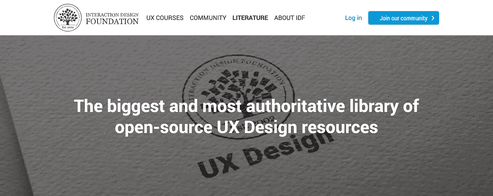

# 我用来学习 UI/UX 设计的最好的播客、博客和 YouTube 频道

> 原文：<https://medium.com/hackernoon/the-best-podcasts-blogs-and-youtube-channels-for-learning-ui-ux-design-42890ee2c4c8>

> "我从未让学校教育干扰我的教育。"——马克·吐温

Photo by [Chris Benson](https://unsplash.com/photos/yx-iJFybOBQ?utm_source=unsplash&utm_medium=referral&utm_content=creditCopyText) on [Unsplash](https://unsplash.com/?utm_source=unsplash&utm_medium=referral&utm_content=creditCopyText)

在我上周写的文章中，我写了如何创建一个持续学习的系统。我列出了一个八步流程来帮助你挑选学习的内容，如何选择资源，以及如何更快地掌握一个概念/技能。

我在那里提到过**如何快速持续学习的一个核心部分是知道什么是最好的资源。**

知道使用哪些资源的最好方法之一是询问已经学习了这些技能/概念的人— **询问他们最想推荐哪些资源。**

我可能还不是 UI/UX 设计方面的专家，但是我已经在这方面消耗了很多资源。无论是播客，文章，还是 YouTube 视频，我都消耗了很多，也有很多资源被推荐给我。

在这篇文章中，我将列出我发现并喜爱的最佳资源，你可以用它们来了解 UX 设计的广泛领域。我会列出我自己使用过并推荐的资源，以及其他人推荐的资源(即使我没有读过/看过)。

希望，这将是一个很好的起点，让你沉浸在学习更多关于 UX 设计！

# 1.收听播客

## 让我们从一个简单的方法开始学习更多的 UI/UX 设计——播客。

播客是一个开始学习任何主题的好地方，因为你可以在做其他任务的时候学习，比如做家务或通勤/驾驶。

# 如何收听这些播客:

如果你使用安卓系统，你可以下载名为 [Podcast Addict](https://play.google.com/store/apps/details?id=com.bambuna.podcastaddict&hl=en) 的应用程序，它可以让你搜索并下载数百集播客到你的手机上。是我用的 app，没听说有更好的安卓替代。

你可以在上面搜索下面的任何播客，点击“订阅”该播客，然后找到并下载我将在下面推荐的播客剧集。

对于 iOS 用户，苹果有一个独立的播客应用程序，你可以在那里搜索和下载/播放剧集。以下 3 个播客都可以在苹果播客上找到！

## 现在谈谈建议:

我将推荐我听过的 3 个播客，让你了解更多关于 UI/UX 设计的知识，以及成为一名 UI/UX 设计师是什么感觉:

# **播客#1:根——关于菲律宾设计师的播客**

 [## 根网站

### Roots 是一个关于菲律宾设计师故事的播客，由 Alexis Collado 主持和制作。

rootspodcast.design](https://rootspodcast.design/) 

**Roots 是一个关于菲律宾设计师故事的播客，**由 Alexis Collado 主持和制作，他是 UX 协会的创始人之一，我也是该协会的成员之一。亚历克西斯也是我的好朋友和导师，但这不是我推荐这个播客的原因。

我推荐它是因为它让成为一名 UI/UX 设计师变得更加现实和可能，因为你可以听听其他已经在这个领域的菲律宾设计师的意见。对于像我这样的菲律宾人来说，这非常鼓舞人心，也很有教育意义。

我推荐两集:

1.  [**第 23 集与 Chrys Laguitao**](https://rootspodcast.design/podcast/chrysfrancisco) ，瑞士谷歌高级 UX 设计师。她讲述了自己在卡内基梅隆大学获得人机交互硕士学位，并实现在谷歌工作的梦想的经历。
2.  [**第 6 集，与 Roxy Navarro**](https://rootspodcast.design/podcast/roxynavarro) 合作，设计工作室 Works for Heart 的联合创始人，为非政府组织和当地社区等影响力驱动型组织提供设计服务。

# 播客#2:内部对讲机

 [## 播客-内部对讲机

### 每周四，内部对讲播客的特色是与从业者和领导者的对话，他们来自…

www.intercom.com](https://www.intercom.com/blog/category/podcast/) 

**Inside Intercom 是由**[**Intercom.com**](https://www.intercom.com/)**，**一家快速成长的&成功创业，提供应用内客户消息传递。在这个播客中，他们采访了各种创业/技术专业人士，包括产品设计师和产品负责人。

这些对话要严肃得多，也可能是技术性的，但你在这里学到的一些东西是宝贵而难得的。当我在 Kalibrr 做产品设计师实习的时候，我在这里听了很多集。以下是我可以推荐的几个:

1.  [**专访**](https://www.intercom.com/blog/podcast-julie-zhuo-on-product-design/) **产品设计副总裁 Julie Zhuo。Julie 是设计行业中最受尊敬的人之一，因此她的见解非常独到。**
2.  [**塞缪尔·胡利克在建宁上**](https://www.intercom.com/blog/podcast-samuel-hulick-onboarding/) **。塞缪尔是 UserOnboard 网站的创始人，该网站分析多种应用程序的入职流程。听听这个，了解如何设计更好的入职培训。**

# 播客#3:音阶大师

 [## 音阶大师-由雷德·霍夫曼主持

### “规模大师”是一个原创播客，由 LinkedIn 的联合创始人和 Greylock 的投资者雷德·霍夫曼主持。的…

mastersofscale.com](https://mastersofscale.com/) 

《音阶大师》是我听过的最有趣、制作精良的播客之一。在这个播客中，Linkedin 的联合创始人雷德·霍夫曼采访了一些最成功的商人，包括脸书的马克·扎克伯格和 Airbnb 的布莱恩·切斯基。

这里的大部分剧集更多的是关于如何启动和运营一家初创公司，但也有一些是关于 UI/UX 设计的。这是我最喜欢的一个:

1.  [**布莱恩·切斯基手工打造的用户体验**](https://mastersofscale.com/brian-chesky-handcrafted/) **。**Airbnb 的 Brian 谈到手工制作和紧密设计使用你的平台的整个体验的重要性，就像他在 Airbnb 早期所做的那样。

Instagram 的联合创始人凯文·斯特罗姆的那一集也很不错。但是所有的剧集都很不错，所以只要你感兴趣的就听吧。

# 2.要关注的媒体出版物、作家和博客

阅读参考资料的一个好地方是 Medium.com[网站，这是我写和发布这篇文章的地方。Medium 是写博客和发布博客的最好地方之一，所以很多人，尤其是 UI/UX 设计师，用它来发布文章。](/)

Medium 也有很多“出版物”，就像 Medium 内部的博客/脸书页面。你可以跟随这些出版物阅读由编辑整理的好文章。你甚至可以贡献一篇文章，让他们发表你的文章。

如果你还没有一个中型帐户，现在就去创建一个！只需点击右上角的“开始”按钮，然后关注下面的出版物和作者。这是我现在每天都会访问的网站。只是不要被所有的“特色故事”所困扰，这些故事只提供给付费订阅者。Medium 上也有很多好的免费文章。

下面是一些关于 UI/UX 设计的最好的博客或媒体出版物。

# #1: [UX 集体——UX design。抄送](https://uxdesign.cc/)

 [## UX 集体

### 策划关于用户体验、可用性和产品设计的故事。作者@fabriciot 和@caioab。

uxdesign.cc](https://uxdesign.cc) 

UX 集体出版物是关于 UX 设计的最大的媒体出版物，拥有 154，000 名追随者。他们几乎每天都会发布新文章，我也在上面读过不少好文章。以下是我可以推荐的几个:

1.  [**如何设计更好的表单**](https://uxdesign.cc/design-better-forms-96fadca0f49c) —这是一篇简单的文章，里面有很多设计更好表单的技巧。
2.  [**2018 年的 UX**](https://trends.uxdesign.cc/)——这篇由 UX 集体的编辑撰写的文章概述了今年 UX 设计发生的一些关键趋势。例如，“产品设计”是如何成为一个比“UX 设计”更流行的术语。他们还有 2017 年和 2016 年的 UX，所以你可以比较一下这个行业发生了什么。

# 第二名:尼克·巴比奇的《UXPlanet.org UX 星球》

 [## UX 星球

### UX 星球是与用户体验相关的一切的一站式资源。

uxplanet.org](https://uxplanet.org) 

《UX 星球》也是媒体上的顶级出版物之一，主要由主编尼克·巴比奇管理。Nick 是一名软件开发人员，他对 UI/UX 设计充满热情。他写了很多好文章，并且他把其中的大部分贴在了 UX 星球上。这里有几个好的:

1.  [**按钮设计的 7 个基本规则**](http://7 Basic Rules for Button Design) —这是一篇关于设计按钮的简单小技巧的文章。很短很棒。
2.  [**2018 年 12 大移动 UX 设计趋势**](http://12 Mobile UX Design Trends For 2018)**——这是一篇了解移动 UX 设计趋势的好文章，这样你就可以改进你的移动应用设计。这也是一件很酷的事情，可以看看设计师们在做什么创新，让应用程序更有用，更令人愉快。**

# **#3:交互设计基础**

****

**[**交互设计基金会**](https://www.interaction-design.org) 是一个成立于 2002 年的非营利性社区，他们有[一个关于设计的文章的大型图书馆](https://www.interaction-design.org/literature)。他们也有 5 本开源书籍，可以在网上免费阅读。这些书包含了大量关于交互设计和其他相关主题的信息。**

**除了这些书籍，IDF 还定期发布文章，就如何使用各种 UI 和 UX 方法给出具体建议。他们还有**的自定进度在线课程，你可以一次上多门课，固定费用为 8 美元/月。我没有尝试过他们的任何课程，但我发现他们的一些文章非常有价值。如果你想知道如何使用 UX 方法或者如何改进你的 UI，他们可能有一篇文章适合你。****

# ****其他有趣的媒体作家如下:****

1.  ****[**朱莉·卓来自脸书**](/@joulee) 【再次】——朱莉最出名的是她的写作，比如她在 Medium 上的文章和她的电子邮件列表。她还在她的[梦想设计课程](/the-year-of-the-looking-glass/my-dream-design-curriculum-ace1d0475289)上写了这篇很棒的文章(绝对值得一读！)****
2.  ****[**迈克尔·马戈利斯**](https://library.gv.com/@mmargolis) ，谷歌风投[的 UX 研究合伙人](http://gv.com)。迈克尔是 UX 研究领域最著名的专家之一，他为数百家初创公司提供如何进行用户研究的建议。谷歌风投(Google Ventures)是谷歌的风险投资部门，投资数百家令人兴奋的初创公司。这里有一篇他写的很棒的文章，教你如何为一个创业公司/产品做用户研究。****

# ****3.关注/观看的 YouTube 频道****

****另一个学习 UI/UX 设计的好地方是 YouTube。YouTube 上有很多关于 UI/UX 设计的讲座和教程。以下是我可以推荐的几个:****

1.  ********一起写生。Pablo 是最受欢迎的 UI/UX 设计师之一，这得益于他丰富有趣的 YouTube 视频。你可以观看这篇关于如何使用[自动布局插件](https://www.youtube.com/watch?v=v393LgriWCs)的教程(针对那些想更好地使用 Sketch 应用设计软件的 Mac 用户)。他还写了一些很棒的文章，并制作了很棒很有趣的插图。你也可以在 Medium 上关注他！********
2.  ****[**萨拉杜迪**](https://www.youtube.com/channel/UCxM6G42vmI752f60od3Gypw/videos) **。**莎拉是 UX 的一名设计师兼企业家。到目前为止，我只看过她的一个视频(也只有 10 分钟)，但这是一个相当有见地的视频！这是 UX 投资组合评论上的一段视频。作品集是你给雇主留下深刻印象并获得聘用的主要方式，她的视频让我对如何改进自己的作品集有了深刻的见解。****

## ****其他值得关注的设计相关频道:****

1.  ******—这更多的是针对平面设计，但是这里也有对 UI/UX 设计师有价值的视频。******
2.  ******[**dev tips**](https://www.youtube.com/channel/UCyIe-61Y8C4_o-zZCtO4ETQ)—这个更多是给编码员用的，但是[我用了素描](https://www.youtube.com/watch?v=hdZhDMky6uQ)这个教程来学习怎么用！Travis 还有一个关于从头开始设计和编码网站的视频系列，我用它来学习网站开发和设计。******
3.  ****[**反思**](https://www.youtube.com/channel/UCj6kVZL1zzV3nbyKSONsIXw)——这里有设计师们的演讲视频(虽然还没怎么看，但以后会看的！)****

# ****关于消耗这些资源的一些提示:****

****你可能已经看到了这篇文章的很多链接，你可能会感到不知所措。所以这里有一些建议:****

1.  ****我建议你先从听播客开始，因为你不必花很多时间就能做到。你可以在吃饭、通勤或做家务时听播客。你可以从 Airbnb 的布莱恩·切斯基的《音阶大师》那集开始！这可能是我上面推荐的电影中最有趣的。****
2.  ****继播客之后，下一个最容易消费的是 YouTube 视频。因此，请继续订阅上面的频道。****
3.  ****之后，**去关注并订阅上面那些博客和媒体出版物。**也下载 Medium app，**养成每天看一篇设计文章的习惯。******
4.  ****当然，最好的学习方法是应用它们。所以，去给自己找一个 UI/UX 设计项目，无论是实习/自由职业、你想重新设计的应用程序/网站，还是你想模仿的创业想法。然后去 Google away，找到对你的项目有帮助的资源！你不需要把自己局限在这些。****

****反正就这些了！如果你有你喜欢或想推荐的资源，请在下面随意评论。我知道还有很多其他很棒的资源，(比如像[《日常用品设计》](https://www.amazon.com/Design-Everyday-Things-Revised-Expanded/dp/0465050654)和 [sidebar.io](http://sidebar.io) 这样的书)，但是如果我试图把它们都列出来，这篇文章就太长了。****

****有这么多关于 UI/UX 设计的资源，我们只需要找到并使用它们。我希望你能找到上面的一些有价值的资源！****

# ****连接更深****

****如果你喜欢这篇文章，点击拍手按钮或在下面留下回复！每一次鼓掌都帮助我把我的作品带给更多的人。****

*****Brian Tan 是一名来自马尼拉的 21 岁 UI/UX 设计师和作家。他还是菲律宾第一个 UX 设计爱好者学生组织* [*用户体验协会*](http://fb.com/UXSoc) *的人力资源副总裁。通过*[*brian.tan@obf.ateneo.edu*](mailto:brian.tan@obf.ateneo.edu)*与他取得联系。*****